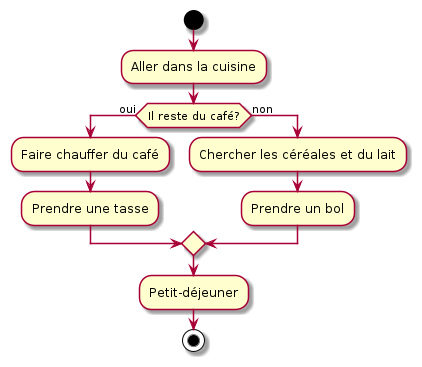
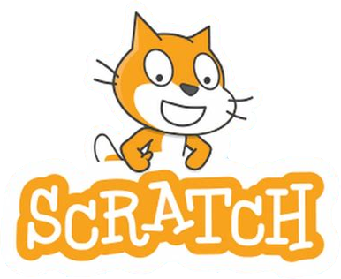
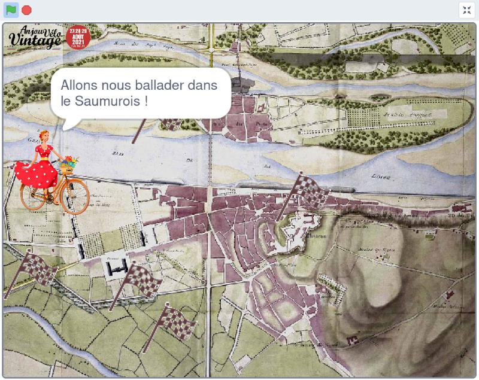
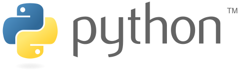
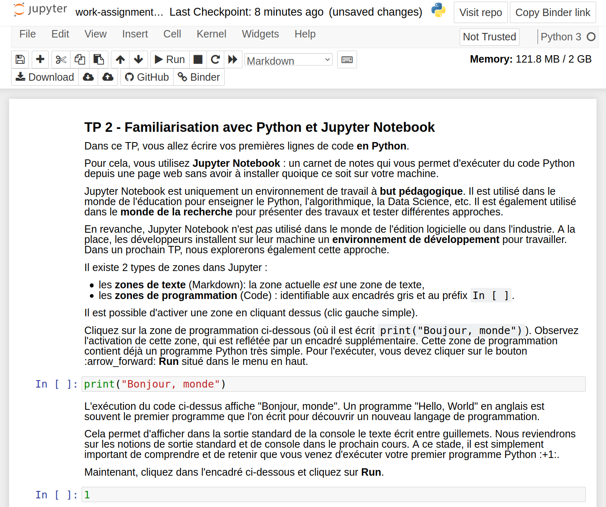

<!-- _class: title-section -->


# <!--fit--> Algorithmique Appliquée

##### BTS SIO SISR

## Introduction à la programmation et à l'algorithmique

<!-- On commence les choses sérieuses ! -->

---

# Plan

- Intérêt du cours
- Discussion sur les algorithmes
- Histoire de l’algorithmique
- Définition formelle
- Architecture simplifiée d'un ordinateur
- Discussion sur les langages de programmation
- Introduction au langage Python
- Types numériques, expressions et objets en Python
- Variables et assignation

---

<!-- _class: title-section -->

# <!--fit--> Intérêt du cours

## :star: :star: :star: :star: :star:

<!-- Pourquoi venir en cours et écouter un prof quand on pourrait rester au chaud chez soi et jouer à des jeux vidéos ? -->

---

# :point_right: Intérêt de savoir programmer

Selon vous, à quoi sert de savoir programmer ?

<!--
On va commencer par une autre question :
A quoi pensez-vous que sert de savoir programmer ?
-->

---

# Quelques exemples

* Automatiser votre travail pour rentrer plus tôt chez vous le soir :alarm_clock:
* Ecrire une App révolutionnaire et devenir millionnaire :moneybag:
* Amuser vos amis avec vos propres jeux vidéos :space_invader:
* Simplifier la mise en relation de milliers de personnes :busts_in_silhouette:

<!--
Voici quelques exemples de cas où savoir programmer est utile...
-->

---

# Et l'algorithmique dans tout ça ? :astonished:

L'algorithmique est au :heart: de la programmation

<!--
Il s'agit d'une formalisation et d'un socle commun à toutes les technologies et langages de programmation.
Même s'il est possible de programmer sans une connaissance approfondie de l'algorithmique, son étude est capitale pour écrire des programmes performants et maintenables.
-->

---

# Qu'est-ce que je vais apprendre d'utile ? :neutral_face:

* Le socle de la programmation : l'**algorithmique** :computer:
* Un langage de programmation industriel : **Python** :snake:
* Les bases pour écrire un logiciel **robuste** :muscle:, **performant** :fire: et **maintenable** :+1:

---

# Euh... Attendez, j'ai choisi SISR, pas SLAM :angry:

* Ce cours fait bien parti de votre programme.
* De plus en plus d'entreprises s'organisent en mode **DevOps**.
* La capacité à **automatiser** des tâches est également capital dans votre futur métier.

<!--
Le mode de fonctionnement DevOps regroupe des experts en Opérations/Réseau avec des experts en développement logiciel : pour être efficace, ous devez comprendre les métiers de vos collaborateurs.
L'automatisation est la clé du succès de très nombreux projets car elle permet de gagner du temps, et de vérifier la qualité tout au long de l'avancement du projet.
-->

---

<!-- _class: title-section -->

# <!--fit--> Discussion sur les algorithmes

---

## :point_right: Auriez-vous des exemples d'algorithmes en tête ?

<!--
A ce stade, sans doute pas... Ou alors vous avez déjà lu des choses sur le sujet.
-->

---

## Exemple informel 1
#### Aller sur Internet :computer:

* Brancher l'ordinateur.
* Appuyer sur le bouton Power.
* Vérifier la connexion réseau.
* Cliquer sur l'icône du navigateur web.
* Entrer une URL.
* Tapper sur la touche *Entrée*.

<!--
Cet exemple illustre simplement une série d'instructions.
-->

---

## Exemple informel 2
#### Cuisine :cake:

* Prendre les ingrédients.
* Suivre les étapes de la recette.
* Mettre au four.
* Tant que ce n'est pas cuit, attendre.
* Sortir le plat du four.

<!--
Cet exemple illustre les concepts d'entrées (les ingrédients) et de sortie (le plat) d'un algorithme.
-->

---

## Exemple informel 3
#### Choisir le petit déjeuner :coffee:

* S'il reste du café:
  * Faire chauffer du café.
  * Prendre une tasse.
  * Verser le café.
* Sinon:
  * Prendre un paquet de céréales.
  * Prendre un bol.
  * Verser du lait.

<!--
Cet exemple illustre le concept de condition.
-->

---

## Exemple 4
#### Multiplication calculée avec une somme

*Mathématiques* : $x \times y = \sum_{0}^{y - 1} x$

:arrow_down:

*Python* :
```py
def multiplie(x, y):
    resultat = 0
    for _ in range(y):
        resultat += x  
    return resultat
```

<!--
Cet exemple est un petit spoiler de la suite du cours avec un vrai algorithme implémenté en Python et sa définition équivalente en mathématiques.
-->

---

## :point_right: A vous de trouver des idées

<!--
Après ces quelques exemples, les étudiants devraient pouvoir trouver quelques exemples supplémentaires.
Faire un tour de table ou demander aléatoirement à quelques étudiants.
-->

---

# Intuitions à ce stade... 

Un algorithme :
* a des **entrées** et des **sorties**,
* comporte une **suite d'instructions**,
* peut comporter des **conditions**,
* peut comporter des **répétitions** (boucles).

<!--
Aborder ces quelques exemples permet d'avoir une première intuition sur la nature exacte d'un algorithme.
-->

---


<!-- _class: title-section -->

# <!--fit--> Histoire de l'algorithmique

<!--
Avant d'approfondir la notion d'algorithme, on va parler un peu d'histoire...
-->

---

### :point_right: Selon vous, de quelle époque datent les premiers algorithmes ?

<!--
Sachant que l'informatique a vraiment commencé à prendre son essor vers les années 1980, et que les étudiants sont (probablement) des milléniums, il est probable qu'ils avancent des dates assez récentes.
C'est justement pour casser le plus rapidement possible cette vision que cette partie du cours présente une histoire rapide de l'algorithmique.
-->

---

# Babylone

* Les mathématiques Babyloniennes de l'ancienne Mésopotomie (actuellement l'Iraq) montrent les premiers algorithmes.
* Des premières tablettes d'argile Sumérienne trouvées près de Bagdad remontent à **2500 ans avant notre ère**.
* Ces algorithmes étaient utilisés pour prédire la date et le lieux de certains événements astronomiques.

<!--
Les GAFAM n'ont inventé ni la roue, ni l'eau chaude...
-->

---

# Egypte

* Les mathématiques de l'ancienne Egypte utilisaient également des algorithmes pour résoudre des problèmes arithmétiques.
* Certains papyrus, comme celui de Rhind, remontent à **1550 ans avant notre ère**. Ils cherchaient à calculer des volumes, des aires et à résoudre des problèmes géométriques... notamment en relation avec des pyramides !

---

# Grèce Antique

* On doit aux mathématiques Hellenistiques, qui remontent à **300 ans** avant notre ère, de nombreux algorithmes encore célèbres aujourd'hui.
* Deux exemples notables :
  * Le *Siève d'Eratosthenes* : permet de trouver tous les nombres premiers jusqu'à une certaine limite.
  * L'*algorithme d'Euclide* : permet de calculer le Plus Grand Commun Dénominateur (PGCD).

---

### Muhammad ibn Musa al-Khwarizmi

* Il était un mathématicien, astronome, géographe et professeur à la Maison de la Sagesse à Bagdad. Il a vécu au **9e siècle** de notre ère.
* Il était le mathématicien le plus lu au moyen-âge en Europe.
* Le mot "algorithme" vient de la **traduction du nom Al-Khwarizmi** d'abord en latin (Algorizmi) puis en ancien anglais (algorism). Ce mot avait alors une signification différente.

<!--
Il a notamment écrit un traité sur le système numéraire Hindou-Arabique qui a été traduit au 12e siècle en latin, ainsi qu'un livre sur l'algèbre.
-->

---

# Ada Loveplace

* La comtesse Ada Loveplace a vécu au milieu du **19e siècle** au Royaume-Uni.
* Elle a travaillé avec Charles Babbage sur des machines analytiques capables théoriquement d'exécuter n'importe quel algorithme.
* Ada est considérée comme pionière car elle a écrit les premiers algorithmiques dédiés à une exécution par un ordinateur.
* Un langage de programmation créé beaucoup à la fin du 20e siècle a été nommé Ada en sa mémoire.

---

# Alan Turing

* Ce mathématicien, informaticien, scientifique et philosophe a vécu au **début du 20e siècle**.
* Ce personnage est historique au-délà de la discipline de l'algorithmique puisqu'il a fortement contribué à la victoire contre les Nazis lors de la 2e guerre mondiale.
* L'une de ses contributions essentielles est la **Machine de Turing**, qui est le premier ordinateur généraliste (par rapport à des ordinateurs spécialisés commes les calculatrices).

<!--
C'est grâce à sa machine Enigma, capable de décrypter les messages des Nazis, que de nombreuses opérations ont pu être déjouées.
Pour l'anecdote, son décès tragique a inspiré le logo de l'entreprise Apple (C).
-->

---

# Donald Knuth

Ce professeur émérite en informatique de l'université de Stanford a contribué à la démocratisation de l'algorithmique au travers de ses ouvrages *The Art of Computer Programming*, sur lesquels il travaille toujours **aujourd'hui**.

---

### Anecdotes récentes

* Google s'est construit autour de l'algorithme *Map Reduce*, inventé par ses fondateurs.
* Bill Gates a indiqué que Microsoft recrute n'importe quelle personne qui comprend les ouvrages de Knuth.
* Les géants Américains (GAFAM) et Chinois (BATX) utilisent tous des algorithmes et recherchent tous les meilleurs candidats dans ce domaine.
* L'Intelligence Artificielle est simplement un ensemble d'algorithmes travaillant sur des données massives.

<!--
Quelques anecdotes récentes...
Etre bon en algorithmique, c'est la garantie d'un succès professionnel.
-->

---

<!-- _class: title-section -->

# <!--fit--> Définition formelle

---

Un algorithme est une liste **finie** d'instructions décrivant un ensemble de calculs qui, lorsqu'ils sont exécutés sur un ensemble d'entrées, va passer par une séquence d'états bien définis et finalement produire une sortie.

<!--
On insiste ici sur le fait que la liste d'instructions doit être finie. Une boucle infinie ou une récursion infinie ne constituent pas des algorithmes.
On note que cette définition n'implique pas nécessairement de déterminisme par rapport aux sorties. Un algorithme peut utiliser un générateur de nombres aléatoires et faire varier ses sorties pour des entrées constantes.
-->

---

<!-- _class: title-section -->

# <!--fit--> Architecture simplifiée d'un ordinateur

<!--
A partir de maintenant, on va s'intéresser uniquement à la classe des algorithmes qui s'exécutent sur une machine.
Nous allons donc nous intéresser au fonctionnement d'un ordinateur.
-->

---

# Un champ limité d'actions

Un ordinateur ne sait faire que 2 choses :
* Faire des calculs,
* Se souvenir du résultat de ces calculs.

<!--
Par ailleurs, un ordinateur ne sait faire que ce qu'on lui dit.
L'Intelligence Artificielle ne change rien à cela.
-->

---

# Mise en perspective

Un simple ordinateur de bureau standard sait :
* Faire beaucoup de calculs très rapidement : des **centaines de milliards de calculs par seconde**.
* Se souvenir qu'une quantité remarquable de données : 1 téraoctet (To), c'est **1 000 000 000 000 octets**. Changez l'unité en kilogrammes ou mètres...

<!--
Un ordinateur sait donc faire ces 2 choses extrèmement bien.
A tel point qu'il peut vous tromper en vous donnant l'impression d'intelligence.
Mais la seule intelligence est celle des scientifiques, ingénieurs et développeurs qui ont travaillé dessus.
-->

---

# <!--fit--> Champ encore plus limité avant

Les premières machines étaient à **programme fixe** :
* Une calculatrice avec les opérations $+$, $-$, $\times$, $\div$.
* Un calculateur de trajectoire de missiles.
* Un solveur de système d'équations linéaires.
* Etc.

Les systèmes embarqués utilisent encore ce procédé pour des raisons de coût et de performance.

<!--
Cela signifie qu'ils ne savaient résoudre qu'un unique type de problème.
Concernant les systèmes embarqués, si on doit programmer un peluche qui doit dire "Bonjour maman" lorsque l'on appuie sur son ventre, on est très limité en terme de puissance de calcul et la performance énergétique doit être maximale pour éviter de devoir changer les piles toutes les 3 minutes.
-->

---

# <!--fit--> Capacité à exécuter différents programmes

Vos machines sont dites à **programmes stockés** :
* Elles ont des composants qui stockent les programmes.
* Elles ont des composants qui lui permettent d'exécuter les instructions de ces programmes.

---

# <!--fit--> Architecture logique simplifiée d'un ordinateur

Un ordinateur comporte :
* Des **entrées** (clavier, souris, ...) et des **sorties** (écran, son, ...).
* Des **mémoires** (disque, RAM, caches, ...).
* Des **calculateurs** (CPU, GPU, ...) ayant :
  * **Unité de contrôle** (compteur de programme, ...).
  * **Unités arithmétique et logique** ($+$, $-$, ...).

<!--
@TODO : faire un diagramme à la place
-->

---

# <!--fit--> Cycle de vie simplifié d'un programme

* La séquence d'instructions du programme est chargé en mémoire.
* Un programme particulier appelé **interprêteur** exécute chaque instruction dans l'ordre :
    * Un **compteur de programme** pointe en mémoire vers la prochaine instruction à exécuter.
    * Cette instruction est envoyée à l'**unité arithmétique et logique** qui s'occupe de la résoudre.

---

# Flot de contrôle

* Dans certains cas, sur la base d'un test, l'interprêteur saute vers une autre séquence d'instructions.
* C'est ce que l'on appelle le **flot de contrôle**.
* Cela nous permet d'écrire des programmes complexes.
* Une partie de ce premier cours et du prochain est dédié à l'étude des **structures de contrôle**.

---

### Graphe de flot de contrôle



---

<!-- _class: title-section -->

# <!--fit--> TP 01 - Démarrer avec Scratch

---




* **Scratch** est un langage de programmation graphique à destination des plus jeunes.
* Créé par le **MIT**.
* **Démo** : [Editeur Scratch](https://scratch.mit.edu/projects/editor/).

<!--
Faire une démo live de Scratch pour présenter le fonctionnement général.
La démo live peut consister en la 1ière partie du TP avec le personnage du chat Scratch.
Ma nièce, qui a 10 ans au moment de l'écriture de ce cours, sait utiliser Scratch.
C'est un langage parfait pour apprendre la programmation.
-->

---



# <!--fit--> TP : Jeu Vidéo avec Scratch

* [**Lien** vers le sujet de TP](./tp-01-scratch.html).
* **Contexte** : Anjou Vélo Vintage.

---

<!-- _class: title-section -->

# <!--fit--> Discussion sur les langages de programmation

---

# Intuition

* Un langage de programmation offre une **syntaxe** pour spécifier les **instructions** que l'interprêteur doit exécuter.
* Il existe de nombreux langages de programmation.
* **Scratch** et **Python** sont des langages de programmation.

---

# Machine de Turing

* En 1936, Alan Turing : spécification de la **Machine de Turing Universelle**.
* Avec quelques **instructions élémentaires**, et une **mémoire**, il est possible d'écrire **n'importe quel programme** exécutable par une machine.

---

# Thèse de Church Turing

*Si une fonction est exécutable par une machine, alors une Machine de Turing peut être programmée pour l'exécuter.*

:arrow_right: Un algorithme peut donc être écrit dans **n'importe quel** langage de programmation.


---

# <!--fit--> Indécidable : tout n'est pas possible

* Certains problèmes **ne peuvent pas** être résolus par un algorithme.
* **Problème d'arrêt** (Halting Problem) : il est impossible d'écrire un programme capable de prédire si un autre programme arbitraire s'exécute indéfiniment.
* Cela signifie par exemple qu'il est impossible pour un programme de prédire si un autre programme fonctionne correctement.

<!--
Le problème d'arrêt de la Machine de Turing est l'un des résultats remarquables des travaux d'Alan Turing.
C'est un exemple de problème que l'on ne peut pas résoudre avec un algorithme en un nombre d'étapes finies.
L'avantage de ce problème, c'est qu'il donne du travail à de nombreux informaticiens et testeurs.
En effet, sans cela, la programmation aurait été beaucoup plus aisée.
-->

---

# Turing-complet

* Un langage de programmation est dit **Turing-complet** s'il permet de simuler une machine de Turing.
* Autrement dit, il permet d'écrire tout programme qu'une machine peut exécuter.

---

# Retour sur Scratch

* Scratch :cat: est **Turing-complet**.
* Scratch comporte de **nombreuses instructions** sous forme de blocs.
* On peut donc écrire n'importe quel algorithme avec Scratch.
* Le programme suivant calcule 1 + 1 :


---

# <!--fit--> Autre exemple : Brainfuck

* Brainfuck :brain: est **Turing-complet**.
* C'est un langage *minimal* qui comporte seulement **8 instructions élémentaires**.
* Ce langage montre qu'il est possible d'écrire n'importe quel programme avec une **syntaxe illisible** pour un être humain.
* Le programme suivant calcule 1 + 1 :

```
+>+[-<+>]<
```

<!--
Signification du programme en Brainfuck :
+      # Stocke 1 à l'adresse 0.
>      # Déplace le pointeur à l'adresse 1.
+      # Stocke 1 à l'adresse 1.
[-<+>] # boucle qui décrémente la valeur à l'adresse 1 et ajoute cette valeur à l'adresse 0
       # tant que la valeur à l'adresse 1 est strictement supérieur à 0.
<      # Déplace le pointeur à l'adresse 0 (pour réinitialiser l'état).
Ce langage est certes une parodie de langage de programmation, mais il est souvent mentionné pour son aspect éducatif. En effet, il montre intuitivement à quel point il est important pour un langage d'être compréhensible et maintenable.
-->

---

# <!--fit--> Caractéristiques d'un langage

* **Primitives élémentaires** : litéraux (`42`, `3.14`), chaînes de caractères (`"yo"`), opérateurs (`/`, `+`).
* **Syntaxe** : ensembles de séquences bien formées (exemple : `1 + 1` est bien formé, mais pas `1 1`).
* **Sémantique** : associe une signification aux séquences de symboles bien formés.

<!--
Avec Scratch, la grammaire est correcte par construction car l'interface graphique et l'usage des blocs empêchent d'écrire un programme syntaxiquement incorrect.
Avec un éditeur de texte et un langage de programmation plus classique, il est possible de faire des erreurs de grammaire.
-->

---

# <!--fit--> Paradigmes de programmation

* **Langage déclaratif** : suite de déclarations de faits ou états.
  * *Exemples* : HTML, CSS, CSV.
* **Langage impératif** : suite d'instructions à exécuter.
  * *Exemples* : Python, Scratch, Brainfuck.
* Il existe d'autres paradigmes : orienté-objet, orienté-aspect, fonctionnel, générique, etc.

<!--
HTML et CSS sont des exemples de langages déclaratifs qui seront étudiés dans le cadre d'un autre cours.
Le format de fichier CSV est également un langage déclaratif auquel vous avez peut-être déjà été confronté.
Scratch, Brainfuck et Python sont des langages impératifs. Python supporte également d'autres paradigmes de programmation qui sont en dehors du cadre de ce cours.
-->

---

# <!--fit--> Compilé ou interprêté

* Langage **compilé** : le code source du programme est traduit en *code machine binaire* exécuté directement par le matériel (processeur, carte graphique, etc.).
  * *Exemples* : Java, C, C++, Rust.
* Langage **interprêté** : le code source du programme est lu par un programme appelé *interprêteur* qui exécute ce code.
  * *Exemples* : Python, Scratch, JavaScript, HTML, CSS.

<!--
Le temps de compilation et la traduction en code machine permet d'obtenir de meilleures performances.
Les langages interprêtés sont souvent plus simples et plus pratiques, mais moins performants.
-->

---

# <!--fit--> Bas niveau ou haut niveau

* **Bas niveau** : manipulation de données et d'opérations proches de la machine.
  * *Exemple* : Déplace le contenu d'un registre de 32bit vers cet autre registre.
  * *Langages* : Assembleur, C.
* **Haut niveau** : manipulation d'abstractions de haut niveau fournies par le langage.
  * *Exemple* : Affiche un bouton OK à telle localisation.
  * *Langages* : Java, Python, JavaScript.

---

# <!--fit--> Général ou spécifique à un domaine

* **Généraliste - General Purpose** : langage applicable à une vaste variété de domaines.
  * *Exemples* : Python, Java, C, C++, Assembleur.
* **Domain-Specific Language (DSL)** : les opérations primitives du langage sont spécifiques à un domaine particulier.
  * *Exemples* : SQL, HTML, CSS.

---

<!-- _class: title-section -->

# <!--fit--> Introduction au langage Python

## :snake:

---

# <!--fit--> Quelques mots d'introduction



* Langage généraliste, interprêté, de haut niveau, et multi-paradigmes (impératif et orienté-objet).
* Langage simple à apprendre.
* Communauté très active : très nombreux outils, tutoriels et très bonne documentation.
* Hommage aux Monty Python.

---

# Quelques dates

* **1991** : Création du langage par Guido van Rossum.
* **2000** : Sortie de la version 2.0 et début de l'essor.
* **2008** : Sortie de la version 3.0 non-compatible avec la version 2.0 ; peu utilisé au début.
* **2015** : Sortie de TensorFlow et essor exponentiel de l'usage du langage.
* **2020** : Fin de vie de la version 2.0.
* **2021** : *Vous* apprenez Python !

---

# <!--fit--> Quelques applications écrites avec Python

* **RankBrain** : algorithme derrière Google.
* **YouTube** : streaming vidéo.
* **Rover Persévérance (Mars)** : communication entre rover et satellite.
* **Abaqus/CAE** : interface graphique 3D de calcul par élements finis.

---

# <!--fit--> Quelques domaines de prédilection

* **Intelligence Artificielle** : Machine Learning, Deep Learning, Data Science.
* **Automatisation de tâches** : Scripts, Intégration Continue, Déploiement Continue.
* **Recherche** : Recherche Opérationnelle, Calcul Scientifique.
* **Backend Applications** : Développement Web côté serveur.
* **Internet of Things** : Développement de prototypes.

---

## Mais...

* Moins *performant* et moins *structuré* que d'autres langages comme C++ et Java.
* Ne peut s'exécuter dans un navigateur web directement contrairement à JavaScript.

---

<!-- _class: title-section -->

# <!--fit--> Types numériques, expressions et objets en Python

---

# Déclarations

* Un programme (également appelé **script**) Python est composé de **déclarations**.
* Chaque déclaration dit à l'interpêteur Python ce qu'il doit faire.
* Par exemple :
```py
print("Bonjour tout le monde")
```

:arrow_right: demande à l'interprêteur d'afficher `Bonjour tout le monde`.

<!--
Nous allons commencer à nous intéresser à la manière de former des déclarations interprêtables par l'interprêteur Python.
Pour cela, on va commencer par regarder les objets.
-->

---

# Objet

* En Python, **tout est objet**.
* Chaque objet possède un **type**.
* Un type peut être :
  * **Scalaire** s'il est indivisible.
  * **Non-scalaire** s'il est décomposable.

---

# Types scalaires

* **int** : nombre entier naturel (`0`, `8`, `-12`).
* **float** : nombre réel, dit à virgule flottante (`1.5`, `3.14`, `-6e10`, `5e-6`).
* **bool** : vrai ou faux (`True`, `False`).
* **None** : représente l'absence de valeur (`None`).

---

# Expressions

* On combine des objets et des **opérateurs** pour former des **expressions**.
* Le résultat de l'évaluation d'une expression s'appelle **valeur de l'expression**.
* Exemple :

```py
1 + 1
```
:arrow_right: `2`

---

# <!--fit--> Autres exemples d'expressions

```py
4.5 + 2.3
```
:arrow_right: `6.8`

```py
-5 < 3
```
:arrow_right: `True`

```py
2 == 3
```
:arrow_right: `False`

---

# Opérateurs arithmétiques

* `+` : addition.
* `-` : soustraction.
* `*` : multiplication.
* `/` : division.
* `%` : modulo (reste de la division).
* `//` : division entière.
* `**` : puissance.

<!--
D'autres exemples seront donnés dans le TP suivant.
-->

---

# Comparaisons

* `<` : strictement plus petit que.
* `<=` : plus petit ou égal.
* `>` : strictement plus grand que.
* `>=` : plus grand ou égal.
* `==` : égal.
* `!=` : différent.

<!--
Attention au double égal !
Tous les étudiants font l'erreur au moins une fois. Vous ne ferez sans doute pas exception...
-->

---

# Opérateurs Booléen

* `and` : ET logique.
* `or` : OU logique.
* `not` : NON logique.

---

# Démo

### Utilisation d'un shell Python
#### <!--fit--> Démonstration de l'utisation d'opérateurs pour former des expressions

<!--
Montrer ce genre de chose :
(not 2.3 >= 5) and (2 ** 3 > 6)
Demander aux étudiants leur avis sur la valeur des expressions avant de les évaluer par l'interprêteur Python.
-->

---

<!-- _class: title-section -->

# <!--fit--> Variables et assignation

---

# Variable

* Il est possible de **lier** un objet à un **nom** :

```py
x = 42
```

* On dit que `x` est une **variable** liée à un objet de type `int` et dont la valeur est `42`.

---

# Assignation

* Le fait de lier un objet à une variable s'appelle une **assignation**.
* Il est possible de réassigner un nouvel objet à une variable :

```py
x = 42
y = x   # y vaut 42
x = 314
z = x   # z vaut 314
```

---

# Typage dynamique

* Une variable peut se voir assigner n'importe quel type d'objet.
* En particulier, il est possible (bien que **déconseillé**) d'assigner un nouvel objet d'un type différent du type initial : on parle de **typage dynamique**.

```py
x = 42
y = x     # y vaut 42
x = True
z = x     # z vaut True
```

<!--
Les raisons pour lesquelles c'est déconseillé :
* Facilité d'introduction de problèmes subtiles et difficiles à corriger.
* Pénaltie en termes de performances.
-->

---

<!-- _class: title-section -->

# <!--fit--> TP 02 - Python avec Jupyter Notebook

---


* **Jupyter Notebook** est un environnement de développement Python.
* Adapté pour la recherche, l'enseignement, le prototypage, etc.
* **Binder** offre la possibilité d'exécuter un carnet Jupyter dans une page web.
* **Démo** : [](https://mybinder.org/v2/gh/loic-yvonnet/algo-appliquee/master?filepath=cours%2F01-intro-programmation%2Fwork-assignment-02.ipynb)

---



### TP : Familiarisation avec Python et Jupyter Notebook

[**Lien** vers le sujet de TP](./tp-02-jupyter-notebook.html).
