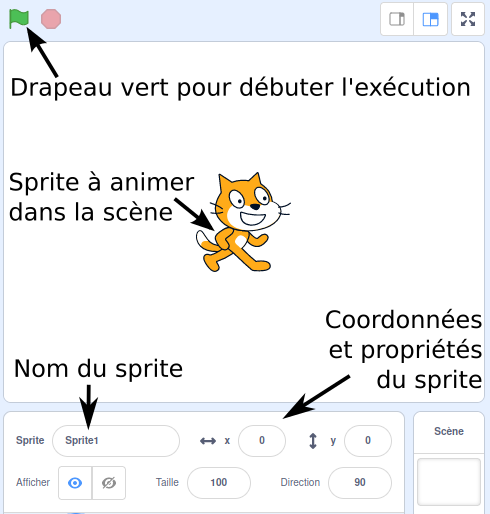
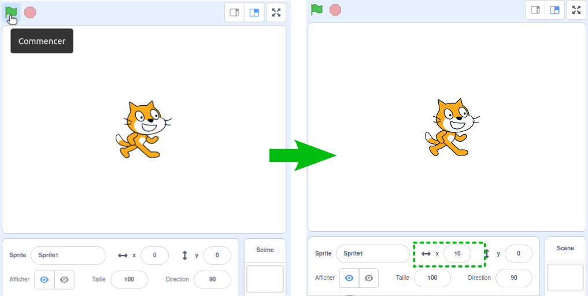
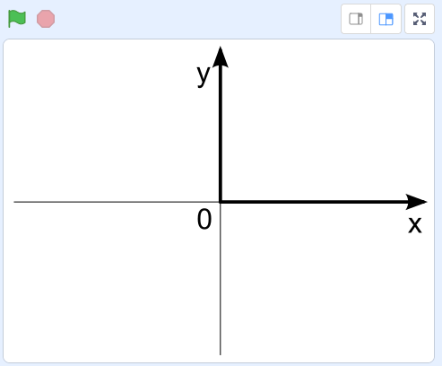
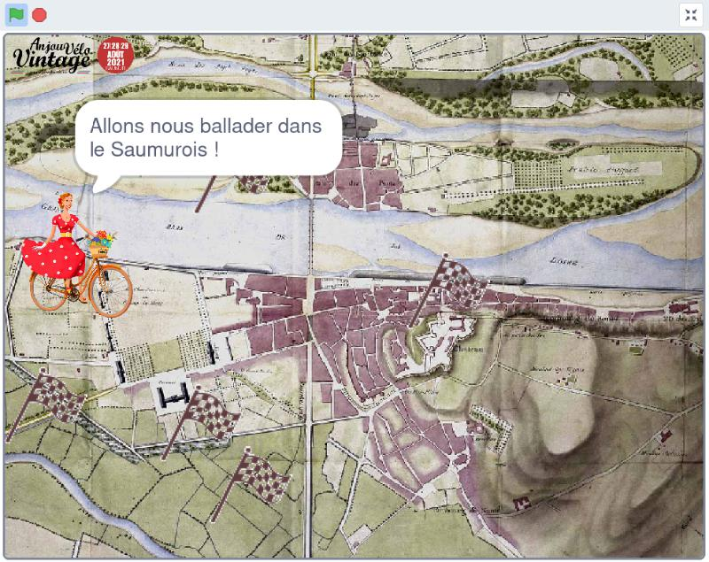
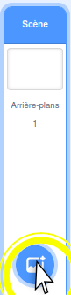
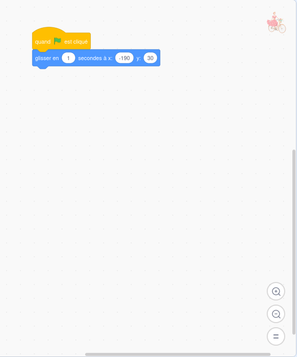
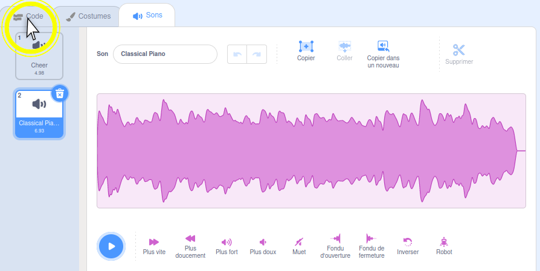

[**Scratch**](https://scratch.mit.edu/projects/editor/) est un langage de programmation graphique qui permet de réaliser de petites **histoires animées** ou des **jeux vidéos simples**. Ce langage est particulièrement adapté à l'**apprentissage de la programmation**. Il a été maintes fois utilisé avec succès pour initier de jeunes enfants au développement logiciel.

Scratch est ludique et drôle à utiliser. Cependant, de **nombreux concepts fondamentaux** à l'ingénierie logicielle se cachent derrière les couleurs chatoyantes et les animaux souriants. On retrouve des concepts comme les structures de contrôle, les variables, les boucles, ou encore les fonctions. On y aborde implicitement la **programmation impérative**, la **programmation orientée-objet**, la **programmation événementielle** et la **programmation concurrente**.

En anglais, "*starting from scratch*" signifie "commencer à partir de rien". En ce sens, Scratch se positionne comme le tout premier langage de programmation de choix quand on n'a jamais fait de développement. En revanche, Scratch n'a pas vocation à être utilisé dans un contexte professionnel, contrairement au **Python**.

Nous allons très prochaintement passer au langage Python, qui est beaucoup plus "*sérieux*". Mais Python n'existe qu'en anglais, et sa version graphique [edublocks](https://app.edublocks.org/) est un peu moins intuitive que Scratch. Par ailleurs, il existe une multitude de langages de programmation, et c'est toujours intéressant d'en connaître plusieurs.

Scratch ne sera pas un choix possible lors de l'examen final.

L'interface graphique de Scratch est disponible [en ligne](https://scratch.mit.edu/projects/editor/) et nous allons l'utiliser pour réaliser un tout premier programme.

## Tout premier programme Scratch

Si vous n'avez pas encore écrit de programme informatique, vous êtes sur le point de créer le tout premier. Commencez par aller sur [https://scratch.mit.edu/projects/editor/](https://scratch.mit.edu/projects/editor/). Vous allez arriver sur l'éditeur Scratch :

L'éditeur comporte plusieurs zones :
* **Menu Principal** : permet de créer un nouveau programme, d'en charger en existant, de sauvegarder l'actuel, de changer la langue d'affichage, de revenir en arrière, etc.
* **Menu Secondaire** : permet de naviguer entre la zone de codage, la zone de gestion des graphiques (appelés costumes) et la zone de gestion des sons.
* **Blocs de Code** : Scratch fourni une liste prédéfinie de blocs de code réutilisables dans la zone de programmation.
* **Zone de Programmation** : permet d'écrire un programme Scratch pour donner du comportement au *sprite* sélectionné, en glissant-déposant des blocs de code.
* **Zone de Résultat** : permet d'exécuter le code et d'en visualiser le résultat.
* **Configuration Graphique** : permet de gérer la liste des *sprites* et des *scènes*.

Un "*sprite*" est personnage ou objet animé dans le jeu. Par exemple, le chat (qui s'appelle le "chat Scratch") est un *sprite*. Dans Super Mario Bros (C), les personnages Mario et Luigi sont des *sprites*, ainsi que les ennemis, les briques, les tuyaux, etc. Le décor en fond d'écran avec lequel on ne peut pas interagir n'est pas un *sprite* : il s'agit de la *scène*.

Vous aller commencer par aller chercher le bloc "Quand *drapeau-vert* est cliqué" dans la catégorie Evénements.

Vous aller ensuite lui ajouter le bloc "Avancer de" dans la catégorie Mouvements. Faites bien attention à ce que le bloc bleu colle le bloc jaune. Si 2 blocs ne sont pas collés, ils ne sont pas en relation.

Ce programme est très simple. Il indique que lorsque l'on clique sur le drapeau vert dans la Zone de Résultat, le sprite du chat Scratch doit d'avancer de 10 pas. On peut trouver le nom du sprite, ainsi que ses coordonnées juste en-dessous de la Zone de Résultat.

Vous pouvez maintenant appuyer sur le drapeau vert pour commencer l'exécution. Notez que le sprite du chat se déplace légèrement vers la droite. Par ailleurs, la nouvelle coordonnée x est désormais égale à 10.

Relancer plusieurs l'exécution en appuyant plusieurs fois sur le drapeau vert. Observez le déplacement progressif du chat Scratch vers la droite.

En pratique, la scène peut être considérée comme un système d'axe à 2 dimensions dont le centre O(0, 0) se situe au milieu.

Vous pouvez maintenant sauvegarder ce tout premier programme sur votre ordinateur. Le format de fichier de Scratch est le sb3.

Notez qu'il est possible de supprimer un bloc dans la Zone de Programmation en effectuant un clic-droit, puis en sélectionnant "Supprimer le bloc". Cela peut s'avérer utile en cas d'erreur.

De même, il est possible de supprimer un sprite en cliquand sur l'icône de poubelle située en haut à droite de l'icône de sprite dans la zone Configuration Graphique.

## Présentation du projet Anjou Vélo Vintage

Tous les ans, une manifestation joyeuse et joviale réunit des cyclistes nostalgiques (ou pas) à [Saumur](https://www.ville-saumur.fr/) : [l'Anjou Vélo Vintage](https://www.anjou-velo-vintage.com/fr/). Le principe est simple : plusieurs courses cyclistes sont proposées et il est nécessaire d'avoir un vélo et de porter des vêtements "vintages" pour y participer.

L'exercice qui suit est un hommage à cette manifestation. Il est à noter que les images et logos utilisés sont la propriété exclusive de la manifestation et de ses organisateurs.

Supposons que vous travaillez pour une ESN (Entreprise de Services du Numérique). Les organisateurs ont fait appel à votre entreprise pour créer un teaser de leur événement sur la forme d'un mini jeu vidéo mettant en scène une cycliste qui doit passer par les différentes étapes de la course. Votre supérieur hiérarchique vient vous voir et vous délègue l'implémentation du jeu.

Fort de votre première expérience avec Scratch, vous décidez d'utiliser ce langage pour réaliser le mini jeu.

## Recueil graphique

La première étape consiste à réaliser une recherche de visuels, car il n'y a pas de graphiste dans votre équipe. Vous décidez d'utiliser les éléments suivants :
* Cycliste glamour que vous trouvez ici : [https://www.anjou-velo-vintage.com/images/dresscode/glamour.png](https://www.anjou-velo-vintage.com/images/dresscode/glamour.png).
* Logo de l'événement que vous trouvez ici : [https://www.anjou-velo-vintage.com/images/logo.png](https://www.anjou-velo-vintage.com/images/logo.png).
* Drapeau représentant une étape de la course que vous trouvez ici : [https://www.anjou-velo-vintage.com/images/esprit-avv/pictos/depart.png](https://www.anjou-velo-vintage.com/images/esprit-avv/pictos/depart.png).

Maintenant, il vous faut un décor. Vous décidez d'utiliser le plan de Saumur en 1814, bien que ce soit relativement anachronique par rapport à l'Anjou Vélo Vintage. Vous trouvez ce plan sur le site [Saumur Jadis](https://saumur-jadis.pagesperso-orange.fr/) : [https://saumur-jadis.pagesperso-orange.fr/plans/plan1814.jpg](https://saumur-jadis.pagesperso-orange.fr/plans/plan1814.jpg). Notez que ce plan est la propriété exclusive des administrateurs du site [Saumur Jadis](https://saumur-jadis.pagesperso-orange.fr/).

## Ajout des éléments graphiques dans Scratch

Retournez sur dans l'[éditeur Scratch](https://scratch.mit.edu/projects/editor/). Cliquez sur Fichier > Nouveau.

Nous n'avons pas besoin du chat Scratch. Nous pouvons donc le supprimer.

Voici un aperçu du résultat souhaité à la fin de ce TP. Le code est beaucoup plus complexe dans le premier programme, mais nous allons avancer pas-à-pas.

Bien que le résultat ne soit pas un jeu AAA comme World of Warcraft (C), il est remarquable de parvenir à finaliser un premier jeu vidéo lors de son tout premier cours d'informatique.

Nous allons commencer par téléverser les éléments graphiques du jeu. Commençons par l'arrière-plan. En bas à droite, cliquez sur "Importer un arrière-plan".

Sélectionnez ensuite plan1814.jpg que vous avez précédemment enregistrer sur votre machine.

Notre arrière-plan apparaît dans le 2e onglet.

Il est souhaitable de nettoyer l'arrière-plan vide par défaut. Pour cela, on commence par le sélectionner.

Puis on clique sur la poubelle.

Comme vous pouvez l'observer dans la Zone de Résultat, le plan importé ne couvre pas toute la largeur. Pour agrandir le plan, vous devons le convertir en vectoriel. Cliquez sur le bouton "Convertir en Vecteur" en bas.

Dans la zone graphique, cliquez sur le plan.

En utilisant les manipulateurs, agrandissez le plan pour qu'il couvre toute la largeur de la Zone de Résultat.

Cliquez sur "Importer un sprite" et choisissez glamour.png.

Modifiez la taille : mettez 40 à la place de 100.

Cliquez dans l'onglet "Costumes" en haut à gauche.

Cliquez sur "Importer un Costume" en bas à gauche. Choisissez à nouveau glamour.png.

Changez le nom du costume : glamour-to-left (ou bien glamour-vers-la-gauche).

Appliquez un mirroir horizontal en cliquant sur le bouton associé.

Choisissez le premier costume. Ensuite, changez le nom du premier costume : glamour-to-right (ou bien glamour-vers-la-droite).

Cliquez à nouveau sur "Importer un sprite" et choisissez logo.png cette fois-ci.

Modifiez la taille du logo : 25

Modifiez les coordonnées du logo :
* x : -194
* y : 166

Suivez les mêmes étapes pour importer le drapeau représentant une étape du parcours.

Sélectionnez le sprite glamour afin de l'activer.

## Initialisation de la scène

Le code source du jeu vidéo est nettement plus complexe que celui de votre tout premier programme. Aidez-vous des couleurs et des formes des blocs pour reproduire le programme pas-à-pas.

A ce stade, il est tout-à-fait normal de ne pas encore comprendre toutes les subtilités de la programmation. Il est possible d'appréhender ce TP comme un simple puzzle ou Lego (R) : il suffit d'assembler les pièces comme indiqué pour parvenir au résultat souhaité.

Ajoutez le bloc `quand `*drapeau-vert*` est cliqué`.

Ajoutez le bloc `glisser en à x ; y` :
* En 1 seconde
* x : -190
* y : 30

Cela permet de repositionner la cycliste à son point de départ à chaque fois que l'on réexécute le jeu.

Ajoutez le bloc `basculer sur le costume` et choisissez glamour-to-right (ou glamour-vers-la-droite).

Cela permet de réinitialiser l'orientation de la cycliste pour qu'elle regarde vers la droite lorsque l'on exécute le jeu.

On peut faire une première exécution en cliquant sur le drapeau vert. On pourra alors observer la cycliste se déplacer en 1s vers la position initiale souhaitée.

Si vous n'observez pas de déplacement, cela signifie tout simplement qu'elle se trouve déjà à sa position initiale.

On souhaite donner au joueur la possibilité de déplacer la cycliste. Pour ce faire, on va utiliser les flèches du clavier : les touches haut, bas, droite et gauche. Pour cela, on va réagir à des événements clavier grâce à des blocs qui représentent ces événements.

Rajoutez un bloc `quand la touche` dans la Zone de Programmation. Ce bloc ne s'imbrique pas avec le reste et doit rester indépendant dans un premier temps. On remarque au passage que les programmes Scratch se construisent comme des Lego (R). Certaines pièces sont faites pour s'assembler, et d'autres non.

## Gestion des touches clavier

Par défaut, le bloc `quand la touche` réagit à un appuie sur la touche espace. Choisissez plutôt la flèche droite à la place.

Quand l'utilisateur appuie sur la flèche droite de son clavier, la cycliste doit partir vers la droite. On doit donc l'orienter vers la droite.

Pour cela, connectez un bloc `changer costume` et choisissez "glamour-to-right" ou "glamour-vers-la-droite".

Ensuite, on souhaite que la cycliste se déplace vers la droite. Un déplacement vers la droite correspond à l'application d'un vecteur (x, 0). Autrement dit, on va incrémenter l'abscisse du sprite représentant la cycliste.

Rajoutez un bloc `mettre x à`.

A l'intérieur du bloc `mettre x à`, glissez-déposez un bloc d'addition. Faites bien attention à le mettre à l'intérieur, comme sur la capture d'écran ci-dessous.

Dans le bloc d'addition, vous allez ajouter en opérande le bloc `abscisse x`. Comme son nom l'indique, cela représente l'abscisse du sprite de la cycliste à un instant donné.

Toujours dans le bloc d'addition, vous allez rentrer la valeur `2` comme seconde opérande. La séquence se lit donc de la manière suivante : "lorsque l'utilisateur appuie sur la flèche droite, change l'orientation du sprite et déplace le de 2 unités en x (donc vers la droite)".

Relancez l'exécution à nouveau. Appuyez sur la flèche droite du clavier et observer le personnage évoluer vers la droite.

On souhaite maintenant pouvoir déplacer notre sprite également à gauche, en bas et en haut, afin de pouvoir explorer l'ensemble de la zone de jeu. On pourrait refaire l'exercice 3 fois. Cela étant, on peut aussi dupliquer le travail réaliser et l'adapter.

Faites un clic droit sur le bloc `quand la touche` puis cliquez sur "Dupliquer".

Il ne reste plus qu'à adapter les valeurs comme sur la capture d'écran ci-dessous. Faites attention au bloc de soustraction qui doit venir remplacer le bloc d'addition.

Relancez l'exécution pour vérifier que vous pouvez déplacer la cycliste à gauche et à droite.
Tentez notamment de la déplacer au-délà des limites de l'écran. Observez qu'elle peut parfaitement en sortir.

Dans ce jeu, on considère que sortir de l'écran n'est pas souhaitable. Vous allez donc corriger ce problème en rajoutant un bloc `rebondir si le bord est atteint`. Pensez à bien mettre ce bloc pour la gestion des 2 événements : gauche et droite.

N'hésitez à relancer l'exécution (drapeau vert) pour vérifier le comportement. Maintenant, la cycliste ne doit plus pouvoir sortir de l'écran.

En vous inspirant des précédentes actions pour gérer les événements gauche et droite, ajoutez les blocs nécessaires pour aller en bas et en haut.

## Eviter un conflit de déplacement

Pendant la première seconde de jeu, on réinitialise la position de notre cycliste. Cependant, durant ce même laps de temps, le joueur a déjà la possibilité d'appuyer sur les flèches de son clavier. Lorsque cela survient, on fait face à un conflit. En effet, d'un côté, un appuie sur une flèche provoque un déplacement relatif par rapport à la position actuelle du sprite. D'un autre côté, le sprite tente d'aller exactement en même temps à une position fixe pré-définie. Ces 2 demandes de déplacement sont en contradiction : on nomme cela un problème de concurrence.

Pour prévenir ce problème, vous allez attendre que le déplacement initial soit terminé avant de prendre en compte l'appuie sur les flèches du clavier.

Dans la zone des Blocs de Code, cliquez sur le bouton "Créez une variable".

Dans le menu qui s'ouvre, remplissez le champ avec la valeur "peutBouger" puis cliquez sur Ok.

Toujours dans la zone des Blocs de Code, décochez la variable "peutBouger". Cela permet de ne pas l'afficher dans la Zone de Résultat.

Ajoutez le bloc `mettre ma variable à` directement sous le block `quand `*drapeau-vert*` est cliqué`. Vous pouvez jouer avec le magnétisme des blocs pour insérer un nouveau blocs entre 2 blocs déjà connectés.

Dans la liste, vous allez choisir "peutBouger" à la place de "ma variable". Dans la zone de texte à droite, vous allez rentrer "faux". Le bloc doit donc contenir "mettre peutBouger à faux".

Rajoutez à nouveau un bloc `mettre ma variable` à la fin de la séquence. Cette fois-ci, la bloc doit contenir "mettre peutBouger à vrai".

Autrement dit, tant que le sprite de cycliste n'a pas atteint sa position initiale, la variable "peutBouger" est valué à "faux". Dès que ce déplacement initial est terminé, la variable "peutBouger" prend la valeur "vrai".

On souhaite maintenant que les événements de gestion des flèches du clavier ne fassent rien tant que la variable "peutBouger" est égale à "faux".

Ajoutez un bloc `si` qui va encadrer tous les blocs situés sous le bloc `quand la touche flèche haut est pressée`. Aidez-vous du magnétisme des blocs.

A l'intérieur du bloc `si`, vous devez ajouter un bloc de `condition d'égalité`. Ce bloc comporte 2 opérandes qui doivent être égales afin que les blocs internes soient exécutés.

Toujours à l'intérieur du bloc `si`, la première opérande du bloc de `condition d'égalité` est la variable "peutBouger". La seconde opérande est le texte "vrai".

La manière de lire cette séquence de blocs est désormais : lorsque la flèche haute du clavier est pressée, si la variable peutBouger est vraie, alors déplace le sprite de cycliste vers le haut et rebondie si le bord est atteint.

Reproduisez le même schéma pour les autres événements.

## Afficher du texte

La gestion des entrées/sorties est importante en programmation logicielle. Afin d'informer un utilisateur, on souhaite souvent afficher un texte à l'écran.

Dans le cas présent, on souhaite informer le joueur de l'objectif du jeu et de le scénariser.

Insérez un bloc `dire pendant` juste au-dessus de `mettre peutBouger à vrai`. Faites dire "Bonjour !" pendant 2 secondes.

De la même manière, rajoutez d'autres textes à faire dire à notre cycliste avant qu'elle ne parte :
* Bonjour ! (2 secondes)
* Allons nous ballader dans le Saumurois ! (3 secondes)
* Chaque drapeau représente une étape de notre voyage... (3 secondes)
* Allons-y ! (2 secondes)
* 3... (1 seconde)
* 2... (1 seconde)
* 1... (1 seconde)
* Partez ! (1 sconde)

Vérifiez que tout se passe comme prévu. Vérifiez notamment que vous ne pouvez pas déplacer le sprite de la cycliste avant que cette dernière n'ait dit "Partez !" (ou quelque soit le dernier texte que vous ayez choisi de lui faire dire).

Vous avez maintenant atteint un stade où le sprite se déplace convenablement après une initialisation complète. Il est temps de sauvegarder votre travail.

## Gestion des collisions : attraper les drapeaux

L'étape suivante consiste à multiplier les drapeaux, les positionner à des emplacements aléatoires et à permettre à votre cycliste d'attraper ces drapeaux. Le fait de réagir à l'intersection entre 2 sprites s'appelle la gestion des collisions.

Dans la zone de Configuration Graphique, cliquez sur le sprite nommé "départ" qui est représenté par un drapeau. Notez que l'icône en haut à droite de la Zone de Programmation a été mise à jour. Vous programmez maintenant le comportement du sprite départ.

Ajoutez un bloc `quand `*drapeau-vert*` est cliqué`.

Cliquez sur le bouton "Créer une variable".

Renseignez "nbDrapeauxTouches" comme nom de variable et cliquez sur Ok. Attention à ne pas utiliser d'accent, ni d'espace ni de caractère spécial : il s'agit bien de nbDrapeauxTouch**e**s, sans accent.

Créez une autre variable et appelez-la "nbTotalDrapeaux".

Cachez ces 2 variables en les décochant.

Ajoutez un bloc `mettre ma variable à` et changez ses paramètres pour donner : mettre nbTotalDrapeaux à 6.

Ajoutez un bloc `mettre ma variable à` et changez ses paramètres pour donner : mettre nbDrapeauTouches à 0.

Ajoutez un bloc `répétez fois`.

A l'intérieur du bloc `répétez fois`, ajouter un `bloc de soustraction`.

Les opérandes du `bloc de soustraction` sont :
* La variable nbTotalDrapeaux,
* 1.

A l'intérieur du bloc `répéter`, rajoutez un bloc `créer un clone de moi-même`.

Ainsi, on va créer 6 - 1 = 5 clones du sprite nommé départ. Initialement, tous ses sprites partagent la même position. Ils sont donc les uns sur les autres.

Rajoutez un bloc indépendant `quand je commence comme un clone`.

Ajoutez, à ce bloc indépendant, un bloc `glisser en 1 seconde à position aléatoire`.

Comme pour notre cycliste, on va éviter que nos drapeaux sortent de l'écran. On va donc les faire rebondir. Ce n'est pas idéal car on peut se retrouver avec des drapeaux à l'envers, mais c'est toujours mieux que de ne pas pouvoir les voir, ne pas pouvoir les attraper et donc ne pas pouvoir finir le jeu.

Ajoutez un bloc `rebondir si le bord est atteint`.

En exécutant à nouveau le jeu, vous devriez voir 5 drapeaux se déplacer à des positions aléatoires.

Faites les essais suivant :
* Initialisez la variable nbTotalDrapeaux à 10 : que se passe-t-il ?
* Initialisez la variable nbTotalDrapeaux à 100 : que se passe-t-il ?

Rajoutez un bloc `attendre jusqu'à ce que` sous les 2 séquences.

A l'intérieur des blocs `attendre jusqu'à ce que`, ajoutez un sous-bloc `touche le` et choisissez le paramètre "glamour". Cela signifie que les blocs suivants ne seront pas exécutés tant que le sprite courant (ou l'un de ses clones) ne soit touché par le sprite de votre cycliste.

Dans les 2 cas, ajoutez un bloc `ajouter à` afin d'ajouter 1 à la variable nbDrapeauxTouches.

Ajoutez un bloc `cacher` pour faire disparaître les drapeaux une fois qu'ils sont touchés.

Ajoutez un bloc `montrer` au début pour le sprite original pour le montrer à nouveau après une exécution où il aurait été touché (et donc caché).

Si vous réexécutez le jeu, vous verrez que les drapeaux disparaissent lorsque la cycliste les touche. Par contre, il ne se passe rien de spécial quand tous les drapeaux ont été attrapés.

## Gérer la fin du jeu

Lorsque tous les drapeaux ont été attrapés, on veut stopper le jeu et afficher des messages de récompense. On souhaite également afficher le temps mis pour attraper tous les drapeaux, afin de mettre en avant un challenge.

Retournez dans le sprite "glamour" pour ajouter plus de comportements à notre cycliste.

Créez une nouvelle variable nommée tempsTotal.

En bas de la séquence principale, ajoutez un bloc `réinitialiser le chronomètre`.

Ajoutez un bloc `attendre jusqu'à ce que`

A l'intérieur du bloc `attendre jusqu'à ce que`, insérez un bloc de `condition d'égalité`. Les opérandes de ce dernier bloc sont :
* nbDrapeauxTouches
* nbTotalDrapeaux

Autrement dit, les blocs suivants ne seront exécutés qu'une fois que la cycliste aura touché tous les drapeaux affichés dans la scène.

Ajoutez un bloc `mettre ma variable à` et utilisez tempsTotal.

Ajoutez un sous-bloc `arrondi de`.

Utilisez le bloc `chronomètre` en paramètre d'`arrondi de`.

En d'autres termes, une fois que la cycliste a touché tous les drapeaux, on regarde notre chronomètre et on inscrit sa valeur (arrondie).

Utilisez un nouveau bloc `mettre ma variable à` pour mettre la variable peutBouger à faux. En effet, une fois que le jeu est fini, on ne doit plus pouvoir bouger le personnage.

On va maintenant afficher des messages d'une part pour scénariser la fin du jeu et d'autre part pour rendre compte du résultat du joueur : son chrono.

Ajoutez un bloc `pensez à pendant` en rajoutant un message du type : "Trop fière d'être arrivée !".

Ajoutez un bloc `dire`.

Dans le bloc `dire`, ajoutez un sous-bloc `regrouper`.

Dans le sous-bloc `regrouper`, ajoutez un sous-sous-bloc `regrouper`. Nous avons maintenant 3 champs.

Remplissez les 3 champs comme suit :
* "J'ai mis "
* Bloc variable `tempsTotal`
* " secondes !"

Vous avez maintenant un jeu complet avec une vraie gestion des collisions. N'hésitez à l'exécuter plusieurs fois et à changer quelques paramètres pour observer les différences. Vous auriez aussi intérêt à sauvegarder votre travail.

## Son

L'ajout de son à un jeu fournit une touche finale importante pour l'ambiance.

Dirigez-vous vers le 3e onglet du Menu Secondaire, intitulé Sons.

Pour le son, vous allez utiliser directement la bibliothèque de base de Scratch.

Cliquez sur Choisir un son.

Cliquez sur le filtre Voix, puis sélectionnez Cheer.

Ajoutez un autre son.

Cliquez sur le filtre Boucle, puis sélectionnez Classical Piano.

Retournez dans l'onglet Code.

Ajoutez un bloc `arrêtez tous les sons` sous le bloc `mettre peutBouger à faux` afin de stopper la musique d'ambiance lorsque le jeu est fini.

Ajoutez tout de suite après un bloc `jouer le son`.

Choisissez "Cheer".

Rajoutez un nouveau bloc quand `*drapeau-vert*` est cliqué, indépendant de tout le reste.

Ajoutez-lui un bloc `jouer le son Classical Piano jusqu'au bout`.

Connectez un bloc `répéter jusqu'à ce que`.

Utilisez un bloc conditionnel pour comparer nbDrapeauxTouches et nbTotalDrapeaux. 

A l'intérieur, rajouter à nouveau un `jouer le son Classical Piano jusqu'au bout`. Cela permet de jouer en boucle le même son.

Maintenant, on souhaite jouer un son particulier lorsque la cycliste attrape un drapeau.

Retournez dans le sprite nommé "départ", et qui correspond au drapeau.

Allez dans l'onglet Sons.

Rajoutez un son depuis la catégorie Voix et choisir Laugh1.

Retournez dans le code.

Ajoutez les derniers blocs `jouer le son Laugh1` pour le cas nominal, et le cas des clones.

Félicitations, vous venez de réaliser votre premier jeu vidéo. Pensez à bien le sauvegarder et faites-le essayer à tous vos amis (*) !

Veuillez ne pas publier ce contenu sur Internet pour des raisons de droit d'auteur. En effet, les images sont la propriété exclusive de [Saumur Jadis](https://saumur-jadis.pagesperso-orange.fr/) et d'[Anjou Vélo Vintage](https://www.anjou-velo-vintage.com/fr/).

(*) sauf en salle de classe !