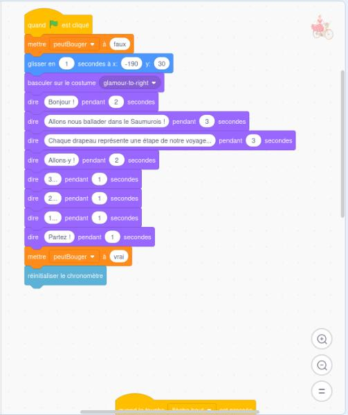

[**Scratch**](https://scratch.mit.edu/projects/editor/) est un langage de programmation graphique qui permet de réaliser de petites **histoires animées** ou des **jeux vidéos simples**. Ce langage est particulièrement adapté à l'**apprentissage de la programmation**. Il a été maintes fois été utilisé avec succès pour initier de jeunes enfants au développement logiciel.

Scratch est ludique et drôle à utiliser. Cependant, de **nombreux concepts fondamentaux** à l'ingénierie logicielle se cachent derrière les couleurs chatoyantes et les animaux souriants. On retrouve des concepts comme les structures de contrôle, les variables, les boucles, ou encore les fonctions. On y aborde implicitement la **programmation impérative**, la **programmation orientée-objet**, la **programmation événementielle** et la **programmation concurrente**.

En anglais, "*starting from scratch*" signifie "commencer à partir de rien". En ce sens, Scratch se positionne comme le tout premier langage de programmation de choix quand on n'a jamais fait de développement. En revanche, Scratch n'a pas vocation à être utilisé dans un contexte professionnel, contrairement au **Python**.

Nous allons très prochaintement passer au langage Python, qui est beaucoup plus sérieux. Mais Python n'existe qu'en anglais, et sa version graphique [edublocks](https://app.edublocks.org/) est un peu moins intuitive. Par ailleurs, il existe une multitude de langages de programmation, et c'est toujours intéressant d'en connaître plusieurs.

Scratch ne sera pas un choix possible lors de l'examen final.

L'interface graphique est disponible de Scratch [en ligne](https://scratch.mit.edu/projects/editor/) et nous allons l'utiliser pour réaliser un tout premier programme.

## Tout premier programme Scratch

Si vous n'avez pas encore écrit de programme informatique, vous êtes sur le point de créer le tout premier. Commencez par aller sur [https://scratch.mit.edu/projects/editor/](https://scratch.mit.edu/projects/editor/). Vous allez arriver sur l'éditeur Scratch :

L'éditeur comporte plusieurs zones :
* **Menu Principal** : permet de créer un nouveau programme, d'en charger en existant, de sauvegarder l'actuel, de changer la langue d'affichage, de revenir en arrière, etc.
* **Menu Secondaire** : permet de naviguer entre la zone de codage, la zone de gestion des graphiques (appelés costumes) et la zone de gestion des sons.
* **Blocs de Code** : Scratch fourni une liste prédéfinie de blocs de code réutilisables dans la zone de programmation.
* **Zone de Programmation** : permet d'écrire un programme Scratch pour donner du comportement au *sprite* sélectionné, en glissant-déposant des blocs de code.
* **Zone de Résultat** : permet d'exécuter le code et d'en visualiser le résultat.
* **Configuration Graphique** : permet de gérer la liste des *sprites* et des *scènes*.

Un "*sprite*" est personnage ou objet animé dans le jeu. Par exemple, le chat (qui s'appelle le "chat Scratch") est un *sprite*. Dans Super Mario Bros (C), les personnages Mario et Luigi sont des *sprites*, ainsi que les ennemis, les briques, les tuyaux, etc. Le décors en fond d'écran avec lequel on ne peut pas interagir n'est pas un *sprite* : il s'agit de la *scène*.

Vous aller commencer par aller chercher le bloc "Quand *drapeau-vert* est cliqué" dans la catégorie Evénements.

Vous aller ensuite lui ajouter le bloc "Avancer de" dans la catégorie Mouvements. Faites bien attention à ce que le bloc bleu colle le bloc jaune. Si 2 blocs ne sont pas collés, ils ne sont pas en relation.

Ce programme est très simple. Il indique que lorsque l'on clique sur le drapeau vert dans la Zone de Résultat, le sprite du chat Scratch doit d'avancer de 10 pas. On peut trouver le nom du sprite, ainsi que ses coordonnées juste en-dessous de la Zone de Résultat.

Vous pouvez maintenant appuyer sur le drapeau vert pour commencer l'exécution. Notez que le sprite du chat se déplace légèrement vers la droite. Par ailleurs, la nouvelle coordonnée x est désormais égale à 10.

Relancer plusieurs l'exécution en appuyant plusieurs fois sur le drapeau vert. Observez le déplacement progressif du chat Scratch vers la droite.

En pratique, la scène peut être considérée comme un système d'axe à 2 dimensions dont le centre O(0, 0) se situe au milieu.

Vous pouvez maintenant sauvegarder ce tout premier programme sur votre ordinateur. Le format de fichier de Scratch est le sb3.

Notez qu'il est possible de supprimer un bloc dans la Zone de Programmation en effectuant un clic-droit, puis en sélectionnant "Supprimer le bloc". Cela peut s'avérer utile en cas d'erreur.

De même, il est possible de supprimer un sprite en cliquand sur l'icône de poubelle située en haut à droite de l'icône de sprite dans la zone Configuration Graphique.

## Présentation du projet Anjou Vélo Vintage

Tous les ans, une manifestation joyeuse et joviale réunit des cyclistes nostalgiques (ou pas) à [Saumur](https://www.ville-saumur.fr/) : [l'Anjou Vélo Vintage](https://www.anjou-velo-vintage.com/fr/). Le principe est simple : plusieurs courses cyclistes sont proposées et il est nécessaire d'avoir un vélo et de porter des vêtements "vintages" pour y participer.

L'exercice qui suit est un hommage à cette manifestation. Il est à noter que les images et logos utilisés sont la propriété exclusive de la manifestation et de ses organisateurs.

Supposons que vous travaillez pour une ESN (Entreprise de Services du Numérique). Les organisateurs ont fait appel à votre entreprise pour créer un teaser de leur événement sur la forme d'un mini jeu vidéo mettant en scène une cycliste qui doit passer par les différentes étapes de la course. Votre supérieur hiérarchique vient vous voir et vous délègue l'implémentation du jeu.

Fort de votre première expérience avec Scratch, vous décidez d'utiliser ce langage pour réaliser le mini jeu.

## Recueil graphique

La première étape consiste à réaliser une recherche de visuels, car il n'y a pas de graphiste dans votre équipe. Vous décidez d'utiliser les éléments suivants :
* Cycliste glamour que vous trouvez ici : [https://www.anjou-velo-vintage.com/images/dresscode/glamour.png](https://www.anjou-velo-vintage.com/images/dresscode/glamour.png).
* Logo de l'événement que vous trouvez ici : [https://www.anjou-velo-vintage.com/images/logo.png](https://www.anjou-velo-vintage.com/images/logo.png).
* Drapeau représentant une étape de la course que vous trouvez ici : [https://www.anjou-velo-vintage.com/images/esprit-avv/pictos/depart.png](https://www.anjou-velo-vintage.com/images/esprit-avv/pictos/depart.png).

Maintenant, il vous faut un décor. Vous décidez d'utiliser le plan de Saumur en 1814, bien que ce soit relativement anachronique par rapport à l'Anjou Vélo Vintage. Vous trouvez ce plan sur le site [Saumur Jadis](https://saumur-jadis.pagesperso-orange.fr/) : [https://saumur-jadis.pagesperso-orange.fr/plans/plan1814.jpg](https://saumur-jadis.pagesperso-orange.fr/plans/plan1814.jpg).

## Programmation de base du jeu

Retournez sur dans l'[éditeur Scratch](https://scratch.mit.edu/projects/editor/). Cliquez sur Fichier > Nouveau.

Nous n'avons pas besoin du chat Scratch. Nous pouvons donc le supprimer.

Voici un aperçu du résultat souhaité à la fin de ce TP. Le code est beaucoup plus complexe dans le premier programme, mais nous allons avancer pas-à-pas.

Bien que le résultat ne soit pas un jeu AAA comme World of Warcraft (C), il est remarquable de parvenir à finaliser un premier jeu vidéo lors de son tout premier cours d'informatique.

Nous allons commencer par téléverser les éléments graphiques du jeu. Commençons par l'arrière-plan. En bas à droite, cliquez sur "Importer un arrière-plan".

Sélectionnez ensuite plan1814.jpg que vous avez précédemment enregistrer sur votre machine.

Notre arrière-plan apparaît dans le 2e onglet.

Il est souhaitable de nettoyer l'arrière-plan vide par défaut. Pour cela, on commence par le sélectionner.

Puis on clique sur la poubelle.

Comme vous pouvez l'observer dans la Zone de Résultat, le plan importé ne couvre pas toute la largeur. Pour agrandir le plan, vous devons le convertir en vectoriel. Cliquez sur le bouton "Convertir en Vecteur" en bas.

Dans la zone graphique, cliquez sur le plan.

En utilisant les manipulateurs, agrandissez le plan pour qu'il couvre toute la largeur de la Zone de Résultat.

Cliquez sur "Importer un sprite" et choisissez glamour.png.

Modifiez la taille : mettez 40 à la place de 100.

Cliquez dans l'onglet "Costumes" en haut à gauche.

Cliquez sur "Importer un Costume" en bas à gauche. Choisissez à nouveau glamour.png.

Changez le nom du costume : glamour-to-left (ou bien glamour-vers-la-gauche).

Appliquez un mirroir horizontal en cliquant sur le bouton associé.

Choisissez le premier costume. Ensuite, changez le nom du premier costume : glamour-to-right (ou bien glamour-vers-la-droite).

Cliquez à nouveau sur "Importer un sprite" et choisissez logo.png cette fois-ci.

Modifiez la taille du logo : 25

Modifiez les coordonnées du logo :
* x : -194
* y : 166

Suivez les mêmes étapes pour importer le drapeau représentant une étape du parcours.

Sélectionnez le sprite glamour afin de l'activer.

Ajoutez le bloc "Quand *drapeau-vert* est cliqué".

Ajoutez le bloc "Glisser en à x/y" :
* En 1 seconde
* x : -190
* y : 30

Cela permet de repositionner la cycliste à son point de départ à chaque fois que l'on réexécute le jeu.

Ajoutez le bloc "Basculer sur le costume" et choisissez glamour-to-right (ou glamour-vers-la-droite).

Cela permet de réinitialiser l'orientation de la cycliste pour qu'elle regarde vers la droite lorsque l'on exécute le jeu.

On peut faire une première exécution en cliquant sur le drapeau vert.

