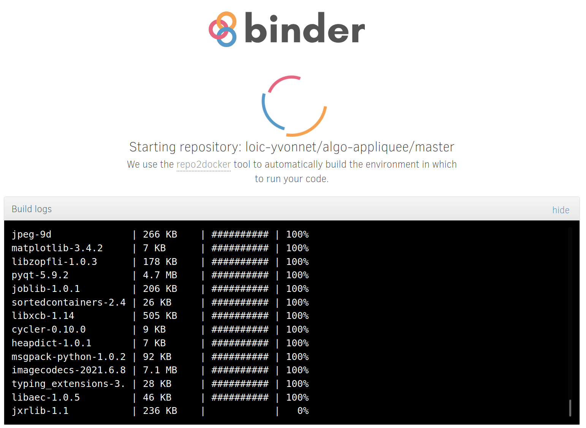
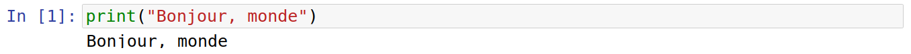
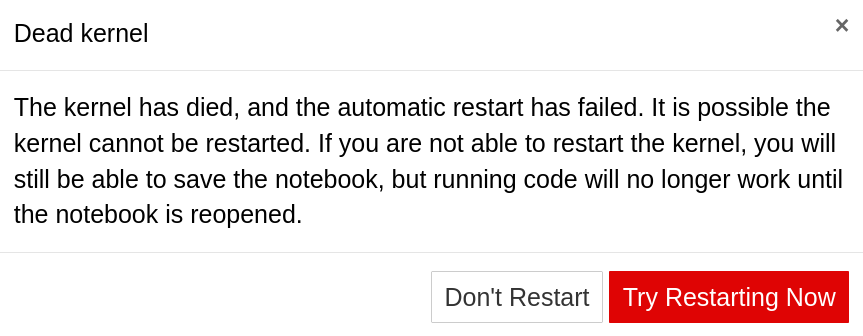

Dans ce TP, vous allez utiliser Jupyter Notebook pour commencer à programmer en Python.

Cliquez sur ce lien pour lancer Binder, qui est un service Cloud pour exécuter dans un un carnet Jupyter Notebook :

Le chargement de Jupyter Notebook peut prendre jusqu'à 5 minutes. Soyez donc patient ! Vous pouvez lire la suite de cette page en attendant...

L'écran suivant va s'afficher pendant que l'environnement de programmation se prépare automatiquement dans le Cloud.

Ne fermez pas l'onglet, car vous devriez tout recharger depuis le départ.

Une fois que le carnet est chargé, vous devriez obtenir la page suivante :

Le menu est en anglais. Il va falloir vous habituer : la plupart des environnements de programmation et des outils sont dans la langue de Shakespear. C'est également vrai pour l'administration réseau. Vous avez donc intérêt à bien travailler avec votre professeur d'anglais !

Le bouton le plus important est le bouton Run, qui permet d'exécuter la zone de code sélectionnée :

Pour exécuter du code, vous devez sélectionner la zone de code :

Ensuite, vous pouvez cliquer sur le bouton Run et observer le résultat de l'exécution :

Cette puissance de calcul dans le Cloud a forcément un coût financier. Ce coût est supporté par plusieurs sponsors :
* [Google Cloud](https://cloud.google.com/)
* [OVH](https://www.ovh.com/)
* [GESIS Notebooks](https://notebooks.gesis.org/)
* [L'Institut Turing](https://turing.ac.uk/)

Pour éviter le gaspillage de ressources de calcul, un carnet inactif pendant 10 minutes se désactive automatiquement. Vous aurez alors un message d'erreur de ce type :

Lorsque cela arrivera, ne vous inquiétez pas : cliquez simplement sur le bouton rouge "Try Restarting Kernel" et tout rentrera dans l'ordre.

Il est probable que votre carnet soit désormais chargé. Bon TP.