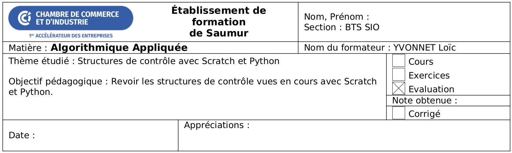

Ce devoir à la maison va donner lieu à une note sur 20. Il doit être rendu avant le début du prochain cours.

Pour l'exercice Scratch, vous devez fournier un fichier nommé `dm01_exercice_1.sb3`.

Pour les autres exercices, vous devez créer un fichier nommé `dm01_exercice_X.py` où X est le numéro de l'exercice.

Vous devrez créer une archive `dm01.zip` contenant tous vos fichiers et l'envoyer à [loic@yvo.solutions](mailto:loic@yvo.solutions).

## Exercice 1 - Déplacements circulaires automatisés <span class="fs-4 fw-lighter">(5 points)</span>

On souhaite que la cycliste se déplace de manière rotative indépendamment des entrées utilisateurs :
* Rouvrez votre fichier de sauvegarde du TP 01, et enregistrez-le sous `dm01_exercice_1.sb3`.
* Sélectionnez le sprite de cycliste nommé glamour en bas à droite.
* Changez sa position initial pour qu'elle soit centrée.
* Changez le bloc de repositionnement initial pour qu'elle aille en $(0, 1)$.
* Supprimez les 4 séquences de blocs qui permettent de gérer les entrées clavier pour déplacer la cycliste avec les flèches du clavier.
* Rajoutez un nouveau bloc "quand le drapeau vert est cliqué".
* Connectez une boucle à ce bloc.
* Dans cette boucle, vous allez recalculer la prochaine position P de la cycliste en utilisant la trigonométrie :

$$
P =
\begin{pmatrix}
P_x \\
P_y
\end{pmatrix}
=
\begin{pmatrix}
rayon \cdot \cos(angle) \\
rayon \cdot \sin(angle)
\end{pmatrix}
$$

* Initialement, avant la boucle :
    * La variable `rayon` prend la valeur 1.
    * La variable `angle` prend la valeur 0.
    * La variable `Px` prend la valeur 1.
    * La variable `Py` prend la valeur 0.
* A chaque itération :
    * La variable `angle` est incrémentée de $\dfrac{\pi}{8}$.
    * Si après incrément, la valeur de variable `angle` est supérieure à $2 \cdot \pi$ :
        * La variable `angle` reprend la valeur 0.
        * La variable `rayon` est incrémentée de 5 unités.
    * Vous recalculez `Px` et `Py` avec la formule trigonométrique ci-dessus.
    * Vous utilisez un bloc adéquat pour déplacer le sprite glamour à la position (`Px` ; `Py`).
* Sauvegardez et exécutez.

Vous devriez maintenant gagner au jeu automatiquement.

## 2. Manipulation de chaînes de caractères

### Exercice 2.1 - Majuscules et Minuscules <span class="fs-5 fw-lighter">(2 points)</span>

Ecrivez un script qui demande à l'utilisateur d'entrer une chaîne de caractères :
* Si la chaîne de caractères ne comporte que des majuscules, affichez `"MAJ"`.
* Si la chaîne de caractères ne comporte que des minuscules, affichez `"MIN"`.
* Sinon, affichez `"MIX"`.

*Astuces* :
* Utilisez une boucle pour parcourir et tester, un à un, les caractères de la chaîne.
* Utilisez la comparaison lexicographique pour savoir si un caractère est entre "A" et "Z" (ou respectivement "a" et "z") : 
```python
caractere = "T"
if ("A" <= caractere) and (caractere <= "Z"):
    print("T est entre A et Z")
```
* Utilisez des variables et des conditions.

### Exercice 2.2 - Palindrome <span class="fs-5 fw-lighter">(4 points)</span>

Un palindrome est une chaîne de caractères "mirroir" : on peut la lire indifféremment de gauche à droite ou de droite à gauche.
Les accents, la ponctuation, les espaces et les majuscules ne sont pas pris en compte.

Par exemple, les mots et phrases suivants sont des palindromes :
* Non.
* Ressasser.
* Ésope reste ici et se repose.
* La mariée ira mal.
* Eh ! ça va, la vache ?

Ecrivez un script qui demande à l'utilisateur d'entrer une chaîne de caractères sans accent.
Si la chaîne de caractères est un palindrome, affichez `"C'est beau !"`.
Sinon, affichez `"Dommage, ce n'est pas un palindrome..."`.

*Astuces* :
* Utilisez un index de début qui s'incrémente.
* Utilisez un index de fin qui se décrémente.
* Si un caractère n'est pas alphabétique, incrémentez l'index de début - respectivement décrémentez l'index de fin.
* Comparez entre eux les caractères alphabétiques de début et de fin jusqu'à ce que les index se croisent, ou jusqu'à ce qu'il y ait une différence.
* Dans cet exercice, on n'utilise pas d'accent ni de majuscule. Les chaînes de test sont donc :
    * `"non"`
    * `"ressasser"`
    * `"esope reste ici et se repose"`
    * `"la mariee ira mal"`
    * `"eh ! ca va, la vache ?"`

### Exercice 2.3 - Acrostiche <span class="fs-5 fw-lighter">(3 points)</span>

Une manière de cacher un message dans un texte consiste à utiliser les premières lettres de chaque vers d'un poème.

Cet acrostiche daterait de 1598, et aurait été écrite dans le cadre de l'édit de Nantes préparé par Henri IV :

<blockquote class="blockquote">
    <p class="mb-0 ps-5"><strong>A</strong>ntique clef de France,</p>
    <p class="mb-0 ps-5"><strong>N</strong>ecteté de souffrance,</p>
    <p class="mb-0 ps-5"><strong>G</strong>arant contre ennemys,</p>
    <p class="mb-0 ps-5"><strong>E</strong>stappe d'asseurance,</p>
    <p class="mb-0 ps-5"><strong>R</strong>ecours de secourance,</p>
    <p class="mb-0 ps-5"><strong>S</strong>eccurité d’amys.</p>
</blockquote>

Vous trouverez d'autres exemples sur [Wikipedia](https://fr.wikipedia.org/wiki/Acrostiche) pour tester votre algorithme, notamment le Horace de Corneille.

Ecrivez un script qui affiche le message caché dans un acrostiche.

L'acrostiche lui-même pourra être défini de la manière suivante (les prochains cours expliqueront plus en détails cette syntaxe) :
```py
acrostiche = "\n".join((
    "Antique clef de France,",
    "Necteté de souffrance,",
    "Garant contre ennemys,",
    "Estappe d'asseurance,",
    "Recours de secourance,",
    "Seccurité d’amys."
))
```

*Astuces* :
* Vous devez afficher le tout premier caractère.
* Ensuite, vous devez parcourir chaque caractère. A chaque fois que vous trouverez un retour à la ligne, vous devrez afficher le caractère suivant (s'il existe).

## 3. Calcul numérique

### Exercice 3.1 - Moyenne <span class="fs-5 fw-lighter">(2 points)</span>

Ecrivez un script qui calcule la moyenne des nombres à virgule flottante rentrés par l'utilisateur.

Dans une boucle, demandez à l'utilisateur, à l'aide de la fonction `input`, de rentrer un nombre réel. La boucle s'arrête lorsque l'utilisateur rentre la chaîne `"fin"` à la place d'un nombre réel.

Affichez la moyenne des nombres rentrés par l'utilisateur.

### Exercice 3.2 - Calculatrice en ligne de commande <span class="fs-5 fw-lighter">(4 points)</span>

Ecrivez un script qui calcule à la demande une addition, soustraction ou multiplication de 2 nombres entiers.

Dans une boucle :
* Demandez à l'utilisateur l'opération à effectuer : `+`, `-`, `*` ou `fin`.
* Si l'utilisateur rentre `fin`, stoppez la boucle.
* Demandez ensuite 2 nombres entiers à l'utilisateur et affichez le résultat de l'opération demandée.
