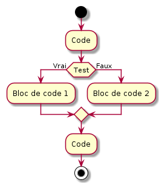
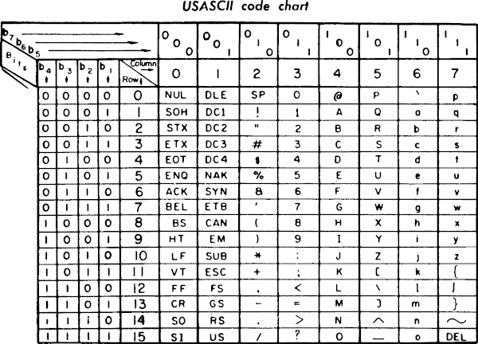
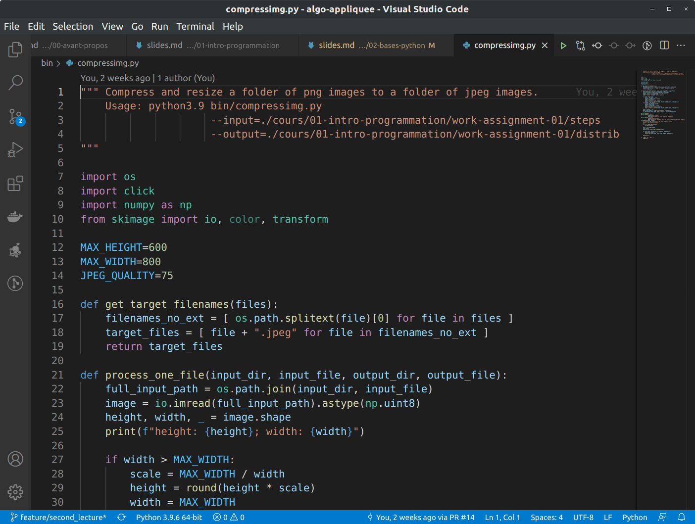
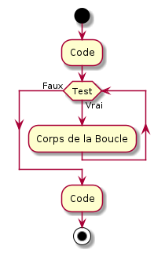
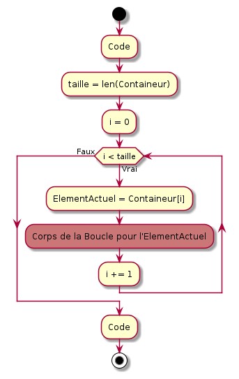

<!-- _class: title-section -->

# <!--fit--> Algorithmique Appliquée

##### BTS SIO SISR

## Les bases du langage Python

<!-- Faisons sifler les serpents ! -->

---

# Plan

- Conditions
- Chaînes de caractères et encodage de caractères
- Entrée et sortie standard
- Boucles "Tant Que"
- Boucles "Pour"
- Discussion sur les différences entre Scratch et Python
- Style, commentaires et PEP 8

---

<!-- _class: title-section -->

# Conditions

---

# Branche

* Un algorithme doit souvent prendre des **décisions**.
* En fonction de la valeur d'une **expression Booléenne**, l'interprêteur va suivre une **branche** ou une autre.

---

# <!--fit--> Exemple de branchement



* On peut visualiser graphiquement les branches.
* Pseudo-code équivalent :

```
Si la valeur de l'expression Test renvoie Vrai:
    Exécute le Bloc de code 1
Sinon:
    Exécute le Bloc de code 2
```

* En anglais :
  * si :arrow_right: `if`
  * sinon :arrow_right: `else`


---

# Conditions en Python

* La forme de base est la suivante :

```py
if Test:
    Bloc de code 1
else:
    Bloc de code 2
```

* Attention aux `:` et à l'**indentation** de 4 espaces.
* Attention à la casse : les mots clés `if` et `else` sont en **minuscule**.

---

# Le `else` est facultatif

* Une condition peut prendre tout simplement la forme :

```py
if Test:
    Bloc de code # Exécuté si Test == True
```

---

# Quelques exemples

```py
texte = ""
taille = 175

if taille > 180:
    texte = "grand"
else:
    texte = "petit"

print(texte)
```

:arrow_right: `petit`

---

# Quelques exemples

```py
texte = "petit"
taille = 175

if taille > 180:
    texte = "grand"

print(texte)
```

:arrow_right: `petit`

---

<!-- _class: smaller-text -->

# `if` imbriqués

```py
texte = ""
taille = 175

if taille > 180:
    if taille > 200:
        texte = "très grand"
    else:
        texte = "grand"
else:
    if taille > 155:
        texte = "moyen"
    else:
        texte = "petit"

print(texte)
```

:arrow_right: `moyen`

---

# <!--fit--> Plus lisible avec les expressions Booléennes composées

```py
texte = ""
taille = 175

if taille > 200:
    texte = "très grand"
elif taille > 180:
    texte = "grand"
elif taille > 155:
    texte = "moyen"
else:
    texte = "petit"

print(texte)
```

:arrow_right: `moyen`

---

# <!--fit--> Expression conditionnelle dense

```py
taille = 175
texte = "grand" if taille > 180 else "petit"
print(texte)
```

:arrow_right: `petit`

---

<!-- _class: title-section -->

# <!--fit--> Chaînes de caractères et encodage de caractères

---

# Type `str`

* En anglais, **string** signifie **chaîne de caractères**.
* C'est une **liste de caractères**.
* Cette liste commence et termine par `"` (ou `'`).
* Cela n'a *rien* à voir avec certains vêtements... :bikini:
* `str` est la contraction de string.
* Exemple :

```py
taille = "petit"
```

---

# Concaténation

```py
entree = "avocat"
plat = "riz"
dessert = "chocolat"
espace = " "
repas = entree + espace + plat + espace + dessert

print(repas)
```

:arrow_right: `avocat riz chocolat`

---

# Multiplication scalaire

```py
a = "a"
trois_a = 3 * a

print(trois_a)
```

:arrow_right: `aaa`

---

# Multiplication ?

```py
a = "a"
a_voir = a * a
```

:arrow_down:

```
TypeError: can't multiply sequence by non-int of type 'str'
```

<!--
Cela ne voudrait de toutes façons rien dire.
Mieux vaut interdire une syntaxe sans sémantique.
-->

---

# Longueur

`len` est un diminutif de **length**, qui signifie longueur.

```py
chaine = "abcde"
len(chaine)
```

:arrow_right: `5`

```py
chaine = "papillon"
len(chaine)
```

:arrow_right: `8`

---

# Indexation

```py
chaine = "abcde"
chaine[0]
```

:arrow_right: `"a"`

```py
chaine = "abcde"
chaine[2]
```

:arrow_right: `"c"`

---

# Indexation négative

```py
chaine = "abcde"
chaine[-1]
```

:arrow_right: `"e"`

```py
chaine = "abcde"
chaine[-3]
```

:arrow_right: `"c"`

---

# <!--fit--> Indexation en dehors des limites

```py
chaine = "abcde"
chaine[5]
```

:arrow_down:

```
IndexError: string index out of range
```

---

# Tranche entre 2 bornes

```py
debut = 1
fin = 4
chaine = "abcde"
tranche = chaine[debut:fin]
print(tranche)
```

:arrow_right: `"bcd"`

*Note* : en anglais, on parle de **slicing**.
*Note 2* : la borne de fin est exclue.

---

# <!--fit--> Tranche à partir d'un index

```py
debut = 2
chaine = "abcdefg"
tranche = chaine[debut:]
print(tranche)
```

:arrow_right: `"cdefg"`

---

# <!--fit--> Tranche jusqu'à un index

```py
fin = 5
chaine = "abcdefg"
tranche = chaine[:fin]
print(tranche)
```

:arrow_right: `"abcde"`

---

# <!--fit--> Tranche non contiguë

```py
debut = 1
fin = 10
saut = 2
chaine = "abcdefghijklmnop"
tranche = chaine[debut:fin:saut]
print(tranche)
```

:arrow_right: `"bdfhj"`

---

# Caractères spéciaux

- On utilise le **caractère d'échappement** `\` en préfixe des caractères spéciaux dans les chaînes de caractères.
- Quelques exemples :
  - Guillements : `\"`
  - Tabulation : `\t`
  - Retour à la ligne : `\n`
  - Retour chariot : `\r`
  - Backslash : `\\`

---

# <!--fit--> Exemples de caractères spéciaux

```py
print("lapin\rLu")
```

:arrow_right: `"Lupin"`

```py
print("C:\\Users\\mikado\\Documents")
```

:arrow_right: `"C:\Users\mikado\Documents"`

```py
print("\tValeur : \"Zorro\"")
```

:arrow_right: `"	Valeur : "Zorro""`

---

# <!--fit--> Conversion vers des nombres

```py
chaine = "1234"
entier = int(chaine)
entier += 8765
print(entier)
```

:arrow_right: `9999`

```py
chaine = "3.1415"
reel = float(chaine)
reel *= 2
print(reel)
```

:arrow_right: `6.283`

---

# <!--fit--> Conversion depuis des nombres

```py
entier = 123
chaine = str(entier)
chaine *= 2
print(chaine)
```

:arrow_right: `"123123"`

---

<!-- _class: smaller-text -->



# <!--fit--> Encodage de caratères : ASCII

* **ASCII** : American Standard Code for Information Interchange.
* Encodage simple et **compact** : sur 7 bits (moins de 1 octet), on peut avoir jusqu'à $2^7 = 128$ caractères.
* Chaque caractère est représenté par un nombre entre 0 et 127.
* La **table ASCII** offre une correspondance entre les nombres et leurs caractères associés.

---

# Limites du ASCII

* こんにちは : Bonjour *(Japonais)*
* 你好吗？ Comment allez-vous ? *(Mandarin)*
* شكرا لك : Merci *(Arabe)*
* :sos: :weary: :computer: : Je ne comprends rien au cours ! *(Emoji)*

---

# Unicode

* **Unicode** : Universal Coded Character Set.
* L'objectif est de **normaliser** l'encodage de caractères, d'**inclure** un maximum de langues et autres besoins et d'**optimiser** la représentation numérique.
* L'**UTF-8** (pour Unicode Transformation Format - 8 bit) est le plus répandu.
* UTF-8 utilise entre 1 et 8 octets pour représenter jusqu'à 1 112 064 caractères.

<!--
UTF-8 ne permet pas de représenter tous les symboles de toutes les langues.
Il existe de très nombreux autres formats d'encodage.
Certains formats sont populaires pour certaines langues.
Par défaut, Python utilise UTF-8.
-->

---

# Encodage en Python

* L'encodage par défaut d'un script Python est **UTF-8**.
* On peut changer cela en ajoutant au tout début d'un fichier Python :

```py
# -*- coding: ascii -*- 
```

* Toutes les `str` d'un script Python utilisent cet encodage par défaut.

---

# <!--fit--> Changer l'encodage à la volée

```py
texte_en_utf8 = "Bonjour !"
texte_en_ascii = texte_en_utf8.encode("ascii")
print(texte_en_ascii)
```

:arrow_right: `b'Bonjour !'`

Le préfixe `b` signifie qu'il s'agit d'une chaîne binaire.

<!--
Nous reviendrons plus tard sur le type binaire.
-->

---

<!-- _class: title-section -->

# <!--fit--> Entrée et sortie standard

---

# Introduction aux I/O

* En français, on parle d'Entrées/Sorties, soit **E/S**.
* La langue anglaise prédomine en informatique.
* La traduction en anglais d'E/S est **I/O** pour Input/Output.
* On enlève en général le *slash*, ce qui donne **IO**.

---

# Les fichiers standards

* Les Systèmes d'Exploitation classiques comportent 3 fichiers standards :
  * `stdin` (index 0) : entrée texte standard.
  * `stdout` (index 1) : sortie texte standard.
  * `stderr` (index 2) : sortie d'erreur standard.

---

# Lire dans `stdin`

* `stdin` est une redirection vers le périphérique clavier.
* Une lecture dans `stdin` signifie donc que l'on va lire ce que l'utilisateur écrit.
* En Python, on utilise la fonction `input` pour lire dans `stdin` :

```py
nom = input("Votre nom : ")
```

---

# Ecrire dans `stdout`

* `stdout` est une redirection vers la console.
* Une écriture dans `stdout` va afficher le contenu dans la console.
* En Python, on utilise la fonction `print` pour écrire dans `stdout` :

```py
nom = input("Votre nom : ")
print(nom)
```

---

<!-- _class: smaller-text -->

# Ecrire dans `stderr`

* `stderr`, tout comme `stdout`, est une redirection vers la console.
* Une écriture dans `stderr` va afficher le contenu dans la console.
* En Python, lorsqu'une exception est levée, un message d'erreur est affiché dans `stderr` par défaut.
* On peut également utiliser `sys.stderr.write` :

```py
import sys
sys.stderr.write("Oh mince ! dit Shipper")
```

---

# Formattage simple

```py
age_en_texte = input("Votre age : ")
age = int(age_en_texte)
print("Vous avez", age, "ans")
```

:arrow_right: `"Vous avez 42 ans"`
*(si `age == 42`)*

---

# <!--fit--> Limites du formattage simple

```py
ht = 69.5
tva = 1/5
taxe = round(ht * tva * 100) / 100
ttc = ht + taxe
label_ht = "Prix (HT) : "
label_ttc = "Prix (TTC) : "
print(label_ht, ht, "€\n", label_ttc, ttc, "€")
```

:arrow_down:

```
Prix (HT) :  69.5 €
 Prix (TTC) :  83.4 €
```

---

# <!--fit--> Chaîne de caractères litérale formattée

```py
ht = 69.5
tva = 1/5
taxe = round(ht * tva * 100) / 100
label_ht = "Prix (HT) :"
label_ttc = "Prix (TTC) :"
print(f"{label_ht:>12} {ht:.2f}€\n{label_ttc:>12} {ht + taxe:.2f}€")
```

:arrow_down:

```
 Prix (HT) : 69.50€
Prix (TTC) : 83.40€
```

---

<!-- _class: title-section -->

# TP 03 - Initiation aux Environnements de Développement Intégrés avec pour but de manipuler des chaînes de caractères

---


* **Visual Studio Code** est un Environnement de Développement Intégré.
* Edité par Microsoft en JavaScript/Electron.
* Gratuit et Open Source.
* Linux, macOS, Windows.
* Nombreuses extensions.
* [**Lien vers le site officiel**](https://code.visualstudio.com)

<!--
Extensions disponibles pour presque tous les langages de programmation.
Excellent support de Python.
Vous pourrez l'utiliser sans problème pour vos projets professionnels.
Est utilisé notamment pour l'édition de ce cours.
-->

---



### TP : Usage d'un IDE et manipulation de chaînes

[**Lien** vers le sujet de TP](./tp-03-ide-et-strings.html).

---

<!-- _class: title-section -->

# <!--fit--> Boucles "Tant que"

---

# Pourquoi des boucles ? :loop:

* Imaginons un programme qui prend en entrée un nombre et doit calculer la somme de 1 à ce nombre :

```py
nombre = int(input("Entrez un nombre positif : "))
resultat = 0
if nombre == 1:
    resultat = 1
elif nombre == 2:
    resultat = 1 + 2
elif nombre == 3:
    resultat = 1 + 2 + 3
elif nombre == 4:
    resultat = 1 + 2 + 3 + 4
# etc.
print(resultat)
```

<!--
Evidemment, on pourrait faire `sum(range(nombre + 1))` si on avait déjà quelques connaissances plus avancées.
Mais ici, on se pose la question de l'implémentation de sum.
-->

---

# Pourquoi des boucles ?

On souhaite en fait ici exprimer :

$$
\sum_{i = 0}^{nombre} i = 0 + 1 + 2 + ... + (nombre - 1) + nombre
$$

Le commentaire `# etc.` dans la diapositive précédente ou l'ellipse `...` dans la formule ci-dessus expriment tous les 2 une **répétition**.

---

# Définition

* Une **boucle** permet de répéter un ensemble d'instructions.
* Une répétition de cet ensemble d'instructions s'appelle une **itération**.
* L'ensemble d'instructions à répéter s'appelle le **corps de la boucle**.
* Une boucle s'arrête lorsque sa **condition de fin** devient vraie.

---

# <!--fit--> Boucle "Tant Que"



Une boucle "Tant Que" peut s'exprimer ainsi en pseudo-code :

```
Tant Que la valeur de l'expression Test est Vraie:
    Exécute le Corps de la Boucle
```

En anglais : `tant que` :arrow_right: `while`

---

# Exemple en Python

```py
nombre = int(input("Entrez un nombre : "))

resultat = 0
i = 0
while i <= nombre:
    resultat += i
    i += 1

print(resultat)
```

:arrow_right: `45` si `nombre == 9`

---

<!-- _class: smaller-text -->

# Evolution des valeurs

| Itération | i | resultat | nombre |
|:---------:|:-:|:--------:|:------:|
| 0         | 0 | 0        | 9      |
| 1         | 1 | 1        | 9      |
| 2         | 2 | 3        | 9      |
| 3         | 3 | 6        | 9      |
| 4         | 4 | 10       | 9      |
| 5         | 5 | 15       | 9      |
| 6         | 6 | 21       | 9      |
| 7         | 7 | 28       | 9      |
| 8         | 8 | 36       | 9      |
| 9         | 9 | 45       | 9      |

---

# Boucle infinie :skull:

```py
nombre = 9
resultat = 0
i = 0
while i <= nombre:
    resultat += i
    i -= 1
```

<!--
`i` ne fait que diminuer.
`i` reste donc indéfiniment plus petit que `nombre`.
La condition de fin de la boucle n'est jamais atteinte.
-->

---

# Continue

<!-- _class: smaller-text -->

```py
from math import sin

pi = 3.14159265
epsilon = 1e-6
actuel = -2 * pi
fin = 2 * pi
increment = pi / 6
while actuel < fin:
    sin_actuel = sin(actuel)
    precedent = actuel
    actuel += increment

    if abs(sin_actuel) < epsilon: # si sin(actuel) est proche de 0
        continue                  # évite les instructions suivantes
    
    valeur = 1 / sin_actuel
    print(f"x = {precedent:>9.6f} ;"
        f" sin(x) = {sin_actuel:>9.6f} ;"
        f" 1 / sin(x) = {valeur:>9.6f}")
```

<!--
sin(pi/2) == 0.
En partant de -2*pi, et avec un increment de pi/6, on va passer par pi/2 et -pi/2.
Donc, on pourrait arriver sur des divisions par zéro.
Avec les erreurs numériques, la probabilité de tomber sur une division par zéro est faible.
En revanche, on observerait des valeurs immenses en divisant par des nombres proches de zéro.
Pratique pour éviter des valeur gênantes sans toutefois arrêter la boucle.
-->

---

<!-- _class: smaller-text -->


# Continue

```
x = -5.759587 ; sin(x) =  0.500000 ; 1 / sin(x) =  2.000000
x = -5.235988 ; sin(x) =  0.866025 ; 1 / sin(x) =  1.154701
x = -4.712389 ; sin(x) =  1.000000 ; 1 / sin(x) =  1.000000
x = -4.188790 ; sin(x) =  0.866025 ; 1 / sin(x) =  1.154701
x = -3.665191 ; sin(x) =  0.500000 ; 1 / sin(x) =  2.000000
x = -2.617994 ; sin(x) = -0.500000 ; 1 / sin(x) = -2.000000
x = -2.094395 ; sin(x) = -0.866025 ; 1 / sin(x) = -1.154701
x = -1.570796 ; sin(x) = -1.000000 ; 1 / sin(x) = -1.000000
x = -1.047198 ; sin(x) = -0.866025 ; 1 / sin(x) = -1.154701
x = -0.523599 ; sin(x) = -0.500000 ; 1 / sin(x) = -2.000000
x =  0.523599 ; sin(x) =  0.500000 ; 1 / sin(x) =  2.000000
x =  1.047198 ; sin(x) =  0.866025 ; 1 / sin(x) =  1.154701
x =  1.570796 ; sin(x) =  1.000000 ; 1 / sin(x) =  1.000000
x =  2.094395 ; sin(x) =  0.866025 ; 1 / sin(x) =  1.154701
x =  2.617994 ; sin(x) =  0.500000 ; 1 / sin(x) =  2.000000
x =  3.665191 ; sin(x) = -0.500000 ; 1 / sin(x) = -2.000000
x =  4.188790 ; sin(x) = -0.866025 ; 1 / sin(x) = -1.154701
x =  4.712389 ; sin(x) = -1.000000 ; 1 / sin(x) = -1.000000
x =  5.235988 ; sin(x) = -0.866025 ; 1 / sin(x) = -1.154701
x =  5.759587 ; sin(x) = -0.500000 ; 1 / sin(x) = -2.000000
```


---

# Break

```py
x = 1000 * 1000 * 1000
while True:
    if (x % 11 == 0) and (x % 27 == 0):
        break
    x -= 1
print(f"{x} est dans la table des 11 et des 27")
```

:arrow_right: `"999999891 est dans la table des 11 et des 27"`

<!--
On cherche ici le plus grand nombre inférieur à 1 milliard qui soit divible par 11 et 27.
L'instruction break arrête la boucle.
Cette instruction permet d'ajouter des conditions de fin au cours de l'exécution d'une itération.
-->

---

# Boucles imbriquées

```py
i = 1
while i < 4:
    line = ""
    j = 1
    while j < 4:
        line += f"{i * j:>3}"
        j += 1
    print(line)
    i += 1
```
:arrow_down:

```
  1  2  3
  2  4  6
  3  6  9
```


---

<!-- _class: title-section -->

# <!--fit--> Boucles "Pour" et "Bornes"

---

<!-- _class: smaller-text -->

# Intérêt

Admettons que nous ayons une liste de noms que nous souhaitons afficher dans la console :

```py
liste = [ "Alan", "Ada", "Donald" ]
taille = len(liste)
i = 0
while i < taille:
    nom = liste[i]
    print(nom)
    i += 1
```

:arrow_down:

```
Alan
Ada
Donald
```

<!--
On peut tout faire avec des boucles while.
On remarque que pour un cas simple comme celui-ci, on est obligé d'utiliser un index i et de calculer explicitement la borne de fin.
-->

---

# Simplification

```py
for nom in [ "Alan", "Ada", "Donald" ]:
    print(nom)
```

:arrow_down:

```
Alan
Ada
Donald
```

---

# <!--fit--> Boucle "Pour"



Une boucle "Pour" peut s'exprimer ainsi en pseudo-code :

```
Pour chaque élément du containeur:
    Exécute le Corps de la Boucle sur cet élément
```

En anglais : `pour` :arrow_right: `for`

---

# Autre exemple

```py
for i in { 1, 2, 3 }:
    print(i)
```

:arrow_down:

```
1
2
3
```

<!--
On peut également itérer sur des entiers.
-->

---

# Retour sur les sommes

```py
somme = 0
for i in { 1, 2, 3, 4, 5, 6, 7, 8, 9 }:
    somme += i
print(somme)
```

:arrow_right: `45`

<!--
Si on connait la borne supérieure, on peut lister tous les nombres par lesquels on doit passer.
-->

---

# <!--fit--> Mais si on ne connait pas la limite supérieure ?

```py
taille = int(input("Taille : "))
somme = 0
# for i in { 1, 2, 3, 4, 5, ..., taille }: # ce code est commenté
#     somme += i                           # comment fait-on ?
print(somme)
```

<!--
On se retrouve à nouveau coincé : soit on retourne sur des boucles while, soit il nous faut un autre concept pour générer un ensemble d'entiers.
-->

---

# Solution : bornes

La fonction `range` permet de résoudre ce problème.
En anglais : `borne` :arrow_right: `range`.

```py
taille = int(input("Taille : "))
somme = 0
for i in range(taille + 1):
    somme += i
print(somme)
```

---

# Autre exemple

```py
for i in range(3):
    print(i)
```

:arrow_down:

```
0
1
2
```

Autrement dit : $[ 0 ; 3 [$

<!--
Va de 0 au nombre indiqué moins 1.
-->

---

# Bornes de début et de fin

```py
debut = 1
fin = 3
for i in range(debut, fin):
    print(i)
```

:arrow_down:

```
1
2
```

Autrement dit : $[ debut ; fin [$

---

# Pas

```py
debut = 1
fin = 6
pas = 2
for i in range(debut, fin, pas):
    print(i)
```

:arrow_down:

```
1
3
5
```

---

<!-- _class: title-section -->

# TP 04 - Quelques algorithmes simples pour prendre en main les fondamentaux de l'algorithmique

---


* *Jupyter Notebook* est supporté par Binder dans votre *navigateur web* et par *Visual Studio Code*.
* Vous avez maintenant pu essayer les deux dans le cadre des précédents TP.
* Vous êtes libres d'utiliser l'environnement de **votre choix** à partir de ce TP.

<!--
Extensions disponibles pour presque tous les langages de programmation.
Excellent support de Python.
Vous pourrez l'utiliser sans problème pour vos projets professionnels.
Est utilisé notamment pour l'édition de ce cours.
-->

---

### TP : Algorithmes pour l'arithmétique simple

[**Lien** vers le sujet de TP](./tp-04-algo-arithmetique.html).

---

<!-- _class: title-section -->

# <!--fit--> Différences entre Python et Scratch

---

# <!--fit--> Différences concernant les conditions

<!--
Assez similaire finalement.
Scratch vous oriente pour empêcher les erreurs de syntaxe.
Rechercher les blocs prend beaucoup de temps.
Ecrire les algorithmes dans un éditeur de texte est beaucoup plus rapide.
-->

---

# <!--fit--> Différences concernant les boucles

<!--
Scratch oriente encore une fois pour empêcher les erreurs de syntaxe.
Scratch propose des choses non disponibles par défaut dans Python : attendre une collision par exemple.
C'est parce que Scratch est à la fois un langage et une boîte à outils pour le développement de jeux vidéos.
-->

---

Comment feriez-vous pour ré-implémenter le TP 01 Anjou Vélo Vintage en Python ?

<!--
Personnellement, je commencerais par pip install PyGame, qui est une boîte à outils pour créer des jeux vidéos simples en Python.
PyGame est plus complexe que Scratch, mais il permet d'aller beaucoup plus loin, par exemple en créant des jeux 3D.
-->

---

<!-- _class: title-section -->

# <!--fit--> Style, commentaires et PEP 8

---

# <!--fit--> Que pensez-vous du code suivant ?

```py
from math import sin
var1=3.14159265;var2=1e-6;var3=-2*var1;var4=2*var1;var5=var1/6
while var3<var4:
    var6=sin(var3);var7=var3;var3+=var5
    if abs(var6)<var2:continue
    var8=1/var6
    print(f"var7={var7};var6={var6};var8={var8}")
```

:arrow_right: Que fait-il ?

---

<!-- _class: smaller-text -->

# <!--fit--> Vous avez déjà vu ce code !

```py
from math import sin

pi = 3.14159265
epsilon = 1e-6
actuel = -2 * pi
fin = 2 * pi
increment = pi / 6
while actuel < fin:
    sin_actuel = sin(actuel)
    precedent = actuel
    actuel += increment

    if abs(sin_actuel) < epsilon: # si sin(actuel) est proche de 0
        continue                  # évite les instructions suivantes
    
    valeur = 1 / sin_actuel
    print(f"x = {precedent:>9.6f} ;"
        f" sin(x) = {sin_actuel:>9.6f} ;"
        f" 1 / sin(x) = {valeur:>9.6f}")
```

<!--
Qu'en déduisez-vous ?
-->

---

# Le style, ça compte

* On écrit le code d'abord pour les **êtres humains**.
* Ensuite, on écrit le code pour la machine.
* Le code doit être **simple**, et si possible, **évident**.

---

# Maintenance

* Un développeur passe **plus de 80%** de son temps à **lire du code** existant.
* Des projets de plus de **100 000 lignes de code** sont courant.
* Imaginez-vous devoir lire, comprendre et corriger des problèmes dans un code **que vous n'avez pas écrit**.
* Imaginez que le développeur initial a quitté l'équipe, voire l'entreprise...

---

# Une histoire de coûts

* Un code simple à comprendre prendra **moins de temps à faire évoluer**.
* Un code simple comporte en général **moins de problèmes**.
* Le temps passé à comprendre du code et corriger des problèmes génère **un coût pour les entreprises**.
* La mauvaise qualité d'un logiciel impacte l'**image de marque** d'une entreprise.

<!--
Une mauvaise image de marque implique au final moins de ventes, et donc également un coût.
-->

---

# Mais les performances ?

* Un code difficile à comprendre ne s'exécute **pas** plus rapidement.
* En général, **80% du temps d'exécution est passé dans 20% du code**.
* On optimise uniquement les 20%...
* **Même les parties optimisées doivent être maintenable.**

---

# <!--fit--> Qu'est-ce qu'un code lisible ?

* **Commentaires** : ils aident à comprendre les parties non triviales.
* **Variables** : elles doivent être bien nommées.
* **Indentation** : Python vous y oblige !
* **Espacement** : 
    * *Vertical* pour séparer les blocs de code.
    * *Horizontal* pour séparer les composantes d'une expression.
    * Une expression par ligne.

---

# Bonnes pratiques

* L'une des difficultés du développement logiciel est d'écrire du code simple à comprendre.
* De nombreux outils et techniques visent notamment cet objectif.
* Il existe **de nombreuses autres bonnes pratiques**.
* Nous en mentionnerons quelques unes dans le reste du cours.

---

# Recettes Python

* Python est un langage piloté par une communauté.
* La communauté écrit des propositions : **Python Enhancement Proposals (PEP)**.
* Les propositions sont discutées puis intégrées dans le langage, afin de l'améliorer.
* L'une des propositions est **PEP 8** et discute du style en Python.

---

# PEP 8

[Lien vers PEP 8](https://www.python.org/dev/peps/pep-0008/)

*Grandes lignes dans les prochaines diapositives*

---

# Rester consistant

* La règle la plus importante est de **rester consistant**.
* Une base de code écrite par N développeurs doit donner le sentiment qu'elle a été écrite par une seule et même personne.
* Les règles d'entreprise sont prioritaires sur celles de PEP 8.

---

# <!--fit--> Espaces ou Tabulations ?

On utilise 4 espaces pour l'indentation.

<!--
L'une des questions philosophiques entre programmeurs...
-->

---

# <!--fit--> Longueur maximale de ligne

Maximum 79 caractères par ligne au total.

---

# <!--fit--> Règles pour une expression sur plusieurs lignes

* 79 caractères, c'est peu.
* On doit souvent revenir à ligne pour les expressions complexes.
* Exemple :

```py
revenus = (salaire_net
           + interets_comptes_bancaires
           - impots_revenus
           - remboursements_emprunt)
```


---

<!-- _class: title-section -->

# <!--fit--> Devoir à la Maison 01
