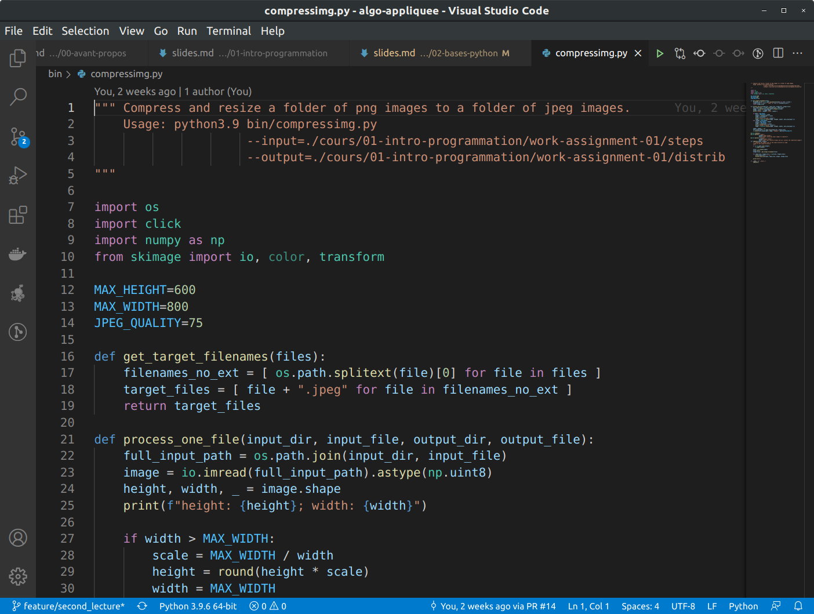

Dans ce TP, vous allez apprendre 2 choses :
* utiliser un environnement de développement intégré.
* la manipulation de chaînes de caractères pour résoudre des problèmes classiques et simples.

## Installer Python sur sa machine

Pour ce cours, il est recommandé d'installer la dernière version disponible de Python. Au moment de l'écriture de ces lignes, il s'agit de la version 3.9, mais n'hésitez pas à prendre une version plus récente (tant que cela reste sur la version majeure 3.x).

### Sur Windows

Python n'est pas installé par défaut sur Windows. Vous trouverez l'installeur sur le [site officiel Python.org](https://www.python.org/downloads/windows/).

A la fin de l'installation, ouvrez PowerShell et tappez :
```powershell
python --version
```

Si vous recevez en retour le numéro de version que vous venez d'installer, vous avez désormais Python sur votre machine.

### Sur macOS

Il y a de bonnes chances que Python soit déjà installé. Ouvrez le `Terminal` et tappez la commande :
```bash
python --version
```

Si la version renvoyée est 2.7, vous pouvez tenter :
```bash
python3 --version
```

Si vous n'avez pas la dernière version de Python, vous devrez la télécharger et l'installer depuis le [site officiel Pyhon.org](https://www.python.org/downloads/mac-osx/).

### Sur GNU/Linux

A moins que votre distribution soit vraiment exotique, vous avez déjà Python sur votre machine.

Ouvrez votre terminal préféré et vérifier les versions déjà installées :
```bash
python --version
python3 --version
```

Si vous n'avez pas la dernière version de Python, il est presque certain que la communauté Open Source fournisse un paquet permettant son installation.

Par exemple, sur Ubuntu 18.04 LTS :
```bash
# Ajout du repo contenant le paquet Python 3.9
sudo add-apt-repository ppa:deadsnakes/ppa

# Mise à jour du gestionnaire de paquets
sudo apt update

# Installation de Python 3.9
sudo apt install python3.9

# Vérification de l'installation
python3.9 --version

# Mise à jour des outils essentiels pour Python
sudo apt install python3.9-distutils
python3.9 -m pip install --upgrade pip
python3.9 -m pip install --upgrade distlib
python3.9 -m pip install --upgrade setuptools
```

### L'alternative Docker

Si vous connaissez et maîtrisez déjà Docker, vous pouvez télécharger l'[image officielle](https://hub.docker.com/_/python/).

```bash
docker pull python
```

## Environnement de Développement Intégré

Dans le 1er TP, vous avez utilisé Scratch, qui s'utilise dans un navigateur web. Scratch est à la fois le langage de programmation et l'environnement de développement. Les 2 sont couplés.

Dans le 2ième TP, vous avez utilisé Python avec Jupyter Notebook depuis un navigateur web grâce à Binder qui fournit un environnement de développement virtualisé.

Dans le monde de l'entreprise, Scratch n'est pas utilisé, et Jupyter Notebook est très rarement utilisé. A la place, on utilise d'autres types d'environnements de développement.

### Les mauvaises solutions

Sur Windows, le logiciel `Bloc Note` (notepad) ne fournit pas de coloration syntaxique, n'indente pas automatiquement le code, n'offre pas d'aide contextuelle, ne souligne pas les erreurs potentielles et ne permet pas d'exécuter son code pas à pas.

Les suites `Microsoft Office` (`Word`), `LibreOffice` (`Writer`), `Google Docs`, `Apple Pages` et autres éditeurs de texte constituent également de mauvaises solutions pour les mêmes raisons. Ce ne sont pas des logiciels adaptés pour l'écriture de logiciels.

Un bon ouvrier sait utiliser le bon outil pour réaliser ses tâches efficacement. Vous serez pénalisés si vous utilisez ces logiciels plutôt que ceux mentionnés ci-après.

### Les solutions intermédiaires

Sur Windows, le logiciel `Notepad++` offre la coloration syntaxique et l'indentation automatique de code. Ce logiciel très léger est un excellent remplaçant du `Bloc Note` mais n'est pas du tout idéal pour l'écriture de code Python.

Sur GNU/Linux, les logiciels `gedit` (Gnome) et `kedit` (KDE) fournissent le même niveau de service que `Notepad++`.

### Les solutions en mode texte

Il est possible d'installer `vim` ou `emacs` sur n'importe quel système d'exploitation. Ces éditeurs en lignes de commandes nécessitent de connaître de nombreux raccourcis clavier pour être efficace.

Ils ont l'avantage de pouvoir être installés partout, et sont très pratiques pour éditer du code sur des machines distantes ou ne possédant pas d'environnement graphique.


L'apprentissage de `vim` ou `emacs`, bien que fortement recommandé pour votre carrière professionnelle, ne fait pas parti du périmètre de ce cours.

### IDLE

Historiquement, Python est fourni avec un environnement de développement nommé `IDLE` en hommage à l'un des comédiens des Monty Python. Par ailleurs, idle veut dire oisif en anglais. De plus, IDE (si on retire le L) signifie Integrated Development Environment.

Sur Windows, cet éditeur est fourni de base avec l'installeur de Python (voir votre). Sur GNU/Linux, cela dépend des distributions, mais il existe toujours un package permettant de l'installer.


IDLE a été développé pour Python, et fournit donc de bons outils. Cependant, il n'est pas l'éditeur le plus intuitif. C'est une bonne solution si vous n'avez pas la possibilité d'installer autre chose.

### Les environnements intégrés

Il existe de nombreux environnements de développement intégrés (EDI) puissants, gratuits, et qui fournissent une excellente expérience utilisateur pour le langage Python.

Tous ces environnements doivent offrir les services suivants :
* **Coloration syntaxique** : les différents éléments du langage sont différenciés par des couleurs différentes.
* **Identation automatique** : l'éditeur indente le code automatiquement en fonction des lignes de code précédentes.
* **Auto-complétion** : l'éditeur propose de compléter automatiquement le code que vous écrivez et propose des suggestions d'amélioration.
* **Exécution pas à pas** : possibilité d'exécuter pas à pas le code.
* **Shell intégré** : possibilité d'exécuter des commandes Python indépendantes.
* **Explorateur de solution** : visualisation de l'arborescence des fichiers du projet.
* **Gestionnaire de contrôle de version** : intégration avec les gestionnaires de contrôle de version populaires comme `Git`.
* **Extensions** : capacités à installer des extensions supplémentaires et de supporter d'autres langages de programmation.

Une liste non-exhaustive de très bons éditeurs inclue :
* [Anaconda](https://www.anaconda.com/products/individual)
* [PyCharm](https://www.jetbrains.com/pycharm/)
* [Sublime](https://www.sublimetext.com/)
* [Visual Studio Code](https://code.visualstudio.com/)

Le choix entre ces différentes solutions est essentiellement une question de goût et d'habitudes.

### Installation de Visual Studio Code (VS Code)

Pour cela, il faut essentiellement [aller sur le site](https://code.visualstudio.com/), et suivre les instructions.

Si nécessaire, demandez de l'aide à votre formateur.



Lancez VS Code à la fin de l'installation.

### Installation des extensions

Installez l'extension `Python` (le nom complet est `ms-python.python`), éditée par Microsoft. Cette extension inclue les extensions `Pylance` et `Jupyter`.

Si vous connaissez déjà `Git`, l'extension `GitLens` est recommandée. Cela dit, elle n'est pas utile pour ce TP (ni les prochains).


## Utilisation de Visual Studio Code pour exécuter du Python

On peut utiliser VS Code de 4 manières pour exécuter du Python :
* En ligne de commande dans le shell intégré.
* En mode interactif
* En créant ou ouvrant un carnet Jupyter.
* En exécutant un script.

### En ligne de commande

Dans le menu, allez dans View > Terminal.

Une fenêtre Terminal apparaît en bas. Lancez Python :

```bash
# Sur Windows :
python

# Sur macOS :
python3

# Sur GNU/Linux :
python3.9
```

Vous pouvez désormais entrer, une à une, des instructions Python :

```py
print("Bonjour Python depuis VS Code !")
en_allemand = "Guten Tag"
print(en_allemand)
```


### En mode interactif

Utilisez le raccourci clavier `Ctrl + N` pour créer un nouveau fichier.

Cliquez sur `Sélectionnez un langage`.


Dans la liste déroulante, choisissez le langage Python.


Rentrez le code suivant puis utilisez le raccourci clavier `Shift + Entrée` :

```py
# %%
print("Bonjour Python depuis VS Code !")
```

Ajoutez le code suivant et cliquez sur `Run Cell` :


```py
# %%
en_allemand = "Guten Tag"
print(en_allemand)
```


### Jupyter Notebook intégré

Utilisez le raccourci clavier `Ctrl + P`.

Dans la zone de texte qui apparaît, tappez :
```
>Jupyter
```

Faites bien attention au `>` initial et à ne pas faire de faute de frappe.

Vous obtenez une liste de commandes en relation avec Jupyter. Dans cette liste déroulante, cliquez sur `>Jupyter: Create New Blank Notebook`.

Dans la zone de texte, entrez le code suivant :
```py
print("Bonjour Python depuis VS Code !")
```

Cliquez ensuite sur l'icône de flèche à gauche de la zone de texte. Le code est exécuté.

En-dessous de la zone de texte, cliquez sur le bouton `+ Code`. Dans la nouvelle zone de texte, entrez le code suivant :
```py
en_allemand = "Guten Tag"
print(en_allemand)
```

Cliquez sur la flèche à gauche de cette nouvelle zone de texte afin de l'exécuter.


### Exécution d'un script

C'est de loin le mode le plus fréquent.

Allez dans le menu Fichier > Nouveau.

Copiez-collez le code suivant dans l'éditeur :
```py
print("Bonjour Python depuis VS Code !")

en_allemand = "Guten Tag"
print(en_allemand)
```

Allez dans le menu Fichier > Sauvegarder puis appelez votre fichier `mon_premier_script.py`.

Cliquez sur la flèche verte en haut à droite pour exécuter le script.


## Manipulation de chaînes de caractères

Pour chaque exercice, vous devez créer un fichier nommé `tp03_exercice_X.py` où X est le numéro de l'exercice.

### Exercice 1 - Nombre de jours vécus

Ecrivez un script qui demande à l'utilisateur d'entrer son âge (un nombre entier).
En considérant qu'une année fait 365 jours, le script doit calculer le nombre de jours vécu par l'utilisateur.
Le script doit afficher : `"Vous avez vécu au moins *X* jours"`, où X est le nombre de jours calculés.

*Astuces* :
* Utilisez `input` pour demander une chaîne et `print` pour afficher le résultat.
* Pensez à faire la conversion de chaîne de caractères vers entier `int`.
* Utilisez une variable nommée `age` et une autre variable nommée `nb_jours`.

### Exercice 2 - Des chiffres et des lettres

Ecrivez un script qui demande à l'utilisateur d'entrer une chaîne de caractères.
Testez le 1er caractère renvoyé par l'utilisateur :
* S'il s'agit d'une voyelle (a e i o u y), affichez `"Voyelle"`.
* S'il s'agit d'un chiffre (0 1 2 3 4 5 6 7 8 9), affichez `"Chiffre"`.
* S'il s'agit d'une consonne, affichez `"Consonne"`.
* S'il s'agit d'un caractère spécial, affichez `"Spécial"`.

*Astuce* : vous pouvez utiliser `upper` ou `lower` pour gérer uniformément les majuscules et minuscules.
```py
chaine = "Nébulaire"
minuscules = chaine.lower() # "nébulaire"
majuscules = chaine.upper() # "NÉBULAIRE"
```

### Exercice 3 - Mimic

Ecrivez un script qui demande à l'utilisateur d'entrer un mot.
Affichez ce mot 3 fois, séparé par des espaces et terminé par un point d'exclamation.

Par exemple, si l'entrée est `"Bonjour"`, la sortie doit être `"Bonjour Bonjour Bonjour !"`.

### Exercice 4 - Trois fois quatre

Ecrivez un mini script dans lequel vous afficherez les valeurs suivantes sur des lignes séparées :
* `3 * 4`
* `3 * str(4)`
* `3 * "4"`
* `3 * int("4")`
* `3 * str(int(str(4)))`

### Exercice 5 - Retourné

Ecrivez un script qui demande à l'utilisateur d'entrer un mot.
Affichez ce mot à l'envers, en utilisant uniquement une instruction de *slicing* (tranche).

Par exemple, si l'entrée est `"Bonjour"`, la sortie doit être `"ruojnoB"`.

*Astuce* : Rappelez-vous que le dernier caractère a pour index -1.

### Exercice 6 - Message codé

Ecrivez un script qui défini la variable suivante :

```py
chaine = ("Allons bon, apprenez, vous y arrivez ! "
          + "A-t-on gagné en habileté et promis déjà, "
          + "à une belle carrière ?")
```

Affichez le message caché qui apparait en prenant du 13e au 90e caractère, tous les 14 caractères.

*Astuce* : Utilisez le *slicing* (tranche).