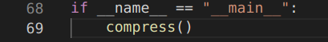

<!-- _class: title-section -->

# <!--fit--> Algorithmique Appliquée

##### BTS SIO SISR

### Programmes numériques simples et techniques de débogage


<!--
On va commencer à réfléchir aux manières d'utiliser les outils vus précédemment pour construire des programmes simples.
On va également voir quelques techniques de programmation et de débogage.
-->

---

# Plan

- Introduction à la technique "devine-et-vérifie"
- Introduction à la dichotomie
- Introduction à l'instrumentation de code
- Introduction à l'algorithme Newton Raphson
- Histoire des bugs et du débogage
- Techniques pour déboguer manuellement
- Utilisation d'un "debugger" avec points d'arrêt

---

<!-- _class: title-section -->

# Correction du travail à la maison

---

### DM : Retours sur Scratch et Python

[**Lien** vers le sujet de DM](../02-bases-python/dm-01.html).

---

<!-- _class: title-section -->

# <!--fit--> Introduction à la technique "devine-et-vérifie"

##### Guess-and-check :uk:

---

# Devine-et-vérifie

Nous souhaitons résoudre les problèmes suivants :
- Retrouver un nombre dans un intervalle,
- Déterminer si un nombre est premier,
- Calculer une racine carrée.

Nous allons aborder différentes techniques. La plus simple est "devine-et-vérifie".

---

<!-- _class: smaller-text -->

# <!--fit--> Retrouver un nombre dans un intervalle

```python
valeur_recherchee = int(input("Entrez un nombre entre 0 et 1 000 000 : "))

if valeur_recherchee < 0 or valeur_recherchee > 1000000:
    print("Erreur")
else:
    devine = 0
    while devine < valeur_recherchee:
        devine += 1
    print(devine)
```

<!--
On cherche simplement à retrouver le nombre rentré par l'utilisateur.
On énumère toutes les possibilité.
A chaque étape, on tente de deviner la valeur et on vérifie si c'est la bonne.
-->

---

<!-- _class: smaller-text -->

# Nombre premier

```python
x = int(input("Entrez un nombre entier positif : "))

if x <= 2:
    print("Les nombres inférieurs ou égaux à 2 ne sont pas premiers")
else:
    diviseur = None
    for devine in range(2, x):
        if x % devine == 0:
            diviseur = devine
            break
    
    if diviseur != None:
        print(f"Le plus petit diviseur de {x} est {diviseur}.")
    else:
        print(f"{x} est un nombre premier")
```

<!--
On énumère à nouveau toutes les possibilités.
A chaque fois, on tente de deviner un diviseur possible et on vérifie le reste de la division.
Au final, si on a trouvé un diviseur, c'est que le nombre n'est pas premier.
-->

---

<!-- _class: smaller-text -->

#  <!--fit--> Nombre premier (plus rapide)

```python
x = int(input("Entrez un nombre entier positif : "))

if x <= 2:
    print("Les nombres inférieurs ou égaux à 2 ne sont pas premiers")
elif x % 2 == 0:
    print(f"Le plus petit diviseur de {x} est 2.")
else:
    diviseur = None
    for devine in range(3, x, 2):
        if x % devine == 0:
            diviseur = devine
            break
    
    if diviseur != None:
        print(f"Le plus petit diviseur de {x} est {diviseur}.")
    else:
        print(f"{x} est un nombre premier")
```

<!--
Ce nouvel algorithme est plus complexe que le précédent pour résoudre le même problème.
Cela étant, cet algorithme est également plus efficace.
En effet, il tire parti du fait qu'un nombre sur 2 est pair, et que les nombres pairs ne sont pas premiers.
Par conséquent, cet algorithme teste 2x moins de nombres que le précédent.
C'est un compromis classique : complexité d'implémentation pour meilleure vitesse d'exécution.
-->

---

## Notion d'heuristique (1/2)

* On pourrait encore accélérer l'algorithme précédent avec des **heuristiques** supplémentaires.
* Une heuristique est une **astuce** permettant de simplifier un problème ou d'accélérer sa résolution.

---

## Notion d'heuristique (2/2)

* Par exemple :
    * on sait qu'un nombre dont le dernier chiffre est 5 est divisible par 5.
    * on sait que si la somme des chiffres d'un nombre est divisible par 3, alors ce nombre est divisible par 3.
    * on sait qu'il n'est pas nécessaire de tester les nombres supérieurs à $\sqrt{x}$.
* Ainsi, on peut éliminer très rapidement les nombres divisibles par 2, 3 ou 5.

---

# Racine carrée

```python
x = int(input("Entrez un nombre entier positif : "))
devine = 0
while devine ** 2 < x:
    devine += 1

if devine ** 2 != x:
    print(f"{x} n'est pas un carré parfait")
else:
    print(f"La racine carrée de {x} est {devine}.")
```

<!--
Cet algorithme, encore du type "devine-et-vérifie" effectue une énumération exhaustive.
Cependant, elle est très limitée : on ne peut trouver que les carrés parfaits.
-->

---

## Racine carrée à petits pas

```python
x = float(input("Entrez un nombre entier positif : "))
devine = 0
pas = 0.0001
while devine ** 2 < x:
    devine += pas

erreur = abs(x - devine ** 2)
print(f"La racine carrée de {x} est {devine} à {erreur} près")
```

<!--
Cet algorithme naïf est inefficace et peu précis.
En effet, il effectue un nombre très important de tests.
Par ailleurs, la précision n'est pas garantie pour les grands nombres.
-->

---

# <!--fit--> Limites de l'approche devine-et-vérifie

* Cette approche est basée sur une **énumération exhaustive**.

* Limites :
    * Effectue un *grand nombre* de tests.
    * Si le nombre recherché n'est pas énuméré, l'erreur n'est pas complètement maîtrisée.

* D'autres approches existent.

---

<!-- _class: title-section -->

# <!--fit--> Introduction à la dichotomie

##### Bisection search :uk:

---

### Le juste prix

* Jeu télévisé des années 1990.
* Le présentateur demandait au joueur de trouver un prix entre **1 et 1000** francs.
* Le joueur propose un prix.
* Le présentateur dit si c'est **supérieur, inférieur ou égal**.
* Le joueur propose un nouveau prix, et le présentateur répond à nouveau.
* Le joueur a **une minute** pour trouver le juste prix.

<!--
Tirer au sort un édudiant et le faire jouer pour voir si elle utilise naturellement une énumération exhaustive ou une dichotomie.
Demandez ensuite aux autres étudiants ce qu'ils en pensent.
Faire éventuellement passer un autre apprenant si la première n'a pas trouvé le juste prix.
-->

---

# La dichotomie

- On utilise le fait que l'espace de travail est **totalement ordonné**.
- A chaque étape, on divise l'espace de travail par 2, jusqu'à converger vers une solution satisfaisante.

--- 

<!-- _class: smaller-text -->

# <!--fit--> Retrouver un nombre dans un intervalle

```python
valeur_recherchee = int(input("Entrez un nombre entre 0 et 1 000 000 : "))

if valeur_recherchee < 0 or valeur_recherchee > 1000000:
    print("Erreur")
else:
    debut = 0
    fin = 1000000
    milieu = round((fin + debut) / 2)
    while milieu != valeur_recherchee:
        if milieu > valeur_recherchee:
            fin = milieu
        else:
            debut = milieu
        milieu = round((fin + debut) / 2)
    print(milieu)
```

<!--
L'intervalle est représenté par [début ; fin].
A chaque itération, on regarde si la valeur au milieu de l'intervalle est la bonne.
Si la valeur recherchée est plus petite que le milieu, l'intervalle devient [début ; milieu].
Sinon, l'intervalle devient [milieu ; fin].
Par conséquent, début et fin convergent rapidement vers la valeur recherchée.
-->

---

<!-- _class: smaller-text -->

# Racine carrée

```python
x = float(input("Entrez un nombre positif : "))

debut = 0
fin = max(1, x)
milieu = (fin + debut) / 2
epsilon = 0.0001

while abs(milieu ** 2 - x) >= epsilon:
    if milieu ** 2 > x:
        fin = milieu
    else:
        debut = milieu
    milieu = (fin + debut) / 2

erreur = abs(milieu ** 2 - x)
print(f"La racine carrée de {x} est {milieu} à {erreur} près")
```

<!--
On travaille dans l'intervalle [0 ; x] si x > 1 ou dans [0 ; 1] si 0 < x < 1.
A chaque itération, on regarde si la valeur au milieu de l'intervalle est proche de la valeur souhaitée, à un epsilon près.
Si la valeur recherchée est plus petite que le milieu, l'intervalle devient [début ; milieu].
Sinon, l'intervalle devient [milieu ; fin].
Par conséquent, début et fin convergent rapidement vers la valeur recherchée.
Cet algorithme basé sur la dichotomie converge beaucoup plus rapidement que la version avec énumération exhaustive.
De plus, on contrôle mieux l'erreur grâce à un epsilon indépendant du pas d'itération.
-->

---

### Comparaison entre dichotomie et énumération exhaustive

* Intuitivement, pour les 3 problèmes qui nous préoccupent :
    * Retrouver un nombre dans un intervalle : la **dichotomie** gagne.
    * Déterminer si un nombre est premier : l'**énumération exhaustive** gagne.
    * Calculer une racine carrée : la **dichotomie** gagne.

* S'il est nécessaire de tester toutes les valeurs, la dichotomie n'apporte rien.

<!--
Dans le cas des nombres premiers, il est de toutes façons nécessaires de tester toutes les valeurs.
-->

---

<!-- _class: title-section -->

## TD : Utilisation de la dichotomie pour calculer des racines et des logarithmes

---

### TD : Dichotomie pour Racines et Logarithmes

[**Lien** vers le sujet de TD](./td-01-dichotomie.html).

---

<!-- _class: title-section -->

# <!--fit--> Introduction à l'instrumentation de code

---

# <!--fit--> Pourquoi instrumenter le code

* Nous avons vu que différents algorithmes permettent de résoudre un même problème.
* Nous avons tenté de comparer ces algorithmes en utilisant notre intuition.
* L'intuition est utile mais pas très *mathématique*.
* On souhaite effectuer des **mesures** et **obserser l'exécution**.

---

# Instrumentation

- L'instrumentation consiste à rajouter du code :
    * pour **observer** l'exécution avec des `print`.
    * pour **mesurer** des indicateurs comme le nombre d'itérations effectuées.
    * pour **comprendre** les problèmes, lorsqu'il y en a.
    
- Ces ajouts **ne modifient pas** l'algorithme instrumenté. Il s'agit **d'instruments de mesure**.

---

<!-- _class: smaller-text -->

# <!--fit--> Observation de valeurs en cours d'exécution

```python
x = float(input("Entrez un nombre positif : "))

debut = 0
fin = max(1, x)
milieu = (fin + debut) / 2
epsilon = 0.0001

while abs(milieu ** 2 - x) >= epsilon:
    print(milieu) # On affiche ici la valeur
    if milieu ** 2 > x:
        fin = milieu
    else:
        debut = milieu
    milieu = (fin + debut) / 2

erreur = abs(milieu ** 2 - x)
print(f"La racine carrée de {x} est {milieu} à {erreur} près")
```
<!--
Dans la version finale de l'algorithme, on souhaitera retirer cette instrumentation.
En effet, l'utilisateur final de l'algorightme ne souhaite pas voir les étapes intermédiaires.
En revanche, pour comprendre un algorithme, il est utile de l'instrumenter de cette manière.
-->

---

<!-- _class: smaller-text -->

### Compte du nombre d'itérations

```python
x = float(input("Entrez un nombre positif : "))

debut = 0
fin = max(1, x)
milieu = (fin + debut) / 2
epsilon = 0.0001

compteur = 0

while abs(milieu ** 2 - x) >= epsilon:
    compteur += 1 # On incrémente le compteur d'itérations
    if milieu ** 2 > x:
        fin = milieu
    else:
        debut = milieu
    milieu = (fin + debut) / 2

erreur = abs(milieu ** 2 - x)
print(f"La racine carrée de {x} est {milieu} à {erreur} près")
print(f"Nombre d'itérations : {compteur}") # on l'affiche
```

<!--
Compter le nombre d'itérations permet de comparer 2 algorithmes ayant le même objectif.
L'algorithme qui parvient au résultat en un nombre d'itérations minimum est meilleur.
-->

---

<!-- _class: smaller-text -->

### Chronométrage de l'exécution

```python
import time

x = float(input("Entrez un nombre positif : "))

chrono_debut = time.process_time() # démarrage du chronomètre

#
# Corps du code à chronométrer
# (voir diapositives précédentes pour les détails)
#

chrono_fin = time.process_time()         # arrêt du chronomètre
temps_ecoule = chrono_fin - chrono_debut # calcul du temps écoulé

erreur = abs(milieu ** 2 - x)
print(f"La racine carrée de {x} est {milieu} à {erreur} près")
print(f"Temps d'exécution : {temps_ecoule}s") # on l'affiche
```

<!--
En plus du nombre d'itérations, avoir le temps d'exécution permet également de comparer des algorithmes.
Il est à noter que cette manière de mesurer est naïve.
Il existe des approches plus robustes pour mesurer un temps d'exécution.
Néanmoins, cette technique offre un moyen rapide de se faire une idée.
-->

---

# Benchmark (1/2)

* La comparaison du temps d'exécution de 2 algorithmes (ou plus) s'appelle un **benchmark**.
* Les processus s'exécutant sur un système d'exploitation sont en compétition pour les ressources de la machine.
* Les mesures effectuées avec `time.process_time` ne sont **pas précises** car elles sont impactées par les autres processus s'exécutant sur la machine.

---

# Benchmark (2/2)

* Si un processus gourmand en ressources (tel qu'un jeu vidéo) est exécuté en même temps, la mesure peut être fortement **impactée**.
* Lorsque l'on souhaite être précis, il faut que les mesures soient **indépendantes** des autres processus.
* Dans les prochains cours et TPs, nous verrons des méthodes plus précises.


---

<!-- _class: title-section -->

# <!--fit--> Introduction à l'algorithme Newton Raphson

---

# <!--fit--> Algorithme d'approximation numérique

* On a utilisé une méthode d'**approximations successives** avec la dichotomie pour résoudre $\sqrt{x}$.
* A chaque itération :
    * on fait une **supposition** ;
    * on calcul l'**erreur** par rapport au résultat théorique ;
    * si l'erreur est inférieure à un $\delta$ suffisamment petit, on s'arrête ;
    * sinon, on fait une nouvelle supposition plus proche que la supposition précédente.

---

# Newtown Raphson (1/4)

- Un autre algorithme d'approximation est également célèbre : **Newton-Raphson**.
- L'algorithme de Newton-Raphson peut être utilisé pour trouver les **racines** de nombreuses fonctions.
- La racine $r$ d'une fonction $f$ est telle que :

$$
f(r) = 0
$$

- On s'intéresse au cas des fonctions polynomiales à une variable.

---

## Newtown Raphson (2/4)

- On note notre fonction polynomiale $P(x)$ :

$$
P(x) = a_n x^n + a_{n-1}x^{n-1} + \dotsb + a_2 x^2 + a_1 x + a_0 \\
P(x) = \sum_{k=0}^n a_k x^k
$$

- Pour rappel, la dérivée de $P(x)$ se note $P'(x)$ et est égale à :

$$
P'(x) = \sum_{k=0}^n a_k kx^{k-1}
$$

---

# Newtown Raphson (3/4)

- On cherche à trouver la racine $r$ telle que $P(r) = 0$.
- On note $s_1$ et $s_2$ des approximations de $r$ pour $P(r) = 0$.
- On souhaite que $s_2$ soit une meilleure approximation de $r$ que $s_1$, soit :

$$
P(r) \le P(s_2) \lt P(s_1)
$$


---

# Newtown Raphson (4/4)

- Un **théorème** prouvé par Newtown montre que $s_2$ peut être calculé de la manière suivante :

$$
s_2 = s_1 - \frac{P(s_1)}{P'(s_1)}
$$

<!--
La démonstration de ce théorème est en-dehors de la portée de ce cours.
-->

---

# <!--fit--> Newtown-Raphson pour le calcul de racine carrée

- Trouver la racine carrée de $a_0$ revient à résoudre $x^2 - a_0 = 0$.
- Notre polynôme s'écrit donc $P(x) = x^2 - a_0$.
- Trivialement, on a $P'(x) = 2x$.
- Si on a une approximation $s_1$ de $P(r) = 0$, alors on calcule une meilleure approximation $s_2$ :

$$
s_2 = s_1 - \frac{P(s_1)}{P'(s_1)} = s_1 - \frac{s_1^2 - a_0}{2s_1}
$$

---

# Application en Python

```python
a0 = float(input("Entrez un nombre positif : "))

s = a0 / 2
epsilon = 0.0001

while abs(s ** 2 - a0) >= epsilon:
    P = s ** 2 - a0
    P_prime = 2 * s
    s = s - P / P_prime

erreur = abs(s ** 2 - a0)
print(f"La racine carrée de {a0} est {s} à {erreur} près")
```

<!--
Il s'agit simplement de l'application directe de la formule énoncée dans les diapositives précédentes.
On démarre avec s = a0 / 2.
Au lieu d'utiliser s1 et s2, on réassigne s à chaque itération.
C'est un algorithme simple, élégant et performant.
-->

---

# Problèmes et algorithmes

- En résumé :
    - Retrouver un nombre dans un intervalle : la **dichotomie** gagne,
    - Déterminer si un nombre est premier : l'**énumération exhaustive** gagne,
    - Calculer une racine carrée : **Newton-Raphson** gagne.
    
- Vous allez voir cela en pratique dans le prochain TP.

---

<!-- _class: title-section -->

## TP : Comparaison d'algorithmes ayant le même objectif

---

### TP : Comparaison d'Algorithmes

[**Lien** vers le sujet de TP](./tp-05-comparaison-algo.html).

---

<!-- _class: title-section -->

### Histoire des bugs et du débogage dans la culture anglo-saxonne

---

# <!--fit--> Le mythe de l'insecte dans la machine

- 1947 : un insecte empêchant le fonctionnement du calculateur de l'université de Harvard est découvert.
- Depuis, une légende urbaine affirme qu'il s'agit du premier "bug" (insecte en anglais).
- L'emploi du terme "bug" pour désigner un problème viendrait de là.

---

# Les vraies origines

- Le terme "bug" était déjà utilisé dans la langue anglaise pour désigner un problème.
- 1896 : Le livre *Nouveau Catéchisme de l'Electricité* de *Hawkins* emploie cette terminologie.
- En ancien anglais, le terme "*bugbear*" signifie "*tout ce qui peut causer une peur ou une anxiété excessive sans que cela soit nécessaire*".

---

# Eviter les bugs (1/2)

- **Problème d'arrêt** (Halting Problem) : il n'est pas possible de prouver la validité d'un programme de manière générique.
- **Preuve de programme** : 
    - Prouver le bon fonctionnement d'un algorithme est ardu.
    - Prouver le fonctionnement d'un programme complexe est presque toujours trop coûteux.

---

# Eviter les bugs (2/2)

- **Solution** : mettre en place de **bonnes pratiques** de développement logiciel.

- Nous aborderons quelques unes de ces bonnes pratiques dans les prochains cours.

---

# Bugs manifestes et cachés

- **Bug manifeste** : le problème est visible facilement. Par exemple, un crash.
- **Bug caché** : le problème est quasiment invisible dans la plupart des cas. Par exemple, une fuite mémoire.

<!--
Une fuite mémoire survient lorsqu'un programme alloue toujours plus de mémoire, sans jamais la libérer.
Le programme peut fonctionner correctement pendant plusieurs jours sans problème.
-->

---

# <!--fit--> Bugs persistants et intermittents

- **Bug persistant** : il survient de manière systématique et il est facile à reproduire.
- **Bug intermittent** : il semble survenir de manière aléatoire et il est difficile à reproduire.

<!--
Les bugs manifestes et persistants sont les plus simples à analyser et à corriger.
Les bugs cachés et intermittents peuvent se révéler très complexes à déboguer.
Si ces problèmes surviennent rarement, il arrive que certaines entreprises décident malheureusement de ne pas les traiter.
-->

---

<!-- _class: title-section -->

# Techniques pour déboguer manuellement un programme sur papier

---

# <!--fit--> Plus capables et moins rapides

* Une **machine** n'est pas nécessaire pour exécuter un algorithme.
* Les 1ers algorithmes ont été inventés bien avant la création des 1ers calculateurs.
* Un **humain** peut tout à fait exécuter manuellement un algorithme.
* Un humain sera simplement moins rapide qu'une machine.
* Un humain peut également faire des erreurs de calcul qu'une machine éviterait.

---

# <!--fit--> Pourquoi le faire manuellement ?

* Vous devez donc vous préparer pour l'**examen**.
* Les entreprises les plus prestigieuses demandent aux candidats de **développer sur un tableau blanc**.
* En pratique, même en entreprise, on continue à **résoudre les problèmes les plus complexes** par des brouillons sur papier ou sur tableau blanc avant de passer sur machine.

---

# Procédure

* Prendre un papier :scroll:
* Prendre un crayon :pencil2:
* Dessiner un tableau dont le nombre de colonnes est égal au nombre de variables à suivre :bar_chart:
* A chaque itération, remplir une ligne avec les valeurs actuelles des variables :1234:

---

# Exemple


```python
a0 = 16

s = a0 / 2
epsilon = 0.1

while abs(s ** 2 - a0) >= epsilon:
    P = s ** 2 - a0
    P_prime = 2 * s
    s = s - P / P_prime

print(f"sqrt({a0}) == {s}")
```

<!--
La difficulté dans cet exemple est que lors d'une itération, P et P_prime dépendent de la valeur précédente de s.
Nous avons choisi, sur une ligne, de donner la valeur de s ayant servi au calcul de P et P_prime lors de l'itération courante.
La nouvelle valeur de s apparaît sur la ligne suivante.
-->

---

<!-- _class: title-section -->

# <!--fit--> Utilisation d'un debugger avec points d'arrêt

---

# La puissance d'un EDI

* Tout bon **E**nvironnement de **D**éveloppement **I**ntégré (EDI) propose un **debugger**.
* Visual Studio Code, avec l'extension Python, propose un bon debugger.
* L'objectif d'un debugger est d'arrêter l'exécution d'un processus pour regarder son état.
* On doit lancer le processus depuis l'EDI en **mode débogage**, et utiliser des **points d'arrêt**.
* Un point d'arrêt se nomme *breakpoint* en anglais.

---

### Lancer en mode débogage


A gauche de l'interface se trouve le menu *Run and Debug*.

---

### Choisir le mode de débogage


Dans le cadre de ce cours, vous choisirez toujours de déboguer le fichier courant.

---

### La barre d'outils de débogage


Lorsque le programme s'exécute (non arrêté sur un point d'arrêt), la barre d'outils de débogage, qui se trouve en haut de l'éditeur, a cet aspect.

---

#### Barre d'outils de débogage sur un point d'arrêt


- L'aspect change lorsque l'exécution arrive sur un point d'arrêt.
- Il devient alors possible d'exécuter pas à pas les instructions.

---

### Options de la barre d'outils


- Les icônes permettent respectivement :
    - Continuer l'exécution (**F5**),
    - Exécuter l'instruction courante (**F10**),
    - Rentrer dans la fonction (**F11**),
    - Exécuter toutes les instructions jusqu'à la fin de la fonction,
    - Recommencer l'exécution depuis le début,
    - Stopper l'exécution;

---

### Comment poser un point d'arrêt ?



Aspect d'une ligne avant de poser un point d'arrêt.

---

### Point d'arrêt classique


- Il suffit de **cliquer à gauche de la ligne** pour poser un point d'arrêt.
- Un **rond rouge** apparaît.
- Il est également possible d'utiliser le raccourci **F9**.
- Pour supprimer un point d'arrêt, il suffit de cliquer dessus à nouveau (ou d'utiliser F9 une seconde fois).

---

#### Arrêt sur point d'arrêt


- La ligne est mise **en surbrillance** lorsqu'un point d'arrêt est atteint.
- Il devient alors possible d'**examiner toutes les variables** locales et globales.
- Pour cela, positionnez le curseur de la souris au-dessus d'une variable.

---

### Autre méthode pour lancer en mode débogage


En haut à droite de l'éditeur se trouve un bouton avec une flêche. Si on sélectionne la flêche avec un insecte, on lance l'exécution en mode débogage.

---

#### Point d'arrêt conditionnel


Parfois, on souhaite arrêter l'exécution **uniquement lorsqu'une condition bien particulière est remplie**.

Pour cela, on commence par créer un point d'arrêt classique. Ensuite, on fait un clic droit sur ce point d'arrêt pour l'éditer.

---

#### Expression Booléenne sur un point d'arrêt


Si on souhaite arrêter l'exécution uniquement si la valeur de la variable P est inférieure à 20, il suffit de rentrer l'expression `P < 20`.

Il est possible de rentrer **n'importe quelle expression Booléenne valide** en Python.

---

## Aspect d'un point d'arrêt conditionnel


L'aspect d'un point d'arrêt conditionnel permet d'alerter sur la nature particulière de ce point d'arrêt.

---

# <!--fit--> Tableau de valeurs


On peut obtenir l'arborescence de toutes les valeurs de toutes les variables dans l'encadré à gauche de l'éditeur.

---

### Avec un compteur


- Parfois, on souhaite arrêter l'exécution à une **itération particulière**.
- On créé un point d'**arrêt conditionnel** en spécifiant "Hit" puis le numéro d'itération souhaité.
- L'arrêt s'effectuera lorsque le pointeur de stack sera passé le nombre de fois spécifié sur la ligne de code spécifiée.

---

## Logs supplémentaires


- Parfois, on souhaite rajouter des **logs supplémentaires** sans pour autant changer le programme.
- Le point d'arrêt Log **n'arrête pas** l'exécution du programme.
- Il affiche le contenu de la f-string spécifiée à chaque fois que la ligne est atteinte.

---

### Aspect d'un point d'arrêt Log


Un point d'arrêt Log est un losange à la place d'un cercle.

---

### Autres options de débogage (1/2)

* Il existe de nombreuses autres options de débogage.
* Par exemple :
    * Voir la pile d'appels de fonctions et changer de contexte ;
    * Créer un point d'arrêt lors de l'entrée dans une fonction ;


---

### Autres options de débogage (2/2)

#### Autres exemples

- Activation et désactivation de tous les points d'arrêt,
- Suivre la valeur d'expressions particulières,
- Afficher différents threads d'exécution,
- etc.

<!--
Nous ne rentrerons pas dans ces détails dans le cadre de ce cours.
Le cours de méthodologie et les prochains cours de programmation en JavaScript, PHP, etc. vous apporteront des outils supplémentaires.
-->

---

<!-- _class: title-section -->

# TP : Déboguer un programme mal écrit et comportant des bugs

---

### TP : Débogage d'un programme mal écrit

[**Lien** vers le sujet de TP](./tp-06-debogage.html).
