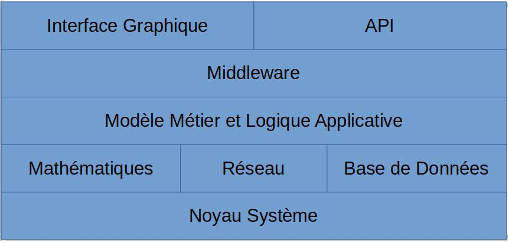

<!-- _class: title-section -->

# <!--fit--> Algorithmique Appliquée

##### BTS SIO SISR

## Procédures et fonctions

<!--
Les fonctions sont fondamentales en programmation.
Il s'agit de l'unité de travail permettant la réutilisation et la programmation modulaire.
Nous allons voir dans ce cours en quoi les fonctions sont importantes et comment les définir et les appeler.
-->

---

<!-- _class: smaller-text -->

# Plan

- Procédures : définition et appel
- Arguments
- Valeurs par défaut
- Variables locales et globales
- Fonctions
- Spécifications et contrat
- Nombre variable d'arguments
- Retour de plusieurs résultats
- Un mot sur la récursivité
- Fonctions d'ordre supérieur
- Fonctions lambda
- Programmation impérative et fonctionnelle
- Un mot sur les méthodes
 
---

<!-- _class: title-section -->

# <!--fit--> Procédures : définition et appel

---

## Comment réutiliser ce code ?

```python
a0 = 16

s = a0 / 2
epsilon = 0.001

while abs(s ** 2 - a0) >= epsilon:
    P = s ** 2 - a0
    P_prime = 2 * s
    s = s - P / P_prime
```

:arrow_right: On souhaite pouvoir appeler ce code pour n'importe quelle valeur de $a_0$.

<!--
La solution naïve consiste à dire qu'il suffit de changer la valeur de a0 puis de relancer le script.
Ce n'est pas vraiment réutilisable : il faut modifier le code source à chaque fois que l'on souhaite tester une nouvelle valeur.
Vous n'avez pas besoin de changer le code source de votre calculatrice pour faire un nouveau calcul.
-->

---

<!-- _class: smaller-text -->

##### Comment combiner des algorithmes ?

```python
a0, b0, epsilon = 16, -27, 0.001

# Racine carrée
sa = a0 / 2
while abs(sa ** 2 - a0) >= epsilon:
    P = sa ** 2 - a0
    P_prime = 2 * sa
    sa = sa - P / P_prime

# Racine cubique
positif = True
if b0 < 0:
    positif, b0 = False, -b0
sb = b0 / 2
while abs(sb ** 3 - b0) >= epsilon:
    P = sb ** 3 - b0
    P_prime = 3 * sb ** 2
    sb = sb - P / P_prime
if not positif:
    sb = -sb

s = sa + sb
```

<!--
Il s'agit d'une manière un peu complexe d'afficher 1.
Pour afficher la somme d'une racine carrée et d'une racine cubique, on est obligé d'implémenter 2 fois Newtown-Raphson et de copier-coller nos algorithmes.
On souhaite réutiliser nos algorithmes.
-->

---

# Réutilisabilité

- On souhaite pouvoir **réutiliser** des algorithmes.
- On souhaite pouvoir **appeler** et **paramétrer** les appels à nos algorithmes.
- On souhaite pouvoir **combiner** facilement nos algorithmes.

---

# Couches d'abstraction



<!--
Si on devait recopier chaque algorithme à chaque fois qu'on doit l'appeler avec une valeur particulière, ce sera ingérable.
Pour gérer des projets complexes, on est obligé de construire des couches d'abstraction.
Chaque couche d'abstraction s'appuie sur les couches inférieures pour fournir des services de plus haut niveau.
Une couche d'abstraction abstraie une partie de la complexité.
Cela permet au final de manipuler facilement des composants qui eux-mêmes sont complexes.
Dans ce diagramme, on a une application avec une interface graphique et des APIs qui permettent de manipuler un modèle de données qui s'appuie lui-même sur une base de données, sur des fonctions mathématiques, etc.
Si les couches d'abstraction n'existaient pas, l'utilisateur final devrait lui-même manipuler les fonctions mathématiques.
Les jeux vidéos seraient potentiellement moins funs et plus éducatifs !
-->

---

# Procédure

- Une **procédure** est une suite d'instructions.
- Il est possible d'appeler plusieurs fois une procédure.

---

# Syntaxe d'une procédure

```python
def procedure():
    print("Première procédure")
```

<!--
Ici, rien n'est affiché.
On ne fait que définir une procédure.
-->

---

### Appel d'une procédure (invocation)

```python
def procedure():
    print("Première procédure")

procedure()
procedure()
procedure()
```

:arrow_down:

```
Première procédure
Première procédure
Première procédure
```

<!--
Ici, on défini une procédure, puis on l'appelle 3 fois.
Par conséquent, le message est affiché 3 fois dans la sortie standard.
-->

---

<!-- _class: smaller-text -->

**Exemple avec racine cubique**

```python
def racine_cubique_27():
    """Affiche la racine cubique de 27."""
    b0 = 27
    epsilon = 0.001
    positif = True
    if b0 < 0:
        positif = False
        b0 = -b0
    sb = b0 / 2
    while abs(sb ** 3 - b0) >= epsilon:
        P = sb ** 3 - b0
        P_prime = 3 * sb ** 2
        sb = sb - P / P_prime
    if not positif:
        sb = -sb
    print(sb)

racine_cubique_27()
```

:arrow_down:

```
3.000000081210202
```

<!--
Evidemment, il peut y avoir plusieurs instructions dans une procédure.
Une procédure peut contenir ses propres variables locales.
Une procédure possède son propre contexte d'exécution.
-->    

---

<!-- _class: title-section -->

# Arguments

---

# Passage d'un argument

```python
def carre(x):
    print(f"{x ** 2}")

carre(2)
carre(3)
```

:arrow_down:

```
4
9
```

<!--
La valeur de la variable x passée en argument de la fonction carre est remplacée par le nombre au niveau de l'appel de procédure.
Ainsi, pour carre(2), on a x == 2.
De même, pour carre(3), on a x == 3.
-->

---

<!-- _class: smaller-text -->

**Argument pour le calcul de la racine cubique**

```python
def racine_cubique(x):
    epsilon = 0.001
    positif = True
    if x < 0:
        positif = False
        x = -x
    s = x / 2
    while abs(s ** 3 - x) >= epsilon:
        P = s ** 3 - x
        P_prime = 3 * s ** 2
        s = s - P / P_prime
    if not positif:
        s = -s
    print(s)

racine_cubique(27)
racine_cubique(-27)
```

:arrow_down:

```
3.000000081210202
-3.000000081210202
```

<!--
On a désormais des procédures réutilisables et utiles.
-->

---

# Plusieurs arguments

```python
def somme(a, b)
    resultat = a + b
    print(resultat)

somme(2, 3)
somme(3, 4)
```

:arrow_down:

```
5
7
```

<!--
On peut évidemment passer autant d'arguments que nécessaire.
-->

---

### Passage par valeur et passage par référence (1/2)

- Certains langages (comme C++ ou C#) font la distinction entre le passage d'arguments **par valeur** et le passage **par référence**.
- **En Python, seul le passage par valeur existe**.
- En C#, par défaut, les arguments sont également passés par valeur, comme en Python.
- Le passage par référence permet de modifier le paramètre d'entrée.

---

<!-- _class: smaller-text -->

##### Passage par valeur et passage par référence en C# (2/2)

```csharp
static void passage_par_valeur(int a)
{
    a = a + 1;
    Console.WriteLine(a); // affiche 1
}

static void passage_par_reference(ref int a)
{
    a = a + 1;
    Console.WriteLine(a); // affiche 1
}

static void Main()
{
    x = 0;

    passage_par_valeur(x); // passe une copie de x
    Console.WriteLine(x);  // affiche 0

    passage_par_reference(ref x); // passe une référence vers x
    Console.WriteLine(x);         // affiche 1
}
```

<!--
Cet exemple est en C#.
On doit utiliser un autre langage de programmation car le Python ne supporte pas le passage par référence.
-->

---

<!-- _class: title-section -->

# Valeurs par défaut

---

# Intérêt

- Une valeur par défaut pour un argument permet de **simplifier l'appel** dans les cas classiques.
- Cela donne à l'appelant **plus de possibilités** de paramétrage dans les cas particuliers.

---

# Puissance

```python
def puissance(x, exposant=2):
    print(f"{x ** exposant}")

puissance(2)
puissance(2, 3)
```

:arrow_down:

```
4
8
```

---

<!-- _class: smaller-text -->

**Racine cubique avec $\varepsilon$**

```python
def racine_cubique(x, epsilon=0.0000001):
    positif = True
    if x < 0:
        positif = False
        x = -x
    s = x / 2
    while abs(s ** 3 - x) >= epsilon:
        P = s ** 3 - x
        P_prime = 3 * s ** 2
        s = s - P / P_prime
    if not positif:
        s = -s

    print(s)

racine_cubique(27)
racine_cubique(27, 1)
```

:arrow_down:

```
3.000000000000002
3.0004936436555805
```

---

## Tous les arguments sont éligibles

```python
def bonjour(prenom="Amélie", nom="Poulain"):
    print(f"Bonjour {prenom} {nom}")

bonjour()
bonjour(nom="Teng")
```

:arrow_down:

```
Bonjour Amélie Poulain
Bonjour Amélie Teng
```

---

# Attention

```python
def bonjour(prenom="Amélie", nom):
    print(f"Bonjour {prenom} {nom}")
```

:arrow_down:

```
    def bonjour(prenom="Amélie", nom):
                                     ^
SyntaxError: non-default argument follows default argument
```

<!--
Un argument sans valeur par défaut ne peut pas succéder à un argument avec une valeur par défaut.
-->

---

<!-- _class: title-section -->

# <!--fit--> Variables locales et globales

##### Scope

---

<!-- _class: smaller-text -->

### Portée des variables

```python
def f(a):
    print(a)

def g(a, b):
    f(a)
    f(b)

def h():
    a = 3
    b = a + 2
    g(b, a)

h()
```

:arrow_down:

```
5
3
```

<!--
La portée d'une variable est limitée a la procédure dans laquelle elle est définie.
Les arguments d'une procédure sont des variables de cette procédure.
Ainsi, dans le contexte de h, on appelle g(b, a), avec b == 5 et a == 3.
Dans le contexte de g, le premier argument a == 5, et le second argument b == 3.
La première fois que l'on appelle f, on affiche donc 5.
La deuxièmre fois que l'on appelle f, la variable a dans le contexte de f est a == 3.
Donc on affiche 3 la deuxième fois.
-->

---

# Variable globale

```python
a = 5

def f(a=10):
    print(a)

f()
f(a)
```

:arrow_down:

```
10
5
```

<!--
Même principe que précédemment.
La différence ici est que la variable globale a n'affecte pas le contexte de f.
-->

---

### Accès en lecture à une variable globale

```python
a = 3

def f():
    for _ in range(a):
        print(a * "*")

f()
```

:arrow_down:

```
***
***
***
```

<!--
On peut accéder en lecture seule à une variable globale dans le contexte d'une fonction.
On dit que la variable est globale car elle n'est locale à aucune procédure.
-->

---

### Accès en écriture à une variable globale

```python
a = 3

def f():
    a -= 1
    for _ in range(a):
        print(a * "*")

f()
```

:arrow_down:

```
    a -= 1
UnboundLocalError: local variable 'a' referenced before assignment
```

<!--
On ne peut pas accéder en écriture à une variable globale par défaut.
-->

---

# Mot clé `global`

```python
a = 3

def f():
    global a
    a -= 1
    for _ in range(a):
        print(a * "*")

f()
```

:arrow_down:

```
**
**
```

<!--
On doit informer explicitement que l'on souhaite réutiliser la variable a du contexte global.
-->


---

<!-- _class: title-section -->

# Fonctions

---

# Généralisation

- Une procédure est une **fonction** qui ne retourne pas de résultat.
- Une procédure est donc une fonction.
- De manière générale, on parle toujours de fonctions.

---

# Retourner un résultat

```python
def somme(a, b):
    """Renvoie la somme de a + b."""
    return a + b

resultat = somme(1, 2)
```

:arrow_down:

```
3
```

<!--
Le mot clé return permet de retourner un résultat.
On peut affecter ce résultat à une autre variable.
En pratique, vous avez déjà utilisé de nombreuses fonctions : range, int, float, input, print, etc.
-->

---

# Définition formelle (1/3)

```python
def nom_de_la_fonction(liste_de_parametres):
    corps_de_la_fonction
```

---

# Définition formelle (2/3)

- Lorsque l'on appelle (ou *invoque*) une fonction :
    - les expressions qui forment les paramètres sont évaluées.
    - les paramètres formels de la fonction sont liés aux valeurs de ces expressions (passage par valeur).
    - le point d'exécution est déplacé depuis le point d'invocation à la première instruction du corps de la fonction.
    - *cf. diapositive suivante...*
    


---

# Définition formelle (3/3)

- Lorsque l'on appelle (ou *invoque*) une fonction :
    - *cf. diapositive précédente...*
    - le corps de la fonction est exécuté :
        - jusqu'à une instruction `return`, auquel cas la valeur de la fonction devient la valeur de cette expression `return`,
        - ou alors jusqu'à ce qu'il n'y ait plus d'instruction à exécuter, auquel cas `None` est retourné.
---

# Fonction racine carrée

```python
def racine_carree(x, epsilon=0.000001):
    """Renvoie la racine carrée de x à epsilon près."""
    s = x / 2
    while abs(s ** 2 - x) >= epsilon:
        P = s ** 2 - x
        P_prime = 2 * s
        s = s - P / P_prime

    return s

resultat = racine_carree(16)
```

:arrow_down:

```
4.000000000000004
```

<!--
Plutôt que d'afficher le résultat dans la sortie standard, on préfère le renvoyer.
Cela offre plus de flexibilité et est plus évolutif.
-->

---

<!-- _class: smaller-text -->

### Fonction racine cubique

```python
def racine_cubique(x, epsilon=0.000001):
    """Renvoie la racine cubique de x à epsilon près."""
    positif = True
    if x < 0:
        positif = False
        x = -x
    s = x / 2
    while abs(s ** 3 - x) >= epsilon:
        P = s ** 3 - x
        P_prime = 3 * s ** 2
        s = s - P / P_prime
    if not positif:
        s = -s
    return s

resultat = racine_cubique(-27)
```

:arrow_down:

```
-3.000000000000002
```

<!--
On vient de se faire une petite bibliothèque composée des fonctions somme, racine_carre, et racine_cubique.
On va donc pouvoir répondre à notre problématique initiale de simplification de notre code.
-->

---

# Retour au problème initial

```python
r2 = racine_carree(16)
r3 = racine_cubique(-27)
resultat = somme(r2, r3)
```

:arrow_down:

```
1.0000000000000022
```

<!--
Le code initial pour résoudre ce problème était beaucoup plus conséquent, comme vous pourriez le voir en revenant sur les premières diapositives.
-->

---

<!-- _class: smaller-text -->

# Plusieurs retours

```python
def converti_nombre(x):
    """Converti le nombre x textuel sous un format entier."""
    if x == "zéro":
        return 0
    elif x == "un":
        return 1
    elif x == "deux":
        return 2
    else:
        return "non défini"

resultat = converti_nombre("un")
```

:arrow_down:

```
1
```

<!--
L'emploi, ou non, de plusieurs returns n'affecte pas les performances d'exécution.
Il existe des débats concernant l'élégance de l'emploi de plusieurs returns.
Il s'agit essentiellement d'une histoire de préférence personnelle.
Souvent, une fonction écrit avec plusieurs returns comporte moins de variables et est plus simple à comprendre et à maintenir.
En effet, une fonction équivalente avec un unique return devrait employer au moins une variable supplémentaire pour sauvegarder le résultat à renvoyer.
-->

---

### Retour de plusieurs résultats

```python
def ajoute_soustrait_et_multiplie(a, b):
    """Renvoie a + b, a - b et a * b."""
    somme = a + b
    difference = a - b
    produit = a * b
    
    return somme, difference, produit

ajout, diff, prod = ajoute_soustrait_et_multiplie(3, 2)
print(f"somme : {ajout}; différence : {diff} ; produit : {prod}")
```

:arrow_down:

```
somme : 5; différence : 1 ; produit : 6
```

<!--
Il est possible de retourner plusieurs résultats en les séparant par des virgules.
On les récupère de la même manière au niveau de l'appel de fonction.
Nous verrons d'autres exemples plus loin dans ce cours.
-->

---

<!-- _class: title-section -->

# <!--fit--> Spécifications et contrat

---

### Intérêt de la documentation des spécifications

* Vous avez étudié, lors du dernier cours, l'algorithme de Newtown-Raphson.
* Cet algorithme n'est pas trivial.
* De manière générale, il faut considérer qu'**aucun algorithme n'est trivial**.
* Il faut **documenter son code**.
* En particulier, il faut documenter chacune de ses fonctions.

---

<!-- _class: smaller-text -->

# Les docstrings

* Chaque langage de programmation a ses bonnes pratiques de documentation.
* En Python, on documente le contrat de nos fonctions en utilisant une **docstring**.
* Une **docstring** commence et termine par un triple double-guillemet sur plusieurs lignes.

```python
    """La première ligne décrit de manière concise le but de la fonction.
    
    On laisse ensuite une ligne vide avant de rentrer plus dans les détails.
    Ensuite, on documente chaque entrée, puis chaque sortie.
    """
```

---

# Exemple avec la fonction `somme`

```python
def somme(a, b):
    """Retourne la somme des arguments.

    a - entier, flottant ou chaîne de caractères.
    b - entier, flottant ou chaîne de caractères.
    Retourne la somme a + b.
    """
    return a + b
```

<!--
On peut dans certains cas se retrouver avec plus de commentaires que de code.
Il faut faire attention à bien garder les commentaires synchronisés avec l'implémentation.
-->

---

### Exemple avec la fonction $\sqrt{x}$

```python
def racine_carree(x, epsilon=0.000001):
    """Renvoie la racine carrée de x à epsilon près.

    Calcule la racine carrée d'un nombre x positif en employant
    l'algorithme de Newtown-Raphson.
    x - nombre flottant positif ou nul.
    epsilon - nombre flottant strictement positif.
    Retourne une valeur proche de la racine carrée de x, à plus
    ou moins epsilon près.
    """
    s = x / 2
    while abs(s ** 2 - x) >= epsilon:
        P = s ** 2 - x
        P_prime = 2 * s
        s = s - P / P_prime

    return s
```

---

<!-- _class: smaller-text -->

# Aide (1/2)

```python
help(round)
```

:arrow_down:

```
round(number, ndigits=None)
    Round a number to a given precision in decimal digits.
    
    The return value is an integer if ndigits is omitted or None.  Otherwise
    the return value has the same type as the number.  ndigits may be negative.
```

<!--
Il s'agit de la docstring de la fonction native round.
-->

---

<!-- _class: smaller-text -->

# Aide (2/2)

```python
help(racine_carree)
```

:arrow_down:

```
racine_carree(x, epsilon=1e-06)
    Renvoie la racine carrée de x à epsilon près.
    
    Calcule la racine carrée d'un nombre x positif en employant
    l'algorithme de Newtown-Raphson.
    x - nombre flottant positif ou nul.
    epsilon - nombre flottant strictement positif.
    Retourne une valeur proche de la racine carrée de x, à plus
    ou moins epsilon près.
```

<!--
On peut utiliser la même commande pour obtenir les docstring que l'on a défini.
-->

---

<!-- _class: title-section -->

# TD : Fonctions géométriques simples

---

### TD : Fonctions géométriques simples

[**Lien** vers le sujet de TD](./td-02-fonctions-geom.html).

---

<!-- _class: title-section -->

# <!--fit--> Nombre variable d'arguments

---

# Fonction `print`

```python
arg1 = "La fonction print"
arg2 = "peut prendre"
arg3 = "N"
arg4 = "arguments"
print(arg1, arg2, arg3, arg4)
```

:arrow_down:

```
La fonction print peut prendre N arguments.
```

<!--
La fonction print prend un nombre variable (en anglais : variadic) d'arguments.
-->

---

# Fonction `max`

```python
max_pair = max(1, 5)
max_serie = max(4, 8, 0, -1, 4, 5)
print(f"{max_pair}\n{max_serie}")
```

:arrow_down:

```
5
8
```

<!--
La fonction max prend également un nombre variable d'arguments.
En pratique, de nombreuses fonctions en Python offre cette possibilité.
-->

---

# Intérêt

- La capacité à passer une liste variable d'arguments offre de la **fléxibilité** pour l'appelant.
- La sémantique au niveau de l'appelant est claire.
- Il vous est possible de définir vos propres fonctions à nombre variable d'arguments positionnels.
 
---

<!-- _class: smaller-text -->

##### Opérateur \* de déballage (*unpacking operator* :uk:).

```python
def moyenne(*arguments):
    """Renvoie la moyenne des arguments.

    arguments - doit comporter au moins une valeur et toutes 
                les valeurs sont numériques.
    Retourne la moyenne de ces arguments.
    """
    total = 0
    for argument in arguments:
        total += argument
    
    return total / len(arguments)

resultat = moyenne(1, 2, 3, 4, 5, 6, 7, 8, 9)
print(resultat)
```

:arrow_down:

```
5.0
```

---

<!-- _class: smaller-text -->

#### Autre exemple

```python
def log(message, *valeurs):
    """Affiche dans la sortie standard le message et la liste des valeurs.
    
    message - chaîne de caractères à afficher.
    valeurs - liste d'arguments variable de valeurs à afficher.
    """
    if not valeurs:
        print(message)
    else:
        valeurs_str = str(valeurs[0])
        for valeur in valeurs[1:]:
            valeurs_str += ", " + str(valeur)
        print(f"{message} : {valeurs_str}")

log("Bonjour")
log("Mes valeurs", 7, 42, 3.14)
```

:arrow_down:

```
Bonjour
Mes valeurs : 7, 42, 3.14
```

<!--
Contrairement au précédent exemple, celui-ci supporte le cas où la liste variable d'arguments est vide.
-->

---

#### Arguments positionnels et nommés (1/2)

- Il est possible d'appeler une fonction avec les arguments dans l'ordre de leur déclaration. Il s'agit d'**arguments positionnels**.
- Il est également possible d'appeler une fonction en **spécifiant les noms des arguments et leurs valeurs**. Il s'agit d'**arguments nommés**.


---

#### Arguments positionnels et nommés (2/2)

```python
def debit(diff_poids, diff_temps, periode=1, unites_par_kg=1):
    return ((diff_poids * unites_par_kg) / diff_temps) * periode
```

- Les 2 premiers arguments sont positionnels, et les 2 derniers sont nommés.
- Il est possible de définir des fonctions avec un nombre variable d'arguments nommés.

---

<!-- _class: smaller-text -->

### Nombre variable d'arguments nommés

```python
def affiche_parametres(**kwargs):
    """Affiche simplement les paramètres d'entrée."""
    for cle, valeur in kwargs.items():
        print(f"{cle} : {valeur}")

affiche_parametres(a=1, b=3, c=5)
affiche_parametres(prenom="Louise", nom="Clark")
```

:arrow_down:

```
a : 1
b : 3
c : 5
prenom : Louise
nom : Clark
```

<!--
On emploie ici une étoile supplémentaire.
Cette syntaxe deviendra plus claire lorsque nous parlerons des dictionnaires lors d'un prochain cours.
-->

---

<!-- _class: title-section -->

# <!--fit--> Retour de plusieurs résultats

---

# Intérêt

- Nous avons vu que le passage d'arguments se fait par valeur en Python.
- Il est donc nécessaire de retourner les résultats, et il peut y en avoir plusieurs.
- Nous avons vu des exemples avec les vecteurs lors du TP précédent.

---

## Un autre exemple de retour de plusieurs résultats

```python
def echange(premier, second):
    return second, premier

un = 1
deux = 2
un, deux = echange(un, deux)
print(f"{un}, {deux}")
```

:arrow_down:

```
2, 1
```

---

<!-- _class: smaller-text -->

### Inintérêt d'un sous-ensemble de résultats

- Il peut arriver que certains résultats ne soient pas pertinants dans notre contexte d'appel.
- Une convention en Python consiste à utiliser `_` (underscore) pour une variable dont la valeur ne nous intéresse pas.

```python
def quelques_elements():
    return 1, 2, 3

un, _, trois = quelques_elements()
print(f"un : {un} ; trois : {trois}")
```

:arrow_down:

```
un : 1 ; trois : 3
```

---

### Opérateur de déballage pour retours de fonction

Vous pouvez utiliser l'unpacking operator lorsqu'une fonction retourne un grand nombre de résultats.

```python
def longue_liste():
    return 1, 2, 3, 4, 5, 6, 7, 8, 9

un, *entre, neuf = longue_liste()
print(f"un : {un} ; neuf : {neuf} ; nombre d'autres : {len(entre)}")
```

:arrow_down:

```
un : 1 ; neuf : 9 ; nombre d'autres : 7
```

---

# Autre exemple

```python
def longue_liste():
    return 1, 2, 3, 4, 5, 6, 7, 8, 9

un, deux, *autres = longue_liste()
print(f"un : {un} ; deux : {deux} ; nombre d'autres : {len(autres)}")
```

:arrow_down:

```
un : 1 ; deux : 2 ; nombre d'autres : 7
```

---

<!-- _class: title-section -->

# <!--fit--> Un mot sur la récursivité

---

# Fractal


- Un fractal est un motif géométrique dont la forme se répète indéfiniment à différentes échelles.
- L'exemple ci-contre est la séquence de Mandelbrot.

<!--
La récursivité est un concept avec lequel les étudiants ont souvent des difficultés au départ.
Il est utile d'introduire cette notion avec une intuition géométrique puis un exemple plus textuel avant de passer à une définition plus formelle.
Attention : cette page contient un git animé inactif dans la version pdf.
Images de Wikipedia.
Liens :
- https://upload.wikimedia.org/wikipedia/commons/thumb/2/21/Mandel_zoom_00_mandelbrot_set.jpg/640px-Mandel_zoom_00_mandelbrot_set.jpg
- https://upload.wikimedia.org/wikipedia/commons/a/a4/Mandelbrot_sequence_new.gif
-->

---

### Fractal et récursivité


- Un fractal est récursif dans le sens où il se répète lui-même.
- Le flocon de Von Koch ci-contre part d'un triangle et lui applique plusieurs fois la même fonction.
- On dit que cette fonction est appliquée de manière récursive.

<!--
Attention : cette page contient un git animé inactif dans la version pdf.
Images de Wikipedia.
Lien : https://upload.wikimedia.org/wikipedia/commons/f/fd/Von_Koch_curve.gif
-->

---

# Accronymes récursifs

* Ces accronymes sont récursifs :
    * **G**NU is **N**ot **U**nix
    * **W**INE **I**s **N**ot an **E**mulator
    * **C**URL **U**RL **R**equest **L**ibrary
    * **P**HP **H**ypertext **P**reprocessor
    * **G**RPC **R**emote **P**rocedure **C**all
    * **Y**AML **A**in't **M**arkup **L**anguage
* On les dit récursifs car ils se répètent indéfiniment.

---

## Définition : fonction récursive

* Une fonction est **récursive** si **elle s'appelle elle-même**.
* La récursion peut être **directe** si la fonction s'appelle elle-même directement.
* La récursion peut être **indirecte** si la fonction appelle une séquence de fonctions qui finit par appeler la fonction initiale.
* La récursion doit avoir une **condition de fin**. Sinon, son exécution prendrait un temps infini.

---

# Suites mathématiques

- En mathématiques, on peut définir la plupart des suites arithmético-géométriques de la manière suivante :

$$
\forall \{a, b, b_0, c, N\} \in \mathbb{N}^5,
\begin{cases}
f(0) = b_0 \\
f(N) = a f(N-1)^{c} + b
\end{cases}
$$

- Il s'agit d'une **définition récursive** car l'évaluation de la fonction au rang N dépend des valeurs des rangs inférieurs.

<!--
On défini une valeur constante pour le premier élément.
On défini la valeur d'un élément par rapport aux éléments précédents.
-->

---

<!-- _class: smaller-text -->

# En Python

```python
def f(N, a=1, b=0, c=1, b0=0):
    """Calcule la Nième valeur de la suite arithmético-géométrique f.

    f est définie telle que f(0) = b0, et f(N) = a . f(N-1)^c + b sinon.
    N - nombre entier strictement positif.
    a - nombre entier utilisé comme multiplicateur géométrique.
    b - nombre entier utilisé comme raison arithmétique.
    c - nombre entier comme puissance.
    b0 - nombre entier constituant le début de la suite.
    Retourne la Nième valeur de la suite.    
    """
    if N == 0:
        return b0
    else:
        return a * (f(N - 1, a, b, c, b0) ** c) + b
```

<!--
Cette définition est identique à la définition mathématiques.
Par contre, cette définition est complexifiée inutilement par la nécessité de passer les valeurs de a, b, c et b0 aux appels récursifs de f.
On va simplifier cette définition avant de la tester puis de l'instrumenter.
-->

---

<!-- _class: smaller-text -->

# <!--fit--> Simplification de l'exemple précédent

Pour a = 2, b = 1, b0 = 0, c = 1 :

```python
def f(N):
    """Calcule la Nième valeur de la suite arithmético-géométrique f.

    f est définie telle que f(0) = 0, et f(N) = 2 * f(N-1) + 1 sinon.
    Retourne la Nième valeur de la suite.    
    """
    if N == 0:
        return 0
    else:
        return 2 * f(N - 1) + 1

resultat = f(3)
print(resultat)
```

:arrow_down:

```
7
```

---

<!-- _class: smaller-text -->

# <!--fit--> Instrumentation de l'exemple précédent

```python
def f(N):
    if N == 0:
        print("f(0) = 0")
        return 0
    else:
        precedent = f(N - 1)
        actuel = 2 * precedent + 1
        print(f"f({N}) = {actuel}")
        return actuel

resultat = f(3)
```

:arrow_down:

```
f(0) = 0
f(1) = 1
f(2) = 3
f(3) = 7
```

<!--
On voit bien ici que f(3) mène à l'évaluation de f(2), qui mène à l'évaluation de f(1), qui mène à l'évaluation de f(0).
f(0) contient la condition de fin de la récursivité. On le voit car f(0) n'appelle pas f.
Une fois que f(0) est affiché et évalué, on remonte la pile d'appels et on effectue les calculs.
On calcule d'abord f(1) = 2 * 0 + 1 = 1, et on l'affiche.
On calcule ensuite f(2) = 2 * 1 + 1 = 3, et on l'affiche.
On calcule enfin f(3) = 2 * 3 + 1 = 7, et on l'affiche.
-->

---

<!-- _class: smaller-text -->

# Limites de la pile

```python
def f(N):
    if N == 0:
        return 0
    else:
        precedent = f(N - 1)
        actuel = 2 * precedent + 1
        return actuel

resultat = f(1000000)
```

:arrow_down:

```
RecursionError: maximum recursion depth exceeded
Fatal Python error: _Py_CheckRecursiveCall: Cannot recover from stack overflow.
```

<!--
A chaque appel récursif, le contexte d'appel doit être sauvegardé.
Cela augmente progressivement la quantité de mémoire nécessaire au calcul.
Par ailleur, la callstack (pile d'appels) est limitée par le système d'exploitation.
Lorsque l'on appelle f avec 1 000 000, on doit avoir une profondeur de pile d'appels de 1 million.
Or, le système d'exploitation utilisé ne permet pas d'avoir une telle prodondeur.
Par conséquent, l'exécution s'arrête lorsque l'on atteint les limites du système d'exploitation.
Ce type de problème s'appelle : stack overflow (surchage de pile d'appels).
-->

---

#### Notes concernant la récursivité

* Certains problèmes ont une **définition naturellement récursive**.
* Ces problèmes sont **plus faciles** à résoudre en utilisant la récursivité.
* Parfois, les solutions itératives équivalentes sont très difficiles à trouver.
* Les **solutions itératives** sont presque toujours **meilleures** car :
    * Elles n'engendrent pas de *stack overflow*.
    * Elles nécessitent souvent moins de mémoire car le contexte d'appel n'a pas à être sauvegardé.

---

<!-- _class: title-section -->

# <!--fit--> Fonctions d'ordre supérieur

#### Fonctions en tant qu'objets

---

# Intérêt

* Un **code propre** est écrit en fonction d'algorithmes et de structures de données.
* Lorsque l'on écrit des bibliothèques de fonctions, on souhaite que les fonctions fournies puissent être utilisées dans une grande variété de contextes.
* Les **fonctions d'ordre supérieur** sont un outil puissant pour **réutiliser** des algorithmes et les **généraliser**.

<!--
On va voir ce que sont ces fonctions d'ordre supérieur.
-->

---

# Définition

- Une **fonction d'ordre supérieur** est une fonction qui fait au moins l'une des 2 choses suivantes :
    * Prend une fonction comme argument.
    * Renvoie une fonction comme résultat.

---

# Tout est objet

- En Python, tout est objet.
- En particulier, **une fonction est un objet**.

```python
def foo():
    pass

foo_type = type(foo)
print(f"{foo_type}")
```

:arrow_down:

```
<class 'function'>
```

---

<!-- _class: smaller-text -->

#### Assignation d'une fonction à une variable

```python
def f():
    return 1

def g():
    return 2

fonction = f   # la variable "fonction" est liée à f
a = fonction() # f est appelée

fonction = g   # la variable "fonction" est liée à g
b = fonction() # g est appelée

print(f"a = {a} ; b = {b}")
```

:arrow_down:

```
a = 1 ; b = 2
```

---

<!-- _class: smaller-text -->

**Généralisation de la dichotomie**

```python
def dichotomie(x, f, debut=0, fin=1000, epsilon=0.001):
    """Cacule la racine r telle que f(r) - x = 0 par dichotomie.

    Généralisation de l'algorithme de dichotomie sur un intervalle [debut ; fin]
    avec une fonction d'évaluation f pour le calcul d'une racine r. La racine r
    doit être dans l'intervalle de recherche, sinon la condition de fin de
    l'algorithme n'est pas garantie.
    x - nombre flottant dont on recherche la racine | f(r) - x | < epsilon.
    f - fonction d'évaluation prenant et renvoyant un flottant. Cette fonction
        doit être dérivable sur l'intervalle [debut ; fin].
    debut - début de l'intervalle de recherche de r.
    fin - fin de l'intervalle de recherche de r.
    epsilon - erreur acceptable qui doit être strictement supérieure à 0.
    Renvoie la racine r telle que | f(r) - x | < epsilon.
    """
    r = (debut + fin) / 2
    while abs(f(r) - x) >= epsilon:
        if f(r) < x:
            debut = r
        else:
            fin = r
        r = (debut + fin) / 2
    return r
```

---

#### Recherche dans un intervalle avec dichotomie d'ordre supérieur

```python
def affine(x):
    """Renvoie la valeur en entrée."""
    return x

resultat = dichotomie(50, affine)
print(resultat)
```

:arrow_down:

```
49.999237060546875
```

---

<!-- _class: smaller-text -->

#### Racine carrée avec dichotomie d'ordre supérieur

```python
def racine_carree(x, epsilon=0.001):
    """Renvoie la racine carrée de x."""
    
    def carre(x):
        return x ** 2

    debut = 0
    fin = max(1, x)

    return dichotomie(x, carre, debut, fin, epsilon)

resultat = racine_carree(25)
print(resultat)
```

:arrow_down:

```
4.9999237060546875
```

<!--
Comme vous pouvez le voir, il est possible de définir des sous-fonctions.
Ces fonctions ne peuvent être appelées que depuis leur contexte directe.
Elles sont invisibles de l'extérieur.
Ces fonctions internes ne devraient jamais faire plus de 1 à 3 lignes.
-->

---

## Générateur de fonction (1/3)

- Le principe d'un générateur de fonction : on **retourne une nouvelle fonction** en capturant les entrées.
- Exemple : série mathématique paramétrable.

---

<!-- _class: smaller-text -->

## Générateur de fonction (2/3)

```python
def suite(a=1, b=0, c=1, b0=0):
    """Renvoie la suite f telle que f(0) = b0, et f(N) = a . f(N-1)^c + b.

    a - nombre entier utilisé comme multiplicateur géométrique.
    b - nombre entier utilisé comme raison arithmétique.
    c - nombre entier comme puissance.
    b0 - nombre entier constituant le début de la suite.
    Retourne une fonction prenant un paramètre entier N et renvoyant f(N).
    """

    def f(N):
        return b0 if N == 0 else a * (f(N - 1) ** c) + b

    return f
```


---

## Générateur de fonction (3/3)

```python
suite_arithmetique = suite(b=2)
print(f"f(0) = {suite_arithmetique(0)}")
print(f"f(1) = {suite_arithmetique(1)}")
print(f"f(2) = {suite_arithmetique(2)}")
print(f"f(3) = {suite_arithmetique(3)}")
```

:arrow_down:

```
f(0) = 0
f(1) = 2
f(2) = 4
f(3) = 6
```

---

<!-- _class: title-section -->

# Fonctions lambda

---

# Origine

* Le **calcul lambda**, noté $\lambda$-calcul est un système mathématique formel pour exprimer des calculs quelconques à partir des concepts de **fonction** et d'application.
* Il est inventé dans les année 1930 par Alonzo Church.
* Ce système est **Turing-complet**.
* Dans ce système, tout est fonction.

<!--
En français, le terme "lambda" peut avoir une connotation péjorative signifiant : commun, quelconque voire inintéressant.
Le terme "fonction lambda" se retrouve dans beaucoup de langages de programmation.
Ce terme vient du calcul lambda.
Les fonction lambda sont intéressantes et pratiques.
-->

---

## Fonctions lambda dans les langages impératifs

* Une fonction lambda :
    * n'a pas de nom - elle est **anonyme**.
    * est courte.
* Les fonctions lambda sont utilisés dans la **programmation d'ordre supérieur**.
* Ces fonctions offrent une syntaxe plus légère pour les fonctions internes.

---

## Fonction lambda en Python

- Le mot clé `lambda` est suivi d'une liste de paramètres puis d'une expression.
- Cette expression est la valeur de retour de la fonction lambda.
- Exemple :

```python
lambda x : x ** 2
```

---

# <!--fit--> Racine carrée avec dichotomie et lambda

```python
def racine_carree(x, epsilon=0.001):
    """Renvoie la racine carrée de x."""
    return dichotomie(x,
                      lambda x : x ** 2,
                      debut=0,
                      fin=max(1, x),
                      epsilon=epsilon)

resultat = racine_carree(25)
print(resultat)
```

:arrow_down:

```
4.9999237060546875
```

---

<!-- _class: smaller-text --->

# <!--fit--> Générateur de suite avec lambda (1/2)

```python
def suite(a=1, b=0, b0=0):
    """Renvoie la suite f telle que f(0) = b0, et f(N) = a . f(N-1) + b.

    a - nombre entier utilisé comme multiplicateur géométrique.
    b - nombre entier utilisé comme raison arithmétique.
    b0 - nombre entier constituant le début de la suite.
    Retourne une fonction prenant un paramètre entier N et renvoyant f(N).
    """
    if a == 1:
        # Calcul du terme général dans le cas d'une suite arithmétique
        return lambda N : b0 + N * b
    else:
        # Calcul du terme général dans le cas général
        r = b / (1 - a)
        return lambda N : (a ** N) * (b0 - r) + r
```

<!--
Il n'est évidemment pas possible de définir une fonction lambda récursive.
En effet, une fonction lambda n'a pas de nom et ne peut donc pas savoir comment s'appeler elle-même.
C'est la raison pour laquelle nous utilisons ici le calcul du terme général d'une suite arithmético-géométrique.
Il s'agit de la version itérative de l'algorithme récursif vu dans les diapositives précédentes.
-->

---

# <!--fit--> Générateur de suite avec lambda (2/2)

```python
ma_suite = suite(a=2, b=1)
print(f"f(1) = {ma_suite(1)}")
print(f"f(2) = {ma_suite(2)}")
print(f"f(3) = {ma_suite(3)}")
```

:arrow_down:

```
f(1) = 1.0
f(2) = 3.0
f(3) = 7.0
```

---

<!-- _class: title-section -->

# <!--fit--> TP : Fonctions d'ordre supérieur

---

### TP : Fonctions d'ordre supérieur

[**Lien** vers le sujet de TP](./tp-07-fonctions-sup.html).

---

<!-- _class: title-section -->

### Programmation impérative
##### :vs:
### Programmation fonctionnelle 

###### Notions de pureté et d'immutabilité

---

# <!--fit--> Contraintes des langages fonctionnels (1/2)

* Dans un langage fonctionnel :
    * Les variables sont **immutables**. Elles ne peuvent pas changer de valeur.
    * Les fonctions sont **pures** :
        * Les sorties ne dépendent que des entrées.
        * Il n'y a donc pas d'accès possible à une variable globale.
        * Il n'y a pas d'effet de bord : lecture depuis un fichier, entrée console, etc.

---

# <!--fit--> Contraintes des langages fonctionnels (2/2)

* **Python** n'est **pas un langage fonctionnel** : on peut changer les valeurs des variables et accéder à des variables globales.
* Il est possible d'écrire du code fonctionnel avec Python en appliquant les principes fonctionnels.

---

# Quelques langages fonctionnels notables

- Haskell
- Scala
- F#
- Erlang

---

### Programmation impérative


* Etat **global** et **effets de bords** parfois difficiles à maîtriser.
* Pour comprendre une fonction : il faut potentiellement comprendre l'état global du programme.
* Un code non maîtrisé peut devenir un "plat de spaghetti".

<!--
Image de Wikipedia.
Lien : https://upload.wikimedia.org/wikipedia/commons/3/33/Spaghettata.JPG
-->

---

# Solution fonctionnelle

- La programmation fonctionnelle tente de remédier à ces problèmes en ayant une **approche plus proche des mathématiques**.

---

### Pourquoi tout le monde ne fait pas du fonctionnel ? (1/2)

* **Performances** :
    * Les langages fonctionnels sont interprétés et comportent tous un *garbage collector*.
    * Un langage fonctionnel ne peut pas être aussi performant que C++ ou Rust.
    * Un langage fonctionnel peut être aussi performant que Python.

---

### Pourquoi tout le monde ne fait pas du fonctionnel ? (2/2)

* **Complexité** :
    * Les contraintes supplémentaires et le rattachement à la théorie des catégories peut sembler plus complexe à appréhender.
    * Les langages impératifs (ou multi-paradigmes) comme Python sont plus anciens et ont une plus grande communauté d'utilisateurs.
* **Bibliothèques** : Il existe moins de bibliothèques disponibles avec les langages fonctionnels.

<!--
On peut espérer que les 2 dernier points vont évoluer dans le bon sens.
Les langages fonctionnels sont extrêmement intéressants mais certains cas d'usage ne sont pas supportés, comme la programmation temps réelle embarquée.
-->

---

#### Les langages impératifs sont-il condamnés à produire du mauvais code ?

* **Non**.
* Le langage de programmation C est impératif et il est très facile à utiliser de manière incorrecte.
* L'interpréteur **CPython** est implémenté dans le langage de programmation C.
* CPython est de très bonne qualité et fait environ 1 million de lignes de code.


---

# Kernel Linux

* Le **kernel Linux** est implémenté dans le langage de programmation C.
* Le kernel Linux fait **plusieurs millions de ligne de code**.
* Le kernel Linux est très propre et suit un **standard de programmation** très strict.
* La qualité du code est dépendante de l'**équipe de développeurs** plus que du langage.

---

<!-- _class: title-section -->

# <!--fit--> Un mot sur les méthodes

#### Avec l'exemple du type str

---

# Langage Orienté-Objet

* Python est un langage de programmation **multi-paradigmes**.
* Python est un langage impératif et également **orienté objet**.
* La programmation orientée objet ne sera *pas* étudiée dans ce cours.
* En revanche, vous utilisez des objets qui sont fournis avec le langage.

---

### Méthodes sur `str` (1/2)

```python
chaine = "bonjour, monde"

majuscules = chaine.upper()
print(majuscules)

capitales = chaine.capitalize()
print(capitales)

index_o = chaine.find("j")
print(index_j)
```

:arrow_down:

```
BONJOUR, MONDE
Bonjour, monde
3
```

---

### Méthodes sur `str` (2/2)

* Les chaînes de caractères sont représentées par le type `str`.
* On a utilisé une syntaxe particulière pour appeler les fonctions `upper`, `capitalize` et `find` qui sont rattachées au type `str`.
* Ces fonctions rattachées à un type spécifiques s'appellent des **méthodes**.
* Chaque type peut définir son propre jeu de méthodes.

---

<!-- _class: title-section -->

# Devoir à la Maison 02

---

### DM : Retours sur les fonctions et le débogage

[**Lien** vers le sujet de DM](./dm-02.html).
