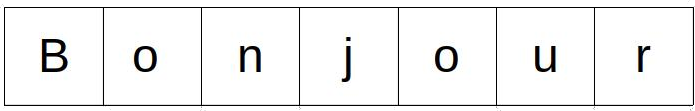
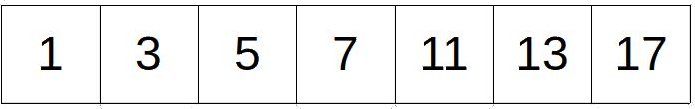
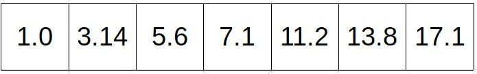
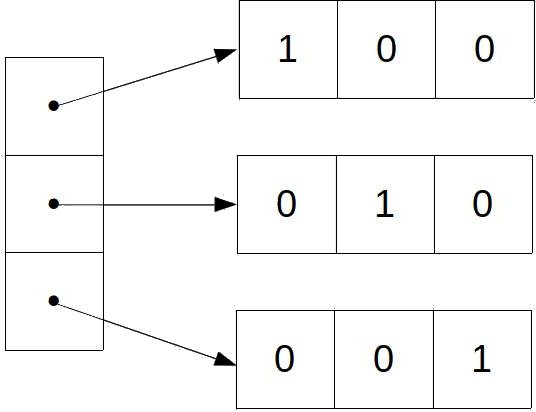
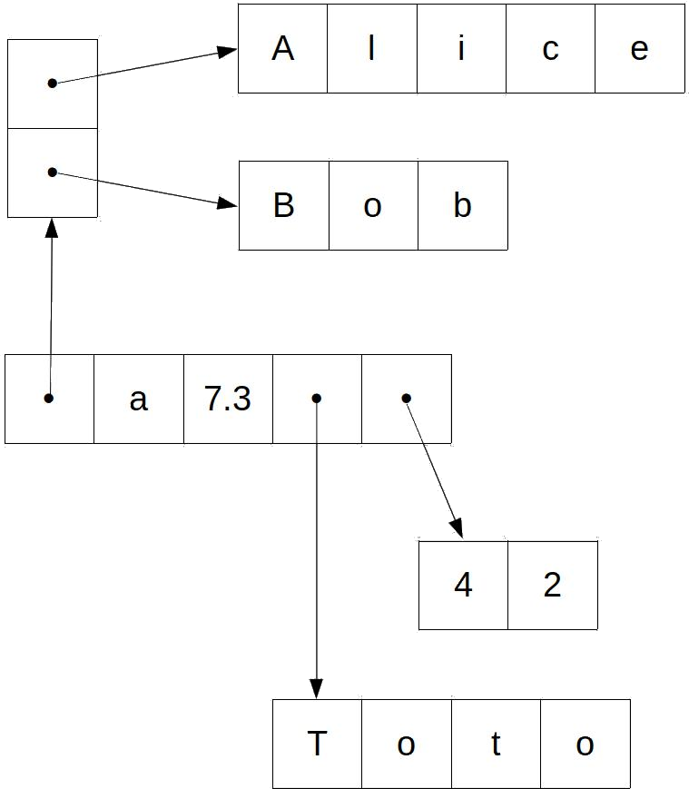
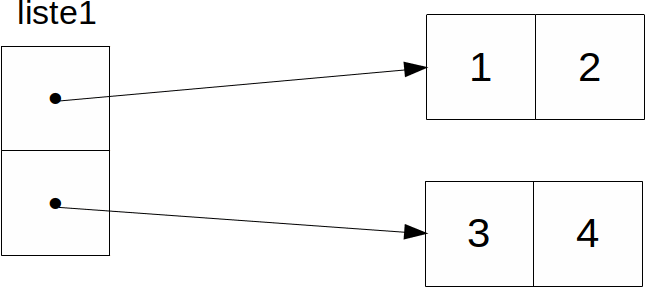
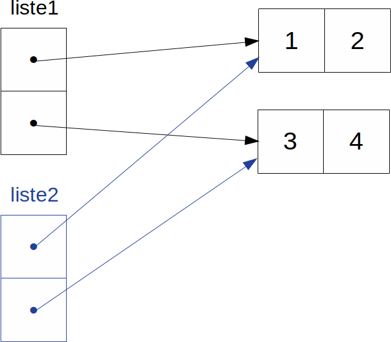
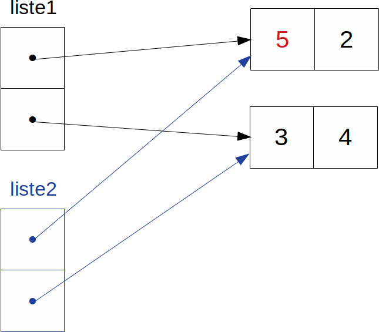

<!-- _class: title-section -->

# <!--fit--> Algorithmique Appliquée

##### BTS SIO SISR

## Structures de données fondamentales en Python

---

# Plan

- Notion de conteneur
- Notion d'opérations CRUD
- Tuples
- Ranges
- Lists
- Clonage et copie profonde
- Sets
- Dictionnaires
- Technique "Pythonic": compréhensions
- Structure personnalisée

---

<!-- _class: title-section -->

# <!--fit--> Correction du travail à la maison

---

### DM : Retours sur les fonctions et le débogage

[**Lien** vers le sujet de DM](../03-programmes-simples/dm-02.html).

---

<!-- _class: title-section -->

# <!--fit--> Notion de conteneur

##### Container :uk:

---

# Types utilisés jusqu'à présent

- `int` : nombre entier.
- `float` : nombre flottant.
- `str` : chaîne de caractères.


---

# Conteneur de caractères



Une chaîne de caractères est un **conteneur de caractères**.

```python
chaine = "Bonjour"
```

---

# Conteneur d'entiers



On voudrait aussi pouvoir manipuler des conteneurs d'entiers.

---

# Conteneur de flottants



On voudrait aussi pouvoir manipuler des conteneurs de nombres flottants.

---

# Tableaux à 2 dimensions



On voudrait aussi pouvoir manipuler des tableaux à 2, 3, N dimensions.

---

# Données hétérogènes



On voudrait aussi pouvoir manipuler des données hétérogènes.

---

# Collections

* Les conteneurs sont également appelés **collections**.
* Leur propriété principale est d'être **itérable**.
* Cela signifie que l'on peut itérer sur chaque élément de la collection.

---

# Différents conteneurs

- Il existe différents types de conteneurs, pour répondre à différents besoins.
- Nous allons étudier les principes offerts en Python.
- Avant cela, nous allons étudier les principales opérations sur les conteneurs.

---

<!-- _class: title-section -->

# <!--fit--> Notion d'opérations CRUD 

##### **C**reate, **R**ead, **U**pdate, **D**elete :uk:

---

# Opérations de base

* **Création** : Création d'un nouveau conteneur.
* **Lecture** : Lecture de tout ou partie du contenu du conteneur.
* **Mise à Jour** :
    * Modification d'une valeur.
    * Insertion d'une valeur.
    * Suppression d'une valeur.
* **Suppression** : Suppression du conteneur.

---

# Création

```python
chaine = "nouvelle chaine"
```

---

# Lecture

```python
for i in range(len(chaine)):
    print(chaine[i])

print(type(chaine))

i = chaine.find("c")
print(i)
```

<!--
Toute opération non destructive est une lecture.
-->

---

# Mise à jour

```python
nouvelle_chaine = chaine.replace("nouvelle", "nouveau")
print(chaine)
print(nouvelle_chaine)
```

:arrow_down:

```
nouvelle chaine
nouveau chaine
```

On ne peut pas modifier une chaîne de caractères.

La mise à jour est impossible.

<!--
Cette impossibilité est une caractéristique intéressante.
Elle est voulue.
Nous allons y revenir très prochainement.
-->

---

# Suppression

```python
chaine = None
```

<!--
On ne peut pas vraiment forcer la suppression d'un objet en Python.
Il s'agit d'un langage dit "managé".
Cela signifie que la fin du cycle de vie d'un objet est géré par l'interpréteur.
En pratique, il existe un processus particulier nommé garbage collector (collecteur de déchets) dont le rôle est de libérer la mémoire des objets qui ne sont pas utilisés.
Une fois que la chaine est mise à None, les caractères ne sont plus référencés, et la mémoire associée sera donc libérée par le garbage collector à son prochain passage.
-->

---

# Immutabilité

* La **mutabilité** est la capacité à mettre à jour un objet.
* Cela signifie qu'il est possible de modifier sa valeur, d'insérer des éléments, ou d'en supprimer.
* L'**immutabilité** est donc l'impossibilité de mettre à jour un objet.

---

# `str` est immutable

```python
chaine = "oui"
chaine = "non"
```

Dans l'exemple ci-dessus, à la 2e ligne, on lie une nouvelle chaîne de caractères `"non"` à la variable `chaine`.

<!--
La chaîne "oui" reste inchangée.
Cette chaîne n'est tout simplement plus référencée par la variable chaine.
-->

---

<!-- _class: title-section -->

# Tuples

---

# Notion de tuple

* Comme les chaînes de caractères, les **tuples** sont des séquences ordonnées immutables d'éléments.
* La différence est que les éléments d'un tuple n'ont pas à être des caractères.
* Les éléments individuels peuvent être de **n'importe quel type**.
* Ils peuvent même être de **types différents**.

---

# Création

```python
tuple1 = () # le tuple vide
print(tuple1)

tuple2 = (1, "deux", 3.14)
print(tuple2)

tuple3 = tuple(range(3))
print(tuple3)
```

:arrow_down:

```
()
(1, 'deux', 3.14)
(0, 1, 2)
```

---

# Valeur répétée

```python
t = (1, 1, 1, 1, 1, 1)
print(t)
```

:arrow_down:

```
(1, 1, 1, 1, 1, 1)
```

---

# Ordre conservé

```python
t = (5, 4, 3, 2, 1, 0)
print(t)
```

:arrow_down:

```
(5, 4, 3, 2, 1, 0)
```

---

# Création d'un tuple à 1 élément

```python
t = (1,)
print(t)
```

:arrow_down:

```
(1,)
```

<!--
La syntaxe (1) est déjà réservée pour le nombre entier 1 entre paranthèses.
Il ne peut pas y avoir 2 sémantiques associées à la même syntaxe dans le même contexte.
Donc, il fallait une syntaxe différente. Cette syntaxe consiste à avoir une virgule supplémentaire à la fin.
-->

---

# Tuple imbriqué

```python
t = (1, ("deux", "trois"), 3.14)
print(t)
```

:arrow_down:

```
(1, ("deux", "trois"), 3.14)
```

---

# Itération sur un tuple (1/2)

```python
t = (1, 2, 3.14)
for i in range(len(t)):
    print(t[i])
```

:arrow_down:

```
1
2
3.14
```

---

# Itération sur un tuple (2/2)

```python
for element in (1, 2, 3.14):
    print(element)
```

:arrow_down:

```
1
2
3.14
```

---

# Slicing

```python
t = (0, 1, 2, 3, 4, 5, 6, 7)
t2 = t[1:6:2]
print(t2)
```

:arrow_down:

```
(1, 3, 5)
```

---

<!-- _class: title-section -->

# <!--fit--> Bornes et itérateurs

##### Ranges & iterables :uk:

---

# Range

```python
print(range(10))
```

:arrow_down:

```
range(0, 10)
```

<!--
La fonction range renvoie un objet range.
Cet objet n'est pas un conteneur.
Il ne renvoie donc pas directement les valeurs 0 à 9 dans cet exemple.
-->

---

# Comparaison de ranges

```python
r1 = range(10)
r2 = range(0, 10, 2)
r3 = range(0, 9, 2)

similaires = (r1 == r2)
print(similaires) # False

similaires = (r2 == r3)
print(similaires) # True
```

<!--
Dans le second cas, les mêmes valeurs sont renvoyées par les ranges.
0, 2, 4, 6, 8
-->

---

# Itérateur

* Tous les types **itérables** ont une méthode nommée `__iter__`.
* La méthode `__iter__` renvoie un **objet itérable**.
* Cet objet itérable est utilisé dans les boucles `for`.
* A chaque itération, le prochain élément de la séquence est renvoyée.
* Un `range` est itérable.

---

# Evaluation paresseuse

### Lazy evaluation :uk:

* La séquence complète d'un `range` n'est jamais construite intégralement.
* A la place, on conserve uniquement les bornes et l'élément actuel.
* On reste ainsi capable de renvoyer toujours le prochain élément.
* Cette optimisation s'appelle l'**évaluation paresseuse**.

---

# <!--fit--> Intérêt de l'évaluation paresseuse (1/2)

```python
import time

depart = time.process_time()

for i in range(1000000000):
    if i == 300:
        break

fin = time.process_time()
temps = fin - depart
print(f"{temps:.6f}s")
```

:arrow_down:

```
0.000064s
```

<!--
Il n'a pas été nécessaire de construire un ensemble d'un milliard d'éléments.
Par conséquent, l'exécution est instantannée.
-->

---

# <!--fit--> Intérêt de l'évaluation paresseuse (2/2)

```python
import time

depart = time.process_time()

for i in tuple(range(1000000000)): # tuple ajouté ici
    if i == 300:
        break

fin = time.process_time()
temps = fin - depart
print(f"{temps:.6f}s")
```

:arrow_down:

```
60.011151s
```

<!--
Simplement en rajoutant le mot clé tuple, il faut maintenant 1 minute pour exécuter ce code sur une station de travail avec un CPU i9 à 4.5GHz.
L'ajout de ce mot clé force l'interpréteur à créer un tuple contenant 1 milliard d'éléments, même si on ne regarde que les 300 premiers.
On parle ici d'évaluation gourmande (greedy evaluation), qui est l'inverse de l'évaluation paresseuse.
-->

---

# Immutable et ordonné

* Par nature, un `range` est immutable.
* Par nature, un `range` conserve son ordre initial.

---

<!-- _class: title-section -->

# Listes

---

# Notion de liste

* Comme les tuples, les **listes** sont une séquence ordonnée de valeurs, où chaque valeur peut être identifiée par un index.
* Une liste, contrairement à un tuple, est **mutable**.
* La liste, notée `list`, est très utilisée en Python.

---

# Création

```python
liste1 = [] # la liste vide
print(liste1)

liste2 = [1, "deux", 3.14]
print(liste2)

liste3 = list(range(3))
print(liste3)
```

:arrow_down:

```
[]
[1, 'deux', 3.14]
[0, 1, 2]
```

---

# Valeur répétée

```python
liste = [1, 1, 1, 1, 1, 1]
print(liste)
```

:arrow_down:

```
[1, 1, 1, 1, 1, 1]
```

---

# Ordre conservé

```python
liste = [5, 4, 3, 2, 1, 0]
print(liste)
```

:arrow_down:

```
[5, 4, 3, 2, 1, 0]
```

---

# Création d'une liste à 1 élément

```python
liste = [1]
print(liste)
```

:arrow_down:

```
[1]
```

---

# Liste imbriquée

```python
liste = [1, ["deux", "trois"], 3.14]
print(liste)
```

:arrow_down:

```
[1, ["deux", "trois"], 3.14]
```

---

# Itération d'une liste (1/2)

```python
liste = [1, 2, 3.14]
for i in range(len(liste)):
    print(liste[i])
```

:arrow_down:

```
1
2
3.14
```

---

# Itération d'une liste (2/2)

```python
for element in [1, 2, 3.14]:
    print(element)
```

:arrow_down:

```
1
2
3.14
```

---

# Slicing

```python
liste = [0, 1, 2, 3, 4, 5, 6, 7]
liste2 = liste[1:6:2]
print(liste2)
```

:arrow_down:

```
[1, 3, 5]
```

---

# Liste de tuples

```python
liste = [(1, 2), (3, 4)]
print(liste)
```

:arrow_down:

```
[(1, 2), (3, 4)]
```

---

# Tuple de listes

```python
t = ([1, 2], [3, 4])
print(liste)
```

:arrow_down:

```
([1, 2], [3, 4])
```

---

# Liste à 2 dimensions

```python
liste = [
    [1, 0, 0],
    [0, 1, 0],
    [0, 0, 1]
]
```

---

# Liste à 3 dimensions

```python
liste = [
    [
        [1, 0],
        [0, 1]
    ],
    [
        [1, 0],
        [0, 1]
    ]
]
```

---

# Concaténation de listes

```python
liste1 = [1, 2, 3]
liste2 = [4, 5, 6]
liste3 = liste1 + liste2
print(liste3)
```

:arrow_down:

```
[1, 2, 3, 4, 5, 6]
```

---

# Modification d'une valeur

```python
liste = [1, 2, 3]
liste[0] = 5
print(liste)
```

:arrow_down:

```
[5, 2, 3]
```

---

# <!--fit--> Insertion d'une valeur au début

```python
liste = [1, 2, 3]
liste.insert(0, 42)
print(liste)
```

:arrow_down:

```
[42, 1, 2, 3]
```

---

# <!--fit--> Insertion d'une valeur au milieu

```python
liste = [1, 2, 3]
liste.insert(2, 42)
print(liste)
```

:arrow_down:

```
[1, 2, 42, 3]
```

---

# <!--fit--> Insertion d'une valeur à la fin

```python
liste = [1, 2, 3]
liste.append(42)
print(liste)
```

:arrow_down:

```
[1, 2, 3, 42]
```

---

# Suppression d'une valeur

```python
liste = [1, 2, 3]
liste.remove(liste[0])
print(liste)
```

:arrow_down:

```
[2, 3]
```

---

# <!--fit--> Suppression de la dernière valeur

```python
liste = [1, 2, 3]
liste.pop()
print(liste)
```

:arrow_down:

```
[1, 2]
```

---

<!-- _class: title-section -->

# TD : Implémenter les opérations matricielles les plus classiques

---

### TD : Opérations matricielles classiques

[**Lien** vers le sujet de TD](./td-03-op-matricielles.html).


---

<!-- _class: title-section -->

# <!--fit--> Clonage et copie profonde

##### Shallow and deep copy :uk:

---

# Le problème

```python
liste1 = [1, 2, 3]
liste2 = liste1

liste2.append(4)
print(liste1)
```

:arrow_down:

```
[1, 2, 3, 4]
```

<!--
Le fait de modifier la 2e liste modifie également la 1ière.
Est-ce surprenant ?
Pas vraiment, la variable liste1 est liée à la liste [1, 2, 3].
Ensuite, on lie la variable liste2 à la même liste [1, 2, 3].
Donc, les variables liste1 et liste2 référencent la même liste.
-->

---

# Impact imbriqué

```python
def f(liste):
    liste.append(4)

liste1 = [1, 2, 3]
f(liste1)
print(liste1)
```

:arrow_down:

```
[1, 2, 3, 4]
```

<!--
Il s'agit exactement du même cas que dans la diapositive précédente.
Même si le passage des variables se fait par valeur en Python, l'argument liste se voit lié à la même liste que la variable liste1.
Par conséquent, la modification de la liste dans la fonction impacte la variable liste1.
Parfois, c'est ce que l'on veut, parfois, non.
-->

---

# Egalité de listes

```python
liste1 = [1, 2, 3]
liste2 = [1, 2, 3]

egaux = (liste1 == liste2)
print(egaux)
```

:arrow_down:

```
[1, 2, 3, 4]
```

<!--
Deux listes sont égales si elles possèdent le même nombre d'éléments et si chacun d'entre eux sont égaux 2 à 2.
Cela n'aide pas à savoir si les 2 variables liste1 et liste2 référencent la même liste.
-->

---

# <!--fit--> Egalité d'objets : opérateur `is`

```python
liste1 = [1, 2, 3]
liste2 = [1, 2, 3]
liste3 = liste2

egaux = (liste1 is liste2)
print(egaux) # False

egaux = (liste2 is liste3)
print(egaux) # True
```

<!--
L'opérateur is permet de déterminer avec certitudes sur 2 variables référencent le même objet.
On sait ainsi si la modification de l'une des variables va entrainer la modification de l'autre.
-->

---

# Clonage (1/2)

```python
liste1 = [1, 2, 3]
liste2 = liste1.copy()
liste2.append(4)
print(liste1)
```

:arrow_down:

```
[1, 2, 3]
```

<!--
Dans ce cas, le clonage nous a permi de créer très facilement un clone indépendant de l'original.
Donc maintenant, lorsque l'on modifie la variable liste2, liste1 reste inchangée.
-->

---

# Clonage (2/2)

```python
liste1 = [1, 2, 3]
liste2 = liste1[:]
liste2.append(4)
print(liste1)
```

:arrow_down:

```
[1, 2, 3]
```

<!--
Il s'agit de la même technique. Seule la syntaxe change.
Il est important de comprendre cette syntaxe car elle est souvent utilisée.
On utilise l'opérateur de slicing pour renvoyer une nouvelle liste.
Cette nouvelle liste va du début à la fin de la liste actuelle, car on utilise les valeurs par défaut.
En effet, lorsque l'on ne spécifie pas la valeur avant le ":", c'est 0.
De même, lorsque l'on ne spécifie pas la valeur après le ":", c'est len(liste).
-->

---

# Limites du clonage

```python
liste1 = [[1, 2], [3, 4]]
liste2 = liste1[:]
liste2[0][0] = 5
print(liste1)
```

:arrow_down:

```
[[5, 2], [3, 4]]
```

<!--
Un clonage effectue une copie uniquement au premier niveau.
Par conséquent, les sous-listes de liste1 sont toujours référencées dans liste2.
La diapositive suivante clarifie les étapes.
-->

---

<!-- Etapes de clonage -->







---

# Copie profonde

```python
import copy

liste1 = [[1, 2], [3, 4]]
liste2 = copy.deepcopy(liste1)
liste2[0][0] = 5
print(liste1)
```

:arrow_down:

```
[[1, 2], [3, 4]]
```

<!--
La copie profonde permet de dupliquer l'ensemble de la structure, quelque soit sa profondeur.
Ainsi, on a maintenant liste1 et liste2 qui sont liés à des structures totalement différentes.
-->

---

<!-- _class: title-section -->

# Ensembles

##### Sets :uk:

---

# Notion d'ensemble

* Comme en mathématiques, un ensemble, noté `set`, est une collection **non-ordonnée** d'**éléments uniques**.
* Les éléments individuels peuvent être de **types différents**.
* Ils doivent être ***hashables***, c'est-à-dire fournir une définition pour les méthodes :
    * `__hash__` : génère un `int` unique pour un objet.
    * `__eq__` : égalité entre 2 objets.

---

# Création

```python
set1 = {} # l'ensemble vide
print(set1)

set2 = {1, "deux", 3.14}
print(set2)

set3 = set(range(3))
print(set3)
```

:arrow_down:

```
{}
{'deux', 1, 3.14}
{0, 1, 2}
```

---

# Valeur répétée

```python
s = {1, 1, 1, 1, 1, 1}
print(s)
```

:arrow_down:

```
{1}
```

---

# Ordre non conservé

```python
s = {5, 4, 3, 2, 1, 0}
print(s)
```

:arrow_down:

```
{0, 1, 2, 3, 4, 5}
```

---

# <!--fit--> Création d'un set à 1 élément

```python
s = {1}
print(s)
```

:arrow_down:

```
{1}
```

---

# Set imbriqué ?

```python
s = {1, {"deux", "trois"}, 3.14}
print(s)
```

:arrow_down:

```
TypeError: unhashable type: 'set'
```

<!--
Le set n'est lui-même pas hashable.
Il n'est donc pas possible d'utiliser un set de set.
-->

---

# Itération sur un set (1/2)

```python
s = {"Mona Lisa", "La Scapigliata", "La Belle Ferronnière"}
for i in range(len(s)):
    print(s[i])
```

:arrow_down:

```
TypeError: 'set' object is not subscriptable
```

<!--
Comme le set n'est pas ordonné, on ne peut pas accéder au ième élément.
Par conséquent, l'opérateur [] n'est pas défini.
-->

---

# Itération sur un set (2/2)

```python
s = {"Mona Lisa", "La Scapigliata", "La Belle Ferronnière"}
for element in s:
    print(element)
```

:arrow_down:

```
La Belle Ferronnière
La Scapigliata
Mona Lisa
```

---

# Union

```python
s1 = {1, 2, 3, 4, 5}
s2 = {4, 5, 6, 7}
s3 = s1 | s2
print(s3)
```

:arrow_down:

```
{1, 2, 3, 4, 5, 6, 7}
```

---

# Intersection

```python
s1 = {1, 2, 3, 4, 5}
s2 = {4, 5, 6, 7}
s3 = s1 & s2
print(s3)
```

:arrow_down:

```
{4, 5}
```

---

# Différence

```python
s1 = {1, 2, 3, 4, 5}
s2 = {4, 5, 6, 7}
s3 = s1 - s2
print(s3)
```

:arrow_down:

```
{1, 2, 3}
```

---

# Sous-ensemble

```python
s1 = {1, 2, 3, 4, 5}
s2 = {1, 2, 3}
sous_ensemble = (s2 <= s1)
print(sous_ensemble) # True
```

---

<!-- _class: title-section -->

# Dictionnaires

##### Dictionaries :uk:

---


# Notion de dictionnaire

* Un dictionnaire, noté `dict`, est une collection de **paires clé/valeur**.
* Une clé doit être **hashable**.
* Une valeur peut avoir **n'importe quel type**.
* Les clés et les valeurs peuvent avoir des types différents.
* Les dictionnaires sont très utilisés en Python.

---

# Création

```python
dico1 = dict() # dictionnaire vide
print(dico1)

dico2 = {"un": 1, "deux": 2, "trois": 3}
print(dico2)
```

:arrow_down:

```
{}
{'un': 1, 'deux': 2, 'trois': 3}
```

---

# Valeur répétée

```python
d = {"un": 1, "un": 1}
print(d)
```

:arrow_down:

```
{'un': 1}
```

---

# Ordre conservé

###### $\ge$ Python 3.8

```python
d = {"trois": 3, "deux": 2, "un": 1}
print(d)
```

:arrow_down:

```
{'trois': 3, 'deux': 2, 'un': 1}
```

<!--
Attention, si vous devez utiliser une version de Python inférieure strictement à 3.8, le comportement sera différent.
Les dictionnaires ont été ré-implémentés dans Python 3.8, et la nouvelle implémentation permet de garantir la conservation de l'ordre.
Cela dit, vous ne devriez pas vous baser sur cette propriété de telle sorte que votre code fonctionne quelque soit la version de l'interpréteur utilisé
-->

---

# <!--fit--> Création d'un dictionnaire à 1 élément

```python
d = {"un": "ein"}
print(d)
```

:arrow_down:

```
{'un': 'ein'}
```

---

# Dictionnaire imbriqué

```python
d = {
    "fr_en": {"un": "one", "deux": "two", "trois": "three"},
    "fr_de": {"un": "ein", "deux": "zwei", "trois": "drei"}
}
print(d)
```

:arrow_down:

```
{'fr_en': {'un': 'one', 'deux': 'two', 'trois': 'three'},
 'fr_de': {'un': 'ein', 'deux': 'zwei', 'trois': 'drei'}}
```

---

# <!--fit--> Itération sur un dictionnaire (1/3)

```python
d = {"Janvier": 1, "Février": 2, "Mars": 3}
for cle in d:
    print(f"Le numéro du mois de {cle} est {d[cle]}.")
```

:arrow_down:

```
Le numéro du mois de Janvier est 1.
Le numéro du mois de Février est 2.
Le numéro du mois de Mars est 3.
```

---

# <!--fit--> Itération sur un dictionnaire (2/3)

```python
d = {"Janvier": 1, "Février": 2, "Mars": 3}
for cle, valeur in d.items():
    print(f"Le numéro du mois de {cle} est {valeur}.")
```

:arrow_down:

```
Le numéro du mois de Janvier est 1.
Le numéro du mois de Février est 2.
Le numéro du mois de Mars est 3.
```

---

# <!--fit--> Itération sur un dictionnaire (3/3)

```python
d = {"Janvier": 1, "Février": 2, "Mars": 3}
for valeur in d.values():
    print(f"Le numéro du mois est {valeur}.")
```

:arrow_down:

```
Le numéro du mois est 1.
Le numéro du mois est 2.
Le numéro du mois est 3.
```

---

# Modification d'une valeur

```python
taille = {"petit": 140, "moyen": 170, "grand": 190}
taille["moyen"] = 165
print(taille)
```

:arrow_down:

```
{'petit': 140, 'moyen': 165, 'grand': 190}
```

---

# Insertion d'une valeur

```python
calories = {"eau": 0, "jus de fruit": 100, "coca": 100000}
calories["vin"] = 1000
print(calories)
```

:arrow_down:

```
{'eau': 0, 'jus de fruit': 100, 'coca': 100000, 'vin': 1000}
```

---

# Suppression d'une valeur

```python
heros = {
    "Catwoman": 300,
    "Batman": 400,
    "Wonderwoman": 900,
    "Robin": 2
}
del heros["Robin"]
print(heros)
```

:arrow_down:

```
{'Catwoman': 300, 'Batman': 400, 'Wonderwoman': 900}
```

---

<!-- _class: title-section -->

# <!--fit--> Technique "Pythonic" : compréhensions

---

# Notion de compréhension

* Une **compréhension** est une syntaxe alternative **plus compacte** pour créer des conteneurs.
* Cette syntaxe est surtout utilisée pour les **listes** et les **dictionnaires** mais peut aussi être utilisée pour les sets.

---

# <!--fit--> Compréhension avec une liste

```python
liste = [i ** 2 for i in range(5)]
print(liste)
```

:arrow_down:

```
[0, 1, 4, 9, 16]
```

---

# <!--fit--> Compréhension avec condition

```python
liste = [i ** 2 for i in range(10) if i % 2 == 0]
print(liste)
```

:arrow_down:

```
[0, 4, 16, 36, 64]
```

---

# Compréhension imbriquée

```python
liste = [(i, j) for i in range(2) for j in range(3)]
print(liste)
```

:arrow_down:

```
[(0, 0), (0, 1), (0, 2), (1, 0), (1, 1), (1, 2)]
```

---

# :warning: Trop complexe :warning:

```python
liste = [[i * j + k for i in range(3)]
            for j in range(6) if j % 3 == 0
                for k in range(2)]
print(liste)
```

:arrow_down:

```
[[0, 0, 0], [1, 1, 1], [0, 3, 6], [1, 4, 7]]
```

<!--
Les compréhensions sont faites pour rendre le code plus simple, et non plus complexe.
Ici, la liste interne est créée avec un range(3) donc comportera 3 élément.
La compréhension externe est composée de 2 boucles.
La première boucle, sur j est limitée aux éléments 0 et 3 car ce sont les seuls éléments dont le reste de la division par 3 est égal à 0 sur l'interval [0 ; 6[.
La deuxième boucle, sur k, est limitée aux éléments 0 et 1.
La liste externe est donc composée de 2x2 = 4 listes internes.
Les 2 premières listes internes sont obtenues pour j == 0 et respectivement k == 0 et k == 1.
Les 2 listes internes suivantes sont obtenues pour j == 3 et respectivement k == 0 et k == 1.
-->

---

# Compréhension avec un set

```python
s = {i ** 3 for i in range(1, 4)}
print(s)
```

:arrow_down:

```
{8, 1, 27}
```

---

# Compréhension avec un dictionnaire

```python
dico = {i: i ** 2 for i in range(2, 11)}
print(dico)
```

:arrow_down:

```
{2: 4, 3: 9, 4: 16, 5: 25, 6: 36, 7: 49, 8: 64, 9: 81, 10: 100}
```

---

## Compréhension avec un dictionnaire et une condition

```python
dico = {i: i ** 2 for i in range(2, 11) if i % 2 == 0}
print(dico)
```

:arrow_down:

```
{2: 4, 4: 16, 6: 36, 8: 64, 10: 100}
```

---

<!-- _class: title-section -->

### TP : Utiliser un dictionnaire pour gérer un hôpital avec des patients, des médecins et des soins à apporter

---

### TP : Gestion d'un hôpital

[**Lien** vers le sujet de TP](./tp-08-gestion-hosto.html).

---

<!-- _class: title-section -->

# Structure personnalisée

##### Notion de classe comme Tuple avancé

---

# <!--fit--> Limites des conteneurs (1/2)

- Modélisation d'un point 3D avec une liste :

```python
point = [0, 0, 0]
x, y, z = point[0], point[1], point[2]
```

- Il faut garder le modèle mental de correspondance :
    - 0 pour l'abscisse x,
    - 1 pour l'ordonnée y,
    - 2 pour la profondeur z.
- Cette correspondance complexifie le code.

<!--
Avec les conteneurs vus jusqu'ici, on peut aller loin.
Nous allons voir une alternative puissante avec les structures de données
-->

---

# <!--fit--> Limites des conteneurs (2/2)

- Modélisation d'un point 3D avec un dictionnaire :

```python
point = {"x": 0, "y": 0, "z": 0}
x, y, z = point["x"], point["y"], point["z"]
```

- Cette solution implique une empreinte mémoire supérieure.

---

# Structure de données

- Python nous permet de définir nos **propres structures de données**.

```py
from dataclasses import dataclass

@dataclass
class Point:
    x: float = 0.
    y: float = 0.
    z: float = 0.

point = Point()
x, y, z = point.x, point.y, point.z
```

---

# Avantages

- Plus **explicite** que l'emploi des indexes d'une liste.
- Code plus précis et **plus simple** à comprendre et maintenir.
- **Moins lourd** en mémoire par rapport à un dictionnaire.
- Egalement **plus performant** qu'une liste car il n'y a pas d'indirection.

<!--
Les éléments d'une liste sont dispersés en mémoire.
Pour accéder à la localisation mémoire d'un élément d'une liste, une indirection est nécessaire en pratique.
Les éléments d'une structure de données sont compacts en mémoire
-->

---

# Conclusion

Les structures de données sont fondamentales pour définir des **abstractions de niveau supérieur** et simplifier la programmation.
