<!-- _class: title-section -->

# <!--fit--> Algorithmique Appliquée

##### BTS SIO SISR

## Résolution de problèmes classiques

---

# Plan

- Listes chaînées
- Queue et FIFO
- Pile et LIFO
- Comparaison entre FIFO et LIFO
- Rappels sur la théorie des ensembles
- Rappels sur le calcul matriciel

<!--
On commence par étudier quelques structure de données supplémentaires, en complément du cours précédent.
Ensuite, on prépare le terrain pour le Devoir à la Maison n°3 qui nécessite quelques bases en algèbre que l'on se propose de revoir.
-->

---

<!-- _class: title-section -->

# Listes chaînées

---

# Introduction

* En Python, une `list` permet de rassembler un nombre variable d'éléments.
* Nous allons voir une manière d'implémenter ce type de liste.

---

# Notion de liste chaînée

* Une liste chaînée est une **structure de données récursive**.
* Une liste chaînée est composée de **noeuds**.
* Un noeud comporte 2 variables :
    * Une valeur,
    * Le noeud suivant.

---

# <!--fit--> Noeud d'une liste chaînée

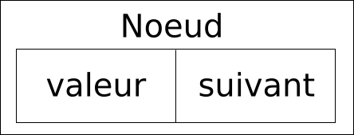

---

# 2 noeuds

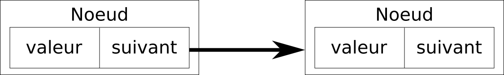

---

# <!--fit--> Structure de données


```python
from dataclasses import dataclass

@dataclass
class Noeud:
    """Noeud de la liste chainee.
    
    La valeur peut etre n'importe quel objet 
    Python valide.
    Le suivant doit avoir pour type Noeud
    ou None.
    """
    valeur = None
    suivant = None
```

---

# Noeud de départ

* Comment identifier le **noeud de départ** de la liste ?
* On souhaite que chaque noeud ait la **même représentation**.
* On introduit un nouveau type, `Liste`, qui référence le noeud de départ.
* Une `Liste` **n'a pas de valeur**.

---

# Noeud de départ identifié par la liste

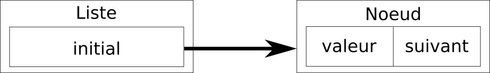

---

# <!--fit--> Structure de données

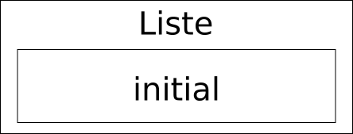

```python
from dataclasses import dataclass

@dataclass
class Liste:
    """Liste chainee.

    Il s'agit simplement d'un point d'entree
    vers le 1er noeud de la liste chainee, 
    nommé initial.
    La variable initial doit avoir pour type
    Noeud ou None.
    """
    initial = None
```

---

# <!--fit--> Liste chaînée comportant 2 valeurs


---

# <!--fit--> Exemple avec 3 valeurs

```python
liste_chainee = creer_liste_chainee(42, 3.14, "bonjour")
```

:arrow_down:


<!--
Vous allez implémenter cette fonction dans le cadre du prochain TP.
-->

---

# Dernier noeud

Le `suivant` du dernier noeud est `None`.

---

# <!--fit--> Parcours d'une liste chaînée

```python
def parcours(liste_chainee, f):
    """Appelle f sur chaque valeur de la liste chaînée.

    liste_chainee - liste chaînée de type Liste.
    f - fonction prenant un argument.
    """
    noeud = liste_chainee.initial
    while noeud != None:
        f(noeud.valeur)       # appelle la fonction f
        noeud = noeud.suivant # passage au noeud suivant
```

---

# Insertion au début

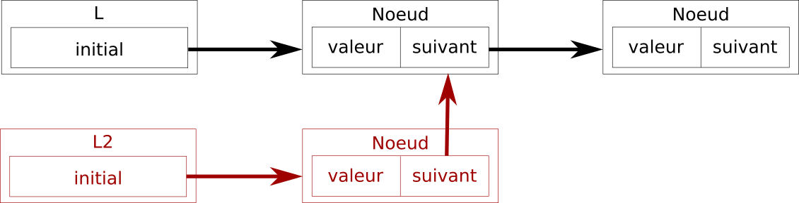

L'insertion au début est **non-destructive**.
Il est possible de construire des listes chaînées **immutables**.

<!--
En revanche, nous ne chercherons pas à construire une telle liste chaînée immutable dans le cadre de ce cours.
-->

---

# Insertion au milieu

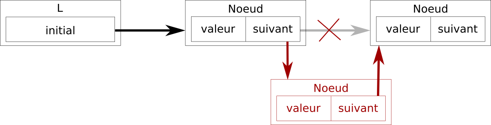

---

# Insertion à la fin

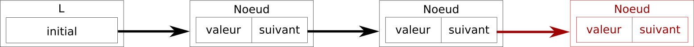

---

# Suppression au début

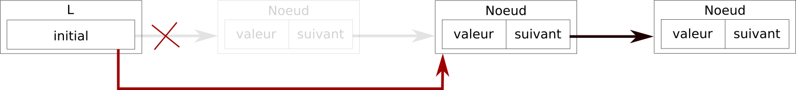

---

# Suppression au milieu

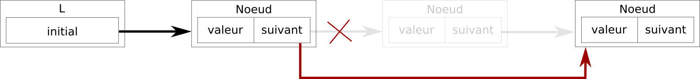

---

# Suppression à la fin

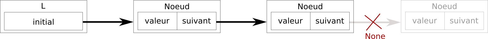

---

# Liste doublement chaînée

```python
from dataclasses import dataclass

@dataclass
class NoeudBidirectionnel:
    valeur = None
    suivant = None
    precedent = None   # Nouveau

@dataclass
class ListeBidirectionnelle:
    initial = None
    final = None       # Nouveau
```

<!--
Une liste doublement chaînée conserve une référence vers le noeud précédent.
-->

---

# <!--fit--> Evaluation des listes chaînées

- **Avantages** :
    - Insertion rapide au début.
    - Insertion rapide à la fin pour une liste doublement chaînée.
- **Inconvénients** :
    - Pas d'indexation : il faut parcourir potentiellement tous les éléments pour en retrouver un.
    - Mémoire éparse : chaque noeud a sa propre adresse en mémoire.

---

# <!--fit--> Comparaison avec une `list`

- La `Liste` chaînée est un exercice intéressant pour comprendre comment une `list` peut être implémentée.
- La `Liste` chaînée introduite ici et dans le prochain TP a un but purement pédagogique.
- Dans du code industriel de production, utilisez une `list`.

---

<!-- _class: title-section -->

# TP : Manipulation d'une liste chaînée

---

### TP : Manipulation d'une liste chaînée

[**Lien** vers le sujet de TP](./tp-09-liste-chainee.html).

---

<!-- _class: title-section -->

# Queue et FIFO

##### First-In, First-Out :uk:

---

# Notion de file d'attente

* Une **queue**, également nommée **file d'attente**, est une collection.
* Cette collection comporte 2 opérations principales :
    * Empiler un élément.
    * Dépiler le 1er élément empilé.
* Premier entré, premier sorti.

---

# Métaphore


<!--
File d'attente de l'Empire State Building à New York.
Source : Wikipedia (C)
-->

---

# Principe

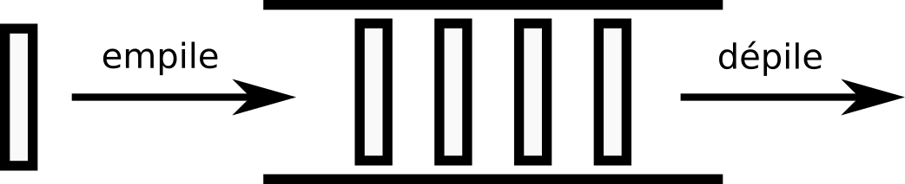

---

# Exemple avec 2 éléments

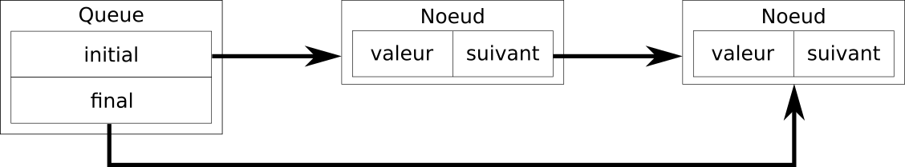

<!--
Il s'agit ici d'une implémentation basée sur une liste chaînée.
D'autres implémentations existent.
Au début, on a initial = None et final = None.
Lorsque le 1er noeud est inséré, initial et final pointent tous les 2 dessus.
-->

---

# <!--fit--> Structure de données

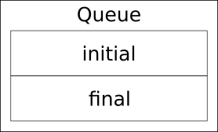

```python
from dataclasses import dataclass

@dataclass
class Queue:
    """Queue utilisant une liste chainee.

    initial - doit avoir pour type 
              Noeud ou None.
    final - doit avoir pour type 
            Noeud ou None.
    """
    initial = None
    final = None
```

<!--
On conserve une référence vers le dernier élément car on sait que chaque empilement se fait à la fin.
Par conséquent, il faut pouvoir ajouter rapidement un élément à la fin.
Nous avons vu que l'ajout à la fin d'une liste chaînée simple nécessite de traverser tous les éléments, ce qui n'est pas nécessairement rapide.
Nous verrons lors du prochain cours des outils mathématiques pour évaluer la vitesse d'exécution d'un algorithme.
-->

---

# Empile

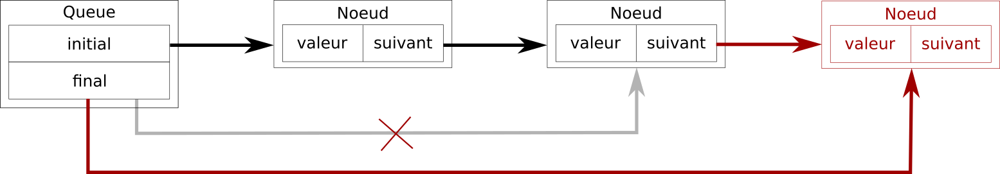

<!--
Vous allez implémenter cet algorithme dans le prochain TP.
-->

---

# Dépile

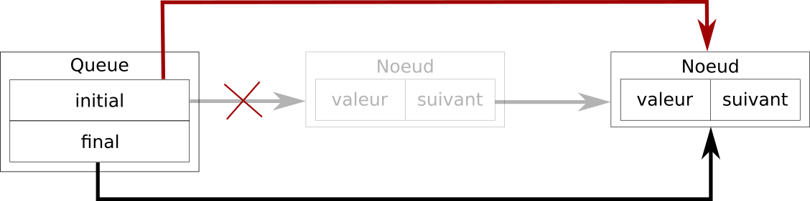


---

# Utilisation d'une `list`

```python
def empile(queue, element):
    """Empile l'élément dans la queue.

    queue - la queue à modifier.
    element - element à empiler dans la queue.
    """
    queue.append(element)

def depile(queue):
    """Depile le 1er élément de la queue.

    queue - la queue à modifier.
    Retourne le 1er élément de la queue.
    """
    return queue.pop(0)
```

<!--
Il s'agit d'une implémentation alternative basée sur une `list`.
Cette implémentation est plus simple et probablement plus performante que celle avec notre liste chaînée.
-->

---

# Exemple

```python
queue = [6, 3, 7]
empile(queue, 10)
print(queue)       # [6, 3, 7, 10]

valeur = depile(queue)
print(valeur)      # 6
print(queue)       # [3, 7, 10]
```

---

<!-- _class: smaller-text -->

# Utilisation de `deque`

```python
from collections import deque

def empile(queue, element):
    """Empile l'élément dans la queue.

    queue - la queue à modifier.
    element - element à empiler dans la queue.
    """
    queue.append(element)

def depile(queue):
    """Depile le 1er élément de la queue.

    queue - la queue à modifier.
    Retourne le 1er élément de la queue.
    """
    return queue.popleft()
```

<!--
Il existe une meilleure structure de données que `list` pour représenter une file d'attente.
Il s'agit de la collection `deque`.
Cette collection offre un profil de performances bien plus intéressant que `list` pour de grandes tailles de données.
-->

---

# Exemple

```python
queue = deque([6, 3, 7])
empile(queue, 10)
print(queue)           # deque([6, 3, 7, 10])

valeur = depile(queue)
print(valeur)          # 6
print(queue)           # deque([3, 7, 10])
```

---

<!-- _class: title-section -->

# Pile et LIFO

##### Stack & Last-In, First-Out :uk:

---

# Notion de pile

* Une **pile** est une collection.
* Cette collection comporte 2 opérations principales :
    * Empiler un élément.
    * Dépiler le **dernier** élément empilé.
* Dernier entré, premier sorti.

---

# Métaphore


<!--
Un empilement de pièces.
On ne peut pas retirer les pièces intermédiares sans faire tomber une pièce supérieure.
En tout cas, pas facilement.
Cela montre un problème plus mécanique appelé "Empilement de bloc".
Le surplomb maximal à chaque niveau est proportionnel à la moitié de la série harmonique.
Source : Wikipedia
-->

---

# Principe

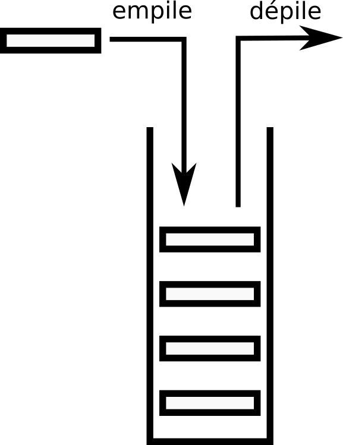

---

# Exemple avec 2 éléments

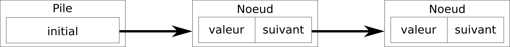

<!--
Il s'agit ici d'une implémentation basée sur une liste chaînée.
D'autres implémentations existent.
-->

---

# <!--fit--> Structure de données


```python
from dataclasses import dataclass

@dataclass
class Pile:
    """Pile utilisant une liste chainee.

    initial - doit avoir pour type 
              Noeud ou None.
    """
    initial = None
```

<!--
Exactement identique à une liste chaînée.
-->

---

# Empile

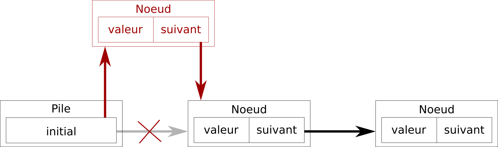

<!--
Vous allez implémenter cet algorithme dans le prochain TP.
-->

---

# Dépile

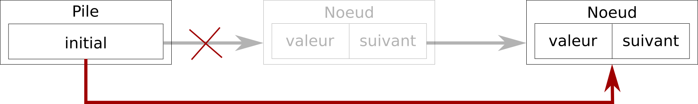


---

# Utilisation d'une `list`

```python
def empile(pile, element):
    """Empile l'élément dans la pile.

    pile - la pile à modifier.
    element - element à empiler dans la pile.
    """
    pile.insert(0, element)

def depile(pile):
    """Depile le 1er élément de la pile.

    pile - la pile à modifier.
    Retourne le 1er élément de la pile.
    """
    return pile.pop(0)
```

<!--
Il s'agit d'une implémentation alternative basée sur une list.
De la même manière que l'on peut implémenter une queue avec une list, la même chose est possible pour une pile.
-->

---

# Exemple

```python
pile = [6, 3, 7]
empile(pile, 10)
print(pile)           # [10, 6, 3, 7]

valeur = depile(pile)
print(valeur)         # 10
print(pile)           # [6, 3, 7]
```

---

<!-- _class: smaller-text -->

# Utilisation de `deque`

```python
from collections import deque

def empile(pile, element):
    """Empile l'élément dans la pile.

    pile - la pile à modifier.
    element - element à empiler dans la pile.
    """
    pile.appendleft(element)

def depile(pile):
    """Depile le 1er élément de la pile.

    pile - la pile à modifier.
    Retourne le 1er élément de la pile.
    """
    return pile.popleft()
```

<!--
On peut aussi bien utiliser un deque pour représenter une queue ou une pile.
Cela peut sembler contre-intuitif, mais c'est pratique.
-->

---

# Exemple

```python
pile = deque([6, 3, 7])
empile(pile, 10)
print(pile)            # deque([10, 6, 3, 7])

valeur = depile(pile)
print(valeur)          # 10
print(pile)            # deque([6, 3, 7])
```

---

<!-- _class: title-section -->

# <!--fit--> Comparaison entre FIFO et LIFO

---

# FIFO :vs: LIFO

|      |       Anglais       |           Français           | Collection |
|------|:-------------------:|:----------------------------:|:----------:|
| FIFO | First In, First Out | Premier Entré, Premier Sorti |    Queue   |
| LIFO |  Last In, First Out | Dernier Entré, Premier Sorti |    Pile    |

<!--
A ne pas confondre avec FIFA...
-->

---


<!--
A gauche : FIFO (queue).
A droite : LIFO (stack).
-->

---

# FIFO dans la réalité

#### Les queues de messages

* Ordonnanceur de tâches (systèmes d'exploitation).
* Traitements asynchrones dans un système.
* Version itérative d'algorithmes récursifs.

---

# LIFO dans la réalité

* Pile d'appels de fonctions.
* Interpréteur.
* Version itérative d'algorithmes récursifs.

---

<!-- _class: title-section -->

# TP : Queues de messages simples

---

### TP : Queues de messages simples

[**Lien** vers le sujet de DM](./tp-10-queues-msg.html).

---

<!-- _class: title-section -->

# <!--fit--> Rappels sur la théorie des ensembles


##### Union, intersection, différence

---

# Intérêt

* Nous avons vu le type `set` dans le cours précédent.
* Le DM n°3 vous demande d'implémenter les opérations classiques sur les ensembles.
* Nous revenons rapidement sur ces définitions pour préparer le DM.

---

# Ensemble vide

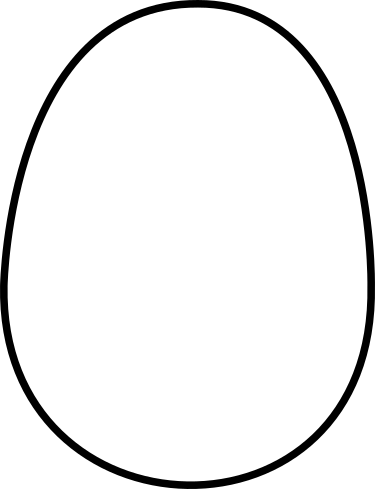

---

# <!--fit--> Ensemble avec quelques éléments

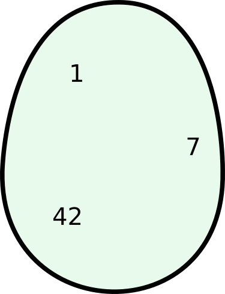

---

# Ensembles disjoints

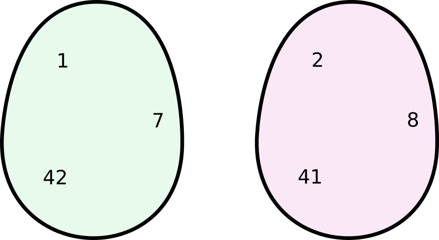

---

# Sous-ensemble

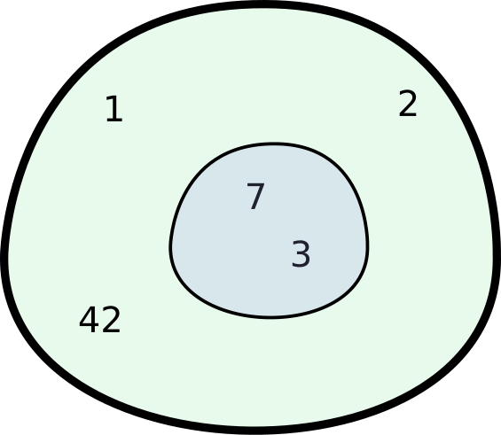

---

# Intersection

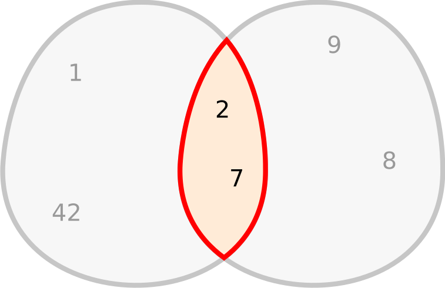

---

# Union

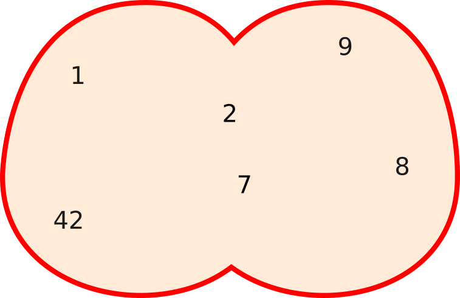

---

# Exclusion

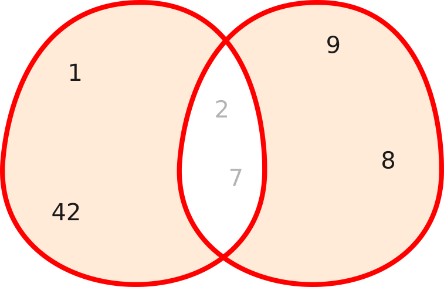

---

# Différence

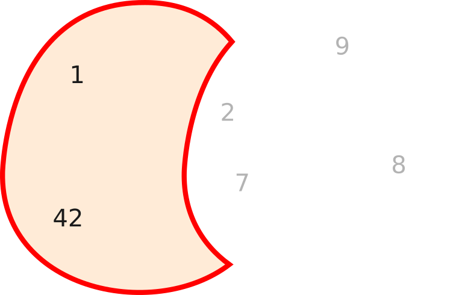

---

<!-- _class: title-section -->

# <!--fit--> Rappels sur le calcul matriciel avancé

##### Diagonalisation, inversion, méthode de Gauss

---

En prévision du DM 03 et de l'examen final
Intérêt : pour faire des jeux vidéos, du CAD/FEA ou des systèmes de guidage de missiles
Autre intérêt : résoudre les systèmes d'équations simples
Transformée d'une matrice
Diagonalisation de matrice
Déterminant et Co-matrice
Inversion de matrice avec co-matrice
Matrices de transformation 2D et 3D
Inversion d'une matrice de transformation
Poser un système d'équation au format matriciel
Résolution avec la méthode de Gauss

---

<!-- _class: title-section -->

# Devoir à la Maison 03

---

### DM : Retours sur les fonctions et le débogage

[**Lien** vers le sujet de DM](./dm-03.html).
