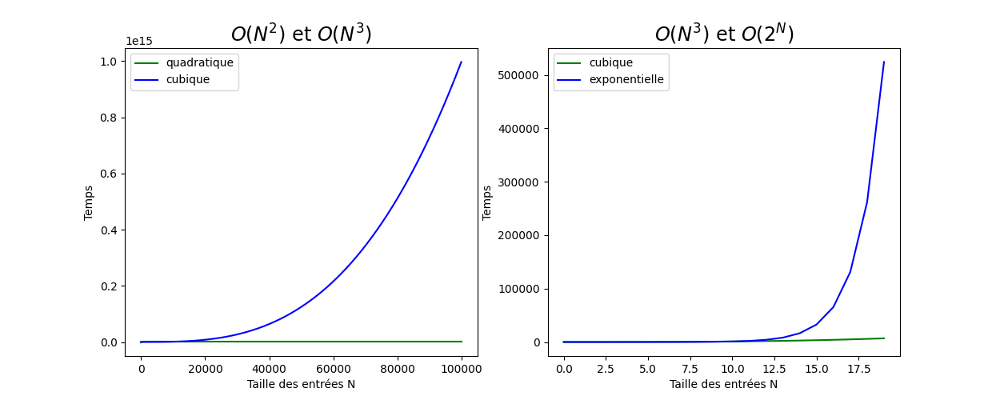

<!-- _class: title-section -->

# <!--fit--> Algorithmique Appliquée

##### BTS SIO SISR

## Introduction à la complexité d'algorithme

<!--
Partie complexe du cours mais totalement fondamentale.
Branchez vos neurones et c'est parti !
-->

---

<!-- _class: smaller-text -->

# Plan

- Intuition sur la complexité
- Complexité temporelle et spatiale
- Notation $O(...)$
- Classes de complexité
- Comparaison des classes de complexité
- Limites de l'étude de complexité
- Approche pragmatique
- Discussion concernant la parallélisation
- Discussion sur la distribution
- Problèmes NP-complet
- Discussion sur les machines quantiques

---

<!-- _class: title-section -->

# <!--fit--> Correction du travail à la maison

---

### DM : Ensembles et calcul matriciel

[**Lien** vers le sujet de DM](../06-problemes-classiques/dm-03.html).

---

<!-- _class: title-section -->

# <!--fit--> Intuition sur la complexité

---

### Complexité conceptuelle et complexité algorithmique

* La **complexité conceptuelle** d'un algorithme est la difficulté à le comprendre.
* La **complexité algorithmique** s'intéresse à l'**efficacité** d'un algorithme.
* Un algorithme plus efficace peut être plus difficile à comprendre. 
* Il s'agit d'un **compromis** entre la complexité conceptuelle et la complexité algorithmique.

---

### Recherche linéaire et dichotomique

* Une recherche linéaire est **très simple à comprendre**.
* Une recherche dichotomique est plus complexe à comprendre.
* Une recherche dichotomique est **plus efficace** qu'une recherche linéaire.
* On dit que la recherche dichotomique a une **meilleure complexité algorithmique**.

---

# Force brute

* Une manière **naïve** de rechercher une solution consiste à explorer toutes les solutions possibles et à vérifier celles qui sont correctes.
* Ce type de solution s'appelle une recherche en **force brute**.
* Exemple : recherche linéaire.

<!--
Cela signifie que l'on s'appuie sur la puissance de la machine plutôt que sur son intelligence.
-->

---

# Approximation

* Combien de temps va prendre mon programme ?
* Objectif : **comparer** les algorithmes **indépendemment d'une machine**.
* La comparaison ne doit pas se baser sur des mesures.
* Approximation : **compter le nombre d'instructions**.

---

# Instruction

* Dans ce modèle :
    * Une instruction (ou étape) prend un **temps fixe**.
    * Toute instruction prend le **même temps**.
* Une instruction peut être aussi bien :
    * Une opération arithmétique.
    * Assignation d'une variable.
    * Effectuer une comparaison.
    * Etc.

---

# Fonction des entrées

* Dans ce modèle, le **temps d'exécution** est fonction du **nombre d'instructions**.
* Si le nombre d'instructions varie avec la taille d'une entrée, alors le temps d'exécution est fonction de la **taille des entrées**.

---

# <!--fit--> Exemple : recherche linéaire

```python
def recherche(liste, x):
    for element in liste:
        if element == x:
            return True
    return False
```

Si la taille de la liste est de 10 éléments on aura au maximum 10 comparaisons.
Si la taille de la liste est de 1 000 000 éléments on aura au maximum 1 000 000 comparaisons.

---

# <!--fit--> Exemple : déterminant de rang 25 (1/2)

- Soit $m_{i,j}$, $1 \le i,j \le 25$, les éléments d'une matrice $M$ dont on cherche le déterminant :

$$
\left|M\right| =
\sum_{\sigma \in S_{25}} \varepsilon(\sigma) m_{1,\sigma(1)} m_{2,\sigma(2)} \dots m_{25,\sigma(25)}
$$

- $S_{25}$ désigne l'ensemble des permutations de $\{1;2;\dots;25\}$.
- $\varepsilon(\sigma)$ désigne la signature de la permution $\sigma$.
- La signature d'une permutation vaut $\pm 1$.

<!--
Il s'agit de la formule de Leibniz.
Dans le cours précédent, nous avons vu la formule de l'expansion de Laplace.
La formule de Leibniz est simplement une autre manière de calculer un déterminant.
Pour N=3, on a 3! = 6 permutations :
{1, 2, 3} => (-1)^0 * m_{1, 1} * m_{1, 2} * m_{1, 3}
{1, 3, 2} => (-1)^1 * m_{1, 1} * m_{1, 3} * m_{1, 2}
{3, 2, 1} => (-1)^2 * m_{1, 3} * m_{1, 2} * m_{1, 1}
{2, 1, 3} => (-1)^3 * m_{1, 2} * m_{1, 2} * m_{1, 3}
{3, 1, 2} => (-1)^4 * m_{1, 3} * m_{1, 1} * m_{1, 2}
{2, 3, 1} => (-1)^5 * m_{1, 2} * m_{1, 3} * m_{1, 1}
-->

---

# <!--fit--> Exemple : déterminant de rang 25 (2/2)

* Il y a autant de produits à 25 termes à calculer que de permutations.
* C'est à dire $25!$.
* Formule de Stirling : $n! \approx (\frac{n}{e})^n \sqrt{2 \pi n}$.
* Cela implique donc environ $1.5 \cdot 10^{25}$ instructions.
* Avec un processeur qui exécute 10 milliards de produits par secondes, il faudra environ **50 millions d'années** pour calculer ces produits.

<!--
Heureusement, il existe d'autres algorithmes plus efficaces pour calculer un déterminant.
En particulier, l'algorithme de Strassen, en O(N^3) implique une résolution pour N=25 en moins de 25^3 = 15625 multiplications.
Sur le même processeur, il faut moins d'une seconde à cet algorithme pour obtenir le résultat.
Nous n'étudierons pas l'algorithme de Strassen dans ce cours, mais on peut ressentir la différence entre moins d'une seconde et 50 millions d'années pour résoudre le même problème.
-->

---

# Loi de Murphy

* **Cas favorable** : le minimum d'instruction est exécuté.
    * Exemple : l'élément recherché est en 1er.
* **Pire cas** : le maximum d'instructions est exécuté.
    * Exemple : l'élément recherché est à la fin.
* **Cas moyen** : temps moyen pour des entrées classiques (par exemple, 90% des cas).
* **Loi de Murphy** : si un problème peut survenir, il surviendra. On se concentre donc sur le pire cas.

---

<!-- _class: title-section -->

# Réflexion sur la complexité temporelle et spatiale

---

# Complexité temporelle

* C'est le type de complexité algorithmique que nous avons discuté jusqu'à présent.
* On s'attache à évaluer le temps d'exécution sur une machine théorique.

---

# Complexité spatiale

* La **complexité spatiale** s'attache à déterminer la place mémoire nécessaire pour la résolution d'un algorithme.
* Il s'agit d'une fonction des entrées de l'algorithme étudié.

---

# Temporel et spatial

* On se focalise d'abord sur la complexité temporelle.
* Si 2 algorithmes ont la même complexité temporelle, on compare leurs complexités spatiales.

---

<!-- _class: title-section -->

# Notation $O(...)$

---

# Notation asymptotique

* **Notation asymptotique** : manière formelle de relier le temps d'exécution à la taille des entrées.
* On s'intéresse au cas où la taille des entrées approche l'**infini**.

<!--
On va prendre un exemple.
-->

---

# Exemple (1/2)

```python
def f(x):
    y = 0
    for i in range(x):
        for j in range(x):
            y += 1
            y += 1

    for i in range(x):
        y += 1

    for i in range(99):
        y += 1

    return y
```

On a $2x^2 + x + 100$ instructions.

<!--
Dans la boucle imbriquée, on a 2 additions, d'où le 2x^2.
La dernière boucle va de 0 à 98 : 99 instructions.
On y ajoute l'initialisation de y à la première ligne du corps de la fonction f => 100 instructions constantes.
-->

---

# Exemple (2/2)

* Pour $x = 3$, on a $2 \cdot 3^2 + 3 + 100 = 121$ instructions. On est dominé par le **facteur constant**.
* Pour $x = 10$, on a 310 instructions, dont 200 dans la première boucle imbriquée.
* Pour $x = 100$, la première boucle imbriquée **écrase** les autres : 20000 instructions contre seulement 200.

---

# Conclusions

- L'exemple précédent montre qu'asymptotiquement, quand x tend vers l'infini, **seul le terme de rang le plus élevé compte** : $2x^2$.
- On peut même dire que la croissance dépend essentiellement de $x^2$.
- Nous souhaitons simplifier l'étude de la complexité des algorithmes en **éliminant les termes insignifiants**.

---

# Notation $\thicksim$

##### Approximation tilde

* Soit $f(n)$ et $g(n)$ deux suites positives indexées sur $\mathbb{N}$.
* On dit que $g \thicksim f$, si $\lim\limits_{\infty} \frac{g}{f} = 1$.
* $f$ et $g$ sont **asymptotiquement égaux**.

---

# Exemples avec $\thicksim$

| Fonction                   | Approximation $\thicksim$ |
|----------------------------|:-------------------------:|
| $2x^2 + x + 100$           |      $\thicksim 2x^2$     |
| $3x^3 + 3000x + 10000000$  |     $\thicksim 3x^3$      |
| $\log(x) + 100000$         |    $\thicksim \log(x)$    |
| $300$                      |      $\thicksim 300$      |

---

# Notation Grand O (1/2)

* On l'appelle **notation de Landau**.
* Il s'agit de la **notation la plus utilisée** en algorithmique pour comparer des algorithmes.
* Cette notation se lit : **Grand O de [...]**.
* On l'appelle également **ordre de grandeur**, ou ordre de croissance.

<!--
Edmund Georg Hermann LANDAU est un mathématicien berlinois renvoyé en 1934 de l'université par les nazis.
Il décède en 1938.
-->

---

# Notation Grand O (2/2)

* Soit $f(n)$ et $g(n)$ deux suites positives indexées sur $\mathbb{N}$.
* On dit que $g = O(f)$ s'il existe $n_0$ et $C > 0$ tels que pour tout $n > n_0$, on a $g(n) \le C f(n).
* Autrement dit, $g$ est dominé par $f$ à partir d'un certain rang.


---

# Exemples avec $\thicksim$ et O

| Fonction          | Approximation $\thicksim$ |       Grand O     |
|-------------------|:-------------------------:|:-----------------:|
| $2N^2 + N + 100$  |      $\thicksim 2N^2$     |       O($N^2$)    |
| $3N^3 + 3N + 3$   |     $\thicksim 3N^3$      |       O($N^3$)    |
| $\log(N) + 10$    |    $\thicksim \log(N)$    |     O($\log(N)$)  |
| $300$             |      $\thicksim 300$      |         O(1)      |

---

# Notation petit o

* On dit que $g = o(f)$ si pour tout $\varepsilon > 0$, il existe $n_{\varepsilon}$ tel que si $n > n_{\varepsilon}$, alors $g(n) \le \varepsilon f(n)$.
* Cette notation se lit : **g est un petit o de f**.
* Autrement dit, g est négligable devant f.
* Si $f(n) \ne 0$, alors $\lim\limits_{\infty} \frac{g}{f} = 0$.
* C'est tout simplement l'**inverse de Grand O**.
* Notation alternative : $g = o(f) \Longleftrightarrow g = \Omega(f)$.

<!--
La notation alternative se dit Grand Oméga de [...].
En mathématiques, on utilise peut-être plus la notation "petit o", et en information, la notation "Grand Oméga".
En pratique, dans l'industrie, cette notation est très rarement utilisée (sauf exception).
-->

---

# Notation $\asymp$

* On dit que $g \asymp f$, s'il existe $n_0$ et $C_1, C_2 > 0$ tels que si $n > n_0$, alors $C_1 f(n) \le g(n) \le C_2 f(n)$.
* $f$ et $g$ sont **comparables**.
* Notation alternative : $g \asymp f \Longleftrightarrow g = \Theta(f)$.

<!--
De la même manière, la notation asymptotique est peut-être plus utilisée en mathématiques, tandis que la notation Grand Théta est probablement plus utilisée en algorithmique.
-->

---

<!-- _class: smaller-text -->

# Comparaison

|                  |  Approximation Tilde  |      Grand O     |    Grand Oméga   |  Grand Théta |
|------------------|:---------------------:|:----------------:|:----------------:|:------------:|
| Notation algo    |      $\thicksim$      |         O        |     $\Omega$     |   $\Theta$   |
| Notation maths   |      $\thicksim$      |         O        |          o       |   $\asymp$   |
| Définition       | Asymptotiquement égal | Borne supérieure | Borne inférieure | Borne serrée |
| Utilité pratique |       Très rare       |  **Très élevée** |     Très rare    |    Elevée    |

---

# Abus de langage fréquent

On utilise si souvent la notation Grand O qu'on l'utilise parfois en lieu et place de Grand $\Theta$.

---

<!-- _class: title-section -->

# Classes de complexité

---

# Résumé

* $O(1)$ désigne une complexité **constante**.
* $O(\log N)$ désigne une complexité **logarithmique**.
* $O(N)$ désigne une complexité **linéaire**.
* $O(N \cdot \log N)$ désigne une complexité **linéarithmique**.
* $O(N^k)$ désigne une complexité **polynomiale**, en particulier :
    * $O(N^2)$ désigne une complexité **quadratique**.
    * $O(N^3)$ désigne une complexité **cubique**.
* $O(C^N)$ désigne une complexité **exponentielle**.

<!--
Nous allons maintenant détailler chacune de ces classes et donner des exemples.
-->

---

# Complexité constante

##### $O(1)$

```python
def f(N):
    return N + 3
```

- Nombre fixe d'opérations.
- Complexité asymptotique indépendante de la taille des entrées.

---

# <!--fit--> Complexité logarithmique (1/3)

##### $O(\log N)$

```python
def serialise(N):
    """Sérialise l'entier N positif en chaîne de caractères."""
    if N == 0:
        return "0"

    chiffres = "0123456789"
    resultat = ""

    while N > 0:
        resultat = chiffres[N % 10] + resultat
        N //= 10

    return resultat
```

<!--
A chaque itération, on traite un chiffre de N.
Donc le nombre d'instructions est proportionnel au nombre de chiffres dans N.
Le nombre de chiffres dans N est asymptotiquement équivalent à log(N).
Donc on est en O(log N), et en pratique meme en Theta(log N).
-->

---

# <!--fit--> Complexité logarithmique (2/3)

##### $O(\log N)$

* L'ordre de grandeur est proportionnel au **logarithme** de la taille des entrées.
* Une recherche dichotomique est en $O(\log N)$.
* Si à chaque itération d'une boucle, on divise par 2 la taille des données restant à traiter, on a une complexité logarithmique.

<!--
En mathématiques, on parle souvent du logarithme népérien tel que ln(e) = 1.
En théorie des nombres et en algorithmique, on utilise le logarithme de base arithmétique : log.
Il s'agit du logarithme en base 10 tel que log(10) = 1.
-->

---

# <!--fit--> Complexité logarithmique (3/3)

- La base de la fonction $\log$ n'interfère pas avec l'ordre de grandeur.
- En effet, il existe un **facteur multiplicatif constant** entre les bases.

$$
\forall \{a, b, N\} \in \mathbb{N}^3_+, \log_b(N) = \frac{\log_a(N)}{\log_a(b)}
$$

Exemple : 
 
$$
O(\log_2(N)) = O\left(\frac{\log_{10}(N)}{\log_{10}(2)}\right)
             = O\left(\frac{1}{\log(2)} \log(N)\right)
             = O(\log(N))
$$

<!--
On peut parfois être tenté d'utiliser le logarithme de base 2 tel que log_2(2) = 1, car nos machines utilisent une représentation binaire.
Mais comme il existe un facteur multiplicatif constant entre les différentes bases logarithmiques, l'ordre de grandeur Grand O est indépendant de la base choisie. Et on choisi donc toujours la base 10.
-->

---

# Complexité linéaire (1/2)

##### $O(N)$

```python
def f(N):
    resultat = 0
    for i in range(N):
        resultat += i ** 2

    return resultat
```

- Le temps d'exécution est **proportionnel à N**.
- En général : une boucle `for`.

---


# Complexité linéaire (2/2)

##### $O(N)$

```python
def factorielle(N):
    return 1 if N == 1 else N * factorielle(N - 1)
```

- Une fonction récursive peut aussi être **linéaire**.

<!--
On utilise plus souvent la récursion pour les problèmes logarithmiques ou exponentiels, mais en réalité, toute classe d'algorithmes (sauf constant) peut être implémenté avec la récursion.
-->

---

# Complexité linéarithmique

##### $O(N \cdot \log N)$

* Le temps d'exécution pour des entrées de taille $N$ est $N \cdot \log N$.
* Cette classe de complexité est légèrement plus complexe.
* Typiquement les algorithmes Tri Fusion et Tri Rapide ont cette classe.
* Nous étudierons ces algorithmes en détail dans un prochain cours.

---

<!-- _class: smaller-text -->

# Complexité quadratique

##### $O(N^2)$

```python
def verifie_paires(liste):
    """Retourne le nombre de paires égales dans la liste."""
    N = len(liste)
    compteur = 0
    for i in range(N):
        for j in range(i + 1, N):
            if liste[i] == liste[j]:
                compteur += 1

    return compteur
```

- Le temps d'exécution est proportionnel au carré de $N$.
- En général : 2 boucles `for` imbriquées.

---

<!-- _class: smaller-text -->

# Complexité cubique

##### $O(N^3)$

```python
def verifie_triplets(liste):
    """Retourne le nombre de triplets dont la somme est nulle."""
    N = len(liste)
    compteur = 0
    for i in range(N):
        for j in range(i + 1, N):
            for k in range(j + 1, N):
                if liste[i] + liste[j] + liste[k] == 0:
                    compteur += 1

    return compteur
```

- Le temps d'exécution est proportionnel au cube de $N$.
- En général : 3 boucles `for` imbriquées.

---

# Complexité polynômiale

##### $O(N^k)$

* Le temps d'exécution est proportionnel à $N^k$.
* En général, on a $k$ boucles imbriquées.
* Les boucles peuvent être disséminées dans des sous-fonctions ou des appels récursifs.
* Au-dessus de $k = 3$, on obtient des temps d'exécution assez long lorsque $N$ grandit.

---

# Complexité exponentielle

##### $O(C^N)$

```python
def fibonacci(N):
    return 1 if N <= 1 else fibonacci(N - 2) + fibonacci(N - 1)
```

* Cette implémentation de Fibonacci est en $O(2^N)$.
* Même pour $C = 2$, le nombre d'instructions devient ingérable pour $N > 50$.
* Malheureusement, de **nombreux problèmes** sont dans cette classe. 

---

# Complexité d'un problème

* S'il existe plusieurs algorithmes pour résoudre un problème, alors la complexité de ce problème correspond à la classe de l'algorithme la plus efficace.
* Exemple : il existe des algorithmes en $O(N)$ et $O(\log N)$ pour trouver un nombre dans une liste triée. Ce problème a donc pour complexité $O(\log N)$.

---

<!-- _class: title-section -->

# <!--fit--> Comparaison des classes de complexité

---

# <!--fit--> Complexité constante, linéaire et logarithmique


<!--
On observe que, comparé à une progression linéaire, la progression logarithmique semble constante.
Cela montre à quel point il est important de rechercher et d'utiliser des algorithmes ayant une meilleure complexité.
-->

---

# <!--fit--> Complexité linéaire, linéarithmique et quadratique


<!--
Une première observation intéressante est que la progression linéarithmique n'est pas si éloignée de la progression linéaire.
On observe par ailleurs que la progression quadratique écrase la progression linéarithmique, qui est pourtant plus rapide que la progression linéaire.
Cette observation est importante : elle montre que les algorithmes linéarithmiques que nous allons étudier lors du prochain cours sont très largement plus efficaces que des algorithmes quadratiques qui résolvent le même problème.
-->

---

# <!--fit--> Complexité quadratique, cubique et exponentielle



<!--
On observe ici que O(N^3) écrase à nouveau O(N^2). On ferait le même constat entre O(N^4) et O(N^3).
Cela signifie que l'augmentation du rang de la puissance a un impact considérable sur la dégradation des performances.
Si on observe ensuite l'évolution de la complexité exponentielle, on voit qu'elle surpasse très rapidement et très violemment O(N^3). De manière générale, ce serait le cas pour tout k avec O(N^k).
-->

---

# <!--fit--> Une comparaison de toutes les classes (1/2)


<!--
On voit tout de suite, même pour de faibles valeurs de N, la distinction importante entre les complexités polynômiales et exponentielles d'une part, et les autres.
Cette observation est importante en pratique : les algorithmes exponentiels ne sont pas utilisables sans heuristiques, et dans de nombreuses situations, les algorithmes à complexité polynômiale ne sont pas utilisables non plus.
Par exemple, lorsqu'une réponse en temps réel est nécessaire, comme une modification de fréquence accoustique, un algorithme quadratique est inacceptable.
Des algorithmes comme la Transformée de Fourier Rapide (Fast Fourier Transform) ont été développé pour cette raison.
-->

---

# <!--fit--> Une comparaison de toutes les classes (2/2)


<!--
Ici, on zoom simplement pour mieux voir les classes de complexité logarithmique, linéarithmique et linéaire.
-->

---

<!-- _class: smaller-text -->

# <!--fit--> Prédictions basées sur l'ordre de grandeur

###### Programme prenant quelques heures pour une taille $N$

| Description    |     Fonction     | Facteur 2x | Facteur 10x |  Temps pour $10N$ | Temps pour $10N$ avec une machine 10x plus rapide |
|----------------|:----------------:|:----------:|:-----------:|:-----------------:|:-------------------------------------------------:|
| linéaire       |        $N$       |      2     |      10     |      un jour      |                  quelques heures                  |
| linéarithmique |    $N \log N$    |      2     |      10     |      un jour      |                  quelques heures                  |
| quadratique    |       $N^2$      |      4     |     100     | quelques semaines |                      un jour                      |
| cubique        |       $N^3$      |      8     |     1000    |   plusieurs mois  |                 quelques semaines                 |
| exponentielle  |       $2^N$      |    $2^N$   |   $2^{9N}$  |       jamais      |                       jamais                      |

<!--
C'est une autre manière d'apprécier la différence entre ces classes d'algorithmes.
On a un programme qui prend quelques heures à s'exécuter.
Si on doit exécuter ce programme un nombre de fois proportionnel à l'une des classes de complexité, on regarde le temps que cela va prendre.
-->

---

<!-- _class: title-section -->

# TD : Evaluation de compléxité

---

### TD : Evaluation de compléxité

[**Lien** vers le sujet de TD](./td-04-eval-complexite.html).

---

<!-- _class: title-section -->

# <!--fit--> Limites de l'étude de complexité

---

# <!--fit--> Architecture d'un processeur

* Les architectures modernes des CPUs sont **complexes** et **difficiles à modéliser** mathématiquement.
* Il peut arriver que l'exécution d'un algorithme théoriquement plus efficace soit **plus lente** qu'un algorithme plus naïf.

<!--
Gardons à l'esprit que dans le cas général, l'étude de la complexité des algorithmes donne un très bon indicateur.
En réalité, c'est souvent lorsque l'on compare des algorithmes dans la même classe de complexité que l'on peut éventuellement avoir des surprises.
Un algorithme quadratique restera plus lent en exécution qu'un algorithme linéaire.
-->

---

# Exemples
    
* **Prédiction de branche** : un CPU peut prédire statistiquement quel code devra être exécuté, et l'exécuter en avance.
* **Hiérarchie de mémoires** : certains algorithmes compactes en mémoire permettent d'utiliser efficacement les hiérarchies de cache et de pagination.
* **Appels systèmes** : par exemple, les allocations mémoires peuvent avoir des impacts importants.

---

# Grandes constantes

* On a vu que $O(2N^2 + CN) = O(N^2)$.
* Si la constante $C$ est **très grande**, l'ordre de grandeur $O$ peut être trompeur en pratique.
* Exemple : $C = 10^{100}$.

<!--
En pratique, cet exemple n'est pas très réaliste car il signifierait qu'une personne a écrit 10^100 instructions.
Cela dit, il est possible de générer des programmes. Donc il n'est pas impossible d'écrire un programme qui génère un autre programme pour lequel le nombre d'instructions (sans boucle) est très grand.
-->

---

<!-- _class: smaller-text -->

# <!--fit--> Boucle interne non-dominante

* Le modèle de coût s'intéresse essentiellement à la **boucle interne**.
* De nombreux algorithmes comporte un nombre significatif d'instructions en-dehors de la boucle interne.

```python
compteur = 0
for i in range(N):
    for j in range(N):

        #
        # Potentiellement de nombreuses instructions ici
        #

        for k in range(N):
            # On dit juste que l'on est en O(N^3)
            compteur += 1
```

<!--
En effet, dans la notation O, on s'intéresse au final uniquement au nombre de fois que l'on passe dans la boucle interne de l'algorithme.
-->

---

# Temps d'instruction

* Le modèle suppose que chaque instruction prend un temps équivalent.
* Cela est faux en pratique : cela dépend de l'**unité arithmétique et logique** du processeur.
* Même les accès à un très grand tableau ne sont pas nécessairement en temps constant. En effet, si le tableau ne rentre pas dans le cache du processeur, il peut y avoir des **fautes de cache** (cache miss) voire des **fautes de page**.

---

# Plusieurs paramètres

* On s'est concentré sur le cas où le temps d'exécution dépend de 1 paramètre $N$.
* De nombreux problèmes dépendent de plusieurs paramètres $N$, $M$, $K$, etc.
* Exemple : Il peut s'agir de listes différentes.

---

<!-- _class: title-section -->

# Approche pragmatique

##### Mesures et benchmarks

---

# Mesurer, mesurer, mesurer

* Le scientifique cherche un modèle mathématique : la théorie de la complexité.
* L'artisan, le technicien et l'ingénieur font des mesures et des abaques.
* Les 2 approches **se complètent**.

<!--
Il s'agit ici bien évidemment d'une caricature.
En pratique, tout le monde recherche des modèles mathématiques car ils sont puissants.
De même, tout le monde fait des mesures pour vérifier ses hypothèses.
-->

---

# Rappel sur `time`

```python
import time

def fonction_a_mesurer(N):
    pass

debut = time.process_time()

N = 10000
fonction_a_mesurer(N)

fin = time.process_time()
temps_ecoule = fin - debut
print(f"Temps d'exécution : {temps_ecoule}s")
```

---

# Même chose avec `datetime`

```python
from datetime import datetime

def fonction_a_mesurer(N):
    pass

debut = datetime.now()

N = 10000
fonction_a_mesurer(N)

fin = datetime.now()
temps_ecoule = fin - debut
print(f"Temps d'exécution : {temps_ecoule.total_seconds()}s")
```

---

# Problèmes

* Les mesures avec `time` et `datetime` ne sont **pas indépendantes**.
* Ces mesures sont fortement impactées par les autres processus exécuté par la machine au même moment.

---

# Benchmark avec `timeit`

- On utilise une fonction d'ordre supérieur avec `timeit`

```python
from timeit import timeit

def fonction_a_mesurer(N):
    pass

N = 10000
test = lambda: fonction_a_mesurer(N)

timeit(test, number=1)
```

---

# Avantages

* Les mesures avec `timeit` sont indépendantes donc beaucoup plus fiables.
* On peut spécifier le nombre de fois à exécuter, pour faire plus facilement des statistiques.

---

<!-- _class: title-section -->

# <!--fit--> Discussion concernant la parallélisation

---

# Plusieurs choses en même temps

* Un ordinateur peut comporter **plusieurs CPU** (processeur de calcul) et **GPU** (processeur graphique).
* Un CPU moderne peut comporter quelques dizaines de coeurs.
* Un GPU moderne peut comporter quelques centaines voire milliers de coeurs.
* Chaque coeur peut exécuter **une instruction en même temps**.

<!--
On parle ici d'un ordinateur "classique", pas d'un super-calculateur ou d'une ferme de calcul.
On ne s'arrête pas ici sur les ALU, FPU et autres unités de calcul dédiés, mais on donne uniquement une vue de très haut niveau.
-->

---

# Parallélisme et concurrence

- **Parallélisme** : les tâches sont découpées et exécutées par la même ressource pour donner l'illusion de parallélisme.
- **Concurrence** : les tâches sont exécutées en même temps.


<!--
On s'intéresse donc plus à la concurrence qu'au parallélisme pour améliorer l'efficacité de nos algorithmes.
Attention : lorsque l'on dit que l'on parallélisme un algorithme, on veut dire qu'on va le séparer en tâches qui vont s'exécuter de manière concurrente.
Il y a donc un abus de langage en parallélisation et concurrence.
-->

---

# Amélioration de l'efficacité

* Peut-on améliorer l'efficacité de nos algorithmes en les parallélisant ?
* Oui mais cela **ne change pas la classe de complexité** d'un algorithme.
* Cela permet malgré tout des gains substantiels.

<!--
La classe de complexité reste, de loin, le facteur le plus important.
-->

---

# Principe de parallélisation

* On divise une tâche en **sous-tâches**.
* On **distribue** les sous-tâches sur différents coeurs (via des fils d'exécution).
* On récupère le **résultat local** de chaque sous-tâche.
* On **combine les résultats** des sous-tâches pour déterminer la solution globale de la tâche principale.

---

# Evaluation des gains

* De combien peut-on améliorer un algorithme en le parallélisant ?
* Naïvement, on dirait que le facteur multiplicateur est le nombre de coeurs.
* En pratique, il existe de nombreuses limitations :
    * certaines parties du code **ne sont pas parallélisables**.
    * il est nécessaire d'**orchestrer et synchroniser** les calculs.

---

# Loi d'Amdahl

Pour tout $s \in \mathbb{N}$ représentant le nombre de coeurs exploitables, et $p \in [0..1]$ le pourcentage de temps d'exécution passé dans le code parallélisable *avant* la parallélisation, la loi d'Amdahl défini la fonction $f$ d'**accélération théorique maximale** :

$$
f(s, p) = \frac{1}{1 - p + \frac{p}{s}}
$$

<!--
On parle ici de latence, qui est le temps pour terminer une tâche.
On ne parle pas de "throughput", qui est la quantité d'actions que l'on peut effectuer dans un interval de temps.
Que vaut f si p = 1 ?
Qu'est-ce que cela signifie ?
Si p = 1, cela veut dire que l'intégralité du code est parallélisable, ou que 100% du temps est passé dans du code parallélisable.
Dans ce cas, on a f(s, 1) = s, ce qui veut dire que l'accélération théorique maximale est limitée par le nombre de coeurs disponibles.
-->

---

# <!--fit--> Représentation graphique de la loi d'Amdahl


<!--
Cela signifie que même si un code est parallélisable à 95%, on a un facteur d'accélération limité à 20x en pratique, même avec des milliers de coeurs.
-->

---

# Supercalculateurs

* Il s'agit d'un ordinateur massif rassemblant un grand nombre de processeurs.
* Un système d'exploitation particulier gère tous ces processeurs.
* Le supercalculateur Fugaku rassemble **7,3 millions de processeurs**.
* Il atteint **415 PFLOPS**, c'est-à-dire $415 \cdot 10^{15}$ instructions à virgule flottante par seconde.

<!--
Ces supercalculateurs sont eux-aussi contraints par la loi d'Amdahl.
Nos smartphones actuels sont plus puissants que les supercalculateurs des années 1970.
-->

---

# Conclusions

* La parallélisation du code permet d'obtenir des **gains significatifs**.
* Ces gains sont **limités** par la loi d'Amdahl.
* La parallélisation **ne change pas la classe de complexité**, qui reste le facteur déterminant de l'efficacité.

---

<!-- _class: title-section -->

# <!--fit--> Discussion sur la distribution de calcul

##### Cluster et sur le Cloud

---

# Noeuds de calcul

* La parallélisation sur le CPU et GPU d'une machine se fait **localement**.
* Il est possible de **distribuer** un calcul sur un **cluster de machines** mis en réseau.
* Chaque machine s'appelle dans ce contexte un **noeud de calcul**.

---

# <!--fit--> On-Premise ou dans le Cloud

* **On-Premise** : exécution dans un cluster appartenant à l'entité (entreprise/personne) effectuant le calcul.
* **Cloud Computing** : exécution dans un cluster localisé dans un datacenter appartement à un fournisseur tiers.

<!--
Quelques acteurs du Cloud en 2021 : Heroku, Google, AWS.
-->

---

# Avantages

* Le **coût** :
    * Un supercalculateur est généralement trop onéreux.
    * Mettre en réseau des ordinateurs du marché est généralement moins coûteux.
    * **Location** de noeuds de calcul dans le Cloud et de payer **à l'usage**.
* L'**évolutivité horizontale** (scalability :uk:) : On peut facilement augmenter les capacités de calcul en rajoutant simplement une machine supplémentaire.

<!--
Evolutivité verticale : on rajoute du hardware à un PC existant.
Un supercalculateur est basé sur la vertical scalability.
Un cluster de calcul est basé sur la horizontal scalability.
Ce dernier est plus évolutif pour moins cher.
-->

---

# Défis supplémentaires

* **Lenteur du réseau** : les échanges de données sur un réseau sont beaucoup plus lents qu'au sein d'une machine.
* **Pannes** : chaque noeud de calcul peut être sujet à des pannes.

<!--
La loi d'Amdahl s'applique également toujours.
-->

---

# Algorithmes distribués

* Il existe de nombreux algorithmes et techniques dédiés au calcul distribué.
* De nombreuses technologies offrent des solutions sur étagère pour répondre à ces problématiques complexes.
* Exemple : Map Reduce.

<!--
Pour le calcul distribué scientifique, on peut mentionner la bibliothèque C++ HPX ou le vénérable MPI.
Pour la gestion de données relationnelles, on peut mentionner les bases de données relationnelles comme PostgreSQL.
Pour la gestion fiable des échanges entre noeuds de calcul, on peut mentionner le pattern Pub/Sub et message queue distribuée comme Kafka.
Pour le Big Data - c'est-à-dire la manipulation d'une grande quantité de données non-relationnelles -, on peut mentionner l'écosystème Hadoop avec Map Reduce, Spark et consorts.
Pour la distribution de milliards de pages web quasi-statiques, on peut mentionner l'architecture REST.
Etc.
-->

---

# Conclusions

* Avec des supercalculateurs ou des clusters de calcul dans le Cloud, on a accès à de très grandes puissances de calcul.
* Pourquoi a-t-on besoin d'autant de puissance ?
* Pourquoi ne peut-on pas utiliser que des algorithmes de complexité logarithmique ?

---

<!-- _class: title-section -->

# <!--fit--> Problèmes NP-complet

---

# <!--fit--> Problèmes "faciles" et "difficiles"

* On en a eu l'intuition : les algorithmes exponentiels ne sont pas vraiment applicables en pratique.
* **Problème "facile"** : il existe un algorithme polynômial (ou meilleur) pour résoudre ce problème.
* **Problème "difficile"** : on n'a pas (encore) trouvé d'algorithme polynômial et on est obligé d'utiliser un algorithme exponentielle.
* On recherche s'il existe des algorithmes non-exponentiels permettant de résoudre le problème.

---

# <!--fit--> Exemples de problèmes "difficiles"

* **Problème de satisfaisabilité Booléenne (SAT)** : Etant donné un ensemble $M$ d'équations impliquant $N$ variables Booléennes, trouver des valeurs pour chaque variable telles que toutes les équations sont satisfaites, or rapporter qu'aucune solution n'existe.
* **Applications** : diagnostique, planification, vérification de modèle, cryptographie.

---

# <!--fit--> Exemples de problèmes "difficiles"

* **Load Balancing** : Etant donné un ensemble de tâches d'une durée spécifiée et une limite de temps $T$, comment ordonnancer ces tâches sur 2 processeurs identiques de telle sorte qu'elles se terminent avant $T$ ?
* **Application** : Routage de paquets sur un réseau.

---

# <!--fit--> Exemples de problèmes "difficiles"

* **Chemin Hamiltonien** : Etant donné un graphe, trouver un chemin qui visite chaque vertex exactement une fois, ou reporter qu'aucune solution n'existe.
* **Applications** : GPS, jeu vidéo.

---

# Formalisation

* **P** est l'ensemble de tous les problèmes qui peuvent être résolus en temps **polynômial** par une Machine de Turing déterministe (c'est-à-dire un ordinateur classique).
* **NP** est l'ensemble de tous les problèmes décidés par une Machine de Turing **N**on-Déterministe en temps **P**olynômial.

<!--
Plus précisément, P et NP font référence aux problèmes de recherche.
Cela dit, tout problème (optimisation, décision, etc.) peut se réduire à un problème de recherche.
C'est la raison pour laquelle on a simplifié la définition sur cette diapositive.
L'idée de Non-Déterminisme vient du fait qu'introduire un caractère aléatoire aux machines permet en théorie d'accroître leur puissance de calcul en "devinant" des solutions. La machine "devine" une solution, et prouve ensuite qu'elle est correcte. Plus formellement, cela vient des Machines de Turing Nondéterministes, qui reviennent plus ou moins à des machines quantiques.
-->

---

# Problème NP-complet

* Un problème est NP-complet si :
    * on peut facilement et rapidement vérifier qu'une solution est correcte.
    * tous les problèmes de la classe NP se ramènent à celui-ci via une réduction polynomiale.
* Cela signifie que le problème est au moins aussi "difficile" que les autres problèmes de la classe NP.

---

# Implications concrètes

* Il existe certains problèmes pour lesquels **on n'a aujourd'hui pas de meilleure solution** que :
    * un algorithme exponentiel,
    * une solution en force brute consistant à explorer tout l'espace de solution (quant il est fini).
* **On n'est pas encore capable de prouver l'existence, ou non, de meilleures solutions**.

---

<!-- _class: title-section -->

# <!--fit--> Discussion sur les machines quantiques

##### Qubit

---

# Machine de Turing déterministe

* Sur nos machines actuelles, un bit a pour valeur 0 ou 1.
* Un octet est codé sur 8 bits.
* Un octet peut donc prendre des valeurs entre $[0..2^8-1]$, soit $[O..255].
* Les opérations principales sur un bit sont celles de la logique Booléenne : AND, OR, XOR, NOT, SHIFT.

<!--
On revient sur notre machine de Turing déterministe avant de passer dans le domaine quantique.
-->

---

# Physique quantique

* En physique quantique, la fonction d'onde d'une particule prend une valeur **au moment de son observation**.
* Tant qu'elle n'est pas observée, une particule est dans un **état quantique**.
* Cet état quantique est régi par **des probabilités**.

---

# Le chat de Schrödinger

* On met le chat dans une boîte.
* Un incident survient.
* Tant que l'on ne regarde pas dans la boîte, le chat est à la fois mort **ET** vivant.
* Ce n'est qu'une fois que l'on regarde dans la boîte que le chat est mort *ou* vivant.

<!--
Cette image illustre le fait qu'entre 2 observations, la variable observée est dans un état quantique probabiliste.
On appelle le fait d'être potentiellement dans 2 états en même temps la "superposition".
-->

---

# Bit quantique (1/2)

##### Qubit

* Un bit quantique est représenté par un vecteur $(p, q)$.
* $p$ est la probabilité pour que le bit soit égal à 0.
* $q$ est la probabilité pour que le bit soit égal à 1.
* Lorsqu'on lit la valeur du bit quantique, il a pour valeur 0 ou 1.

<!--
Encore une fois, une observation (la lecture de la valeur de la variable) fixe un état.
Tant qu'il n'y a pas d'observation, on est dans un état superposé.
Les opérations les plus intéressantes ont lieu dans cet état superposé.
-->

---

<!-- _class: smaller-text -->

# Bit quantique (2/2)

##### Qubit

* On a : $p + q = 1$, puisque soit $p$, soit $q$ est vérifié.
* On pose le vecteur d'amplitudes $(\alpha, \beta)$ tel que $p = \alpha^2, q = \beta^2$.
* On a donc $\alpha^2 + \beta^2 = 1$.
* On peut donc l'espace d'amplitude sur un cercle trigonométrique.
* Les opérations principale sur un bit quantique sont : rotation, symmétrie, porte d'Hadamar, etc.

<!--
Le vecteur (p, q) est dans un espace de probabilité.
Le vecteur (alpha, beta) est dans un espace Euclidien. Il s'agit de l'espace quantique des superpositions.
Ce sont les transformations dans et entre ces espaces qui sont étudiés dans la logique quantique.
On ne rentrera pas plus dans les détails dans ce cours.
Voir les références du cours pour aller plus loin.
-->

---

# <!--fit--> Machine de Turing Non-Déterministe

* Une machine quantique permet de simuler une machine de Turing Non-Déterministe.
* Par conséquent, elle vise à traiter les **problèmes NP** en un temps meilleur que les machines déterministes.

---

# Etat de l'art (1/3)

* Il existe déjà près d'**une centaine d'algorithmes quantiques**.
* Les applications possibles sont variées : cryptographie, apprentissage par machine, calcul scientifique.
* La recherche sur le sujet est très actif.

---

# Etat de l'art (2/3)

* Les machines quantiques actuelles :
    * coûtent **très chers**,
    * ne comportent que **quelques qubits**,
    * **ne permettent pas d'exécuter** la plupart des algorithmes quantiques.

---

# Etat de l'art (3/3)

* Il existe déjà des **langages de programmation quantiques** (ex : Q# de Microsoft).
* On **simule des machines quantiques** sur des ordinateurs classiques.

---

<!-- _class: title-section -->

# TP : Benchmark et complexité

---

### TP : Benchmark et complexité

[**Lien** vers le sujet de TP](./tp-11-bench-complexite.html).
