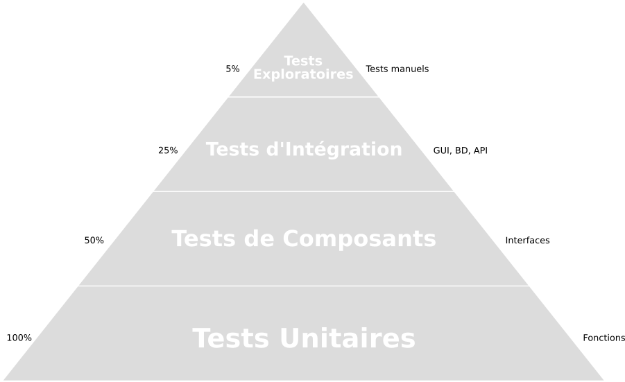

<!-- _class: title-section -->


# <!--fit--> Algorithmique Appliquée

##### BTS SIO SISR

## Tests, exceptions, assertions

<!--
Dans ce cours, on va aborder 2 points importants et complémentaires :
- Comment gérer les erreurs ?
- Comment vérifier que son code fonctionne comme spécifié ?
-->

---

<!-- _class: smaller-text -->

# Plan

- Gestion d'erreurs avec des codes de retour
- Notion d'exception
- Gestion d'exceptions et classes d'exception
- Programmation offensive et défensive
- Invariants
- Assertions
- Tests en boîte opaque
- Tests en boîte transparente
- Automatisation des tests
- Tests unitaires
- Tests pilotant le développement
- Pyramide de tests

---

<!-- _class: title-section -->

# <!--fit--> Gestion d'erreurs avec des codes de retour

---

# Sources d'erreurs (1/2)

* Première source d'erreur : **entrées utilisateur**.
    * Utilisateur **distrait**.
    * Utilisateur **malveillant**.

---

# Sources d'erreurs (2/2)

* Autres sources d'erreur :
    * Limites de l'ordinateur :
        * `int` $\ne \mathbb{Z}$.
        * `float` $\ne \mathbb{R}$.
        * Mémoire de la machine limitée.
        * Espace disque limité.
    * Pannes réseau.
    * Bug dans une bibliothèque utilisée.

---

# Problématiques

* Comment gérer efficacement les erreurs sans impacter les performances ni la clarté du code ?
* Quand doit-on gérer les erreurs ?
* Comment documenter les erreurs et informer de manière claire, accessible et complète ?

<!--
Nous allons voir différentes manières de gérer les erreurs, et revenir sur les principales philosophies de gestion des erreurs.
-->

---

### :warning: Mauvaise idée

```python
def divise(a, b):
    """Renvoie la division de a par b ou une erreur."""
    if b == 0:
        return "Erreur : division par 0"

    return a / b
```

:arrow_right: Pourquoi est-ce une mauvaise idée ?

<!--
C'est une mauvaise idée car le type de retour change en fonction du chemin d'exécution.
Cela signifie que lorsque l'on appelle cette fonction, on doit vérifier s'il s'agit d'une chaîne de caractères.
-->

---

### :warning: Mauvaise idée

```python
def divise(a, b):
    """Renvoie la division de a par b."""
    if b == 0:
        return float("inf")

    return a / b
```

:arrow_right: Pourquoi est-ce une mauvaise idée ?

<!--
Vous avez appris en mathématiques que l'infini ne se traite pas comme un nombre.
Vous avez notamment appris à manipuler les limites en "+ l'infini" et en "- l'infini".
Si on renvoie sans prévenir des nombres flottants particuliers comme l'infini, ou NaN (Not a Number), on s'éloigne complètement du domaine des nombres Réels.
Cela amène presque toujours à des bugs subtiles et difficiles à corriger.
Il vaut mieux ne jamais renvoyer explicitement l'infini ou NaN pour représenter une erreur.
-->

---

# :warning: Mauvaise idée

```python
def niveau_gris(rouge, vert, bleu):
    """Renvoie un niveau de gris à partir d'une couleur RVB.

    rouge, vert et bleu sont des entiers dans [0 ; 255].
    """
    if rouge < 0 or rouge > 255:
        return None
    if vert < 0 or vert > 255:
        return None
    if bleu < 0 or bleu > 255:
        return None

    return (rouge + vert + bleu) // 3
```

:arrow_right: Pourquoi est-ce une mauvaise idée ?

<!--
Encore une fois, le type de retour n'est pas uniforme, ce qui est généralement une mauvaise idée car c'est difficile à utiliser correctement.
Par ailleurs, on n'a aucune idée de l'origine du problème : il n'y a pas de distinction faite entre les différents problèmes possible.
Est-ce le rouge qui ne va pas ? Est-ce le bleu ?
-->

---

# :warning: Solution *partielle*

```python
def divise(a, b):
    """Renvoie la division de a par b et un statut."""
    if b == 0:
        return 0, False

    return a / b, True

resultat, succes = divise(15, 0)
if succes:
    print(resultat)
```

<!--
Dans ce cas, on conserve toujours le même type de retour, ce qui est une bonne chose.
Ici, il n'y a qu'une seule erreur possible, donc on peut se contenter de renvoyer un Booléen qui indique si l'opération est un succès.
-->

---

<!-- _class: smaller-text -->

## :warning: Solution *partielle*

```python
def niveau_gris(rouge, vert, bleu):
    """Renvoie un niveau de gris à partir d'une couleur RVB.

    rouge, vert et bleu sont des entiers dans [0 ; 255].
    """
    if rouge < 0 or rouge > 255:
        return 0, 1
    if vert < 0 or vert > 255:
        return 0, 2
    if bleu < 0 or bleu > 255:
        return 0, 3

    return (rouge + vert + bleu) // 3, 0

gris, statut = niveau_gris(255, 0, 0)
if statut == 0:
    print(f"ok : {gris}")
else:
    print(f"Erreur : l'argument n°{statut} n'est pas dans [0 ; 255]")
```

<!--
Dans cette solution, on conserve toujours le même type de retour.
On est également capable de distinguer les différents types d'erreur.
En revanche, cette solution n'est pas parfaite :
- Les types de retour "retour 0, 1" sont difficiles à lire.
- On n'a pas de message interne pour informer de l'erreur : l'interprétation se fait à l'extérieur.
-->

---

<!-- _class: smaller-text -->

# <!--fit--> Amélioration : quelques constantes

```python
SUCCES = 0
ERREUR_ROUGE = 1
ERREUR_VERT = 2
ERREUR_BLEU = 3

def niveau_gris(rouge, vert, bleu):
    """Renvoie un niveau de gris à partir d'une couleur RVB.

    rouge, vert et bleu sont des entiers dans [0 ; 255].
    """
    if rouge < 0 or rouge > 255:
        return 0, ERREUR_ROUGE
    if vert < 0 or vert > 255:
        return 0, ERREUR_VERT
    if bleu < 0 or bleu > 255:
        return 0, ERREUR_BLEU

    return (rouge + vert + bleu) // 3, SUCCES
```

<!--
Il reste des problèmes :
- Les constantes n'existent pas vraiment en Python. Donc il serait techniquement possible de réassigner SUCCES.
- Il n'y a toujours pas de message associé aux erreurs.
-->

---

<!-- _class: smaller-text -->

# <!--fit--> Amélioration : dictionnaire de messages

```python
SUCCES = 0
ERREUR_ROUGE = 1
ERREUR_VERT = 2
ERREUR_BLEU = 3

MESSAGES = {
    SUCCES : "OK",
    ERREUR_ROUGE : "Rouge à l'extérieur de l'intervalle [0 ; 255]",
    ERREUR_VERT : "Vert à l'extérieur de l'intervalle [0 ; 255]",
    ERREUR_BLEU : "Bleu à l'extérieur de l'intervalle [0 ; 255]"
}

def niveau_gris(rouge, vert, bleu):
    # [...]

gris, statut = niveau_gris(255, 0, 0)
if statut == 0:
    print(f"ok : {gris}")
else:
    print(f"Erreur : {MESSAGES[statut]}")
```

<!--
Nous allons voir un autre mécanisme plus adapté à la gestion des erreurs en Python.
Ce mécanisme n'existe pas dans tous les langages de programmation (par exemple, le langage de programmation C).
Par conséquent, l'approche vue dans ces dernières diapositives peut continuer à être utilisée avec ces langages.
-->

---

<!-- _class: title-section -->

# Notion d'exception

---

### Introduction aux exceptions

```python
liste = [0, 1, 2]
liste[3]
```

:arrow_down:

```
IndexError: list index out of range
```

<!--
Dans certains langages de programmation, comme le C++, les exceptions sont réservées aux cas exceptionnels.
En Python, les exceptions ne sont pas rares et on les trouve partout pour gérer les erreurs.
Ici, IndexError est un type d'exception levée par Python alors que l'on tente d'accéder à un élément en-dehors de l'intervalle.
-->

---

## Autre exemple

```python
resultat = 1 / 0
```

:arrow_down:

```
ZeroDivisionError: division by zero
```

---

### Quelques exceptions classiques

* `IndexError`
* `NameError`
* `TypeError`
* `ValueError`
* `ZeroDivisionError`

<!--
Ces exceptions surviennent lorsque le programme tente d'exécuter une expression dont la sémantique est erronée.
Dans de nombreux cas, il s'agit d'un bug dans le programme, et non d'une erreur qu'il faut gérer.
-->

---

## Bug ou erreur ?

* Une exception peut survenir à cause d'un bug dans le programme.
* Dans ce cas, il faut simplement corriger le code.
* Une exception peut survenir à cause d'une mauvaise entrée d'un utilisateur.
* Dans ce cas, le programme doit réagir de manière appropriée.

<!--
Si on demande un nombre strictement positif et que l'utilisateur rentre 0, que doit faire le programme ?
Il est nécessaire de spécifier puis d'implémenter le comportement approprié au cas d'usage.
-->

---

## Exception non gérée

* Jusqu'à présent, les exceptions ont été traitées comme événements terminaux.
* Lorsqu'une exception survient, le programme s'arrête.
* On parle dans ce cas d'**exception non gérée** (*unhandled exception* :uk:).

---

## Gestion des exceptions

* Lorsqu'une exception est **levée** (*raised* :uk:), il est possible de la **gérer**.
* Cela signifie : exécuter du code spécifique au lieu de terminer le programme.
* On dit que l'on **attrape** (*catch* :uk:) l'exception pour la traiter.

---

# Syntaxe


```python
try:
    # Bloc1 (bloc de code n°1)
except Erreur:
    # Bloc2
except (AutreErreur, PasDeBol):
    # Bloc3
except:
    # Bloc4
else:
    # Bloc5
finally:
    # Bloc6
```

---

### Retour sur la division

```python
def divise(a, b):
    return a / b

try:
    resultat = divise(15, 0)
except ZeroDivisionError:
    print("Error: division par zéro")
else:
    print(f"Le résultat est {resultat}")
```

<!--
On simplifie notre code puisque la division par zéro est déjà détectée.
La gestion d'erreur se fait ici de manière naturelle.
-->

---

### Arrêt du flot de contrôle

```python
def divise(a, b):
    return a / b

try:
    resultat = divise(15, 0)
    print(f"Le résultat est {resultat}")
except ZeroDivisionError:
    print("Error: division par zéro")
```

<!--
Ce code a exactement le même comportement que celui sur la diapositive précédente.
En effet, dès qu'une exception est levée, on sort immédiatement du bloc de code actuel pour aller dans le bloc de gestion de l'exception.
La différence est essentiellement stylistique :
- Le code sur cette diapositive sera mieux compris par des développeurs non habitués au Python, car cette syntaxe existe dans de nombreux langages de programmation.
- Le code sur la diapositive précédente plaira plus à des experts Python, car on rend plus visible ce qui peut émettre une exception.
Le choix se fera donc en fonction du contexte : si on est dans une équipe d'experts Python, on choisira plutôt la solution précédente.
-->

---

### Attraper les toutes :rabbit:

```python
def divise(a, b):
    return a / b

try:
    resultat = divise(15, 0)
    print(f"Le résultat est {resultat}")
except:
    print("Error: division par zéro")
```

<!--
En règle général, il vaut mieux être aussi spécifique que possible.
En effet, dans une base de code industrielle, les occasions d'attraper une exception sont nombreuses.
Si on attrape toutes les exceptions, il est possible que l'on en attrape trop.
NB: le lapin fait référence à Pikachu des Pokemon dont le motto est : attrapez les tous...
Ce lapin est naïf car il veut attraper toutes les exceptions d'un coup.
-->

---

# Finalement (1/2)

```python
def divise(a, b):
    return a / b

try:
    resultat = divise(15, 0)
except ZeroDivisionError:
    print("Error: division par zéro")
else:
    print(f"Le résultat est {resultat}")
finally:
    print("On passe ici")
```

:arrow_down:

```
Error: division par zéro
On passe ici
```

---

# Finalement (2/2)

```python
def divise(a, b):
    return a / b

try:
    resultat = divise(15, 1)
except ZeroDivisionError:
    print("Error: division par zéro")
else:
    print(f"Le résultat est {resultat}")
finally:
    print("On passe ici")
```

:arrow_down:

```
Le résultat est 15
On passe ici
```

---

<!-- _class: title-section -->

# <!--fit--> Gestion d'exceptions et classes d'exception

---

# Levée d'exception

* On est possible de **lever explicitement** des exceptions.
* Cela permet de stopper le flot de contrôle pour rentrer dans un mode de gestion d'erreur.
* La pile d'appels de fonction est déroulée (*unwind* :uk:) jusqu'à trouver un `except` adapté.

---

<!-- _class: smaller-text -->

## Retour sur le niveau de gris

```python
def niveau_gris(rouge, vert, bleu):
    """Renvoie un niveau de gris à partir d'une couleur RVB.

    rouge, vert et bleu sont des entiers dans [0 ; 255].
    """
    if rouge < 0 or rouge > 255:
        raise ValueError("Rouge en dehors de [0 ; 255]")
    if vert < 0 or vert > 255:
        raise ValueError("Vert en dehors de [0 ; 255]")
    if bleu < 0 or bleu > 255:
        raise ValueError("Bleu en dehors de [0 ; 255]")

    return (rouge + vert + bleu) // 3

try:
    gris = niveau_gris(255, -1, 0)
    print(gris)
except ValueError as erreur:
    print(erreur)
```

<!--
On a maintenant une solution élégante et performante pour gérer les différentes erreurs.
-->

---

<!-- _class: smaller-text -->

### <!--fit--> Déroulement de pile d'appels - stack unwinding :uk: (1/2)


```python
def f():
    print("Entrée dans f")
    raise ValueError("peu importe...")
    print("Sortie de f")

def g():
    print("Entrée dans g")
    f()
    print("Sortie de g")

def h():
    print("Entrée dans h")
    g()
    print("Sortie de h")
```

---

### <!--fit--> Déroulement de pile d'appels - stack unwinding :uk: (2/2)

```python
try:
    h()
except ValueError:
    print("Fin")
```

:arrow_down:

```
Entrée dans h
Entrée dans g
Entrée dans f
Fin
```

---

### Retourner une valeur depuis un `try`

```python
def lire_valeur(cast, message, erreur):
    valeur = input(f"{message} : ")
    try:
        return cast(valeur)
    except ValueError:
        print(f"{valeur} : {erreur}")

valeur = lire_valeur(int, "Entrer un entier", "n'est pas un entier")
print(valeur)
```

:arrow_down: si on entre `"chocolat"`

```
chocolat : n'est pas un entier
None
```

<!--
Cette fonction lit une valeur depuis l'entrée, puis tente de la caster en utilisant une fonction en entrée.
Si le cast échoue, il va lever une exception de type ValueError.
Dans ce cas, plutôt que d'exécuter le "return", le flot d'exécution passe dans le except.
Dans ce cas, il n'y a pas de "return" exécuté.
En Python, une fonction qui ne retourne rien retourne None. Donc en pratique, c'est None qui est retourné implicitement si une exception est levée.
-->

---

# Chaîner les exceptions

```python
def divise(a, b):
    try:
        return a / b
    except ZeroDivisionError as erreur:
        raise ValueError("Dénominateur nul") from erreur

divise(15, 0)
```

:arrow_down:

```
ZeroDivisionError: division by zero
The above exception was the direct cause of the following exception:
ValueError: Dénominateur nul
```

<!--
Lorsqu'on lève une nouvelle exception dans le contexte d'une exception précédente, c'est une bonne pratique de les chaîner afin que le contexte soit conservé.
On fait cela grâce à la syntaxe "from" au niveau de la levée de la nouvelle exception.
Cela permet d'aider au débogage lorsque des problèmes surviennent.
Loi de Murphy : des problèmes **vont** survenir !
-->

---

### Définir vos propres exceptions (1/3)

```python
class RougeErreur(Exception):
    pass

class VertErreur(Exception):
    pass

class BleuErreur(Exception):
    pass
```

<!--
En utilisant rigoureusement cette syntaxe, vous définissez vos propres exceptions.
En pratique, cette syntaxe signifie que l'on défini une nouvelle classe qui hérite de la classe Exception.
On hérite de toutes les propriétés de cette classe, et on en surcharge aucune, et on n'en défini par de nouvelle.
-->

---

### Définir vos propres exceptions (2/3)

```python
def niveau_gris(rouge, vert, bleu):
    """Renvoie un niveau de gris à partir d'une couleur RVB.

    rouge, vert et bleu sont des entiers dans [0 ; 255].
    """
    if rouge < 0 or rouge > 255:
        raise RougeErreur("Rouge en dehors de [0 ; 255]")
    if vert < 0 or vert > 255:
        raise VertErreur("Vert en dehors de [0 ; 255]")
    if bleu < 0 or bleu > 255:
        raise BleuErreur("Bleu en dehors de [0 ; 255]")

    return (rouge + vert + bleu) // 3
```

<!--
Définir ses propres exceptions est une bonne pratique lorsque l'on implémente une bibliothèque.
Par exemple, si on implémente une bibliothèque pour gérer des requêtes HTTP, on aura sans doute envie d'avoir une exception HTTPError.
Cela permet de distinguer les exceptions levées par votre bibliothèques des autres types d'exception.
C'est une généralisation du cas où l'on expliquait que ce n'est pas idéal d'attraper toutes les exceptions en même temps.
-->

---

### Définir vos propres exceptions (3/3)

```python
try:
    gris = niveau_gris(255, -1, 0)
except RougeErreur as e:
    print(f"Ecarlate : {e}")
except VertErreur as e:
    print(f"Trop vert : {e}")
except BleuErreur as e:
    print(f"Schtroumpf : {e}")
```

:arrow_down:

```
Trop vert : Vert en dehors de [0 ; 255]
```


---

<!-- _class: title-section -->

# Invariants

##### Préconditions et post-conditions

---

# Contrat d'une fonction

* Une fonction a un **contrat**.
* Ce contrat est un ensemble de :
    * **préconditions** : contraintes sur les valeurs d'entrée.
    * **invariants** : garantie sur les valeurs d'entrée.
    * **post-conditions** : contraintes sur les valeurs de sortie.

---

### Contrat de la fonction `racine_carree`

* **Préconditions** :
    - La variable `x` est un nombre flottant positif ou nul.
    - La variable `epsilon` est un nombre flottant strictement positif.
* **Invariants** : `x` et `epsilon` sont inchangés.
* **Post-conditions** : la valeur retournée est proche de la racine carrée de `x`, à plus ou moins `epsilon`.

---

### Attention à la sur-spécification

* On pourrait également préciser que `x` et `epsilon` doivent être différents de NAN (Not A Number) et de l'infinie.
* On pourrait également préciser que `x` et `epsilon` peuvent également être des entiers.
* Certaines choses sont implicites et n'ont pas besoin d'être spécifiées.
* C'est l'expérience qui dicte ce qui est explicite et implicite.
* Il vaut mieux commencer par être trop explicite et réduire progressivement.

---

<!-- _class: title-section -->

# <!--fit--> Programmation offensive et défensive

---

## Vérification des préconditions

- Il existe 2 approches :
    * Programmation **offensive** : les préconditions sont décrites en commentaires mais non vérifiées.
        - Avantages : performance et simplificité.
        - Inconvénients : robustesse.
    * Programmation **défensive** : les préconditions sont vérifiées et on renvoie une erreur si nécessaire.
        - Avantages : robustesse.
        - Inconvénients : lenteur et complexité.

---

# Division offensive

```python
def divise(a, b):
    """Divise a par b.

    a - nombre flottant.
    b - nombre flottant non nul.
    Retourne la division a / b.
    """
    return a / b
```

<!--
Aucune vérification n'est effectuée, mais les préconditions sont bien spécifiées : il s'agit donc de l'approche offensive.
-->

---

# Division défensive

```python
def divise(a, b, epsilon=0.000001):
    """Divise a par b.

    a - nombre flottant.
    b - nombre flottant non nul.
    epsilon - valeur autour de laquelle b est considérée nulle.
    Retourne la division a / b.
    """
    if abs(b) < epsilon:
        raise ValueError("b est trop proche de 0")

    return a / b
```

<!--
On évite le cas de la division par zéro en effectuant une vérification préalable : il s'agit de l'approche défensive.
-->

---

# Division défensive extrême

```python
def divise(a, b, epsilon=0.000001):
    """Divise a par b.

    a - nombre flottant.
    b - nombre flottant non nul.
    epsilon - valeur autour de laquelle b est considérée nulle.
    Retourne la division a / b si a et b sont corrects.
    """
    if type(a) != float and type(a) != int:
        raise TypeError("a n'est ni int, ni float")
    if type(b) != float and type(b) != int:
        raise TypeError("b n'est ni int, ni float")
    if abs(b) < epsilon:
        raise ValueError("b est trop proche de 0")

    return a / b
```

<!--
En plus d'empêcher la division par zéro, les types des entrées sont vérifiés dynamiquement.
Cette approche est rarement souhaitable car les performances d'exécution peuvent être impactées négativement.
Par ailleurs, le code devient plus difficile à lire et à comprendre.
-->

---

# Approche pragmatique

* Souvent, en Python, on privilégie l'**approche offensive** avec une bonne documentation.
* Dans d'autres langages de programmation, ou certains contextes industriels, d'autres approches peuvent être favorisées.
* Il faut **se renseigner** sur les bonnes pratiques dans votre environnement, et suivre ces bonnes pratiques.

---

<!-- _class: title-section -->

# Assertions

---

# Assert

* Une **assertion** permet de confirmer que l'état d'un calcul est celui attendu.
* On utilise pour cela le mot clé `assert`.
* Une expression Booléenne est attendue.
* Si cette expression vaut `True`, le programme continue son exécution.
* Dans le cas contraire, une exception `AssertionError` est levée.

---

# Exemple

```python
assert 3 % 2 == 0
print("3 est divisible par 2")
```

:arrow_down:

```
AssertionError
```

---

# Exemple

```python
assert 3 % 2 == 0, "Si 3 était divisible par 2, on le saurait"
print("3 est divisible par 2")
```

:arrow_down:

```
AssertionError: Si 3 était divisible par 2, on le saurait
```

<!--
Il est possible de rajouter un message d'erreur
-->

---

# Exemple

```python
assert 3 % 2 == 1
print("Le reste de la division de 3 par 2 est 1")
```

:arrow_down:

```
Le reste de la division de 3 par 2 est 1
```

<!--
Si l'expression est Vraie, le flot de contrôle continue.
-->

---

# Intérêts

* Les assertions peuvent être utilisés dans la **programmation défensive**.
* Elles peuvent également être utilisées dans le cadre de **tests unitaires**.

<!--
Les prochaines parties de ce cours vont introduire le concept de tests unitaires.
-->

---

<!-- _class: title-section -->

# TP : Exceptions dans une calculatrice

---


### TP : Exceptions dans une calculatrice

[**Lien** vers le sujet de TP](./tp-12-exceptions-calculatrice.html).

---

<!-- _class: title-section -->

# <!--fit--> Tests en boîte opaque

---

# Introduction

* **Albert Einstein** : "Aucune expérience ne peut jamais prouver que j'ai raison ; une seule expérience peut prouver que j'ai tort."
* **Edsger Dijkstra** : "Le test de programmes peut montrer la présence de bugs, mais ne peut jamais montrer leur absence."
* Les tests constituent un **filet de sécurité**.
* Les bugs peuvent malgré tout passer à travers les mailles du filet.

---

# Combinatoire

* Même le programme le plus simple a une **forte combinatoire**.
* Par exemple, si on doit écrire la fonction `min`, on a 2 entiers en entrée.
* On ne peut pas tester chaque combinaison de paires d'entiers.
* Cela représenterait $2^{64} \times 2^{64} = 2^{128} \approx 3.4 \cdot 10^{38}$ opérations environ.

---

# Stratégie de test

* Au mieux, on peut **tester quelques combinaisons** qui ont de fortes chances de produire une réponse fausse s'il y a un bug dans le programme.
* Cette collection d'entrées à tester s'appelle une **suite de tests**.

---

# Partitionnement

* On va partitionner l'espace de valeurs en sous-ensembles qui doivent produire des résultats similaires.

|        | a < 0                          | a == 0 | a > 0   |
|--------|--------------------------------|--------|---------|
| b < 0  | 3 tests (a < b, a == b, a > b) | Test 6 | Test 9  |
| b == 0 | Test 4                         | Test 7 | Test 10 |
| b > 0  | Test 5                         | Test 8 | 3 tests |

<!--
Ce partitionnement en 13 tests devrait permettre de découvrir de nombreux bugs dans la fonction min.
Mais pas forcément tous les bugs.
-->

---

# Contre-exemple

```python
def min(a, b):
    """Renvoie le minimum entre a et b.

    a - entier.
    b - entier.
    Renvoie a s'il est plus petit que b et b sinon.
    """
    if b == 424242: # bug ou backdoor
        return a
    return a if a < b else b
```

<!--
A moins de tester explicitement la valeur 424242, le partitionnement précédent a très peu de chances de découvrir le bug dans cette implémentation.
NB : une backdoor est un bug mis à dessein pour permettre à un groupe d'exploiter ce bug à leur profit.
-->

---

### Familles de stratégies

* **Boîte opaque** : tests effectués par des personnes ne connaissant pas l'implémentation du programme.
* **Boîte transparente** : tests effectués par les implémenteurs du programme.

---

## Equipe Qualité

* De nombreuses entreprises ont une **équipe Qualité** séparée de l'équipe de développement du logiciel.
* Cette équipe est **indépendante** de l'équipe de développement.
* L'objectif de cette équipe est de **trouver un maximum de bugs** avant que le logiciel arrive en production chez des clients.

<!--
Ces équipes peuvent également porter le nom d'équipe QA (pour Quality Assurance) ou VV (pour Vérification et Validation).
-->

---

## Vérification par des tiers

* Il est même possible de faire appel à des **entreprises tierces**.
* Ces entreprises indépendantes vont faire un **audit**.
* C'est notamment le cas dans le domaine de la cybersécurité.

---

# Intérêt (1/2)

* Les développeurs peuvent **mal comprendre** les spécifications.
* Les développeurs peuvent **reproduire un bug** dans leurs tests.
* Dans ce cas, le test réalisé par le développeur innocente son code de manière injustifiée.

<!--
Par exemple, un programme qui doit gérer une valeur qui ne doit pas être égale à 0.
Le développeur pourrait ne pas gérer du tout ce cas, et ne pas le tester.
Ainsi, le bug en 0 ne serait jamais vu par le développeur (avant qu'un client ne s'en aperçoive).
-->

---

# Intérêt (2/2)

* **Biais psychologique** :
    * Un développeur a intérêt à dire que son programme fonctionne dans tous les cas.
    * Un testeur a intérêt à montrer qu'il trouve des bugs dans le code du développeur.
* **Concurrence bénéfique** : cette concurrence entre développeur et testeur créé une émulation et booste les projets.

<!--
Le développeur doit respecter des délais de livraison et doit aller vite.
Le testeur est souvent tenu pour responsable si des bugs sont trouvés en production.
Cette concurrence bénéficie à la fois aux délais de livraison et à la qualité logicielle.
-->

---

# Processus

* Le testeur repart des **spécifications**.
* Le testeur établi les conditions d'usage classiques (fil rouge).
* Le testeur détermine les **conditions limites**.
* Le testeur créé un **plan de tests** qui comporte une suite de tests.
* Le testeur **exécute** régulièrement ce plan de tests.

<!--
Ce processus est largement manuel.
Il consomme donc un temps très important.
-->

---

<!-- _class: title-section -->

# <!--fit--> Tests en boîte transparente

---

# Bugs cachés dans le code

* Certains bugs sont cachés dans le code.
* Pour le trouver, il faut regarder le code.
* Avec la connaissance dece code, on sait que l'on doit tester la valeur 424242 :

```python
def min(a, b):
    if b == 424242:
        return a
    return a if a < b else b
```

---

## Chemins d'exécution

* On cherche à empreinter chaque **chemin d'exécution** possible.
* On souhaite passer dans chaque branche de chaque condition.
* On souhaite rentrer dans chaque exception.
* On souhaite rentrer dans chaque boucle.

---

## Cas des boucles `for`

* Il faut tester les cas où :
    * on ne rentre pas dans la boucle.
    * le corps de la boucle est exécuté une fois.
    * le corps de la boucle est exécuté plus d'une fois.
* Il faut passer dans tous les `break`, `continue`, `return`, `yield`, etc.

---

## Cas des boucles `while`

- Il faut tester les mêmes cas qu'une boucle `for`.
- Par ailleurs, il faut exercer toutes les conditions de fin de boucle.
- Dans cet exemple, les 3 conditions de fin doivent être testées indépendemment.

```python
while len(L) > 0 and (L[i] == "ok" or est_vrai):
    # [...]
```

---

### Cas des fonctions récursives

* Il faut tester les cas où :
    * il n'y a pas d'appel récursif.
    * il y a exactement un appel récursif.
    * il y a plus qu'un appel récursif.

---

## couverture de code

* La couverture de code est le pourcentage de lignes de code couvertes par les tests sur le nombre de lignes de code totales du programme.
* C'est un **indicateur** de la qualité logicielle.
* Une couverture supérieure à 80% est souhaitable.
* Une couverture à 100% est difficile et souvent trop coûteuse.

---

<!-- _class: title-section -->

# <!--fit--> Automatisation des tests

---

# Automatiser

* Le travail d'un informaticien est d'**automatiser** des tâches.
* Il est possible d'**automatiser les tests**.
* On écrit des programmes qui testent d'autres programmes.
* On les appelle des **programmes de tests**.

---

# Intérêt

* **Gagner du temps** en évitant de tester manuellement.
* **Eviter des régressions** pendant des phases de maintenance.
* Rejouer les tests dans **différents environnements** (ex : machine plus lente).
* Calculer des **indicateurs** automatiquement (ex : couverture de code).

---

# Fonctionnement

* L'environnement d'exécution se lance (via potentiellement de la virtualisation).
* Le programmes de test sont invoqués avec un jeu de données prédéfini et/ou généré aléatoirement.
* Le résultat des invocations est sauvegardé.
* L'acceptabilité des résultats est vérifié.
* Un rapport de test est généré.

---

# Pyramide de tests



<!--
La pyramide des tests présente les différents types de tests automatiques et leur positionnement.
Les plus importants, qui composent la base, sont les tests unitaires.
A chaque niveau, on trouve à gauche le pourcentage de couverture de code idéal.
A droite sont listés quelques entités testés à ce niveau.
Les tests de composants se font au niveau des interfaces des composants logiciels.
Les tests d'intégration automatisent des tâches avec l'interface utilisateur, la base de données, les APIs web, etc.
Les tests exploratoires se font manuellement. Les tests manuels ne devraient pas représenter plus de 5% de l'effort de test.
-->

---

---

<!-- _class: title-section -->

# Tests unitaires

---

# Tests unitaires

* Les tests unitaires sont **à la base** de la pyramide de tests.
* Ils sont également à la base de la stratégie d'automatisation des tests.

---

# Concept

* 1 test unitaire teste **1 fonction** et 1 seule.
* 1 fonction est couverte par **plusieurs tests unitaires**.

---

#### Effets de bord et composants externes

* Un test unitaire est **indépendant**.
* Un test unitaire est **pur** :
    * Il ne dépend pas de variable globale.
    * Il n'utilise pas le réseau.
    * Il n'utilise pas la base de données.
    * Il n'utilise pas de composant tier.

<!--
Lorsque l'on teste du code qui dépend du réseau ou d'une base de donnée ou d'un composant tier, on créé un Mock.
Un Mock est une fonction ou une classe qui a la même interface que le composant à remplacer.
Un Mock suit la philosophie du "Duck Typing" : si cela ressemble à un canard, c'est un canard et on peut l'utiliser là où on attend des canards.
Nous ne rentrerons pas dans les détails dans ce cours.
Retenez simplement que des outils existent pour conserver l'indépendance des tests unitaires.
-->

---

# AAA

* Un test unitaire suit les 3 étapes suivantes :
    * **Arrange** : initialise le test.
    * **Agit** (*act* :uk:) : appelle la fonction à tester.
    * **Affirme** (*assert* :uk:) : vérifie le résultat de la fonction.

---

### Exemple : tests unitaires pour la racine carrée

```python
def racine_carree(x, epsilon=0.000001):
    """Renvoie la racine carrée de x à epsilon près."""
    if x < 0:
        raise ValueError("x est négatif")

    s = x / 2
    while abs(s ** 2 - x) >= epsilon:
        P = s ** 2 - x
        P_prime = 2 * s
        s = s - P / P_prime

    return s
```

---

### Exemple : tests unitaires pour la racine carrée

```python
def test_racine_carree_25():
    # Arrange
    x = 25
    epsilon = 0.00001
    attendu = 5

    # Agit
    resultat = racine_carree(x, epsilon)

    # Affirme
    assert abs(resultat - attendu) <= epsilon
```

---

### Exemple : tests unitaires pour la racine carrée

```python
def test_racine_carree_25_grand_epsilon():
    # Arrange
    x = 25
    epsilon = 0.1
    attendu = 5

    # Agit
    resultat = racine_carree(x, epsilon)

    # Affirme
    assert abs(resultat - attendu) <= epsilon
```

---

### Exemple : tests unitaires pour la racine carrée

```python
def test_racine_carree_0():
    # Arrange
    x = 0
    epsilon = 0.00001
    attendu = 0

    # Agit
    resultat = racine_carree(x, epsilon)

    # Affirme
    assert abs(resultat - attendu) <= epsilon
```

---

### Exemple : tests unitaires pour la racine carrée

```python
def test_racine_carree_1():
    # Arrange
    x = 1
    epsilon = 0.00001
    attendu = 1

    # Agit
    resultat = racine_carree(x, epsilon)

    # Affirme
    assert abs(resultat - attendu) <= epsilon
```

---

### Exemple : tests unitaires pour la racine carrée

```python
def test_racine_carree_negatif():
    # Arrange
    x = -1
    exception_attrappee = False

    # Agit
    try:
        racine_carree(x)
    except:
        exception_attrappee = True

    # Affirme
    assert exception_attrappee
```

---

# Notes pratiques

* Pensez bien à écrire des tests unitaires **lors de l'examen**.
* Si vous n'avez plus le temps, écrivez au moins sur votre copie que des tests unitaires devraient être ajoutés.

---

<!-- _class: title-section -->

# <!--fit--> Tests pilotant le développement 

##### Test Driven Development :uk:

---

# TDD

* Le développement piloté par les tests (ou TDD pour Test-Driven Development) est une **méthodologie**.
* Cette méthodologie vise à **garantir** que tout le code est **couvert par des tests**.

<!--
Dans beaucoup d'entreprises, les tests automatiques sont malheureusement délaissés.
Le TDD est une méthodologie qui permet d'éviter de finir avec une base de code complexe et sans tests automatiques.
-->

---

# Principe

* Ecrire la déclaration de la fonction.
* Ecrire un test unitaire.
* Exécuter le test unitaire et vérifier qu'il échoue.
* Ecrire le minimum de code pour que ce test réussisse.
* Ecrire un test unitaire.
* Etc.

---

# Exemple de TDD avec la racine carrée

```python
def racine_carree(x, epsilon=0.000001):
    """Renvoie la racine carrée de x à epsilon près."""
    pass
```

---

# Exemple de TDD avec la racine carrée

```python
def test_racine_carree_25():
    # Arrange
    x = 25
    epsilon = 0.00001
    attendu = 5

    # Agit
    resultat = racine_carree(x, epsilon)

    # Affirme
    assert abs(resultat - attendu) <= epsilon
```

---

# Exemple de TDD avec la racine carrée

```python
def racine_carree(x, epsilon=0.000001):
    """Renvoie la racine carrée de x à epsilon près."""
    return 5
```

---

# Exemple de TDD avec la racine carrée

```python
def test_racine_carree_25_grand_epsilon():
    # Arrange
    x = 25
    epsilon = 0.1
    attendu = 5

    # Agit
    resultat = racine_carree(x, epsilon)

    # Affirme
    assert abs(resultat - attendu) <= epsilon
```

<!--
Cela fonction toujours !
-->

---

# Exemple de TDD avec la racine carrée

```python
def test_racine_carree_0():
    # Arrange
    x = 0
    epsilon = 0.00001
    attendu = 0

    # Agit
    resultat = racine_carree(x, epsilon)

    # Affirme
    assert abs(resultat - attendu) <= epsilon
```

---

# Exemple de TDD avec la racine carrée

```python
def racine_carree(x, epsilon=0.000001):
    """Renvoie la racine carrée de x à epsilon près."""
    return 5 if x == 25 else 0
```

---

# Exemple de TDD avec la racine carrée

```python
def test_racine_carree_1():
    # Arrange
    x = 1
    epsilon = 0.00001
    attendu = 1

    # Agit
    resultat = racine_carree(x, epsilon)

    # Affirme
    assert abs(resultat - attendu) <= epsilon
```

---

# Exemple de TDD avec la racine carrée

```python
def racine_carree(x, epsilon=0.000001):
    """Renvoie la racine carrée de x à epsilon près."""
    if x == 25:
        return 5
    elif x == 0:
        return 0
    elif x == 1:
        return 1
```

---

# Exemple de TDD avec la racine carrée

```python
def test_racine_carree_negatif():
    # Arrange
    x = -1
    exception_attrappee = False

    # Agit
    try:
        racine_carree(x)
    except:
        exception_attrappee = True

    # Affirme
    assert exception_attrappee
```

---

# Exemple de TDD avec la racine carrée

```python
def racine_carree(x, epsilon=0.000001):
    """Renvoie la racine carrée de x à epsilon près."""
    if x < 0:
        raise ValueError("x est négatif")
    elif x == 25:
        return 5
    elif x == 0:
        return 0
    elif x == 1:
        return 1
```

<!--
Cela ne calcule pas vraiment une racine carrée, mais cela passe les tests unitaires !
Cela montre aussi les limites des tests unitaires.
Il existe bien d'autres méthodologies :
- Acceptance Tests,
- Test Fuzzing,
- Etc.
Cela sort du cadre de ce cours.
-->

---

<!-- _class: title-section -->

# TP : Ecriture de tests unitaires

---

### TP : Ecriture de tests unitaires

[**Lien** vers le sujet de TP](./tp-13-tests-u.html).

---

<!-- _class: title-section -->

# Devoir à la Maison 04

---

### DM : Retour sur la complexité et les tests

[**Lien** vers le sujet de DM](./dm-04.html).
