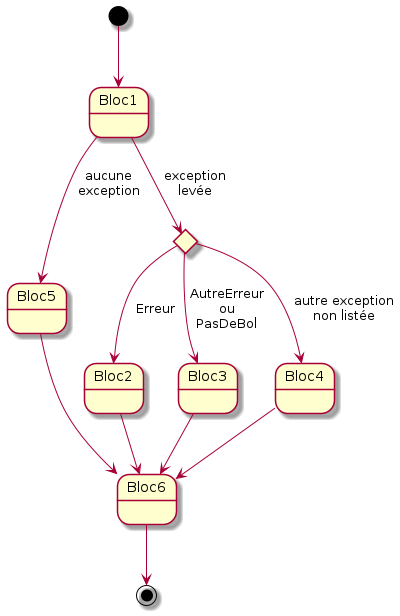
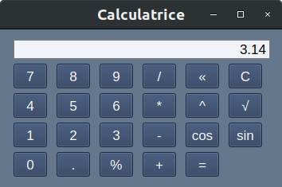

<!-- _class: title-section -->


# <!--fit--> Algorithmique Appliquée

##### BTS SIO SISR

## Tests, exceptions, assertions

<!--
Dans ce cours, on va aborder 2 points importants et complémentaires :
- Comment gérer les erreurs ?
- Comment vérifier que son code fonctionne comme spécifié ?
-->

---

<!-- _class: smaller-text -->

# Plan

- Gestion d'erreurs avec des codes de retour
- Notion d'exception
- Gestion d'exceptions et classes d'exception
- Programmation offensive et défensive
- Assertions
- Invariants
- Tests et qualité logicielle
- Tests en boîte transparente par les développeurs
- Automatisation des tests
- Tests unitaires
- Tests pilotant le développement
- Pyramide de tests

---

<!-- _class: title-section -->

# <!--fit--> Gestion d'erreurs avec des codes de retour

---

# Sources d'erreurs (1/2)

* Première source d'erreur : **entrées utilisateur**.
    * Utilisateur **distrait**.
    * Utilisateur **malveillant**.

---

# Sources d'erreurs (2/2)

* Autres sources d'erreur :
    * Limites de l'ordinateur :
        * `int` $\ne \mathbb{Z}$.
        * `float` $\ne \mathbb{R}$.
        * Mémoire de la machine limitée.
        * Espace disque limité.
    * Pannes réseau.
    * Bug dans une bibliothèque utilisée.

---

# Problématiques

* Comment gérer efficacement les erreurs sans impacter les performances ni la clarté du code ?
* Quand doit-on gérer les erreurs ?
* Comment documenter les erreurs et informer de manière claire, accessible et complète ?

<!--
Nous allons voir différentes manières de gérer les erreurs, et revenir sur les principales philosophies de gestion des erreurs.
-->

---

### :warning: Mauvaise idée

```python
def divise(a, b):
    """Renvoie la division de a par b ou une erreur."""
    if b == 0:
        return "Erreur : division par 0"

    return a / b
```

:arrow_right: Pourquoi est-ce une mauvaise idée ?

<!--
C'est une mauvaise idée car le type de retour change en fonction du chemin d'exécution.
Cela signifie que lorsque l'on appelle cette fonction, on doit vérifier s'il s'agit d'une chaîne de caractères.
-->

---

### :warning: Mauvaise idée

```python
def divise(a, b):
    """Renvoie la division de a par b."""
    if b == 0:
        return float("inf")

    return a / b
```

:arrow_right: Pourquoi est-ce une mauvaise idée ?

<!--
Vous avez appris en mathématiques que l'infini ne se traite pas comme un nombre.
Vous avez notamment appris à manipuler les limites en "+ l'infini" et en "- l'infini".
Si on renvoie sans prévenir des nombres flottants particuliers comme l'infini, ou NaN (Not a Number), on s'éloigne complètement du domaine des nombres Réels.
Cela amène presque toujours à des bugs subtiles et difficiles à corriger.
Il vaut mieux ne jamais renvoyer explicitement l'infini ou NaN pour représenter une erreur.
-->

---

# :warning: Mauvaise idée

```python
def niveau_gris(rouge, vert, bleu):
    """Renvoie un niveau de gris à partir d'une couleur RVB.

    rouge, vert et bleu sont des entiers dans [0 ; 255].
    """
    if rouge < 0 or rouge > 255:
        return None
    if vert < 0 or vert > 255:
        return None
    if bleu < 0 or bleu > 255:
        return None

    return (rouge + vert + bleu) // 3
```

:arrow_right: Pourquoi est-ce une mauvaise idée ?

<!--
Encore une fois, le type de retour n'est pas uniforme, ce qui est généralement une mauvaise idée car c'est difficile à utiliser correctement.
Par ailleurs, on n'a aucune idée de l'origine du problème : il n'y a pas de distinction faite entre les différents problèmes possible.
Est-ce le rouge qui ne va pas ? Est-ce le bleu ?
-->

---

# :warning: Solution *partielle*

```python
def divise(a, b):
    """Renvoie la division de a par b et un statut."""
    if b == 0:
        return 0, False

    return a / b, True

resultat, succes = divise(15, 0)
if succes:
    print(resultat)
```

<!--
Dans ce cas, on conserve toujours le même type de retour, ce qui est une bonne chose.
Ici, il n'y a qu'une seule erreur possible, donc on peut se contenter de renvoyer un Booléen qui indique si l'opération est un succès.
-->

---

<!-- _class: smaller-text -->

## :warning: Solution *partielle*

```python
def niveau_gris(rouge, vert, bleu):
    """Renvoie un niveau de gris à partir d'une couleur RVB.

    rouge, vert et bleu sont des entiers dans [0 ; 255].
    """
    if rouge < 0 or rouge > 255:
        return 0, 1
    if vert < 0 or vert > 255:
        return 0, 2
    if bleu < 0 or bleu > 255:
        return 0, 3

    return (rouge + vert + bleu) // 3, 0

gris, statut = niveau_gris(255, 0, 0)
if statut == 0:
    print(f"ok : {gris}")
else:
    print(f"Erreur : l'argument n°{statut} n'est pas dans [0..255]")
```

<!--
Dans cette solution, on conserve toujours le même type de retour.
On est également capable de distinguer les différents types d'erreur.
En revanche, cette solution n'est pas parfaite :
- Les types de retour "retour 0, 1" sont difficiles à lire.
- On n'a pas de message interne pour informer de l'erreur : l'interprétation se fait à l'extérieur.
-->

---

<!-- _class: smaller-text -->

# <!--fit--> Amélioration : quelques constantes

```python
SUCCES = 0
ERREUR_ROUGE = 1
ERREUR_VERT = 2
ERREUR_BLEU = 3

def niveau_gris(rouge, vert, bleu):
    """Renvoie un niveau de gris à partir d'une couleur RVB.

    rouge, vert et bleu sont des entiers dans [0 ; 255].
    """
    if rouge < 0 or rouge > 255:
        return 0, ERREUR_ROUGE
    if vert < 0 or vert > 255:
        return 0, ERREUR_VERT
    if bleu < 0 or bleu > 255:
        return 0, ERREUR_BLEU

    return (rouge + vert + bleu) // 3, SUCCES
```

<!--
Il reste des problèmes :
- Les constantes n'existent pas vraiment en Python. Donc il serait techniquement possible de réassigner SUCCES.
- Il n'y a toujours pas de message associé aux erreurs.
-->

---

<!-- _class: smaller-text -->

# <!--fit--> Amélioration : dictionnaire de messages

```python
SUCCES = 0
ERREUR_ROUGE = 1
ERREUR_VERT = 2
ERREUR_BLEU = 3

MESSAGES = {
    SUCCES : "OK",
    ERREUR_ROUGE : "Rouge à l'extérieur de l'interval [0..255]",
    ERREUR_VERT : "Vert à l'extérieur de l'interval [0..255]",
    ERREUR_BLEU : "Bleu à l'extérieur de l'interval [0..255]"
}

def niveau_gris(rouge, vert, bleu):
    # [...]

gris, statut = niveau_gris(255, 0, 0)
if statut == 0:
    print(f"ok : {gris}")
else:
    print(f"Erreur : {MESSAGES[statut]}")
```

<!--
Nous allons voir un autre mécanisme plus adapté à la gestion des erreurs en Python.
Ce mécanisme n'existe pas dans tous les langages de programmation (par exemple, le langage de programmation C).
Par conséquent, l'approche vue dans ces dernières diapositives peut continuer à être utilisée avec ces langages.
-->

---

<!-- _class: title-section -->

# Notion d'exception

---

### Introduction aux exceptions

```python
liste = [0, 1, 2]
liste[3]
```

:arrow_down:

```
IndexError: list index out of range
```

<!--
Dans certains langages de programmation, comme le C++, les exceptions sont réservées aux cas exceptionnels.
En Python, les exceptions ne sont pas rares et on les trouve partout pour gérer les erreurs.
Ici, IndexError est un type d'exception levée par Python alors que l'on tente d'accéder à un élément en-dehors de l'interval.
-->

---

## Autre exemple

```python
resultat = 1 / 0
```

:arrow_down:

```
ZeroDivisionError: division by zero
```

---

### Quelques exceptions classiques

* `IndexError`
* `NameError`
* `TypeError`
* `ValueError`
* `ZeroDivisionError`

<!--
Ces exceptions surviennent lorsque le programme tente d'exécuter une expression dont la sémantique est erronée.
Dans de nombreux cas, il s'agit d'un bug dans le programme, et non d'une erreur qu'il faut gérer.
-->

---

## Bug ou erreur ?

* Une exception peut survenir à cause d'un bug dans le programme.
* Dans ce cas, il faut simplement corriger le code.
* Une exception peut survenir à cause d'une mauvaise entrée d'un utilisateur.
* Dans ce cas, le programme doit réagir de manière appropriée.

<!--
Si on demande un nombre strictement positif et que l'utilisateur rentre 0, que doit faire le programme ?
Il est nécessaire de spécifier puis d'implémenter le comportement approprié au cas d'usage.
-->

---

## Exception non gérée

* Jusqu'à présent, les exceptions ont été traitées comme événements terminaux.
* Lorsqu'une exception survient, le programme s'arrête.
* On parle dans ce cas d'**exception non gérée** (*unhandled exception* :uk:).

---

## Gestion des exceptions

* Lorsqu'une exception est **levée** (*raised* :uk:), il est possible de la **gérer**.
* Cela signifie : exécuter du code spécifique au lieu de terminer le programme.
* On dit que l'on **attrape** (*catch* :uk:) l'exception pour la traiter.

---

# Syntaxe



```python
try:
    # Bloc1 (bloc de code n°1)
except Erreur:
    # Bloc2
except (AutreErreur, PasDeBol):
    # Bloc3
except:
    # Bloc4
else:
    # Bloc5
finally:
    # Bloc6
```

---

### Retour sur la division

```python
def divise(a, b):
    return a / b

try:
    resultat = divise(15, 0)
except ZeroDivisionError:
    print("Error: division par zéro")
else:
    print(f"Le résultat est {resultat}")
```

<!--
On simplifie notre code puisque la division par zéro est déjà détectée.
La gestion d'erreur se fait ici de manière naturelle.
-->

---

### Arrêt du flot de contrôle

```python
def divise(a, b):
    return a / b

try:
    resultat = divise(15, 0)
    print(f"Le résultat est {resultat}")
except ZeroDivisionError:
    print("Error: division par zéro")
```

<!--
Ce code a exactement le même comportement que celui sur la diapositive précédente.
En effet, dès qu'une exception est levée, on sort immédiatement du bloc de code actuel pour aller dans le bloc de gestion de l'exception.
La différence est essentiellement stylistique :
- Le code sur cette diapositive sera mieux compris par des développeurs non habitués au Python, car cette syntaxe existe dans de nombreux langages de programmation.
- Le code sur la diapositive précédente plaira plus à des experts Python, car on rend plus visible ce qui peut émettre une exception.
Le choix se fera donc en fonction du contexte : si on est dans une équipe d'experts Python, on choisira plutôt la solution précédente.
-->

---

### Attraper les toutes :rabbit:

```python
def divise(a, b):
    return a / b

try:
    resultat = divise(15, 0)
    print(f"Le résultat est {resultat}")
except:
    print("Error: division par zéro")
```

<!--
En règle général, il vaut mieux être aussi spécifique que possible.
En effet, dans une base de code industrielle, les occasions d'attraper une exception sont nombreuses.
Si on attrape toutes les exceptions, il est possible que l'on en attrape trop.
NB: le lapin fait référence à Pikachu des Pokemon dont le motto est : attrapez les tous...
Ce lapin est naïf car il veut attraper toutes les exceptions d'un coup.
-->

---

# Finalement (1/2)

```python
def divise(a, b):
    return a / b

try:
    resultat = divise(15, 0)
except ZeroDivisionError:
    print("Error: division par zéro")
else:
    print(f"Le résultat est {resultat}")
finally:
    print("On passe ici")
```

:arrow_down:

```
Error: division par zéro
On passe ici
```

---

# Finalement (2/2)

```python
def divise(a, b):
    return a / b

try:
    resultat = divise(15, 1)
except ZeroDivisionError:
    print("Error: division par zéro")
else:
    print(f"Le résultat est {resultat}")
finally:
    print("On passe ici")
```

:arrow_down:

```
Le résultat est 15
On passe ici
```

---

<!-- _class: title-section -->

# <!--fit--> Gestion d'exceptions et classes d'exception

---

# Levée d'exception

* On est possible de **lever explicitement** des exceptions.
* Cela permet de stopper le flot de contrôle pour rentrer dans un mode de gestion d'erreur.
* La pile d'appels de fonction est déroulée (*unwind* :uk:) jusqu'à trouver un `except` adapté.

---

<!-- _class: smaller-text -->

## Retour sur le niveau de gris

```python
def niveau_gris(rouge, vert, bleu):
    """Renvoie un niveau de gris à partir d'une couleur RVB.

    rouge, vert et bleu sont des entiers dans [0 ; 255].
    """
    if rouge < 0 or rouge > 255:
        raise ValueError("Rouge en dehors de [0..255]")
    if vert < 0 or vert > 255:
        raise ValueError("Vert en dehors de [0..255]")
    if bleu < 0 or bleu > 255:
        raise ValueError("Bleu en dehors de [0..255]")

    return (rouge + vert + bleu) // 3

try:
    gris = niveau_gris(255, -1, 0)
    print(gris)
except ValueError as erreur:
    print(erreur)
```

<!--
On a maintenant une solution élégante et performante pour gérer les différentes erreurs.
-->

---

<!-- _class: title-section -->

# Invariants

##### Préconditions et post-conditions

---

# Contrat d'une fonction

* Une fonction a un **contrat**.
* Ce contrat est un ensemble de :
    * **préconditions** : contraintes sur les valeurs d'entrée.
    * **invariants** : garantie sur les valeurs d'entrée.
    * **post-conditions** : contraintes sur les valeurs de sortie.

---

### Contrat de la fonction `racine_carree`

* **Préconditions** :
    - La variable `x` est un nombre flottant positif ou nul.
    - La variable `epsilon` est un nombre flottant strictement positif.
* **Invariants** : `x` et `epsilon` sont inchangés.
* **Post-conditions** : la valeur retournée est proche de la racine carrée de `x`, à plus ou moins `epsilon`.

---

### Attention à la sur-spécification

* On pourrait également préciser que `x` et `epsilon` doivent être différents de NAN (Not A Number) et de l'infinie.
* On pourrait également préciser que `x` et `epsilon` peuvent également être des entiers.
* Certaines choses sont implicites et n'ont pas besoin d'être spécifiées.
* C'est l'expérience qui dicte ce qui est explicite et implicite.
* Il vaut mieux commencer par être trop explicite et réduire progressivement.

---

<!-- _class: title-section -->

# <!--fit--> Programmation offensive et défensive

---

## Vérification des préconditions

- Il existe 2 approches :
    * Programmation **offensive** : les préconditions sont décrites en commentaires mais non vérifiées.
        - Avantages : performance et simplificité.
        - Inconvénients : robustesse.
    * Programmation **défensive** : les préconditions sont vérifiées et on renvoie une erreur si nécessaire.
        - Avantages : robustesse.
        - Inconvénients : lenteur et complexité.

---

# Division offensive

```python
def divise(a, b):
    """Divise a par b.

    a - nombre flottant.
    b - nombre flottant non nul.
    Retourne la division a / b.
    """
    return a / b
```

<!--
Aucune vérification n'est effectuée, mais les préconditions sont bien spécifiées : il s'agit donc de l'approche offensive.
-->

---

# Division défensive

```python
def divise(a, b, epsilon=0.000001):
    """Divise a par b.

    a - nombre flottant.
    b - nombre flottant non nul.
    epsilon - valeur autour de laquelle b est considérée nulle.
    Retourne la division a / b.
    """
    if abs(b) < epsilon:
        raise ValueError("b est trop proche de 0")

    return a / b
```

<!--
On évite le cas de la division par zéro en effectuant une vérification préalable : il s'agit de l'approche défensive.
-->

---

# Division défensive extrême

```python
def divise(a, b, epsilon=0.000001):
    """Divise a par b.

    a - nombre flottant.
    b - nombre flottant non nul.
    epsilon - valeur autour de laquelle b est considérée nulle.
    Retourne la division a / b si a et b sont corrects.
    """
    if type(a) != float and type(a) != int:
        raise TypeError("a n'est ni int, ni float")
    if type(b) != float and type(b) != int:
        raise TypeError("b n'est ni int, ni float")
    if abs(b) < epsilon:
        raise ValueError("b est trop proche de 0")

    return a / b
```

<!--
En plus d'empêcher la division par zéro, les types des entrées sont vérifiés dynamiquement.
Cette approche est rarement souhaitable car les performances d'exécution peuvent être impactées négativement.
Par ailleurs, le code devient plus difficile à lire et à comprendre.
-->

---

# Approche pragmatique

* Souvent, en Python, on privilégie l'**approche offensive** avec une bonne documentation.
* Dans d'autres langages de programmation, ou certains contextes industriels, d'autres approches peuvent être favorisées.
* Il faut **se renseigner** sur les bonnes pratiques dans votre environnement, et suivre ces bonnes pratiques.

---

<!-- _class: title-section -->

# Assertions

---

<!-- _class: title-section -->

# TP : Exceptions dans une calculatrice

---



### TP : Exceptions dans une calculatrice

[**Lien** vers le sujet de TP](./tp-12-exceptions-calculatrice.html).

---

<!-- _class: title-section -->

# <!--fit--> Tests et qualité logicielle

##### Boîte opaque et équipe QA

---

<!-- _class: title-section -->

# <!--fit--> Tests en boîte transparente

##### Par les développeurs

---

<!-- _class: title-section -->

# <!--fit--> Automatisation des tests

---

<!-- _class: title-section -->

# Tests unitaires

---

<!-- _class: title-section -->

# <!--fit--> Tests pilotant le développement 

##### Test Driven Development

---

<!-- _class: title-section -->

# <!--fit--> Pyramide de tests

---

<!-- _class: title-section -->

# TP : Ecriture de tests unitaires

---

### TP : Ecriture de tests unitaires

[**Lien** vers le sujet de TP](./tp-13-tests-u.html).

---

<!-- _class: title-section -->

# Devoir à la Maison 04

---

### DM : Retour sur la complexité et les tests

[**Lien** vers le sujet de DM](./dm-04.html).
