<!-- _class: title-title -->

# <!--fit--> Algorithmique Appliquée

##### BTS SIO SISR

### Algorithmes de recherche et de tri

---

# Plan

- Algorithmiques classiques
- Recherche en Python
- Recherche linéaire
- Recherche binaire
- Tri en Python
- Algorithmes de tri en $O(N^2)$
- Partition
- Tri Rapide
- Tri Fusion

---

<!-- _class: title-header -->

# <!--fit--> Correction du travail à la maison

---

### DM : Retour sur la complexité et les tests

[**Lien** vers le sujet de DM](../08-tests/dm-04.html).

---

<!-- _class: title-header -->

### Retour sur les classes de problèmes usuelles en algorithmique

---

### Familles d'algorithmes classiques

| Famille d'algorithmes | Exemple de problème              | Exemple d'algorithme |
|-----------------------|----------------------------------|----------------------|
| Recherche             | Trouver un nombre dans une liste | Recherche binaire    |
| Tri                   | Trier une liste                  | Tri Fusion           |
| Graphes               | Trouver le plus court chemin     | Bellman-Ford         |
| Chaînes de caractères | Trouver une sous-chaîne          | Boyer-Moore          |

<!--
Tout bon livre ou cours d'algorithmique se doit d'aborder ces algorithmes fondamentaux.
Les chaînes de caractères sont un cas particulier.
On manipule tellement de chaînes de caractères que des algorithmes dédiés existent.
Nous avons vu un exemple en TP concernant le tri de chaînes de caractères.
-->

---

# Intérêt

* De nombreux problèmes peuvent se décomposer en **sous-problèmes**.
* Ces sous-problèmes se ramènent souvent à ceux **résolus par les algorithmes classiques**.

---

# Exemples d'autres problèmes

* Optimisation :
    * Graphes, Tri, Recherche.
* Décision :
    * Graphes, Tri, Recherche.
* Classification :
    * Graphes, Tri, Recherche.
* Résolution d'équations (solver :uk:)

<!--
Comme indiqué, de nombreux problèmes peuvent se décomposer en d'autres familles de problèmes pour lesquels des algorithmes efficaces sont connus.
Les algorithmes de résolutions d'équation appartiennent à une autre famille.
Lors d'un cours précédent, nous avons abordé l'algorithme de l'élimination de Gauss-Jordan, qui est un exemple classique dans cette famille.
-->

---

<!-- _class: title-header -->

# <!--fit--> Recherche en Python

---

# Opérateur `in`

```python
L = [1, 4, 8, 62]
if 4 in L:
    print("On a trouvé 4")
```

:arrow_down:

```
On a trouvé 4
```

<!--
Par conséquent, rechercher un élément dans une liste est très simple en Python.
-->

---

### Egalement pour les `set` et `tuple`

```python
S = {1, 4, 8, 62}
if 4 in S:
    print("On a trouvé 4")

T = (1, 4, 8, 62)
if 4 in T:
    print("On a trouvé 4")
```

:arrow_down:

```
On a trouvé 4
On a trouvé 4
```

<!--
Le même opérateur in peut être utilisé sur d'autres types de collections.
-->

---

### Chaînes de caractères

```python
Ch = "1, 4, 8, 62"
if "4" in Ch:
    print("On a trouvé 4")
```

:arrow_down:

```
On a trouvé 4
```

<!--
Cela fonctionne aussi avec les chaînes de caractères.
-->

---

## Dictionnaires

```python
D = {"un": 1, "quatre": 4, "huit": 8, "soixante deux": 62}
if "quatre" in D:
    print("On a trouvé quatre")

if 4 in D.values():
    print("On a trouvé 4")
```

:arrow_down:

```
On a trouvé quatre
On a trouvé 4
```

<!--
Pour les dictionnaires, on peut rechercher soit par clé, soit par valeur.
-->

---

## Valeur par défaut

```python
resultat = D.get("trois", -1)
print(resultat)
```

:arrow_down:

```
-1
```

<!--
Lorsque l'on travaille avec des dictionnaires, il n'est pas rare que l'on souhaite obtenir la valeur d'un clé, si elle existe, et une valeur par défaut, sinon.
La méthode get rempli ce rôle.
-->

---

<!-- _class: title-header -->

# <!--fit--> Recherche linéaire

---

# Implémentation itérative

```python
def recherche_lineaire(collection, cle):
    for i in range(len(collection)):
        if collection[i] == cle:
            return i
    return -1
```

<!--
Vous avez déjà implémenté cet algorithme.
En pratique, utilisez plutôt l'opérateur in en Python.
Cet algorithme peut être utile si vous implémentez vos propres structures de données.
-->

---

# Preuve d'algorithme

### Preuve triviale

* On parcourt chaque élément de la collection une unique fois, donc l'algorithme s'arrête quand chaque élément est traité.
* Chaque élément est comparé à la clé.
* Donc si un élément est égal à la clé, il sera trouvé.

---

# Complexité

* $O(N)$ : on parcourt chaque élément une fois.
* $\Omega(1)$ : si le 1er élément est égal à la clé, l'algorithme s'arrête immédiatement.

<!--
Rappelez-vous que c'est le Grand O le plus important.
Le Grand Oméga est donné à titre indicatif ici.
-->

---

# Implémentation récursive

```python
def recherche_lineaire(collection, cle):
    def recherche_lineaire_impl(collection, cle, index):
        if index == len(collection):
            return -1
        if collection[index] == cle:
            return index
        return recherche_lineaire_impl(collection, cle, index + 1)
    
    return recherche_lineaire_impl(collection, cle, 0)
```

<!--
Utilisez plutôt la version itérative de l'algorithme.
-->

---

### Preuve de la version récursive

* L'index est incrémenté à chaque récursion.
* La récursion s'arrête lorsque l'index est égal à la taille de la collection.
* A chaque récursion, on teste l'élément à l'index actuel.
* La récursion s'arrête si l'élément à l'index actuel est égal à la clé.
* On parcourt donc chaque élémént une fois et le reste est identique à la version itérative.

---

<!-- _class: title-header -->

# <!--fit--> Recherche binaire

##### Binary search :uk:

---

# Implémentation itérative

```python
def recherche_binaire(collection, cle):
    debut = 0
    fin = len(collection) - 1

    while debut <= fin:
        milieu = debut + (fin - debut) // 2
        actuel = collection[milieu]

        if cle < actuel:
            fin = milieu - 1
        elif cle > actuel:
            debut = milieu + 1
        else:
            return milieu

    return -1
```

<!--
C'est identique à une dichotomie.
-->

---

# Illustration de l'exécution

##### Recherche du chiffre 9

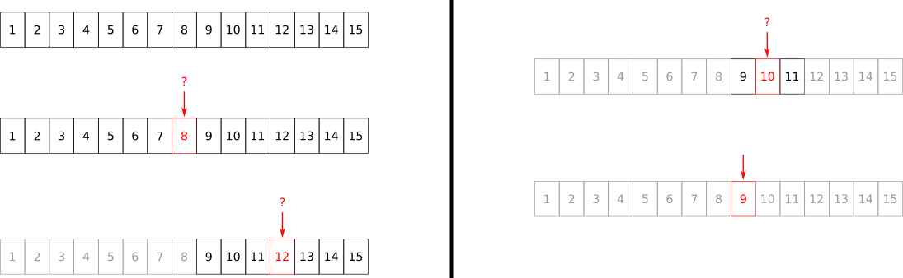

<!--
Le principe est encore mieux visible sous forme d'arbre.
-->

---


# <!--fit--> Exécution sous forme d'arbre (1/4)

##### Recherche du chiffre 9

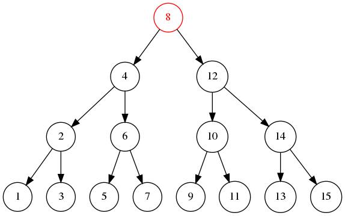

---

# <!--fit--> Exécution sous forme d'arbre (2/4)

##### Recherche du chiffre 9

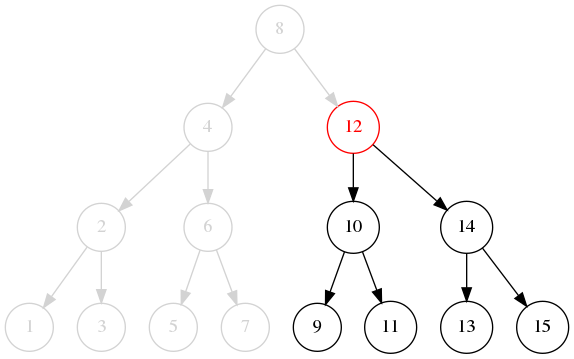

---

# <!--fit--> Exécution sous forme d'arbre (3/4)

##### Recherche du chiffre 9

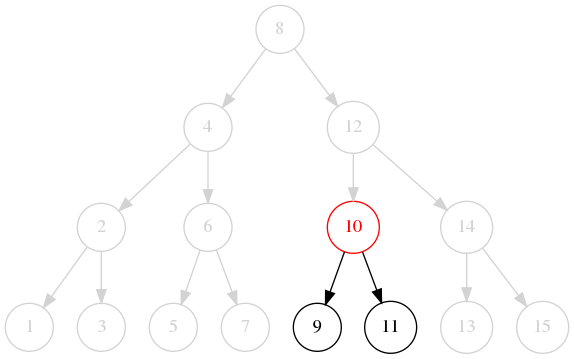

---

# <!--fit--> Exécution sous forme d'arbre (4/4)

##### Recherche du chiffre 9

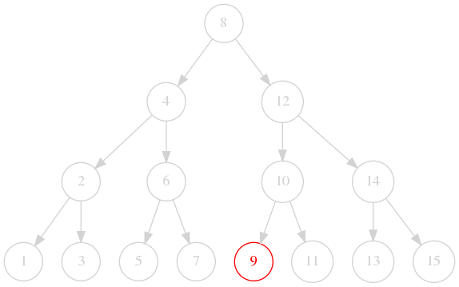

---

## Preuve d'algorithme

* A chaque itération :
    * Soit on trouve la clé et l'algorithme s'arrête.
    * Soit l'intervalle de recherche est réduit de moitié et converge vers la clé car la collection est triée :
        * Soit la borne de fin va au milieu,
        * Soit la borne de début va au milieu.

---

# Complexité

* $O(\log N)$ : on parcourt chaque étage de l'arbre binaire une fois au maximum.
* $\Omega(1)$ : si l'élément du milieu est égal à la clé, l'algorithme s'arrête immédiatement.

<!--
On va prouver la complexité en 0(log N) en établissant le rapport entre la profondeur de l'arbre et le nombre maximal de noeud dans cet arbre.
-->

---

## Profondeur de l'arbre (1/6)

* A la racine de l'arbre (profondeur $p = 1$), on a un seul noeud.
* A chaque niveau, on multiplie le nombre de noeuds par 2.
* A un niveau donné, on a donc $2^{p-1}$ noeuds.

<!--
Le tableau sur la diapositive suivante illustre cette relation.
-->

---

## Profondeur de l'arbre (2/6)

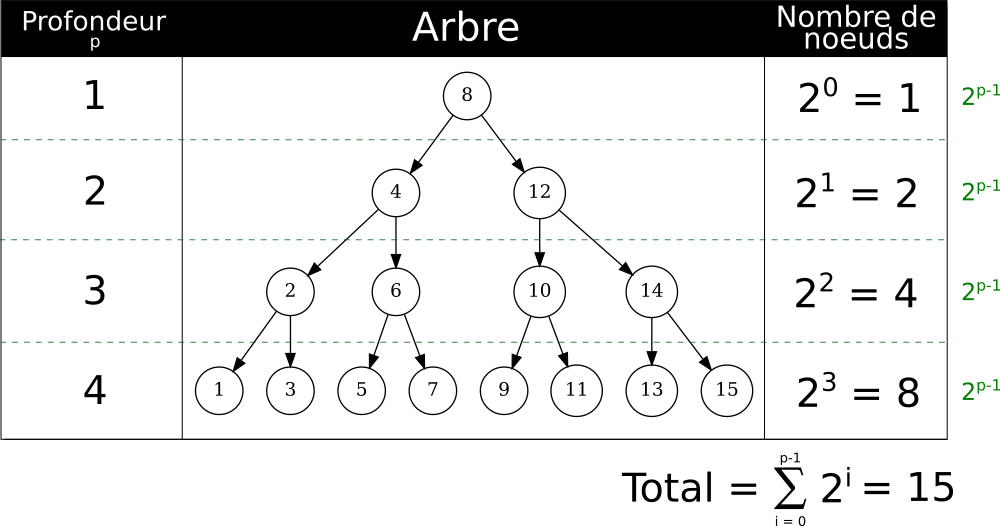


---

## Profondeur de l'arbre (3/6)

Donc le nombre total maximal de noeuds $N$ est relié à la profondeur $p$ :

$$
N = \sum_{i = 0}^{p - 1} 2^i
$$

<!--
A noter qu'il s'agit là d'une valeur maximale puisque le nombre de valeurs dans l'espace de recherche n'est pas nécessairement une puissance de 2.
Il nous reste à exprimer p en fonction de N.
-->

---

## Profondeur de l'arbre (4/6)

##### Un peu d'arithmétique

$$
\begin{align*}
    2^p &= 2^p \times 1 \\
        &= 2^p \times (2 - 1) \\
        &= 2^{p + 1} - 2^{p}
\end{align*}
$$

<!--
On va utiliser cette astuce pour simplifier la somme de la diapositive précédente.
-->

---

## Profondeur de l'arbre (5/6)

##### Application à la somme des profondeurs

$$
\begin{align*}
N = \sum_{i = 0}^{p - 1} 2^i &= 2^{p-1} + 2^{p-2} + \cdots + 2^0 \\
                             &= (2^{p} - 2^{p-1}) + (2^{p-1} - 2^{p-2}) + \cdots + (2^2 - 2^1) + (2^1 - 2^0) \\
                             &= 2^{p} + (- 2^{p-1} + 2^{p-1}) + \cdots + (- 2^1 + 2^1) - 2^0 \\
                             &= 2^{p} - 2^0 \\
                             &= 2^{p} - 1
\end{align*}
$$

<!--
A la 2e ligne, on applique simplement la relation trouvée sur la diapositive précédente.
Puis on élimine chaque composante 2 à 2.
Il nous reste au final N = 2^p - 1.
-->

---

## Profondeur de l'arbre (6/6)

##### Retour sur le logarithme

$$
\begin{align*}
2^p - 1 &= N \\
2^p &= N + 1 \\
\log_2(2^p) &= \log_2(N + 1) \\
p\log_2(2) &= \log_2(N + 1) \\
p &= \log_2(N + 1)
\end{align*}
$$

<!--
On exprime donc la profondeur de l'arbre en fonction du logarithme du nombre maximal de noeud dans l'arbre binaire.
-->

---

## Preuve de la complexité

$$
\begin{align*}
O(p) &= O(\log_2(N + 1)) \\
     &= O(\log(N))
\end{align*}
$$

On avait vu que la complexité de la recherche binaire était proportionnelle à la profondeur $p$ de l'arbre, c'est-à-dire $O(p)$ soit $O(\log N)$.

<!--
Comprendre cette preuve est importante car on peut souvent la réutiliser pour des algorithmes logarithmiques ou linéarithmiques.
-->

---

<!-- _class: smaller-text -->

# Implémentation récursive

```python
def recherche_binaire(collection, cle):
    def recherche_binaire_impl(collection, cle, debut, fin):
        if fin < debut:
            return -1

        milieu = debut + (fin - debut) // 2
        actuel = collection[milieu]

        if cle < actuel:
            return recherche_binaire_impl(collection, cle, debut, milieu - 1)
        elif cle > actuel:
            return recherche_binaire_impl(collection, cle, milieu + 1, fin)
        else:
            return milieu

    debut = 0
    fin = len(collection) - 1       

    return recherche_binaire_impl(collection, cle, debut, fin)
```

<!--
Attention, il s'agit de code qui doit tenir sur une diapositive de cours.
Dans un contexte industriel, il vaudrait mieux avoir 2 fonctions séparées et correctement documentées.
-->

---

## Relation de récurrence

* Une autre manière de prouver la complexité serait d'utiliser une **relation de récurrence**.
* On pose que le nombre maximal de comparaisons $C$ pour $N = 1$ est $C(1) = 1$.
* On établi alors que $C(N) = 1 + C(\frac{N}{2})$.
* La résolution de la relation de récurrence donne également $O(\log_2(N))$.

<!--
Les détails concernant la relation de récurrence sont considérés comme trop avancés pour ce cours.
Retenez simplement qu'elle existe et offre une base mathématiques pour prouver la complexité d'algorithmes qui peuvent être exprimés de manière récursive.
-->

---

<!-- _class: title-header -->

# TP : Recherche dans une collection

---

### TP : Recherche dans une collection

[**Lien** vers le sujet de TP](./tp-14-recherche.html).

---

<!-- _class: title-header -->

# Tri en Python

---


# Tri interne

##### In-place sort :uk:

```python
L = [6, 2, 5, 1, 9, 3, 8, 7, 4]
L.sort()
print(L)
```

:arrow_down:

```
[1, 2, 3, 4, 5, 6, 7, 8, 9]
```

<!--
Le tri "in-place" modifie la liste originale.
-->

---

## Renvoie une liste triée

```python
L1 = [6, 2, 5, 1, 9, 3, 8, 7, 4]
L2 = sorted(L1)
print(f"L1 = {L1}")
print(f"L2 = {L2}")
```

:arrow_down:

```
L1 = [6, 2, 5, 1, 9, 3, 8, 7, 4]
L2 = [1, 2, 3, 4, 5, 6, 7, 8, 9]
```

<!--
Le tri "in-place" est moins coûteux car il économise la copie.
-->

---

# Cas des tuples

```python
T = (6, 2, 5, 1, 9, 3, 8, 7, 4)
T2 = sorted(T)
print(T2)
```

:arrow_down:

```
[1, 2, 3, 4, 5, 6, 7, 8, 9]
```

<!--
Un tuple est immutable.
Par conséquent, on ne peut pas lui appliquer un tri "in-place".
La fonction globale sorted renvoie toujours une liste.
En pratique, la fonction sorted prend en entrée un itérable.
-->

---

# Cas des sets

```python
S = {6, 2, 5, 1, 9, 3, 8, 7, 4}
S2 = sorted(S)
print(S2)
```

:arrow_down:

```
[1, 2, 3, 4, 5, 6, 7, 8, 9]
```

<!--
Un set n'est pas ordonné pas définition.
Par contre, un set est itérable.
Par conséquent, on peut utiliser un set en entrée de sorted pour obtenir une liste triée.
-->

---

### Cas des chaînes de caractères (1/2)

```python
Ch = "6, 2, 5, 1, 9, 3, 8, 7, 4"
Ch2 = sorted(Ch)
print(Ch2)
```

:arrow_down:

```
[' ', ' ', ' ', ' ', ' ', ' ', ' ', ' ', 
 ',', ',', ',', ',', ',', ',', ',', ',',
 '1', '2', '3', '4', '5', '6', '7', '8', '9']
```

<!--
Chaque caractère de la chaîne est trié lexicographiquement.
Evidemment, cela prend aussi en compte les virgules et les espaces.
Ces derniers apparaissent en première position.
-->

---

### Cas des chaînes de caractères (2/2)

```python
Ch = "6, 2, 5, 1, 9, 3, 8, 7, 4"
Ch3 = sorted(Ch.replace(" ", "").replace(",", ""))
print(Ch3)
```

:arrow_down:

```
['1', '2', '3', '4', '5', '6', '7', '8', '9']
```

<!--
Si on veut se limiter aux chiffres, il suffit d'éliminer les caractères qui ne nous intéressent pas.
-->

---

### Cas des dictionnaires (1/2)

```python
D = {"un": 1, "deux": 2, "trois": 3}
D2 = sorted(D)
print(D2)
```

:arrow_down:

```
['deux', 'trois', 'un']
```

<!--
Un dictionnaire est itérable par défaut sur ses clés.
Par conséquent, la fonction sorted travaille par défaut sur les clés du dictionnaire.
Il s'agit d'un tri lexicographique donc les chaînes sont renvoyées par ordre alphabétique.
-->

---

### Cas des dictionnaires (2/2)

```python
D = {"un": 1, "deux": 2, "trois": 3}
D3 = sorted(D.values())
print(D3)
```

:arrow_down:

```
[1, 2, 3]
```

<!--
Il est possible également de trier les valeurs d'un dictionnaire.
-->

---

### Tri décroissant

```python
L = [6, 2, 5, 1, 6, 9, 3, 8, 7, 4]
L.sort(reverse=True)
print(L)
```

:arrow_down:

```
[9, 8, 7, 6, 6, 5, 4, 3, 2, 1]
```

---

### Fonction de tri

```python
L = [(4, 3, 2, 1), [3, 2, 1], "ba"]
L.sort(key=len)
print(L)
```

:arrow_down:

```
['ba', [3, 2, 1], (4, 3, 2, 1)]
```

<!--
On tri par taille de sous-collection.
-->

---

### Tri d'une structure de données

```python
from dataclasses import dataclass

@dataclass
class paiement:
    euros: int = 0
    centimes: int = 0

L = [paiement(10, 0), paiement(3, 55), paiement(3, 99)]
L.sort(key=lambda x: (x.euros, x.centimes))
print(L)
```

:arrow_down:

```
[paiement(euros=3, centimes=55), paiement(euros=3, centimes=99), 
 paiement(euros=10, centimes=0)]
```

<!--
On spécifie les champs à utiliser pour le tri.
On tri d'abord par euro, puis par centimes.
-->

---

### Combinaison

```python
L = [paiement(10, 0), paiement(3, 55), paiement(3, 99)]
L.sort(key=lambda x: (x.euros, x.centimes), reverse=True)
print(L)
```

:arrow_down:

```
[paiement(euros=10, centimes=0), paiement(euros=3, centimes=99),
 paiement(euros=3, centimes=55)]
```

<!--
On utilise à la fois key et reverse
-->

---

### <!--fit--> Tri dans des ordres inversés sur différentes clés

```python
from dataclasses import dataclass

@dataclass
class outil:
    nom: str = ""
    masse: float = 0.

L = [outil("marteau", 1.), outil("niveau", 0.5), 
     outil("cutter", 0.3), outil("compas", 0.3)]
L.sort(key=lambda x: (-x.masse, x.nom))
print(L)
```

:arrow_down:

```
[outil(nom='marteau', masse=1.0), outil(nom='niveau', masse=0.5), 
 outil(nom='compas', masse=0.3), outil(nom='cutter', masse=0.3)]
```

<!--
En utilisant "-", on dit que l'on souhaite trié dans l'ordre décroissant pour le poid.
Pour le nom, on tri dans l'ordre croissant.
-->

---

<!-- _class: title-header -->

# <!--fit--> Algorithmes de tri en $O(N^2)$

---

### Intérêt de l'étude du tri

* Dans le cas général, utilisez `sort` et `sorted` pour trier en Python.
* Vous pourriez avoir à implémenter **votre propre structure de données** et **avoir à la trier**.
* Les algorithmes de tri sont des cas d'école à connaître **en entretien d'embauche**.
* Ils présentent un véritable intérêt pédagogique pour aborder les **algorithmes linéarithmiques**.

---

### Différents algorithmes

* Il existe de nombreux algorithmes de tri.
* Nous allons en étudier 6.
* Ils sont séparés en 2 familles :
    * Algorithmes en $O(N^2)$ donc **quadratiques**.
    * Algorithmes en $O(N \log N)$ donc **linéarithmique**.

<!--
Les moins performants sont également les plus simples à comprendre.
Nous allons commencer par ceux-là.
-->

---

# Tri sélection

### Algorithme (selection sort :uk:)

```python
def tri_selection(a):
    N = len(a)

    for i in range(N):
        min = i
        for j in range(i, N):
            if a[j] < a[min]:
                min = j
        a[i], a[min] = a[min], a[i]

    return a
```

<!--
L'idée de cet algorithme est de mettre le plus petit élément au début à chaque itération.
On parcourt tous les éléments dans la boucle externe.
Dans la boucle interne, on repart du ième élément jusqu'au dernier.
En d'autres termes, dans la boucle interne, on considère que les i premiers sont déjà triés.
C'est bien ce que l'on fait : on recherche le plus petit élément dans la boucle interne, et on le met à la ième position.
-->

---

# Tri sélection

### Exécution animée

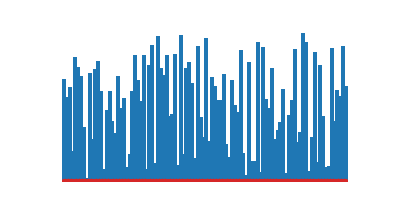

<!--
Pour observer visuellement le tri, on utilise ici des "barres" (en réalité, de petits histogrammes).
On cherche à trier les barres par taille de la plus petite à la plus grande.
On voit ici dynamiquement comment fonctionne le tri sélection.
On voit notamment qu'à chaque itération, la plus petite barre est déplacée à sa position finale.
-->

---

# Tri sélection

### Quelques étapes d'exécution

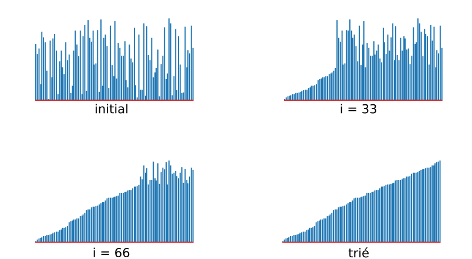

---

# Tri sélection

### Complexité

* On a $N \frac{N - 1}{2}$ comparaisons et $N$ échanges.
* Par conséquent, on a $\thicksim \frac{N^2}{2}$ comparaisons.
* Donc on est en $O(N^2)$.

---

# Tri à bulles

### Algorithme (bubble sort :uk:)

```python
def tri_bulles(a):
    N = len(a)

    for i in range(N - 1):
        for j in range(N - (i + 1)):
            if a[j] > a[j+1]:
                a[j], a[j+1] = a[j+1], a[j]

    return a
```

<!--
L'idée est symmétrique au tri sélection : on met le plus grand élément à la fin de chaque itération.
On parcourt tous les éléments dans la boucle externe.
Dans la boucle interne, on repart du 1er élément et on va jusqu'à N - (i + 1).
En d'autres termes, dans la boucle interne, on considère que les (i + 1) derniers sont déjà triés.
C'est bien ce que l'on fait dans le test : on "pousse" les plus grandes valeurs vers la droite.
-->

---

# Tri à bulles

### Exécution animée


<!--
A la fin de la 1ière itération de i, la plus grande valeur est à droite.
A la fin de la 2ième itération de i, la 2e grande valeur est triée.
Etc.
Sur le principe, on peut observer qu'il y a une symmétrie avec le tri sélection présenté précédemment.
-->

---

# Tri à bulles

### Quelques étapes d'exécution

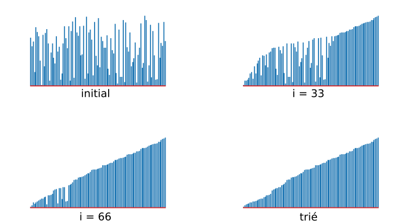


---

# Tri à bulles

### Complexité

* On a $N \frac{N - 1}{2}$ comparaisons et au pire $N \frac{N - 1}{2}$ échanges.
* Par conséquent, on a $\thicksim \frac{N^2}{2}$ comparaisons.
* Donc on est en $O(N^2)$.

<!--
On notera que le tri sélection a moins d'échanges.
Il est donc meilleur que le tri à bulles.
La raison est simple : dans le cas du tri sélection, on chercher l'indice minimum avant de faire l'échange.
Dans le cas du tri à bulle, on fait des échanges à la place de réaffecter la variable min.
En revanche, le tri à bulles fait l'économie de la variable min.
-->

---

# Tri insertion

### Algorithme (insertion sort :uk:)

```python
def tri_insertion(a):
    N = len(a)

    for i in range(1, N):
        j = i
        while j > 0 and a[j] < a[j-1]:
            a[j], a[j-1] = a[j-1], a[j]
            j -= 1

    return a
```

<!--
C'est le principe du tri d'un jeu de cartes dans notre main.
On insère chaque carte au "bon endroit" une à une.
Autrement dit, pour chaque carte, on l'insère à sa position finale dans la partie déjà triée de la main.
Ici, la boucle externe parcourt chaque élément.
La boucle interne positionne le ième élément à sa position finale dans l'intervalle [0 ; i].
-->

---

# Tri insertion

### Exécution animée


<!--
A chaque étape, on voit que la partie triée devient plus importante à chaque itération sur i.
-->

---

# Tri insertion

### Quelques étapes d'exécution

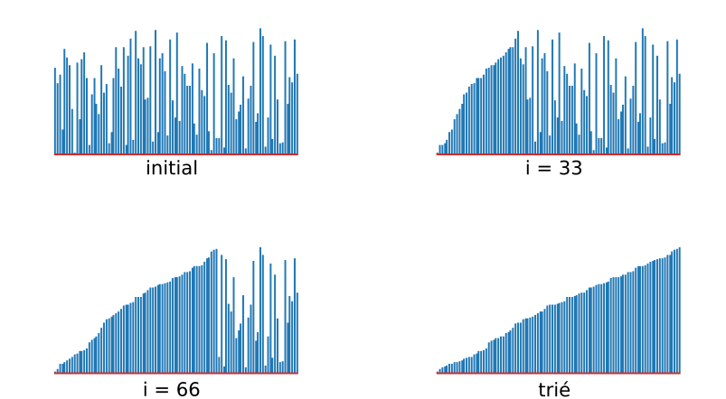

---

# Tri insertion

### Complexité

* On a $\thicksim \frac{N^2}{4}$ comparaisons et $\thicksim \frac{N^2}{4}$ échanges.
* Donc on est en $O(N^2)$.

---

<!-- _class: smaller-text -->

# Tri coquille

### Algorithme (shell sort :uk:)

```python
def tri_coquille(a):
    N = len(a)
    h = 1
    while h < N // 3:
        h = 3 * h + 1

    while h >= 1:
        for i in range(h, N):
            j = i
            while j >= h and a[j] < a[j-h]:
                a[j], a[j-h] = a[j-h], a[j]
                j -= h
            
        h //= 3

    return a
```

<!--
Sur le principe, c'est exactement la même chose que le tri insertion.
La différence essentielle, c'est que l'on tente d'améliorer le cas moyen de l'algorithme en utilisant un coefficient h.
Ce coefficient h est calculé de telle sorte qu'il soit inférieur au tier de la taille du tableau (c'est une heuristique).
Les valeurs que peut prendre h sont : 1, 4, 13, 40, 121, 364, 1093...
Plutôt que de travailler uniquement sur l'intervalle [0 ; i] et décrémenter j de un en un, on effectue à chaque fois des déplacements plus larges d'une valeur h.
La valeur de h est réduite progressivement. Si h commence à 40, il sera ensuite : 40 // 3 = 13, puis 4, 1, et 0.
Lorsque h == 1, on a précisément le tri insertion. Il s'agit de l'étape de "finition".
-->

---

# Tri coquille

### Exécution animée


<!--
Les petites valeurs sont ramenées vers la gauche d'un facteur h = 13, puis 4 et enfin 1.
On peut observer à certains moments un état h-sorted, ce qui signifie que la collection est triée du point de vue de h.
Lorsque c'est le cas, on passe à la valeur inférieure de h pour peaufiner le tri.
-->

---

# Tri coquille

### Quelques étapes d'exécution (1/2)

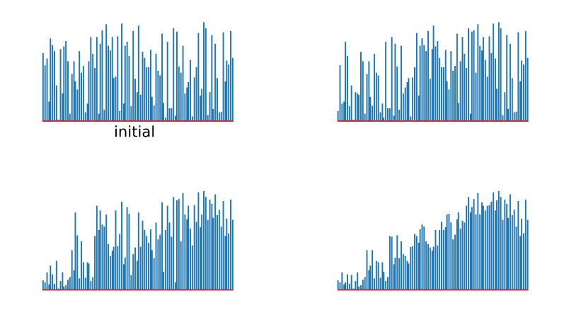

---

# Tri coquille

### Quelques étapes d'exécution (2/2)

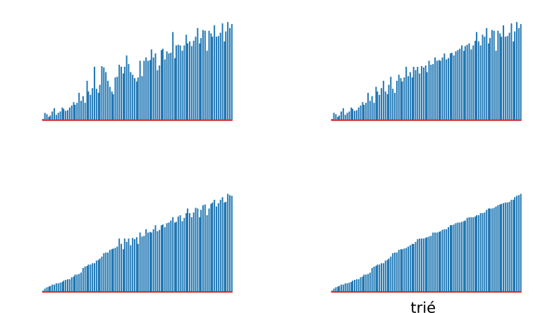

---

# Tri coquille

### Complexité

* On a $\thicksim \sqrt{N^3}$ comparaisons.
* Donc on est en $O(N^{3/2})$.

<!--
La preuve d'algorithme est en dehors de la portée de ce cours.
-->

---

### Comparaison

|  |    |
|:-------------------------------:|:-----------------------------:|
|          Tri sélection          |         Tri à bulles          |

<!--
Ici, on observe bien la symmétrie entre les algorithmes.
-->

---

### Comparaison

|  |  |
|:-------------------------------:|:-------------------------------:|
|          Tri sélection          |         Tri insertion           |

<!--
On peut voir ici que le principe de ces algorithmes est différent.
-->

---

### Comparaison

|  |   |
|:-------------------------------:|:-------------------------------:|
|          Tri insertion          |         Tri coquille            |

<!--
La dernière étape d'un tri coquille est un tri insertion.
Attention : le temps d'exécution des gifs n'est pas proportionnel au temps d'exécution des algorithmes.
Dans le cas général, le tri coquille a une meilleure complexité que le tri insertion.
Par conséquent, le tri coquille s'exécute plus vite en moyenne en réalité.
La raison pour laquelle le gif du tri coquille prend plus de temps est qu'il a été généré avec plus d'images pour mieux voir son évolution plus complexe.
-->

---

<!-- _class: title-header -->

# <!--fit--> Partition : diviser et conquérir

##### Divide-and-Conquer :uk:

---

# Diviser et conquérir

* Le principe de **diviser et conquérir** est fondamental en algorithmique.
* On a vu avec la recherche binaire que le fait de diviser en 2 un problème permet de le résoudre beaucoup plus rapidement.

---

### Rappel sur la partition

* En **mathématiques**, une partition d'un ensemble est un regroupement de ses éléments dans des sous-ensembles non-vides tel que chaque élément est inclu dans exactement un sous-ensemble.
* Exemple :
    * pour l'ensemble $E = \{6, 2, 5, 1, 9, 3, 8, 7, 4\}$,
    * le sous-ensemble $C_1 = \{2, 5, 1, 3, 4\}$,
    * le sous-ensemble $C_2 = \{6\}$,
    * le sous-ensemble $C_3 = \{9, 8, 7\}$,
    * on a $C_1, C_2, C_3$ qui forment une partition de $E$.

<!--
On remarquera dans l'exemple que le 1er sous-ensemble contient l'ensemble des éléments plus petits que 6.
Le 2e sous-ensemble contient uniquement 6.
Le 3e sous-ensemble contient tous les éléments plus grands que 6.
-->

---

## Partitionner en 2

* L'**algorithme de partition** vise à diviser un ensemble en 2 sous-ensembles :
    * L'ensemble des éléments strictement plus petit qu'une valeur.
    * L'ensemble des autres éléments.

---

<!-- _class: smaller-text -->

### Partition

```python
def partition(e):
    N = len(e)
    valeur = e[0]
    i = 0
    j = N

    while True:
        i += 1 # Garanti la progression à droite
        while e[i] < valeur and i != N: i += 1 # Scan vers la droite

        j -= 1 # Garanti la progression à gauche
        while valeur < e[j] and j != 0: j -= 1 # Scan vers la gauche

        if i >= j: break # Si les indices se croisent on s'arrête

        # Echange des éléments entre les 2 partitions
        e[j], e[i] = e[i], e[j]
    
    # Met la valeur de partitionnment entre les 2 partitions
    e[j], e[0] = e[0], e[j]
```

<!--
Dans cette version de l'algorithme, la valeur de partitionnement est prise au début de l'ensemble "e".
Cet algorithme est illustré sur la diapositive suivante.
Globalement, on fait converger à droite l'indice i vers un élément qui devrait appartenir à l'autre partition.
De même, on fait converger à gauche l'indice j vers un élément qui devrait appartenir à l'autre partition.
A chaque fois que l'on trouve des pairs d'éléments se trouvant du mauvais côté, on les échange.
Les 2 sous-ensembles n'ont pas besoin d'être symmétriques : on continue d'échanger les indices ensuite.
-->

---

### Illustration de l'exécution


<!--
Pour plus de lisibilité, la variable "valeur" s'appelle "v" dans ce diagramme.
On voit ici
-->

---

# Exemple

```python
L = [6, 2, 5, 1, 9, 3, 8, 7, 4]
partition(L)
print(L)
```

:arrow_down:

```
[3, 2, 5, 1, 4, 6, 8, 7, 9]
```

<!--
Les sous-ensembles de part et d'autre de 6 forment une partition.
Ici, le chiffre 6 marque le début du 2e sous-ensemble.
-->

---

```python
L = [6, 2, 5, 1, 6, 9, 3, 8, 7, 4]
partition(L)
print(L)
```

:arrow_down:

```
[3, 2, 5, 1, 4, 6, 9, 8, 7, 6]
```

<!--
Les éléments qui ne sont pas plus petits que 6 vont dans le 1er sous-ensemble.
6 n'est pas plus petit que 6, donc il va dans le 2e sous-ensemble.
-->

---

# Complexité

* On a $N + 1$ comparaisons.
* On est donc en $\thicksim N$, et $O(N)$.

<!--
On a certes des boucles imbriquées, mais elles ne parcourent pas [0 ; N].
En pratique on a i qui part de 0 et j qui part de N.
A chaque itération i est incrémenté au moins 1 fois et j est décrémenté au moins une fois.
L'algorithme s'arrête dès que les indices se croisent, donc :
- i parcourt [0 ; j_final]
- j partcout [j_final ; N]
-->

---

<!-- _class: title-header -->

# Tri Rapide

##### Quick Sort :uk:

---

# Tri rapide

### Introduction

* Le tri rapide a une **meilleure complexité** que les autres algorithmes de tri vu jusqu'ici.
* Il est également plus complexe à comprendre.
* Il repose sur la **partition** et une définition **naturellement récursive**.

---

<!-- _class: smaller-text -->

#### Tri rapide - Partition


```python
def partition(a, debut, fin):
    i = debut
    j = fin + 1
    valeur = a[debut]

    while True:
        i += 1
        while a[i] < valeur and i != fin: i += 1

        j -= 1
        while valeur < a[j] and j != debut: j -= 1

        if i >= j: break

        a[j], a[i] = a[i], a[j]

    a[j], a[debut] = a[debut], a[j]

    return j
```

<!--
On effectue simplement quelques ajustements à l'algorithme de partitionnement que nous venons de voir.
En pratique, plutôt que de supposer que l'on partitionne sur l'intervalle [0 ; N], on partitionne sur l'intervalle [debut ; fin].
Par ailleurs, on renvoie aussi l'indice j correspondant au nouvelle emplacement de la "valeur" de partition.
-->

---

# Tri rapide

### Algorithme (quick sort :uk:)

```python
def tri_rapide_recursif(a, debut, fin):
    if fin > debut:
        j = partition(a, debut, fin)
        tri_rapide_recursif(a, debut, j - 1)
        tri_rapide_recursif(a, j + 1, fin)
```

<!--
Pour trier un ensemble, on le partitionne en 2 sous-ensembles tels que tous les éléments du 1er sous-ensembles soient plus petits que ceux du 2e sous-ensemble.
Ensuite, il suffit de trier chaque sous-ensembles.
-->

---

# Tri rapide

### Interface

```python
def tri_rapide(a):
    N = len(a)
    tri_rapide_recursif(a, 0, N - 1)
```

<!--
A noter que le tri rapide est "in-place" : il ne nécessite pas de réserver un espace mémoire supplémentaire.
-->

---

# Tri rapide

### Exécution animée


<!--
Chaque itération du gif montre le résultat d'une partition.
Donc, dès la 1ière image, on a partitionné l'ensemble des "barres" par rapport à la 1ière.
On remarquera que la progression est moins triviale que celle d'un tri à bulles, par exemple.
-->

---

# Tri rapide

### Quelques étapes d'exécution (1/2)

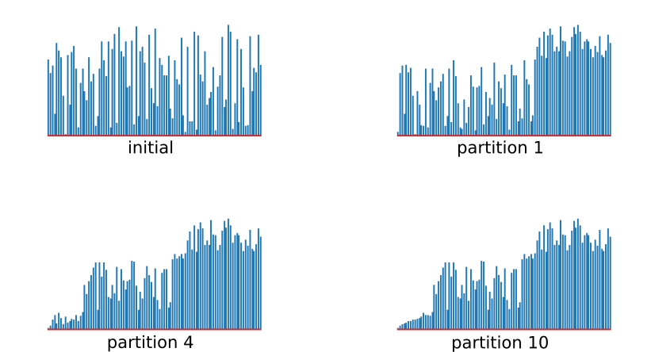

<!--
Quelques arrêts sur image sont utiles pour observer le partitionnement progressif, et les appels récursifs sur les sous-ensembles.
Entre le placement initial et le 1er partitionnement, on voit un net changement.
Entre les 4e et 10e partitions, on voit le travail effectué au tout début.
-->

---

# Tri rapide

### Quelques étapes d'exécution (2/2)

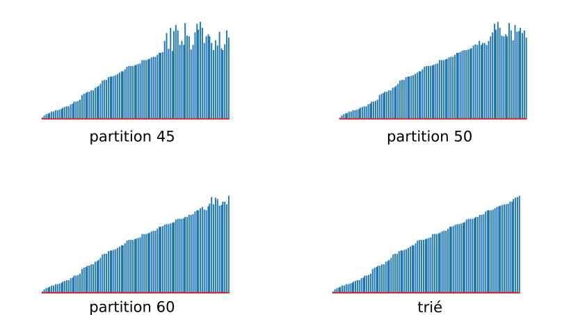

<!--
Sur des étapes plus avancées, on voit également se former puis résoudre les intervalles de partitionnement.
-->

---

# Tri rapide

### Complexité

* On a $\thicksim 2 N \log N$ comparaisons en moyenne.
* On a $\thicksim \frac{N^2}{N}$ comparaisons dans le pire cas.
* Comme on peut facilement se prévenir du pire cas, on admet $O(N \log N)$ en pratique.

<!--
La preuve d'algorithme est en dehors de la portée de ce cours.
-->

---

## Le *pire* cas (1/2)

* Le pire cas survient lorsque la collection est **déjà triée**.
* En effet, le partionnement n'a **aucun effet** dans ce cas.
* On a vu dans la partie sur l'algorithme de partition que la valeur `v` ne se retrouve pas forcément au milieu.
* Si la valeur `v` se retrouve **toujours en premier**, cela signifie que la collection est déjà triée et le tri rapide sera lent et inutile.

<!--
Si la valeur "v" se retrouve en premier après partitionnement, cela signifie qu'il n'existe pas de valeur plus petite, par définition.
S'il n'y a pas de valeur plus petite sur cet ensemble, cette valeur est déjà triée.
Le sous-ensemble suivant est constitué de tous les éléments restants.
Dans ce nouveau sous-ensemble, si la valeur "v2" se retrouve en premier après partionnement, elle est déjà triée.
-->

---

## Le *pire* cas (2/2)

* On peut se prévenir du pire cas en **testant initialement** si le tableau est trié.
* On peut s'éloigner du pire cas en **mélangeant les éléments**.

<!--
Même si le pire cas est rare, avoir une forte disproportion entre les sous-ensembles partitionnés peut avoir un impact négatif sur l'efficacité de l'algorithme de tri rapide.
-->

---

## Le *meilleur* cas

* Le tri rapide est à son maximum lorsque `v` se retrouve toujours *exactement* au milieu à chaque partitionnement.
* Dans ce cas, la relation de récurrence $C$ définissant le nombre de comparaisons $C_N = 2 C_{N/2} + N$.
* $C_N \thicksim N \log N$, ce qui est un début de preuve pour la complexité de cet algorithme.

---

<!-- _class: title-header -->

# Tri Fusion

##### Merge Sort :uk:

---

# Tri Fusion

### Introduction

* Dans le tri rapide, on partitionne en 2 sous-ensembles puis on applique l'algorithme récursivement à chaque sous-ensemble.
* Dans le tri fusion, on fait les opérations dans le sens inverse : on applique **d'abord** récursivement l'algorithme puis on **fusionne** les résultats.
* C'est la fusion qui entraine le tri.

---

<!-- _class: smaller-text -->

### Tri Fusion - Fusion

```python
def fusion(a, debut, milieu, fin):
    i = debut
    j = milieu + 1
    auxiliaire = a[:]
    for k in range(debut, fin + 1):
        if i > milieu:
            a[k] = auxiliaire[j]
            j += 1
        elif j > fin:
            a[k] = auxiliaire[i]
            i += 1
        elif auxiliaire[j] < auxiliaire[i]:
            a[k] = auxiliaire[j]
            j += 1
        else:
            a[k] = auxiliaire[i]
            i += 1
```

<!--
On commence par faire une copie du tableau "a" dans "auxiliaire".
Cette copie est nécessaire pour choisir les éléments depuis leur ordre d'origine.
Ensuite, l'index k parcourt de la gauche vers la droite l'intervalle [debut ; fin].
Cet intervalle est coupé en deux par "milieu".
L'index i parcourt de la gauche vers la droite l'intervalle [debut ; milieu].
L'index j parcourt de la gauche vers la droite l'intervalle ]milieu ; fin].
On considère que les intervalles [debut ; milieu] et ]milieu ; fin] sont triés.
A chaque etape, on choisi le plus petit élément parmis [debut ; milieu] ou ]milieu ; fin].
Une fois que l'on a épuisé un intervalle, on va piocher dans l'autre.
-->

---

# Tri Fusion

### Algorithme (merge sort :uk:)

```python
def tri_fusion_recursif(a, debut, fin):
    if fin > debut:
        milieu = debut + (fin - debut) // 2
        tri_fusion_recursif(a, debut, milieu)
        tri_fusion_recursif(a, milieu + 1, fin)
        fusion(a, debut, milieu, fin)
```

<!--
Comme indiqué en introduction, cette implémentation est quasiment identique à tri_rapide_recursif.
La seule différence, c'est que la fusion a lieu après les récursions.
L'idée essentielle est que l'on fusionne 2 liste triées.
Le résultat est une liste triée.
-->

---

# Tri Fusion

### Interface

```python
def tri_fusion(a):
    N = len(a)
    tri_fusion_recursif(a, 0, N - 1)
```

<!--
Comme pour le tri rapide, on peut se contenter d'initialiser la récursion avec l'intervalle [0, N - 1].
-->

---

# Tri Fusion

### Exécution animée


<!--
Plus l'algorithme avance, plus les fusions sont larges.
On voit de mieux en mieux les opérations de fusion.
Ceci jusqu'à la fusion ultime qui réunit les 2 intervalles [0 ; milieu] et ]milieu, N].
-->

---

# Tri Fusion

### Quelques étapes d'exécution (1/2)

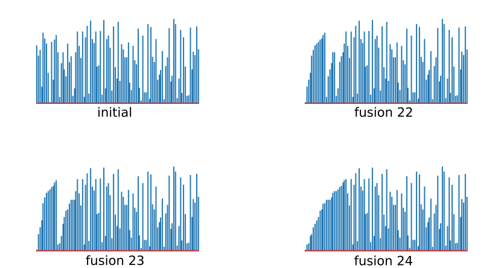

<!--
Dans la suite de fusions 22, 23 et 24, on voit à gauche quelques fusions sur des sous-ensembles.
Cela permet de visualiser les fusions successives.
-->

---

# Tri Fusion

### Quelques étapes d'exécution (2/2)

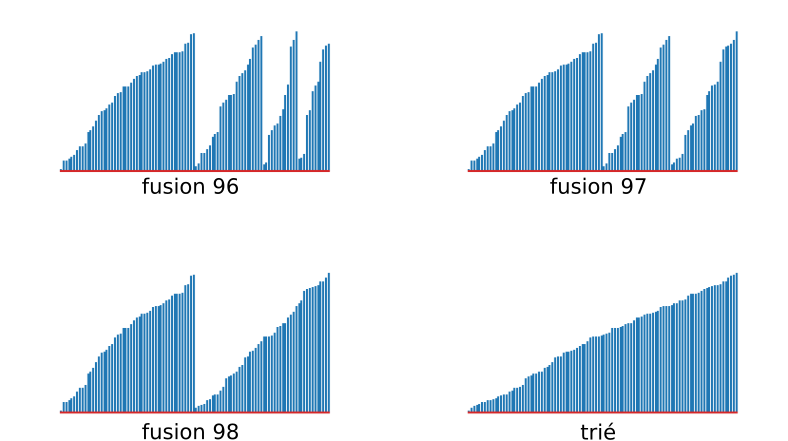

<!--
A la fin de l'algorithme, les fusions sont larges.
Entre la fusion 98 et 99 (nommée "trié"), on voit le résultat typique d'une fusion sur 2 sous-ensembles triés.
-->

---

# Tri Fusion

### Complexité

* La complexité de la fusion elle-même est $\Theta(N)$
* Pour le tri fusion :
    * On a entre $\frac{1}{2} N \log N$ et $N \log N$ comparaisons.
    * On est en $\Theta(N \log N)$.

---

<!--
Concernant la fusion, la preuve est immédiate : on a une boucle for dans l'intervalle [debut, fin + 1].
Or, au minimum, debut = 0, et au maximum fin = N.
Donc la fusion a dans le pire cas un parcourt sur l'intervalle [0 ; N], dons O(N)
Dans le cas du tri fusion, on sait que la dernière fusion se fait sur l'intervalle [0 ; N].
Par conséquent, on est à la fois O(N) et Oméga(N), donc Théta(N).
-->

# Tri Fusion

### Intuition de preuve

* A chaque récursion, on divise l'espace en 2.
* On peut dessiner un arbre binaire pour représenter les appels.
* La profondeur $p$ de cet arbre binaire est proportionnel à $O(\log N)$.
* On a donc $\log N$ fusions, soit $O(N \log N)$ opérations au total.

<!--
Nous avons montré plus tôt dans ce cours la relation entre la profondeur p et le logarithme de N.
La preuve d'algorithme complète est en dehors de la portée de ce cours.
-->

---

### Comparaison

|  |   |
|:----------------------------:|:-----------------------------:|
|          Tri rapide          |         Tri fusion            |

<!--
Encore une fois, la vitesse d'exécution des gifs n'est pas corrélé à l'efficacité des algorithmes mais uniquement au nombre d'étapes capturées de ces algorithmes.
Même si le principe entre ces 2 algorithmes repose sur des fondements similaires, leur exécution est complètement différente.
-->

---

### Existe-t-il un algorithme plus efficace ?

* Autrement dit, existe-t-il un algorithme ayant une meilleure complexité que $O(N \log N)$ pour trier une collection ?
* **Non**, il est possible de prouver que **la meilleure complexité** pour le tri est $O(N \log N)$.
* En revanche, les implémentations peuvent recevoir de **petites améliorations**.
* Par exemple, il existe possible de **paralléliser** tri rapide ou tri fusion.

---

### Eléments de preuve

* On considère que tous les éléments à trier sont distincts.
* On construit un **arbre binaire** de toutes les **permutations possibles**.
* Il y a $N!$ permutations possibles (par définition).
* On s'intéresse à la **profondeur** $p$ et comme l'arbre est binaire, on a $O(p) = O(\log(N!))$.
* L'**approximation de Stirling** nous donne $\log(N!) \thicksim N \log(N)$.

<!--
L'un des chemins dans l'arbre binaire de toutes les permutations nous donne l'ensemble des permutations à effectuer pour trier notre collection.
L'arbre binaire n'est pas forcément complet (c'est à dire qu'il n'a pas forcément d'enfant à gauche et à droite partout).
On s'intéresse à la profondeur maximale p de l'arbre, puisque c'est le nombre maximal de permutations que l'on aura à faire pour trier une collection.
-->

---

<!-- _class: title-header -->

# TP : Tri de collections

---

### TP : Tri de collections

[**Lien** vers le sujet de TP](./tp-15-tri.html).
