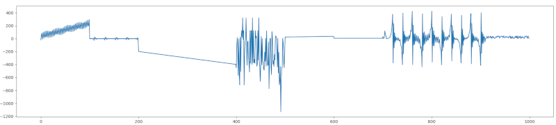

Ce 5e DM vous amène à revoir des éléments de cours vu aujourd'hui concernant les modules.

## Exercice 1 - Moteur de recherche en ligne de commande

Vous allez implémenter un utilitaire permettant d'effectuer une recherche Internet à l'aide :
* du moteur de recherche Qwant,
* du module `requests`,
* du module `inscriptis`.

A l'aide de `pip`, installez les paquets `requests` et `inscriptis` depuis un terminal. Ensuite, créez un nouveau script Python.

### Exercice 1.1 - Construction de l'URL

A l'aide de la fonction `input`, demandez à l'utilisateur de rentrer ses termes de recherche.

Ensuite, concatenez ces termes en utilisant un `"+"` comme séparateur. La chaîne de caractères ne doit plus comporter d'espace ni de caractères spéciaux.

Par exemple, si l'utilisateur a rentré `"chat gris"`, votre chaîne de caractères doit devenir `"chat+gris"`.

Créez ensuite une variable nommée `url` telle que :
* Elle comporte le préfix `"https://www.qwant.com/?q="`,
* Puis les termes de recherches concaténés,
* Et enfin le suffix `"&t=web"`.

En poursuivant notre exemple, la variable `url` serait `"https://www.qwant.com/?q=chat+gris&t=web"`.

### Exercice 1.2 - Envoie de la requête HTTP

En utilisant le module `requests`, effectuez une requête HTTP GET sur l'`url` et récupérez la réponse en sortie.

Le code HTML de la page se trouve dans la propriété `text` de la réponse HTTP.

### Exercice 1.3 - Désérialisation de la réponse HTTP

Le résultat de la réponse HTTP est une chaîne de caractères au format HTML. Il s'agit d'un format qui nécessite une interprétation avant d'être affichée.

En utilisant le module `inscriptis`, convertissez le code HTML de la page en texte simple (à l'aide de `get_text`). Utilisez la fonction `print` pour afficher ce texte dans la sortie.

### Exercice 1.4 - Usurpation d'identité

Le résultat obtenu à ce stade est déroutant : il n'y a aucun résultat de recherche ! La même recherche dans un navigateur web donne un résultat différent. La raison est simple : utiliser une API Web est un service payant de manière générale.

La question qui suit est : comment le serveur de recherche (Google, Bing, Qwant et autres) reconnait-il des requêtes faites depuis un navigateur web ? Comment faire la distinction avec des requêtes effectuées en ligne de commande ?

En pratique, une requête HTTP comporte des entêtes. L'une de ces entêtes s'appelle le User Agent, et identifie la nature de l'entité qui effectue la requête.

On peut donc se faire passer pour un navigateur web pour obtenir des résultats de recherche :
```py
firefox = "Mozilla/5.0 (Macintosh; Intel Mac OS X 10_15_1) AppleWebKit/537.36 (KHTML, like Gecko) Chrome/78.0.3904.108 Safari/537.36"
requests.get(url, headers={"User-Agent":firefox})
```

En revanche, il ne faut pas exécuter la requête un nombre de fois trop élevé : 
* un navigateur web implémente un cache navigateur qui va minimiser le nombre de requêtes effectuées au serveur, contrairement à l'outil naïf en cours d'implémentation,
* les moteurs de recherche limitent le nombre de requêtes que l'on peut effectuer sur un laps de temps donné sans passer par leur site (en utilisant d'autres mécanimes),
* si les moteurs de recherche ne peuvent pas se rémunérer avec la publicité, il est normal qu'ils utilisent un autre modèle économique de rémunération - ici, au nombre de requêtes effectuées sur le laps de temps donné -,

Par ailleurs, il faut être conscient qu'il s'agit d'un hack et non pas d'une vraie solution viable. En effet :
* changer l'identité du User Agent n'est pas une bonne pratique sauf lorsque l'on souhaite tester des problématiques de cybersécurité,
* il ne faut pas changer l'identité du User Agent dans des solutions industrielles.

## Exercice 2 - Tableau de points

Téléchargez un [fichier de points au format CSV](https://github.com/loic-yvonnet/algo-appliquee/raw/master/cours/10-python-avance/assets/random-curve.csv).

Le format CSV (pour Comma Separated Values) est un format de fichier commun pour décrire le contenu d'un tableur ou d'une base de données.

Le fichier `random-curve.csv` que vous venez de télécharger comporte simplement 2 colonnes : les abscisses X et les ordonnées Y d'une fonction. Les valeurs sont séparées par un `";"`.

### Exercice 2.1 - Lire le fichier CSV

A l'aide du module `csv` et de sa fonction `reader`, lisez le fichier de points et affichez dans la sortie standard de la console la liste des 20 premières ordonnées.

### Exercice 2.2 - Affichage de la courbe

A l'aide du package MapPlotLib, affichez la courbe correspondant au nuage de points présent dans le fichier CSV.

Le résultat attendu est :


## Exercice 3 - Tableur

### Exercice 3.1 - Récupération d'une base de données de films

En suivant la même approche que dans l'exercice 1, écrivez une requête HTTP qui récupère le fichier CSV à l'adresse : [https://raw.githubusercontent.com/PacktPublishing/Pandas-Cookbook/master/data/movie.csv](https://raw.githubusercontent.com/PacktPublishing/Pandas-Cookbook/master/data/movie.csv).

En suivant la même approche que dans l'exercice 2, affichez les 20 premières lignes dans la sortie standard.

En utilisant le module `os`, écrivez le contenu dans un fichier csv.

### Exercice 3.2 - Lecture et affichage avec Panda

Panda, tout comme NumPy et MatPlotLib, fait parti des bibliothèques qui font la popularité du langage Python ces dernières années. Il s'agit d'une bibliothèque de gestion de données tabulaires. Il est possible de faire les mêmes opérations que dans un tableur Excel, mais plus facilement et sans avoir à utiliser Visual Basic for Applications (VBA), qui est un langage de programmation ancien.

A l'aide pip, installez la bibliothèque `panda`.

Utilisez la fonction `read_csv` de `panda` pour relire le fichier csv sauvegardé précédemment. Utilisez la fonction `head` pour afficher les 20 premières lignes.

### Exercice 3.3 - Analyse avec Panda

Avec la propriété `shape`, affichez le nombre de lignes et le nombre de colonnes de votre tableau.

Avec la fonction `info`, affichez quelques informations sur vos données.

Avec la fonction `describe`, affichez des statistiques sur la distribution des variables continues.

Avec la fonction `corr`, affichez la corrélation entre chaque variable continue.

En utilisant l'opérateur `[]` pour sélectionner la colonne `genres`, et en utilisant la fonction `value_counts`, affichez le nombre de films répertoriés par genre.

### Exercice 3.4 - Requêtes avancées avec Panda

Dans l'exercice précédent, nous avons vu comment sélectionner une colonne.

Il est possible de filtrer le contenu en suivant la même logique. Par exemple, si la variable panda s'appelle `movies`, on peut utiliser `movies[(movies["title_year"] == 2006)]` pour n'affichez que la liste des films parus en 2006.

On peut combiner des filtres avec l'opérateur `&`. Ainsi :
```python
movies[
    (movies["title_year"] >= 2006)
    & (movies["title_year"] <= 2008)
]
```

va afficher la liste des films entre 2006 et 2008.

Affichez la liste des films d'Action sortis après 2010, ayant au moins 10000 likes Facebook, et paru aux USA.

Avec la fonction `value_counts`, affichez leur nombre.

### Exercice 3.5 - Affichage de graphiques avec Panda et MatPlotLib

Affichez la courbe de l'évolution du budget médian par année aux USA.
