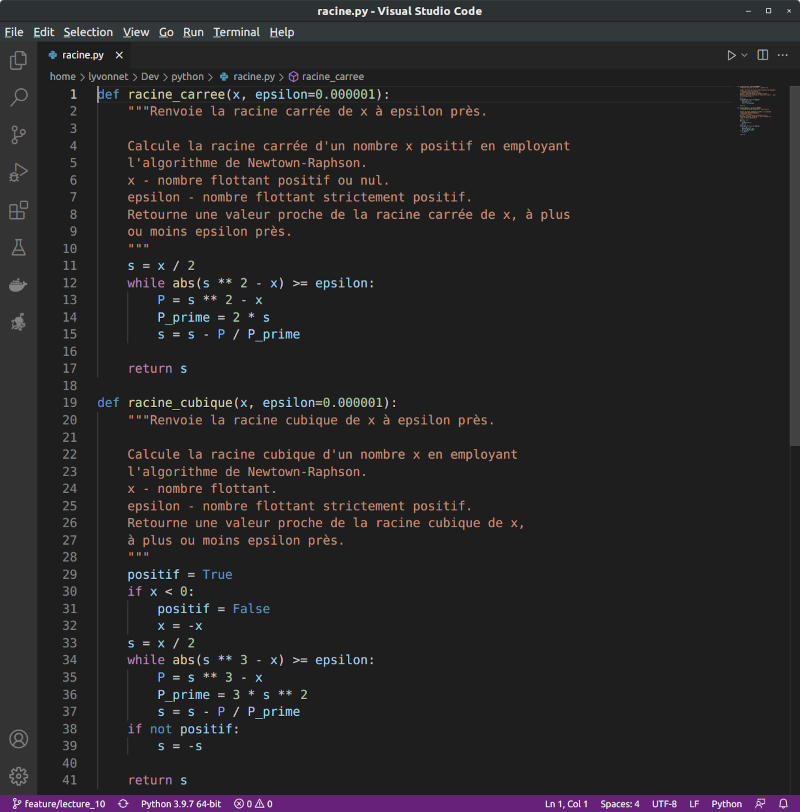
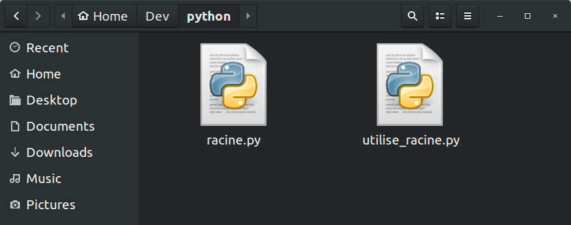
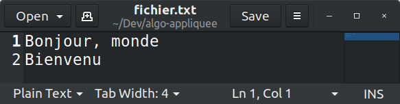
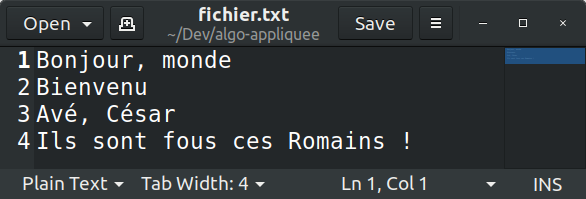

<!-- _class: title-section -->

# <!--fit--> Algorithmique Appliquée

##### BTS SIO SISR

## Bibliothèques Python

<!--
Tout langage de programmation et toute technologie moderne est complexe et profond.
Les bibliothèques sont très importantes pour développer des logiciels au bon niveau d'abstraction.
Afin que vous puissiez être efficaces rapidement dans vos entreprises en alternance, il est important que vous connaissiez les principales bibliothèques offertes par le langage de programmation Python.
-->

---

# Plan

- Programmation modulaire
- Bibliothèque standard
- Focus sur les fichiers
- Gestionnaire de paquets
- Discussion sur les licences

---

<!-- _class: title-section -->

# Programmation modulaire

---

## Taille d'une fonction

* Combien de **responsabilités** doit avoir une fonction ?
* 1 fonction :arrow_right: 1 responsabilité.
* En moyenne, une fonction doit faire entre **7 et 15 lignes**.
* Une fonction qui fait plus de 30 lignes doit être découpée en **plusieurs fonctions plus simples**.

<!--
Il s'agit ici d'ordres de grandeur et de bonnes pratiques.
Il ne s'agit pas d'une règle stricte.
Il faut se référer au contexte de travail et aux règles de codage de l'entreprise dans laquelle vous intervenez.
-->

---

### Exemples de responsabilités

* Effectuer un calcul (ex : racine carrée).
* Rechercher une valeur (ex : recherche binaire)
* Appliquer une transformation (ex : nombre textuel vers numérique).
* Afficher un résultat (ex : une matrice).

---

## Ne pas se répéter

* Lorsque l'on observe un **motif qui se répète** dans le code, il y a un problème.
* Ces répétitions sont le signe d'une **duplication de code**.
* A la place, il faut créer des fonctions et les appeler.
* Le processus de modification du code pour supprimer les duplications s'appelle la **refactorisation**.
* Il s'agit d'une bonne pratique du génie logiciel.

<!--
Par exemple, lorsque l'on a dupliqué plusieurs fois le code de la racine carrée pour calculer la racine de 16, puis pour calculer la somme d'une racine carrée et d'une racine cubique.
A la place, nous avons désormais une fonction racine carrée propre et réutilisable.
-->

---

### Notion de script modulaire

- On rassemble les fonctions de même nature dans un **script**.
- Par exemple, on peut avoir un script `racine.py` qui contient les fonctions `racine_carree` et `racine_cubique`.
- On pourrait avoir un autre script nommé `chaine_caracteres.py` qui contient des fonctions de manipulation de chaînes de caractères.

---

# Module

* Un **module** est un fichier `.py` contenant des définitions et des déclarations Python.
* Le script `racine.py` est donc un module.

---

### Module `racine.py`

|  |  |
|:--------------------------------:|:-------------------------------------:|
|       Fichier `racine.py`        |        Explorateur de fichiers        |

---

## Utilisation d'un module

- On emploie le mot clé `import` pour utiliser une bibliothèque de fonctions.
- Par exemple, avec le module `racine.py` :
```python
import racine

cinq = racine.racine_carree(25)
print(cinq)

trois = racine.racine_cubique(27)
print(trois)
```

<!--
On voit ici que les fonctions sont préfixées par le nom du module.
Cela ressemble à un appel de méthode, comme quand on appelle sort sur une liste.
-->

---

### Autre exemple avec `math`

```python
import math

print(math.cos(0))
```

:arrow_down:

```
1.0
```

---

## Intérêt du préfixe

* Lorsque l'on importe un module, on doit employer `module.f()` pour appeler la fonction `f` définie dans `module.py`.
* On appelle ce préfixe une **qualification complète** (fully qualified :uk:).
* L'objectif est d'éviter la **collision de nom**.
* En effet, plusieurs modules peuvent définir une fonction `f`.

---

### Importer une fonction spécifique

```python
from racine import racine_carree

cinq = racine_carree(25)
print(cinq)
```

:arrow_down:

```
5.000000000016778
```

---

#### :warning: Les autres fonctions sont invisibles

```python
from racine import racine_carree

trois = racine_cubique(27)
print(trois)
```

:arrow_down:

```
NameError: name 'racine_cubique' is not defined
```

---

#### :warning: Le module aussi est invisible

```python
from racine import racine_carree

trois = racine.racine_cubique(27)
print(trois)
```

:arrow_down:

```
NameError: name 'racine' is not defined
```

---

### Tout importer ? :skull:

```python
from racine import *

cinq = racine_carree(25)
print(cinq)

trois = racine_cubique(27)
print(trois)
```

:arrow_down:

```
5.000000000016778
3.000000000000002
```

<!--
Il vaut mieux éviter cette approche.
La diapositive suivante explique pourquoi.
-->

---

### Inconvénients de tout importer

* On perd l'avantage de la **qualification complète**.
* On peut donc avoir des **collisions de noms**.
* Le code est également plus **difficle à comprendre** car on ne sait pas d'où viennent les fonctions utilisées.

<!--
Dans les exemples fournis, on sait d'où viennent les fonctions.
Imaginez maintenant une base de code de 1 million de lignes avec plusieurs centaines de modules.
-->

---

# Alias

```python
import racine as rcn

cinq = rcn.racine_carree(25)
print(cinq)

trois = rcn.racine_cubique(27)
print(trois)
```

:arrow_down:

```
5.000000000016778
3.000000000000002
```

<!--
Il s'agit là d'une bien meilleure alternative.
On n'a plus à tapper le nom complet du module donc le code est moins lourd.
En même temps, on ne perd pas la qualification complète des noms donc le code reste clair et propre.
-->

---

### Importer une liste d'objets

```python
from math import cos, sin, pi

print(cos(0))
print(cos(pi))
print(sin(0))
print(sin(pi))
```

:arrow_down:

```
1.0
-1.0
0.0
1.2246467991473532e-16
```

<!--
En Python, tout est objet.
-->

---

## La fonction principale (1/2)

- Lorsque l'on exécute un script en ligne de commande, l'interprêteur assigne la chaîne de caractère `"__main__"` à la variable globale `__name__`.
- Cela permet de distinguer le cas où un script est importé avec `import`, du cas où un script est exécuté indépendemment.

---

## La fonction principale (2/2)

```python
def main():
    # On peut par exemple tester le bon fonctionnement de 
    # racine_carree et racine_cubique ici.
    pass

if __name__ == "__main__":
    # Exécuté uniquement si le script est lancé en ligne de commande
    main()
```

---

<!-- _class: title-section -->

## Tour d'horizon de la bibliothèque standard Python

---

# Bibliothèque standard

* Le **langage python** est constitué de l'ensemble des mots clés tels que `while`, `for`, `if`, de sa grammaire et de quelques fonctions de base comme `max` et `range`.
* Pour effectuer des opérations plus avancées, on doit utiliser des modules de la **bibliothèque standard**.
* Par exemple  : le module `math`.

<!--
Il est important de distinguer un langage de sa bibliothèque standard.
La bibliothèqe standard de Python est riche et constitue l'une de ses grandes forces.
-->

---

### Services offerts (1/4)

* Collections supplémentaires.
* Hiérarchie d'exceptions.
* Traitement de texte.
* Fonctions mathématiques.
* Module de programmation fonctionnelle.

---

### Services offerts (2/4)

* Système de fichiers.
* Persistence dans une base de données.
* Algorithmes de compression.
* Algorithmes de cryptographie.
* Services de gestion de système d'exploitation.

---

### Services offerts (3/4)

* Concurrence et parallélisation (multithreading).
* Réseau et communication inter-processus.
* Protocoles Internet.
* Parsers (HTML, XML, JSON, etc.).
* Services multimedia.

---

### Services offerts (4/4)

* Internationalisation (i.e. plusieurs langues).
* Interface Graphique avec Tk.
* Outils de développement et de débogage.
* Gestionnaire de paquets.
* Interpréteur Python (AST, Tokenizer, etc.).

<!--
Ces catégories de services ne sont pas tout à fait exhaustives.
Dans les prochaines diapositives, on donne simplement un aperçu de l'une des fonctionnalités offertes dans certaines de ces catégories.
-->

---

<!-- _class: smaller-text -->

# Byte
#### Exemple de collections supplémentaires

```python
octets = b"1 2 3"
print(octets)

chaine = octets.decode()
print(chaine)

liste = octets.split()
print(liste)
```

:arrow_down:

```
b'1 2 3'
1 2 3
[b'1', b'2', b'3']
```

<!--
Le préfixe "b" signifie qu'il s'agit d'un byte et non d'une chaîne de caractères
Le type byte est très utile lorsque l'on veut transiter des paquets sur un réseau.
Dans ce cas, on encode le message, souvent une str, vers un byte.
L'opération inverse de décodage est également disponible.
-->

---

# Expression régulière
#### Exemple de traitement de texte

```python
import re

chaine = "si ton tonton tond ton tonton, ton tonton sera tondu"
expression = r"\bton[a-z]*"
resultat = re.findall(expression, chaine)
print(resultat)
```

:arrow_down:

```
['ton', 'tonton', 'tond', 'ton',
 'tonton', 'ton', 'tonton', 'tondu']
```

<!--
On recherche ici tous les mots qui commencent par "ton".
Le préfixe "r" signifie qu'il s'agit d'une expression régulière et non d'une chaîne de caractères.
Le \b signifie que l'on cherche le début d'un mot.
Ensuite, on dit que le mot doit débuter par "ton".
Enfin, le [a-z] signifie n'importe quel caractère entre a et z.
L'étoile * finale signifie n'importe quel nombre de l'expression précédente (donc [a-z] entre 0 et N fois).
-->

---

<!-- _class: smaller-text -->

### Nombres complexes
#### Exemple de fonctions mathématiques

```python
import cmath

c = complex(cmath.e, 0.0) # e
print(c)
print(cmath.log(c))       # 1

c = complex(cmath.e, 1.0) # e + i
print(c)
print(cmath.log(c))
```

:arrow_down:

```
(2.718281828459045+0j)
(1+0j)
(2.718281828459045+1j)
(1.0634640055214861+0.352513421777619j)
```

<!--
On utilise plutôt i pour représenter la partie imaginaire pure.
La bibliothèque de nombres complexes de Python utilise j à la place.
-->

---

<!-- _class : smaller-text -->

#### SQLite - Exemple de persistence (1/2)

```python
import sqlite3

# Création d'une base de données en mémoire
connection = sqlite3.connect(':memory:')
curseur = connection.cursor()

# Création d'une table
curseur.execute("""CREATE TABLE personnage
                  (nom, prenom, age)""")

# Insertion d'une ligne dans la table
curseur.execute("""INSERT INTO personnage
                   VALUES ('Tyrion', 'Lannister', 27)""")

# Commit la transaction actuelle
connection.commit()

# Suite sur la diapositive suivante...
```

<!--
On créé une base de données en mémoire.
On créé une table dans laquelle on insère une ligne.
Vous verrez en cours de méthodologie les détails sur cette syntaxe, qui s'appelle SQL.
-->

---

<!-- _class : smaller-text -->

#### SQLite - Exemple de persistence (2/2)

```python
# Parcourt des personnages dans la BD
personnages = curseur.execute("SELECT * FROM personnage")
for perso in personnages:
    print(perso)

# Fermeture de la connection (important)
connection.close()
```

:arrow_down:

```
('Tyrion', 'Lannister', 27)
```

---

<!-- _class: smaller-text -->

### ZLib
#### Exemple d'algorithmes de compression

```python
import zlib

chaine = "Lorem Ipsum blabla"
octets = chaine.encode()

compresse = zlib.compress(octets, zlib.Z_BEST_COMPRESSION)
print(compresse[:11])

decompresse = zlib.decompress(compresse)
print(decompresse[:11])
```

:arrow_down:

```
b'x\xda\xf3\xc9/J\xcdU\xf0,('
b'Lorem Ipsum'
```

<!--
On une partie du message compressé et décompressé pour montrer que ces opérations sont bijectives.
On n'affiche que les 11 premiers éléments compressés et décompressés pour voir que l'affichage de caractères non-ASCII prend plus de place à l'affichage (mais pas en mémoire ni sur disque).
-->

---

# Hash
#### Exemple d'algorithmes de cryptographie


```python
import hashlib

hash = hashlib.sha512(b"Personne ne doit savoir...")
hexa = hash.hexdigest()
print(hexa[:15])
```

:arrow_down:

```
c8c43d2d251edb0
```

<!--
Vous verrez sans doute en cours de cybersécurité les différents algorithmes de hashing.
-->

---

### Lancement d'une commande système
#### Exemple de services de SE

```python
import os

if os.name == "posix":
    os.system("ls")
else:
    os.system("dir")
```

:arrow_down:

```
assets  cours  environment.yml  LICENSE         node_modules
bin     dist   includes         marp.config.js  now.json    
```

---

### Lancement d'un fil d'exécution
#### Exemple de concurrence

```python
from threading import Thread 

def bonjour():
    print("bonjour depuis le thread")

thread = Thread(None, bonjour)
thread.start()
thread.join()
```

:arrow_down:

```
bonjour depuis le thread
```

---

<!-- _class: smaller-text -->

#### Echange TCP - Exemple réseau (1/2)
###### Serveur socket TCP

```python
import socket

# Lie une socket sur l'IP 127.0.0.1 et le port 8080
s = socket.socket(socket.AF_INET, socket.SOCK_STREAM)
s.bind(('127.0.0.1', 8080))
s.listen(1)
connexion, _ = s.accept()

# Attend un message
while True:
    message = connexion.recv(1024)
    if not message: break
    connexion.sendall(message)

# Ferme la socket et la connexion (important)
connexion.close()
s.close()
```

<!--
On doit d'abord lancer ce script dans un 1er terminal.
On appelle ce genre de petit programme un echo server.
Encore une fois, vous approndirez ces concepts en cours de réseau.
-->

---

<!-- _class: smaller-text -->

#### Echange TCP - Exemple réseau (2/2)
###### Client socket TCP

```python
import socket

# Ouvre une socket sur l'IP 127.0.0.1 et le port 8080
s = socket.socket(socket.AF_INET, socket.SOCK_STREAM)
s.connect(('127.0.0.1', 8080))

# Envoi un message
s.sendall(b'Bonjour')

# Attend une réponse
reponse = s.recv(1024)

# Ferme la socket (important)
s.close()

print(reponse)
```

<!--
Une fois que le serveur est lancé, il faut ouvrir un nouveau terminal puis lancer le client.
Le client envoie alors un message "Bonjour" au serveur en passant par le port 8080.
L'IP 127.0.0.1 correspond à localhost, c'est à dire la machine courante.
Donc la trame réseau reste en réalité sur la machine courante.
Une fois que le serveur reçoit la trame, il l'a renvoie directement et se déconnecte.
Le client reçoit la réponse du serveur et l'affiche.
Comme le serveur se contente de renvoyer le message reçu, le client affiche tout simplement "Bonjour".
-->

---

<!-- _class: smaller-text -->

#### <!--fit--> Requête HTTP - Exemple de Protocoles Internet

```python
import http

# Créé une connexion HTTP
connexion = http.client.HTTPSConnection('yvo.solutions')

# Envoie une requête GET pour récupérer la page principale
connexion.request("GET", "/")

# Récupère et affiche la réponse
reponse = connexion.getresponse()
print(reponse.status, reponse.reason)
print(reponse.read()[:15])

# Ferme la connexion HTTP
connexion.close()
```

:arrow_down:

```
200 OK
b'<!doctype html>'
```

<!--
On récupère la landing page du site https://yvo.solutions et on affiche les 15 premiers caractères du document HTML reçu.
-->

---

<!-- _class: smaller-text -->

#### <!--fit--> Désérialisation JSON - Exemple de Parsers

```python
import json

# Désérialise une chaîne représentant un objet JSON
chaine1 = """{ "nom": "Tyrion", "prenom": "Lannister", "age": 27 }"""
dico = json.loads(chaine1)

# Applique une modification
dico["adresse"] = "Lannisport"

# Sérialise en chaine représentant un object JSON
chaine2 = json.dumps(dico, sort_keys=True, indent=4)
print(chaine2)
```

:arrow_down:

```
{
    "adresse": "Lannisport",
    "age": 27,
    "nom": "Tyrion",
    "prenom": "Lannister"
}
```

---

<!-- _class: smaller-text -->

# Création d'un gif animé
#### Exemple de Services multimedia

```python
import imageio

fichiers = ["img1.png", "img2.png", "img3.png"]
animation = "animation.gif"
images = [imageio.imread(fichier) for fichier in fichiers]
imageio.mimsave(animation, images, fps=3)
```

:arrow_down:

|  |  |  |  |
|:---------------------------:|:---------------------------:|:---------------------------:|:--------------------------------:|
|       img1.png              |          img2.png           |           img3.png          |          animation.gif           |

---

#### <!--fit--> Affichage de l'AST - Exemple d'interpréteur Python

```python
import ast

noeud = ast.parse("[1, 2, 3]", mode='eval')
arbre = ast.dump(noeud, indent=4)
print(arbre)
```

:arrow_down:

```
Expression(
    body=List(
        elts=[
            Constant(value=1),
            Constant(value=2),
            Constant(value=3)],
        ctx=Load()))
```

<!--
On parse une simple liste contenant 3 constantes : 1, 2 et 3.
On peut voir comment l'interpréteur Python lit et représente en interne ce morceau de code simple.
-->

---

<!-- _class: title-section -->

# <!--fit--> Focus sur les fichiers

---

# Fichiers

* Tous les principaux systèmes d'exploitation offre un **système de fichiers**.
* Cela permet de **sauvegarder** des données.
* Python offre de nombreux services pour **manipuler les fichiers**.

---

### Ouverture et **fermeture**


```python
# Ouvre le fichier
fichier = open("fichier.txt")

# Ferme le fichier (important)
fichier.close()
```

<!--
Si on ne ferme pas le fichier, on a une "fuite de ressource" (resource leak :uk:).
Cela peut avoir de nombreuses conséquences néfastes.
L'une de ces conséquences peut être que les écritures fichiers ne sont pas sauvegardées.
-->

---

### Lecture

```python
fichier = open("fichier.txt")

for ligne in fichier:
    print(ligne)

fichier.close()
```

:arrow_down:

```
Bonjour
```

---

### Ecriture

```python
fichier = open("fichier.txt", "w")

fichier.write("Bonjour, monde\n")
fichier.write("Bienvenu\n")

fichier.close()
```

:arrow_down:



<!--
Par défaut, on ouvre les fichiers en lecture seule.
En ajoutant le "w", on ouvre le fichier en écriture.
La première écriture écrase le contenu existant du fichier.
-->

---

### Ajout à la fin

```python
fichier = open("fichier.txt", "a")

fichier.write("Avé, César\n")
fichier.write("Ils sont fous ces Romains !\n")

fichier.close()
```

:arrow_down:



<!--
On peut aussi ouvrir un fichier en mode "ajout" (append :uk:).
Les écritures se font à la fin du fichier.
-->

---

### Buffer et `flush`

* Un appel à `write` ne produit *pas* une écriture immédiate sur disque.
* Cette manière de fonctionner serait **trop lente** en pratique.
* A la place, il existe des **caches intermédiaires**.
* Pour demander une écriture sur disque, on doit appeler `flush`.

<!--
C'est même plus compliqué que cela car même un appel à flush n'entraine pas une écriture immédiate sur disque.
Il existe différentes raisons : l'ordonnanceur des tâches du système d'exploitation peut avoir allouer du temps CPU à d'autres tâches de plus haute priorité. Il est aussi tout simplement possible que le disque soit déjà en cours d'utilisation.
Cela étant, le délai d'un écriture sur disque après un flush est très court, de l'ordre de quelques microsecondes (10^(-6) secondes).
Le close entraine un flush automatique. Donc dans la majorité des cas, il n'est pas nécessaire d'appeler flush explicitement.
-->

---

### Garantir la fermeture avec `with`

* Pour éviter les **fuites de ressources**, on peut utiliser `with`.
* A la fin du bloc `with`, le fichier est **automatiquement fermé**.
* Il est conseillé de toujours utiliser `with` lorsqu'une action de fin est obligatoire.

```python
with open("fichier.txt") as fichier:
    for ligne in fichier:
        print(ligne)
```

---

<!-- _class: title-section -->

# TP : Initiation aux fichiers

---

### TP : Initiation aux fichiers

[**Lien** vers le sujet de TP](./tp-16-fichiers.html).

---

<!-- _class: title-section -->

# <!--fit--> Introduction aux paquets

##### Gestionnaire de paquets `pip`

---

<!-- _class: title-section -->

# <!--fit--> Discussion sur les licences

##### GPL, MIT, BSD, Apache, etc.

---

<!-- _class: title-section -->

# TP : Courbes et traitement d'images

---

### TP : Courbes et traitement d'images

[**Lien** vers le sujet de TP](./tp-17-courbes.html).

---

<!-- _class: title-section -->

# <!--fit--> Programmation Orientée Object

##### Optionnel (hors programme)

---

<!-- _class: title-section -->

# Devoir à la Maison 05

---

### DM : Plus de modules

[**Lien** vers le sujet de DM](./dm-05.html).
