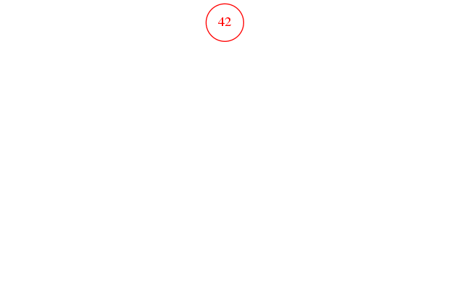

<!-- _class: title-section -->

# <!--fit--> Algorithmique Appliquée

##### BTS SIO SISR

### Introduction à la théorie des graphes

<!--
Cours très important pour l'examen final mais également fondamental car il s'agit d'une introduction au domaine passionant de la recherche opérationnelle.
Soyez très attentifs et faites les TPs avec sérieux.
L'examen final contient en général des questions sur les algorithmes de tri, de calcul matriciel et de graphes.

Note d'implémentation : les graphes sont générés avec GraphViz via le script bin/misc/graph.py.
-->

---

<!-- _class: smaller-text -->

# Plan

- Discussion sur les hiérarchies
- Arbre binaire
- Insertion et recherche
- Arbre N-aire
- Discussion concernant les graphes
- Théorie des graphes
- Digraph
- Identification d'un cycle
- Parcours en profondeur
- Parcours en largeur
- Graphe pondéré
- Recherche de chemin critique

---

<!-- _class: title-section -->

# <!--fit--> Correction du travail à la maison

---

### TP : Plus de modules

[**Lien** vers le sujet de DM](../10-python-avance/dm-04.html).

---

<!-- _class: title-section -->

# <!--fit--> Discussion sur les hiérarchies

---

### Hiérarchie en entreprise


---

### Structure produit


---

### Compétition (1/2)


Il est possible d'inverser la représentation pour obtenir une hiérarchie.

---

### Compétition (2/2)


---

<!-- _class: title-section -->

# <!--fit--> Arbre binaire : représentation

---

### Notion d'arbre

* Une **hiérarchie** peut être représentée sous la forme d'un **arbre**.
* Un **arbre binaire** ne comporte que **2 branches**.
* Chaque noeud peut avoir un sous-noeud à gauche et/ou à droite.

---

### Exemple avec 2 noeuds


---

### Exemple avec 3 noeuds


---

### Relation d'ordre

* La valeur du noeud à **gauche** est **plus petite** que celle du parent.
* La valeur du noeud à **droite** est **plus grande** que celle du parent.

---

### Exemple : $7 < 42 < 108$


---

# <!--fit--> Structure de données


```python
from dataclasses import dataclass
from typing import Any

@dataclass
class Noeud:
    """Noeud d'un arbre binaire."""
    valeur: Any = None
    gauche: Any = None
    droite: Any = None
```

---

# Noeud de départ

* Comment identifier le **noeud de départ** de l'arbre binaire ?
* On souhaite que chaque noeud ait la **même représentation**.
* On introduit un nouveau type, `ArbreBinaire`, qui référence le noeud de départ.
* Un `ArbreBinaire` **n'a pas de valeur**.

---

#### Noeud de départ identifié par l'`ArbreBinaire`


---

# <!--fit--> Structure de données


```python
from dataclasses import dataclass

@dataclass
class ArbreBinaire:
    """Arbre binaire."""
    noeud: Noeud = None
```

---

### Exemple complet


---

<!-- _class: title-section -->

# <!--fit--> Insertion et recherche dans un arbre binaire

---

### Recherche : principe

* On part du noeud à la **racine**.
* On utilise la **relation d'ordre** pour savoir si on doit aller à gauche ou à droite.
* On **descend** dans l'arbre jusqu'à trouver la valeur ou ne plus avoir de descendants.

---

### Illustration de la recherche

###### Valeur recherchée : 25


---

### Etapes de recherche


---


### Algorithme de recherche dans un arbre binaire

```python
def trouve_valeur_dans_arbre_binaire(arbre, valeur):
    """Trouve une valeur dans l'arbre binaire."""
    noeud = arbre.noeud
    while noeud != None and noeud.valeur != valeur:
        if valeur < noeud.valeur:
            noeud = noeud.gauche
        else:
            noeud = noeud.droite

    return noeud
```

---

### Complexité

* Le nombre d'étapes est fonction de la profondeur $p$.
* Pour un arbre binaire *équilibré* de $N$ noeuds, la recherche prend $O(\log N)$.
* Pour un arbre binaire *non-équilibré* de $N$ noeuds, la recherche prend $O(N)$.

---

### Insertion : principe

* Si le noeud racine est vide, la nouvelle valeur est positionnée à la racine.
* Sinon :
    * On utilise la **relation d'ordre** pour descendre dans l'arbre.
    * On créé un nouveau noeud dans un nouvel emplacement.

---

### Illustration de l'insertion



---

### Etapes d'insertion


---

<!-- _class: smaller-text -->

### Algorithme d'insertion

```python
def insere_noeud_dans_arbre_binaire(arbre, valeur):
    """Insère un nouveau noeud dans un arbre binaire."""
    if arbre.noeud == None:
        arbre.noeud = Noeud(valeur=valeur)
        return arbre.noeud

    noeud = arbre.noeud
    while noeud.valeur != valeur:
        if valeur < noeud.valeur:
            if noeud.gauche == None:
                noeud.gauche = Noeud(valeur=valeur)
            noeud = noeud.gauche
        else:
            if noeud.droite == None:
                noeud.droite = Noeud(valeur=valeur)           
            noeud = noeud.droite

    return noeud
```

---

#### :warning: Problème :warning:


---

#### Etapes arbre binaire non-équilibré


---

### Arbre non-équilibré

* Si on insère toujours des valeurs à droite (ou à gauche), on obtient l'équivalent d'une **liste chaînée**.
* On perd alors l'équilibre de l'arbre, et la **complexité** d'insertion et de recherche **augmente**.
* La complexité passe de logarithmique à linéaire dans les 2 cas.

---

### Solution : rééquilibrage

* Un **arbre binaire rouge-noir** (red-black binary search tree :uk:) rééquilibre l'arbre à chaque insertion.
* Des **rotations** sont effectuées pour échanger des noeuds.

---

### Illustration d'un arbre rouge-noir


---

#### Etapes d'insertion dans un arbre rouge-noir


---

### Complexité

Dans un arbre rouge-noir, la recherche et l'insertion sont en $O(\log N)$.

---

<!-- _class: title-section -->

# <!--fit--> Arbre N-aire : représentation

---

### Généralisation

* Les arbres binaires ont de nombreuses propriétés intéressantes (complexité logarithmique).
* Toute hiérarchie ne peut être représentée avec un arbre binaire.
* Les arbres n-aires peuvent avoir **$n$ descendants**.
* Les descendants peuvent être une `list`.

---

### Illustration d'un arbre n-aire


---

### Exemple avec une structure produit


---

<!-- _class: smaller-text -->

# <!--fit--> Structure de données


```python
from dataclasses import dataclass, field
from typing import Any, List

@dataclass
class Noeud:
    """Noeud d'un arbre n-aire."""
    valeur: Any = None
    descendants: List = field(default_factory=list)
```

---

<!-- _class: title-section -->

# TP : Arbres binaires

---

### TP : Arbres binaires

[**Lien** vers le sujet de TP](./tp-18-arbres.html).

---

<!-- _class: title-section -->

# <!--fit--> Discussion concernant les problèmes impliquant des graphes

---

### Chemin le plus rapide


<!--
Quel est le chemin le plus rapide entre Saumur et Paris ?
-->

---

### Réseau


<!--
Par quel chemin faire transiter des paquets entre des noeuds de calcul pour optimiser le flux global d'informations ?
-->

---

### Réseau social


<!--
Comment représenter les relations entre des utilisateurs ?
-->

---

<!-- _class: title-section -->

# <!--fit--> Introduction à la théorie des graphes

<!--
Il y a beaucoup de définitions dans cette partie, mais rien de complexe en réalité.
Regardez bien les exemples qui illustrent chaque définition.
-->

---

### Graphe orienté (1/2)

* Un **graphe orienté** (*directed graph* ou *digraph* :uk:) est caractérisé par :
    * un ensemble $S$ de **sommets** (*vertices* ou *vertex* :uk:).
    * un ensemble $A$ d'**arcs** (*edges* :uk:).

<!--
Vertices est le pluriel de vertex en anglais.
Le terme digraph est très souvent employé, même en français.
-->

---

### Graphe orienté (2/2)

* Chaque arc a une **origine** (*source* :uk:) et un **but** (*target* :uk:).
* On note $s \xrightarrow{a} t$, un arc $a$ d'origine $s$ et de but $t$.
* $t$ est un **successeur** de $s$.
* $s$ est un **prédécesseur** de $t$.

---

### Exemple de graphe orienté


---

### Graphe non-orienté (1/2)

* Un graphe **non-orienté** (*undirected graph* :uk:) ou graphe **symétrique** est caractérisé par :
    * un ensemble $S$ de **sommets**.
    * un ensemble $A$ d'**arêtes**.

---

### Graphe non-orienté (2/2)

* Chaque arête a 2 **extrémités** (éventuellement confondues).
* Tout graphe orienté admet un graphe non-orienté **sous-jacent**.
* Le graphe sous-jacent est composé de l'ensemble des arêtes correspondant aux arcs du digraph.

---

### Exemple de graphe non-orienté


<!--
Il s'agit du graphe sous-jacent à celui présenté précédemment.
-->

---

### Graphe partiel

- On peut restreindre un graphe (orienté ou non) à une partie de ses arcs ou arêtes.
- Il s'agit d'un **graphe partiel**.

|  |  |
|:-----------------------------------------:|:-------------------------------------------------:|
|        Graphe orienté $G_0$               |        $G_1$ : graphe partiel de $G_0$            |

---

### Graphe induit

- On peut restreindre un graphe (orienté ou non) à une partie de ses sommets.
- Il s'agit d'un **graphe induit** (ou **sous-graphe**).

|  |  |
|:-----------------------------------------:|:------------------------------------------------:|
|        Graphe orienté $G_0$               |        $G_2$ : graphe induit de $G_0$            |

---

### Graphe simple

- Un graphe est dit **simple** s'il existe au plus un arc (ou arête) entre une origine et un but.
- Dans ce cas, un arc $(s, t)$ est noté $s \longrightarrow t$.

|  |  |
|:-----------------------------------------:|:------------------------------------------------:|
|     Graphe orienté $G_0$ (non simple)     |           $G_3$ : graphe simple                  |

---

### Graphe antisymétrique

- Un graphe orienté simple est dit **antisymétrique** si, pour tout arc $s \longrightarrow t$, il n'existe pas d'arc $t \longrightarrow s$.

|  |  |
|:------------------------------------------------:|:------------------------------------------------:|
|     Graphe simple $G_3$ (non antisymétrique)     |           $G_4$ : graphe antisymétrique          |

---

### Chemin

- Un **chemin** d'un graphe orienté est une suite d'arcs.
- L'origine d'un arc est le but de l'arc prédécédent.
- Le chemin $s_0 \xrightarrow{a_1} s_1 \xrightarrow{a_2} s_2 \cdots s_{n-1} \xrightarrow{a_n} s_n$ désigne un chemin d'**origine** $s_0$, de **but** $s_n$ et de longueur $n$.

|                                                                     |
|:----------------------------------------------------------------------------------------------------:|
| Chemin $A \xrightarrow{a} B \xrightarrow{b} C \xrightarrow{d} D \xrightarrow{e} A \xrightarrow{f} E$ |

---

### Chemin simple

- Un **chemin simple** ne passe pas 2 fois par le même arc.

|  |  |
|:---------------------------------:|:----------------------------------------:|
|        Chemin non simple          |           Chemin simple                  |

---

### Cycle (ou circuit)

- Dans un graphe orienté, un **circuit** est un chemin dont l'origine et le but sont confondus.
- Dans un graphe non-orienté, un **cycle** est un chemin dont l'origine et le but sont confondus.

|  |   |
|:----------------------------------:|:---------------------------------:|
|        Circuit                     | Cycle dans le graphe sous-jacent  |

---

### Circuit élémentaire

- Un circuit est **élémentaire** s'il ne passe pas 2 fois par le même sommet (sauf l'origine et le but).

|  |  |
|:--------------------------------------------------:|:----------------------------------------------:|
|            Circuit non élémentaire                 |           Circuit élémentaire                  |

---

## Boucle

- Une **boucle** est un circuit composé d'un seul arc.


---

## DAG (Directed Acyclic Graph :uk:)

- Un **DAG** est un graphe orienté sans circuit.
- Ce type de graphe est courant.

|  |  |
|:----------------------------------:|:------------------------------:|
|    $G_5$ n'est pas un DAG          |               DAG              |

---

### Fermeture transitive - définition (1/2)

* La **fermeture transitive** (ou clôture transitive) d'un graphe simple $G$ comporte les sommets et les arcs de $G$. On y ajoute d'autres arcs.
* Pour tout couple de sommets $s$ et $t$ de $G$, s'il existe un chemin entre $s$ et $t$ mais pas d'arc $s \longrightarrow t$, alors on ajoute l'arc $s \longrightarrow t$.

---

### Fermeture transitive - exemple (2/2)

|  |  |
|:----------------------------------------:|:-----------------------------------------------:|
|              Graphe simple               |               Fermeture transitive              |

---

### Graphe connexe

- Un graphe non-orienté est **connexe** s'il existe un chemin entre chaque couple de sommets de ce graphe.

|     |  |
|:------------------------------------------------:|:-----------------------------------------:|
|              Graphe non connexe                  |               Graphe connexe              |

---

### Composante connexe

- La **composante connexe** d'un sommet $s$ est l'ensemble des sommets qui lui sont reliés.


<!--
3 composantes connexes de G (graphe non-orienté).
-->

---

### Graphe fortement connexe

- Un graphe orienté est **fortement connexe** s'il existe un chemin entre chaque couple de sommets de ce graphe.

|     |  |
|:--------------------------------------------:|:---------------------------------------------------:|
|         Graphe non fortement connexe         |               Graphe fortement connexe              |

---

### Composante fortement connexe

- La **composante fortement connexe** d'un sommet $s$ est l'ensemble des sommets $t$ tels qu'il existe un chemin de $s$ à $t$, et un chemin de $t$ à $s$.


<!--
5 composantes fortement connexes du graphe orienté.
-->

---


### Arbre

- En théorie des graphes, un **arbre** est un graphe non-orienté simple, connexe et sans cycle.
- Deux sommets quelconques ne sont reliés que par un unique chemin.
- Le nombre d'arcs est relié au nombre de sommets par la relation : $|A| = |S| - 1$.

---

### Forêt

- Une fôret est un graphe non-orienté dont les composantes connexes sont des arbres.


---


### Arborescence

- Une **arborescence** est un graphe orienté possédant un sommet privilégié, la **racine**.
- Il existe un unique chemin de la racine à tout autre sommet.
- La racine n'a pas de prédécesseur.
- Tout autre sommet a un unique prédécesseur : son **parent**.

---

<!-- _class: title-section -->

# <!--fit--> Représentations des graphes

---

### Plusieurs représentations

* Il existe **plusieurs manières** de représenter un graphe en informatique.
* Chaque représentation a des **avantages** et des **inconvénients**.
* Un type de représentation **ne convient pas** à tous les types de graphes.

---

### Liste de listes d'arcs (1/4)

* Le graphe orienté peut être caractérisé par une **liste de sommets**.
* Chaque sommet est caractérisé par une **liste d'arcs** et une éventuelle étiquette.

---


### Liste de listes d'arcs (2/4)

- sommet 0 : $0 \longrightarrow 1$
- sommet 1 : $1 \longrightarrow 3$, $1 \longrightarrow 4$
- sommet 2 : $2 \longrightarrow 4$
- sommet 3 : $3 \longrightarrow 0$, $3 \longrightarrow 2$
- sommet 4 : $\varnothing$

---


### Liste de listes d'arcs (3/4)

```python
G = [
    [1],      # 0 -> 1
    [3, 4],   # 1 -> 3, 1 -> 4
    [4],      # 2 -> 4
    [0, 2],   # 3 -> 0, 3 -> 2
    []        # aucun
]
```

---

### Liste de listes d'arcs (4/4)

* Il est possible également de représenter un **graphe non-orienté** en dupliquant les arcs pour former les arêtes.
* **Avantages** : simplicité de mise à jour et de parcours.
* **Inconvénients** : difficulté d'obtention de la liste des prédécesseurs sans dupliquer les arcs (pour avoir les arcs "retour").

---

### Matrice d'adjacence (1/6)

* Un graphe simple à $n$ sommets numérotés peut être représenté par une **matrice carrée** $M_{n, n}$ d'entiers.
* L'élément $M[i][j]$ vaut 1 si l'arc $i \longrightarrow j$ existe, et 0 sinon.

---


### Matrice d'adjacence (2/6)

sommets    | 0 | 1 | 2 | 3 | 4 |
:----------|:-:|:-:|:-:|:-:|:-:|
sommet 0 : | 0 | 1 | 0 | 0 | 0 |
sommet 1 : | 0 | 0 | 0 | 1 | 1 |
sommet 2 : | 0 | 0 | 0 | 0 | 1 |
sommet 3 : | 1 | 0 | 1 | 0 | 0 |
sommet 4 : | 0 | 0 | 0 | 0 | 0 |

---


### Matrice d'adjacence (3/6)

$$
M = 
\begin{pmatrix}
    0 & 1 & 0 & 0 & 0 \\
    0 & 0 & 0 & 1 & 1 \\
    0 & 0 & 0 & 0 & 1 \\
    1 & 0 & 1 & 0 & 0 \\
    0 & 0 & 0 & 0 & 0 \\
\end{pmatrix}
$$

---


### Matrice d'adjacence (4/6)

```python
M = [
    [0, 1, 0, 0, 0],
    [0, 0, 0, 1, 1],
    [0, 0, 0, 0, 1],
    [1, 0, 1, 0, 0],
    [0, 0, 0, 0, 0]
]
```

---


### Matrice d'adjacence (5/6)

- Si les arcs sont étiquettés, on peut utiliser ce type de représentation :

```python
M = [
    [None,  "a", None, None, None],
    [None, None, None,  "b",  "c"],
    [None, None, None, None,  "e"],
    [ "f", None,  "g", None, None],
    [None, None, None, None, None]
]
```

---

### Matrice d'adjacence (6/6)

* **Avantages** : représentation compacte, rapidité des recherches (notamment des prédécesseurs) et simplicité des algorithmes de calcul.
* **Inconvénients** : nombreux zéros dans la matrice (information "inutile"), redondance des informations pour les graphes non-orientés, ne convient que pour les graphes simples.

---

### Matrice d'incidence (1/5)

* Un graphe non-orienté à $n$ sommets numérotés et $p$ arêtes numérotées peut être représenté par une **matrice carrée** $M_{n, p}$ d'entiers.
* L'élément $M[i][j]$ vaut 1 si le sommet $i$ est l'une des 2 extrémités de l'arête $j$, et 0 sinon.
* Une colonne de cette matrice comporte donc toujours deux éléments à 1 : les 2 extrémités de l'arête.

---


### Matrice d'incidence (2/5)

arêtes     | a | b | c | d | e | f |
:----------|:-:|:-:|:-:|:-:|:-:|:-:|
sommet 0 : | 1 | 0 | 0 | 0 | 1 | 0 |
sommet 1 : | 1 | 1 | 1 | 0 | 0 | 0 |
sommet 2 : | 0 | 0 | 0 | 1 | 0 | 1 |
sommet 3 : | 0 | 1 | 0 | 0 | 1 | 1 |
sommet 4 : | 0 | 0 | 1 | 1 | 0 | 0 |

---


### Matrice d'incidence (3/5)

$$
M = 
\begin{pmatrix}
    1 & 0 & 0 & 0 & 1 & 0 \\
    1 & 1 & 1 & 0 & 0 & 0 \\
    0 & 0 & 0 & 1 & 0 & 1 \\
    0 & 1 & 0 & 0 & 1 & 1 \\
    0 & 0 & 1 & 1 & 0 & 0 \\
\end{pmatrix}
$$

---


### Matrice d'incidence (4/5)

```python
M = [
    [1, 0, 0, 0, 1, 0],
    [1, 1, 1, 0, 0, 0],
    [0, 0, 0, 1, 0, 1],
    [0, 1, 0, 0, 1, 1],
    [0, 0, 1, 1, 0, 0]
]
```

---

### Matrice d'incidence (5/5)

* **Avantages** : informations non redondantes pour les graphes non-orientés, représentation compacte, rapidité des recherches.
* **Inconvénients** : nombreux zéros dans la matrice (information "inutile"), certaines opérations matricielles ne s'appliquent pas.

---

<!-- _class: title-section -->

# <!--fit--> Parcours en profondeur

##### Depth-First Search :uk:

---

### Intérêt

* Tous les algorithmes d'analyse de graphes ont besoin de parcourir les graphes.
* Les algorithmes de parcours constituent le socle de ces algorithmes plus avancés.

---

### Principe

* On parcourt chaque sommet du graphe.
* Les ordres de parcours dépendent de l'ordre des sommets et de l'ordre des successeurs de chaque sommet.
* Il existe 2 algorithmes principaux de parcours d'un graphe :
    * le parcours en profondeur,
    * le parcours en largeur.

---

### Parcours en profondeur

* Le **parcours en profondeur** (**DFS** - Depth-First Search :uk:) consiste à aller aussi profondément que possible dans le graphe à chaque étape.
* On visite le 1er successeur du 1er sommet, puis son 1er successeur, puis son 1er successeur, etc.
* On remonte ensuite la chaîne pour visiter le 2e successeur du dernier sommet visité, puis le 1er successeur de ce nouveau sommet, etc.

---

### Exemple avec une arborescence


Ordre de visite : 0, 1, 4, 10, 11, 5, 6, 2, 7, 12, 13, 14, 3, 8, 9.

---

### Exemple avec un graphe simple


Ordre de visite : 0, 1, 3, 2, 4.

---

### Exemple avec un graphe non-connexe


Ordre de visite : 0, 3, 2, 7, 12, 11, 6, 13, 14, 9, 10, 8, 4, 1, 5, 11, 15, 16, 17, 18, 19.

---

<!-- _class: smaller-text -->

### Algorithme DFS (récursif)

```python
def parcours_en_profondeur(m, f):
    """Applique la fonction f à chaque sommet du graphe.
    
    m - matrice d'adjacence.
    f - fonction prenant un sommet en argument.
    """
    def parcours_successeurs(m, s, f, marque):
        """Traitement récursif."""
        if s not in marque:
            marque.append(s)
            f(s)
            suivants = successeurs(m, s)
            for suivant in suivants:
                parcours_successeurs(m, suivant, f, marque)

    marque = []
    for s in range(len(m)):
        parcours_successeurs(m, s, f, marque)
```

---

### Complexité

* Chaque sommet est visité.
* Or, les sommets déjà visités sont marqués pour ne pas être traités à nouveau.
* Donc chaque sommet est visité exactement 1 fois.
* Chaque arc d'origine est visité 1 fois.
* Dans le pire cas, le nombre maximal d'opérations sera limité soit par le nombre de sommets, soit par le nombre d'arcs.
* La complexité est donc $O(\max(|A|, |S|))$.

<!--
Pour rappel, |A| est le nombre d'arc, tandis que |S| est le nombre de sommets.
-->

---

<!-- _class: title-section -->

# <!--fit--> Parcours en largeur

##### Breadth-First Search :uk:

---

### Parcours en largeur

* Le **parcours en largeur** (**BFS** - Breath-First Search) consiste à visiter d'abord tous les successeurs directs.
* Une fois que tous les successeurs directs ont été visités, on passe aux successeurs du 1er successeur, etc.

---

### Exemple avec une arborescence


Ordre de visite : 0, 1, 2, 3, 4, 5, 6, 7, 8, 9, 10, 11, 12, 13, 14.

---

### Exemple avec un graphe simple


Ordre de visite : 0, 1, 3, 4, 2.

---

### Exemple avec un graphe non-connexe


Ordre de visite : 0, 3, 4, 2, 8, 9, 1, 5, 11, 7, 6, 12, 13, 14, 10, 15, 16, 18, 17, 19.

---

<!-- _class: smaller-text -->

### Algorithme BFS

```python
def parcours_en_largeur(m, f):
    """Applique la fonction f à chaque sommet du graphe.
    
    m - matrice d'adjacence.
    f - fonction prenant un sommet en argument.
    """
    marque = [] # On ne souhaite pas traiter plusieurs fois un sommet
    queue = []  # On utilise une queue pour traiter d'abord les plus proches
    for s in range(len(m)): # Visite chaque sommet pour les graphes non-connexes
        if s not in marque: # Evite de traiter 2 fois un sommet
            marque.append(s)    # Marque le sommet courant à traiter
            queue.append(s)     # Empile dans la queue des sommets à traiter
            while len(queue) != 0:              # Tant que la queue est non vide
                s_i = queue.pop(0)              # On prend le 1er sommet
                f(s_i)                          # On traite s_i
                suivants = successeurs(m, s_i)  # On prend les successeurs
                for suivant in suivants:        # On parcourt les successeurs
                    if suivant not in marque:   # Les successeurs non marqués
                        marque.append(suivant)  # sont marqués
                        queue.append(suivant)   # et empilés.
```

---

### Complexité

* On parcourt chaque sommet exactement une fois.
* La complexité est en $O(\max(|A|, |S|))$.

---

<!-- _class: title-section -->

# <!--fit--> Identification d'un cycle

---

### Intérêt

* De nombreux algorithmes ne fonctionnent qu'avec des graphes acycliques.
* Il faut donc pouvoir identifier si un cycle existe avant d'utiliser de tels algorithmes.

---

### Principe

* Pour identifier un cycle, on peut utiliser le parcours en profondeur.
* On ajoute un argument à la fonction récursive pour identifier le chemin courant.
* Si on cherche à revisiter un sommet dans ce chemin, on a identifier un cycle.
* Il ne reste plus qu'à retourner ce cycle.

---

<!-- _class: smaller-text -->

#### Algorithme

```python
def cherche_cycle_en_profondeur(m, s, marque, chemin):
    """Recherche en profondeur un cycle.
    
    m - matrice d'adjacence.
    s - sommet à visiter.
    marque - liste de sommets marqués.
    chemin - chemin jusqu'à s.
    """
    cs = chemin + [s]      # On construit le nouveau chemin cs
    if s in chemin:        # Si un cycle est identifié dans le chemin,
        return cs          # on le renvoie.
    if s not in marque:    # Parcours en profondeur
        marque.append(s)              # On marque le sommet s
        suivants = successeurs(m, s)  # On prend les successeurs de s
        for suivant in suivants:      # On vérifie les sous-chemins
            cycle = cherche_cycle_en_profondeur(m, suivant, marque, cs)
            if cycle != None:         # Si un cycle a été identifié dans
                return cycle          # un sous-chemin, on le renvoie.
    return None # Pas de cycle identifié
```

---

### Interface

```python
def identifie_cycle(m):
    """Retourne le premier cycle identifié ou None."""
    marque = []
    for s in range(len(m)):
        cycle = identifie_cycle_dans_chemin(m, s, marque, [])
        if cycle != None:
            return cycle

    return None
```

---


### Exemple

```python
cycle = identifie_cycle(G)
print(cycle)
```

:arrow_down:

```bash
[0, 1, 3, 0]
```

---

### Complexité

- La complexité est la même que pour le parcours en profondeur : $O(\max(|A|, |S|))$.

---

<!-- _class: title-section -->

# <!--fit--> Graphe pondéré : représentation

---

### Principe

* On associe un **poids** à chaque arc ou arête.
* Le poids est un **nombre flottant**.
* Le poids peut donc être positif ou négatif.
* *Exemple* : 
    * un sommet peut représenter une ville,
    * une arête pondérée peut représenter le temps de trajet entre ces villes.

---

### Liste de listes de listes (1/3)

* Pour un graphe non-pondéré, on pouvait utiliser une liste de listes.
* Chaque sous-liste représente les successeurs d'un sommet.
* Pour ajouter les poids, on ajoute une dimension.
* On obtient la hiérarchie suivante :
    * liste de sommets
        * liste de successeurs
            * liste des labels et poids

---

<!-- _class: smaller-text -->


#### Liste de listes de listes (2/3)

```python
G = [
    [ # 0 -> 1 (poids = 42)
        [1, 42]
    ],      
    [ # 1 -> 3 (poids = 21), 1 -> 4 (poids = -56.7)
        [3, 21],
        [4, -56.7]
    ],
    [ # 2 -> 4 (poids = 7)
        [4, 7]
    ],
    [ # 3 -> 0 (poids = 3.14), 3 -> 2 (poids = -8)
        [0, 3.14],
        [2, -8]
    ],
    [] # aucun
]
```

---

### Liste de listes de listes (3/3)

* **Avantages** : évolution simple d'une représentation non-pondérée.
* **Inconvénient** : mêmes inconvénients qu'avec une liste de listes, plus difficile à comprendre et à maintenir.

---

### Matrice d'adjacence (1/5)

- On peut représenter un graphe orienté valué à $n$ sommets avec une matrice carrée $M_{n, n}$ telle que $M[i][j]$ a pour valeur le poids de l'arc $i \longrightarrow j$ si cet arc existe, ou $+\infty$ sinon.

---


### Matrice d'adjacence (2/5)

sommets    |     0     |     1     |     2     |     3     |     4     |
:----------|:---------:|:---------:|:---------:|:---------:|:---------:|
sommet 0 : | $+\infty$ |     42    | $+\infty$ | $+\infty$ | $+\infty$ |
sommet 1 : | $+\infty$ | $+\infty$ | $+\infty$ |     21    |   -56.7   |
sommet 2 : | $+\infty$ | $+\infty$ | $+\infty$ | $+\infty$ |     7     |
sommet 3 : |  3.14     | $+\infty$ |     -8    | $+\infty$ | $+\infty$ |
sommet 4 : | $+\infty$ | $+\infty$ | $+\infty$ | $+\infty$ | $+\infty$ |

---


### Matrice d'adjacence (3/5)

$$
M = 
\begin{pmatrix}
    +\infty &     42  & +\infty & +\infty & +\infty \\
    +\infty & +\infty & +\infty &     21  &   -56.7 \\
    +\infty & +\infty & +\infty & +\infty &     7   \\
     3.14   & +\infty &     -8  & +\infty & +\infty \\
    +\infty & +\infty & +\infty & +\infty & +\infty \\
\end{pmatrix}
$$

---


### Matrice d'adjacence (4/5)

```python
M = [
    [None,   42, None, None,  None],
    [None, None, None,   21, -56.7],
    [None, None, None, None,   7  ],
    [3.14, None,   -8, None,  None],
    [None, None, None, None,  None]
]
```

---

### Matrice d'adjacence (5/5)

* **Avantages** : mêmes avantages qu'une matrice d'adjacence non-pondérée.
* **Inconvénients** : mêmes inconvénients qu'une matrice d'adjacence non-pondérée (mais pas d'inconvénient supplémentaire contrairement à la liste de listes de listes).

---

### Structures de données (1/3)

```python
@dataclass
class Sommet:
    """Sommet d'un graphe."""
    label: int = 0

@dataclass
class Arc:
    """Arc d'un graphe orienté"""
    origine: int = 0
    but: int = 0
    poids: float = 0.

@dataclass
class GraphePondere:
    """Graphe orienté pondéré."""
    sommets: List = field(default=list)
    arcs: List = field(default=list)
```

---


### Structures de données (2/3)

```python
s0 = Sommet(0)
s1 = Sommet(1)
s2 = Sommet(2)
s3 = Sommet(3)
s4 = Sommet(4)

a0 = Arc(origine=0, but=1, poids=42)
a1 = Arc(origine=1, but=3, poids=21)
a2 = Arc(origine=1, but=4, poids=-56.7)
a3 = Arc(origine=2, but=4, poids=7)
a4 = Arc(origine=3, but=2, poids=-8)
a5 = Arc(origine=3, but=0, poids=3.14)

G = GraphePondere(sommets=[s0, s1, s2, s3, s4],
                  arcs=[a0, a1, a2, a3, a4, a5])
```

---

### Structures de données (3/3)

* **Avantages** : Les données sont plus structurées qu'avec une liste de liste de listes.
* **Inconvénients** : On a les mêmes inconvénients qu'avec une liste de listes.

---

<!-- _class: title-section -->

# <!--fit--> Plus court chemin

---

### Principe

* La recherche du chemin le plus court dans un graphe pondéré est un problème classique.
* Le poids d'un chemin est égal à la somme des poids des arcs sur ce chemin.
* Il existe différents algorithmes pour résoudre ce problème.
* Nous étudierons uniquement l'algorithme **Bellman-Ford** dans ce cours.

---

### Bellman-Ford - principe (1/2)

* L'algorithme **Bellman-Ford** permet de construire un **arbre des plus courts chemins** (**SPT** - shortest path tree :uk:).
* Cet algorithme considère les graphes orientés pondérés sans circuit négatif.

---

### Bellman-Ford - principe (2/2)

* Cet algorithme part d'un sommet $s$ donné.
* Au départ, on évalue toutes les distances de $s$ aux autres sommets à l'infini.
* On effectue, sur le principe, un parcours en largeur pour réévaluer à chaque étape la distance minimale de $s$ à chaque autre sommet.
* L'implémentation utilise une matrice d'adjacence.

---

### Bellman-Ford - algorithme (1/4)

```python
def adjacents(m, s):
    """Renvoie les arcs adjacents à s dans m."""
    adj = []
    for j in range(len(m[s])):
        if m[s][j] != None:
            adj.append(Arc(origine=s, but=j, poids=m[s][j]))

    return adj
```

---

<!-- _class: smaller-text -->

### Bellman-Ford - algorithme (2/4)

```python
def recalcule_bellman_ford(m, s, dist_a, arc_vers, queue):
    """Recalcule la distance minimale en considérant les successeurs de s.
    
    m - matrice d'adjacence pondérée.
    s - sommet dans les successeurs sont considérés.
    dist_a - liste des distances minimales aux autres sommets.
    arc_vers - liste des arcs conservés pour aller à un sommet donné.
    queue - queue pour le parcours en largeur.
    """
    adj = adjacents(m, s)
    for arc in adj:
        w = arc.but
        if dist_a[w] == None or dist_a[w] > dist_a[s] + arc.poids:
            dist_a[w] = dist_a[s] + arc.poids
            arc_vers[w] = arc
            if w not in queue:
                queue.append(w)
```

---

<!-- _class: smaller-text -->

### Bellman-Ford - algorithme (3/4)

```python
def bellman_ford_impl(m, s):
    """Implémentation de Bellman-Ford sans gestion de cycles négatifs.
    
    m - matrice d'adjacence pondérée.
    s - sommet de départ.
    Renvoie la liste des distances aux autres sommets et la liste des
    arcs constituant les plus courts chemins.
    """
    dist_a = [None for _ in range(len(m))]   # distances à l'infini
    dist_a[s] = 0                            # distance à lui-même
    arc_vers = [None for _ in range(len(m))] # résultat
    queue = [s]
    while len(queue) != 0:
        v = queue.pop(0)
        recalcule_bellman_ford(m, v, dist_a, arc_vers, queue)

    return dist_a, arc_vers
```

---

<!-- _class: smaller-text -->

### Bellman-Ford - algorithme (4/4)

```python
def bellman_ford(m, s):
    """Renvoie une matrice d'adjacence correspondant au shortest path
    tree (SPT) et la liste des distances minimales."""
    dist_a, arc_vers = bellman_ford_impl(m, s)
    spt = [[None for _ in range(len(m))] for _ in range(len(m))]
    for arc in arc_vers:
        if arc != None:
            spt[arc.origine][arc.but] = arc.poids

    return spt, dist_a
```

---

<!-- _class: smaller-text -->

### Bellman-Ford - exemple (1/2)

|  |  |
|:----------------------------------------------:|:-------------------------------------------------:|
|              Graphe pondéré                    |     Arbre de distances minimales pour $s_0$       |

Coûts = `[0, 42, 55, 63, -14.7]`

---

<!-- _class: smaller-text -->

### Bellman-Ford - exemple (2/2)

|  |  |
|:-----------------------------------------------:|:-----------------------------------------------:|
|              Graphe pondéré                     |     Arbre de distances minimales pour $s_0$     |

Coûts = `[0, 4, 9, 4, 2, 6, 8, 12, 13, 12, 3, 5, 14, 13, 14]`

---

<!-- _class: title-section -->

# <!--fit--> Recherche de chemin critique


---

<!-- _class: title-section -->

# TP : Graphes

---

### TP : Graphes

[**Lien** vers le sujet de TP](./tp-19-graphes.html).
