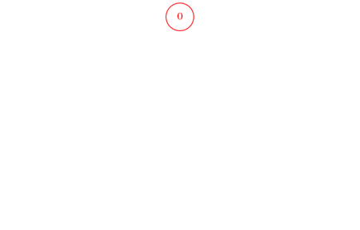
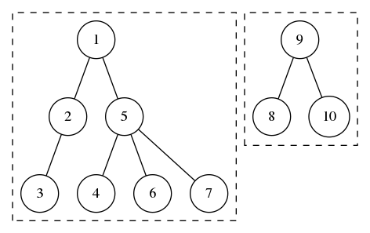

<!-- _class: title-section -->

# <!--fit--> Algorithmique Appliquée

##### BTS SIO SISR

### Introduction à la théorie des graphes

<!--
Cours très important pour l'examen final mais également fondamental car il s'agit d'une introduction au domaine passionant de la recherche opérationnelle.
Soyez très attentifs et faites les TPs avec sérieux.
L'examen final contient en général des questions sur les algorithmes de tri, de calcul matriciel et de graphes.
-->

---

<!-- _class: smaller-text -->

# Plan

- Discussion sur les hiérarchies
- Arbre binaire
- Insertion et recherche
- Arbre N-aire
- Discussion concernant les graphes
- Théorie des graphes
- Digraph
- Identification d'un cycle
- Recherche en profondeur
- Recherche en largeur
- Graphe pondéré
- Recherche de chemin critique

---

<!-- _class: title-section -->

# <!--fit--> Correction du travail à la maison

---

### TP : Plus de modules

[**Lien** vers le sujet de DM](../10-python-avance/dm-04.html).

---

<!-- _class: title-section -->

# <!--fit--> Discussion sur les hiérarchies

---

### Hiérarchie en entreprise


---

### Structure produit


---

### Compétition (1/2)


Il est possible d'inverser la représentation pour obtenir une hiérarchie.

---

### Compétition (2/2)


---

<!-- _class: title-section -->

# <!--fit--> Arbre binaire : représentation

---

### Notion d'arbre

* Une **hiérarchie** peut être représentée sous la forme d'un **arbre**.
* Un **arbre binaire** ne comporte que **2 branches**.
* Chaque noeud peut avoir un sous-noeud à gauche et/ou à droite.

---

### Exemple avec 2 noeuds


---

### Exemple avec 3 noeuds


---

### Relation d'ordre

* La valeur du noeud à **gauche** est **plus petite** que celle du parent.
* La valeur du noeud à **droite** est **plus grande** que celle du parent.

---

### Exemple : $7 < 42 < 108$


---

# <!--fit--> Structure de données


```python
from dataclasses import dataclass
from typing import Any

@dataclass
class Noeud:
    """Noeud d'un arbre binaire."""
    valeur: Any = None
    gauche: Any = None
    droite: Any = None
```

---

# Noeud de départ

* Comment identifier le **noeud de départ** de l'arbre binaire ?
* On souhaite que chaque noeud ait la **même représentation**.
* On introduit un nouveau type, `ArbreBinaire`, qui référence le noeud de départ.
* Un `ArbreBinaire` **n'a pas de valeur**.

---

#### Noeud de départ identifié par l'`ArbreBinaire`


---

# <!--fit--> Structure de données


```python
from dataclasses import dataclass

@dataclass
class ArbreBinaire:
    """Arbre binaire."""
    noeud: Noeud = None
```

---

### Exemple complet


---

<!-- _class: title-section -->

# <!--fit--> Insertion et recherche dans un arbre binaire

---

### Recherche : principe

* On part du noeud à la **racine**.
* On utilise la **relation d'ordre** pour savoir si on doit aller à gauche ou à droite.
* On **descend** dans l'arbre jusqu'à trouver la valeur ou ne plus avoir de descendants.

---

### Illustration de la recherche

###### Valeur recherchée : 25


---

### Etapes de recherche


---


### Algorithme de recherche dans un arbre binaire

```python
def trouve_valeur_dans_arbre_binaire(arbre, valeur):
    """Trouve une valeur dans l'arbre binaire."""
    noeud = arbre.noeud
    while noeud != None and noeud.valeur != valeur:
        if valeur < noeud.valeur:
            noeud = noeud.gauche
        else:
            noeud = noeud.droite

    return noeud
```

---

### Complexité

* Le nombre d'étapes est fonction de la profondeur $p$.
* Pour un arbre binaire *équilibré* de $N$ noeuds, la recherche prend $O(\log N)$.
* Pour un arbre binaire *non-équilibré* de $N$ noeuds, la recherche prend $O(N)$.

---

### Insertion : principe

* Si le noeud racine est vide, la nouvelle valeur est positionnée à la racine.
* Sinon :
    * On utilise la **relation d'ordre** pour descendre dans l'arbre.
    * On créé un nouveau noeud dans un nouvel emplacement.

---

### Illustration de l'insertion


---

### Etapes d'insertion


---

<!-- _class: smaller-text -->

### Algorithme d'insertion

```python
def insere_noeud_dans_arbre_binaire(arbre, valeur):
    """Insère un nouveau noeud dans un arbre binaire."""
    if arbre.noeud == None:
        arbre.noeud = Noeud(valeur=valeur)
        return arbre.noeud

    noeud = arbre.noeud
    while noeud.valeur != valeur:
        if valeur < noeud.valeur:
            if noeud.gauche == None:
                noeud.gauche = Noeud(valeur=valeur)
            noeud = noeud.gauche
        else:
            if noeud.droite == None:
                noeud.droite = Noeud(valeur=valeur)           
            noeud = noeud.droite

    return noeud
```

---

#### :warning: Problème :warning:


---

#### Etapes arbre binaire non-équilibré


---

### Arbre non-équilibré

* Si on insère toujours des valeurs à droite (ou à gauche), on obtient l'équivalent d'une **liste chaînée**.
* On perd alors l'équilibre de l'arbre, et la **complexité** d'insertion et de recherche **augmente**.
* La complexité passe de logarithmique à linéaire dans les 2 cas.

---

### Solution : rééquilibrage

* Un **arbre binaire rouge-noir** (red-black binary search tree :uk:) rééquilibre l'arbre à chaque insertion.
* Des **rotations** sont effectuées pour échanger des noeuds.

---

### Illustration d'un arbre rouge-noir



---

#### Etapes d'insertion dans un arbre rouge-noir


---

### Complexité

Dans un arbre rouge-noir, la recherche et l'insertion sont en $O(\log N)$.

---

<!-- _class: title-section -->

# <!--fit--> Arbre N-aire : représentation

---

### Généralisation

* Les arbres binaires ont de nombreuses propriétés intéressantes (complexité logarithmique).
* Toute hiérarchie ne peut être représentée avec un arbre binaire.
* Les arbres n-aires peuvent avoir **$n$ descendants**.
* Les descendants peuvent être une `list`.

---

### Illustration d'un arbre n-aire


---

### Exemple avec une structure produit


---

<!-- _class: smaller-text -->

# <!--fit--> Structure de données


```python
from dataclasses import dataclass, field
from typing import Any, List

@dataclass
class Noeud:
    """Noeud d'un arbre n-aire."""
    valeur: Any = None
    descendants: List = field(default_factory=list)
```

---

<!-- _class: title-section -->

# TP : Arbres binaires

---

### TP : Arbres binaires

[**Lien** vers le sujet de TP](./tp-18-arbres.html).

---

<!-- _class: title-section -->

# <!--fit--> Discussion concernant les problèmes impliquant des graphes

---

### Chemin le plus rapide


<!--
Quel est le chemin le plus rapide entre Saumur et Paris ?
-->

---

### Réseau


<!--
Par quel chemin faire transiter des paquets entre des noeuds de calcul pour optimiser le flux global d'informations ?
-->

---

### Réseau social


<!--
Comment représenter les relations entre des utilisateurs ?
-->

---

<!-- _class: title-section -->

# <!--fit--> Introduction à la théorie des graphes

<!--
Il y a beaucoup de définitions dans cette partie, mais rien de complexe en réalité.
Regardez bien les exemples qui illustrent chaque définition.
-->

---

### Graphe orienté (1/2)

* Un **graphe orienté** (*directed graph* ou *digraph* :uk:) est caractérisé par :
    * un ensemble $S$ de **sommets** (*vertices* ou *vertex* :uk:).
    * un ensemble $A$ d'**arcs** (*edges* :uk:).

<!--
Vertices est le pluriel de vertex en anglais.
Le terme digraph est très souvent employé, même en français.
-->

---

### Graphe orienté (2/2)

* Chaque arc a une **origine** (*source* :uk:) et un **but** (*target* :uk:).
* On note $s \xrightarrow{a} t$, un arc $a$ d'origine $s$ et de but $t$.
* $t$ est un **successeur** de $s$.
* $s$ est un **prédécesseur** de $t$.

---

### Exemple de graphe orienté


---

### Graphe non-orienté (1/2)

* Un graphe **non-orienté** (*undirected graph* :uk:) ou graphe **symétrique** est caractérisé par :
    * un ensemble $S$ de **sommets**.
    * un ensemble $A$ d'**arêtes**.

---

### Graphe non-orienté (2/2)

* Chaque arête a 2 **extrémités** (éventuellement confondues).
* Tout graphe orienté admet un graphe non-orienté **sous-jacent**.
* Le graphe sous-jacent est composé de l'ensemble des arêtes correspondant aux arcs du digraph.

---

### Exemple de graphe non-orienté


<!--
Il s'agit du graphe sous-jacent à celui présenté précédemment.
-->

---

### Graphe partiel

- On peut restreindre un graphe (orienté ou non) à une partie de ses arcs ou arêtes.
- Il s'agit d'un **graphe partiel**.

|  |  |
|:-----------------------------------------:|:-------------------------------------------------:|
|        Graphe orienté $G_0$               |        $G_1$ : graphe partiel de $G_0$            |

---

### Graphe induit

- On peut restreindre un graphe (orienté ou non) à une partie de ses sommets.
- Il s'agit d'un **graphe induit** (ou **sous-graphe**).

|  |  |
|:-----------------------------------------:|:------------------------------------------------:|
|        Graphe orienté $G_0$               |        $G_2$ : graphe induit de $G_0$            |

---

### Graphe simple

- Un graphe est dit **simple** s'il existe au plus un arc (ou arête) entre une origine et un but.
- Dans ce cas, un arc $(s, t)$ est noté $s \longrightarrow t$.

|  |  |
|:-----------------------------------------:|:------------------------------------------------:|
|     Graphe orienté $G_0$ (non simple)     |           $G_3$ : graphe simple                  |

---

### Graphe antisymétrique

- Un graphe orienté simple est dit **antisymétrique** si, pour tout arc $s \longrightarrow t$, il n'existe pas d'arc $t \longrightarrow s$.

|  |  |
|:------------------------------------------------:|:------------------------------------------------:|
|     Graphe simple $G_3$ (non antisymétrique)     |           $G_4$ : graphe antisymétrique          |

---

### Chemin

- Un **chemin** d'un graphe orienté est une suite d'arcs.
- L'origine d'un arc est le but de l'arc prédécédent.
- Le chemin $s_0 \xrightarrow{a_1} s_1 \xrightarrow{a_2} s_2 \cdots s_{n-1} \xrightarrow{a_n} s_n$ désigne un chemin d'**origine** $s_0$, de **but** $s_n$ et de longueur $n$.

|                                                                     |
|:----------------------------------------------------------------------------------------------------:|
| Chemin $A \xrightarrow{a} B \xrightarrow{b} C \xrightarrow{d} D \xrightarrow{e} A \xrightarrow{f} E$ |

---

### Chemin simple

- Un **chemin simple** ne passe pas 2 fois par le même arc.

|  |  |
|:---------------------------------:|:----------------------------------------:|
|        Chemin non simple          |           Chemin simple                  |

---

### Cycle (ou circuit)

- Dans un graphe orienté, un **circuit** est un chemin dont l'origine et le but sont confondus.
- Dans un graphe non-orienté, un **cycle** est un chemin dont l'origine et le but sont confondus.

|  |   |
|:----------------------------------:|:---------------------------------:|
|        Circuit                     | Cycle dans le graphe sous-jacent  |

---

### Circuit élémentaire

- Un circuit est **élémentaire** s'il ne passe pas 2 fois par le même sommet (sauf l'origine et le but).

|  |  |
|:--------------------------------------------------:|:----------------------------------------------:|
|            Circuit non élémentaire                 |           Circuit élémentaire                  |

---

## Boucle

- Une **boucle** est un circuit composé d'un seul arc.


---

## DAG (Directed Acyclic Graph :uk:)

- Un **DAG** est un graphe orienté sans circuit.
- Ce type de graphe est courant.

|  |  |
|:----------------------------------:|:------------------------------:|
|    $G_5$ n'est pas un DAG          |               DAG              |

---

### Fermeture transitive - définition (1/2)

* La **fermeture transitive** (ou clôture transitive) d'un graphe simple $G$ comporte les sommets et les arcs de $G$. On y ajoute d'autres arcs.
* Pour tout couple de sommets $s$ et $t$ de $G$, s'il existe un chemin entre $s$ et $t$ mais pas d'arc $s \longrightarrow t$, alors on ajoute l'arc $s \longrightarrow t$.

---

### Fermeture transitive - exemple (2/2)

|  |  |
|:----------------------------------------:|:-----------------------------------------------:|
|              Graphe simple               |               Fermeture transitive              |

---

### Graphe connexe

- Un graphe non-orienté est **connexe** s'il existe un chemin entre chaque couple de sommets de ce graphe.

|     |  |
|:------------------------------------------------:|:-----------------------------------------:|
|              Graphe non connexe                  |               Graphe connexe              |

---

### Composante connexe

- La **composante connexe** d'un sommet $s$ est l'ensemble des sommets qui lui sont reliés.


<!--
3 composantes connexes de G (graphe non-orienté).
-->

---

### Graphe fortement connexe

- Un graphe orienté est **fortement connexe** s'il existe un chemin entre chaque couple de sommets de ce graphe.

|     |  |
|:--------------------------------------------:|:---------------------------------------------------:|
|         Graphe non fortement connexe         |               Graphe fortement connexe              |

---

### Composante fortement connexe

- La **composante fortement connexe** d'un sommet $s$ est l'ensemble des sommets $t$ tels qu'il existe un chemin de $s$ à $t$, et un chemin de $t$ à $s$.


<!--
5 composantes fortement connexes du graphe orienté.
-->

---


### Arbre

- En théorie des graphes, un **arbre** est un graphe non-orienté simple, connexe et sans cycle.
- Deux sommets quelconques ne sont reliés que par un unique chemin.
- Le nombre d'arcs est relié au nombre de sommets par la relation : $|A| = |S| - 1$.

---

### Forêt

- Une fôret est un graphe non-orienté dont les composantes connexes sont des arbres.



---


### Arborescence

- Une **arborescence** est un graphe orienté possédant un sommet privilégié, la **racine**.
- Il existe un unique chemin de la racine à tout autre sommet.
- La racine n'a pas de prédécesseur.
- Tout autre sommet a un unique prédécesseur : son **parent**.

---

<!-- _class: title-section -->

# <!--fit--> Représentations des graphes

---

### Plusieurs représentations

* Il existe **plusieurs manières** de représenter un graphe en informatique.
* Chaque représentation a des **avantages** et des **inconvénients**.
* Un type de représentation **ne convient pas** à tous les types de graphes.

---

### Liste de listes d'arcs (1/4)

* Le graphe orienté peut être caractérisé par une **liste de sommets**.
* Chaque sommet est caractérisé par une **liste d'arcs** et une éventuelle étiquette.

---


### Liste de listes d'arcs (2/4)

- sommet 0 : $0 \longrightarrow 1$
- sommet 1 : $1 \longrightarrow 3$, $1 \longrightarrow 4$
- sommet 2 : $2 \longrightarrow 4$
- sommet 3 : $3 \longrightarrow 0$, $3 \longrightarrow 2$
- sommet 4 : $\varnothing$

---


### Liste de listes d'arcs (3/4)

```python
G = [
    [1],      # 0 -> 1
    [3, 4],   # 1 -> 3, 1 -> 4
    [4],      # 2 -> 4
    [0, 2],   # 3 -> 0, 3 -> 2
    []        # aucun
]
```

---

### Liste de listes d'arcs (4/4)

* Il est possible également de représenter un **graphe non-orienté** en dupliquant les arcs pour former les arêtes.
* **Avantages** : simplicité de mise à jour et de parcours.
* **Inconvénients** : difficulté d'obtention de la liste des prédécesseurs sans dupliquer les arcs (pour avoir les arcs "retour").

---


---

<!-- _class: title-section -->

# <!--fit--> Recherche en profondeur

##### Depth-First Search :uk:

---

<!-- _class: title-section -->

# <!--fit--> Recherche en largeur

##### Breadth-First Search :uk:

---

<!-- _class: title-section -->

# <!--fit--> Identification d'un cycle

---

<!-- _class: title-section -->

# <!--fit--> Graphe pondéré : représentation

---

<!-- _class: title-section -->

# <!--fit--> Plus court chemin

---

<!-- _class: title-section -->

# <!--fit--> Recherche de chemin critique

---

<!-- _class: title-section -->

# <!--fit--> Flot maximal

---

<!-- _class: title-section -->

# TP : Graphes

---

### TP : Graphes

[**Lien** vers le sujet de TP](./tp-19-graphes.html).
