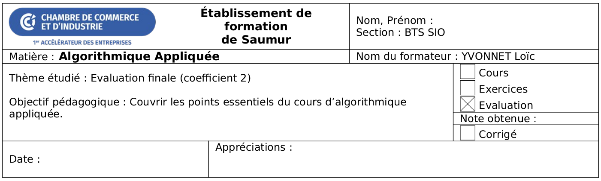

Cette évaluation finale donnera lieu à une note sur 20, coefficient 2.

Vous avez 2h pour répondre aux questions. Vous n'avez pas le droit aux supports de cours, ni ordinateur, ni calculatrice.


## Exercice 1 - Connaissances générales <span class="fs-4 fw-lighter">(2 points)</span>

Que signifie l'expression Turing-complet lorsque l'on parle d'un langage de programmation ?

<div class="w-100 border rounded d-block mb-3" style="height: 100px;"></div>

Qu'est-ce que la dichotomie ? Illustrez avec un exemple.

<div class="w-100 border rounded d-block mb-3" style="height: 100px;"></div>


## Exercice 2 - Evaluation d'expressions Python <span class="fs-4 fw-lighter">(2 points)</span>

Que valent `entier` et `reste` après l'évaluation des expressions Python suivantes ?

```python
entier = 25 // 3
reste = 25 % 3
```

<div class="w-100 border rounded d-block mb-3" style="height: 100px;"></div>


Que vaut `booleen` après l'évaluation des expressions Python suivantes ?

```python
valeur = 5
booleen = (valeur == 5)
```

<div class="w-100 border rounded d-block mb-3" style="height: 100px;"></div>


## Exercice 3 - Structures de contrôle <span class="fs-4 fw-lighter">(3 points)</span>

Qu'affiche le programme suivant ? Justifiez votre réponse.

```python
valeur = 5
if valeur == 10:
    print("beaucoup")
elif valeur == 5:
    print("un peu")
else:
    print("pas du tout")
```

<div class="w-100 border rounded d-block mb-3" style="height: 100px;"></div>


Qu'affiche le programme suivant ? Justifiez votre réponse.

```python
i = 0
while i < 3:
    print(i)
    i = i + 1
```

<div class="w-100 border rounded d-block mb-3" style="height: 100px;"></div>


Qu'affiche le programme suivant ? Justifiez votre réponse.

```python
chaine = ""
for i in range(3):
    chaine = chaine + str(i) + " "
print(chaine)
```

<div class="w-100 border rounded d-block mb-3" style="height: 100px;"></div>


## Exercice 4 - Fonctions <span class="fs-4 fw-lighter">(2 points)</span>

Qu'affiche le programme suivant ? Justifiez votre réponse.

```python
def f(valeur):
    print(valeur)

def g(a, b):
    f(b)
    f(a)

g(5, 3)
```

<div class="w-100 border rounded d-block mb-3" style="height: 100px;"></div>

Qu'affiche le programme suivant ? Justifiez votre réponse.

```python
def f(valeur=5):
    return valeur ** 2

def g(fonction, *args):
    resultat = 0
    for valeur in args:
        resultat += fonction(valeur)

    resultat += fonction()

    return resultat

valeur = g(f, 0, 1, 2)
print(valeur)
```

<div class="w-100 border rounded d-block mb-3" style="height: 100px;"></div>


## Exercice 5 - Structures de données <span class="fs-4 fw-lighter">(2 points)</span>

Qu'affiche le programme suivant ? Justifiez votre réponse.

```python
liste = [0, 1, 2]
resultat = []
for valeur in liste:
    resultat.append(valeur + 1)
print(resultat[1])
```

<div class="w-100 border rounded d-block mb-3" style="height: 100px;"></div>

Qu'affiche le programme suivant ? Justifiez votre réponse.

```python
dico = {"un": 1, "deux": 2}
dico["trois"] = 3
for cle, valeur in dico.items():
    print(f"{cle} = {valeur}")
```

<div class="w-100 border rounded d-block mb-3" style="height: 100px;"></div>


## Exercice 6 - Débogage <span class="fs-4 fw-lighter">(1 point)</span>

Décrivez le comportement du code suivant et corrigez-le si nécessaire.

```python
N = int(input("Affichez les entiers positifs à partir de : "))
i = 0
while i < N:
    print(i + 1)
```

<div class="w-100 border rounded d-block mb-3" style="height: 100px;"></div>


## Exercice 7 - Complexité <span class="fs-4 fw-lighter">(2 points)</span>

Quelle est la complexité de la fonction `f` suivante ? Utilisez la notation Landau $O()$. Justifiez votre réponse.

```python
def f(N):
    compteur = 0
    for i in range(N):
        for j in range(N):
            compteur += 1
    return compteur
```

<div class="w-100 border rounded d-block mb-3" style="height: 100px;"></div>

Quelle est la complexité de la fonction `f` suivante ? Utilisez la notation Landau $O()$. Justifiez votre réponse.

```python
def f(a=2, b=3):
    c = a ** 2
    d = b / 3
    e = c + d
    f = e + 3
    g = c * 2 + d * 3 + e + f
    return g + 1
```

<div class="w-100 border rounded d-block mb-3" style="height: 100px;"></div>


## Exercice 8 - Tri <span class="fs-4 fw-lighter">(3 points)</span>

Un jeune enfant possède une collection de cubes. Chacun des cubes comporte une étiquette libellée soit `"A"`, `"B"` ou `"C"`.

On peut donc représenter la collection de cubes avec une chaîne de caractères telle que : `"BCAABBCACCBABBC"`.

Ecrivez la fonction `tri_cubes` qui prend une chaîne de caractères comportant uniquement des `"A"`, `"B"` et `"C"` et qui renvoie cette chaîne triée.

Par exemple :
```python
cubes_dans_l_ordre = tri_cubes("BCAABBCACCBABBC")
print(cubes_dans_l_ordre)
```

doit afficher :

```
AAAABBBBBBCCCCC
```

<div class="w-100 border rounded d-block mb-3" style="height: 300px;"></div>


<!--
def tri_cubes(chaine):
    """Tri les cubes de l'enfant."""
    compteur = {"A": 0, "B": 0, "C": 0}
    for caractere in chaine:
        compteur[caractere] += 1

    return compteur["A"] * "A" + compteur["B"] * "B" + compteur["C"] * "C"

cubes_dans_l_ordre = tri_cubes("BCAABBCACCBABBC")
print(cubes_dans_l_ordre)
-->


## Exercice 9 - Addition de matrices <span class="fs-4 fw-lighter">(3 points)</span>

On utilise une `list` de `list` pour représenter une matrice.

Par exemple, la matrice $M$ :

$$
M =
\begin{pmatrix}
    1 & 2 \\
    3 & 4
\end{pmatrix}
$$

est représentée de la manière suivante :

```python
M = [
    [1, 2],
    [3, 4]
]
```

Ecrivez la fonction `additionne_matrices` qui prend 2 matrices en entrée et renvoie leur somme.

Pour rappel :

$$
M =
\begin{pmatrix}
    a & b \\
    c & d
\end{pmatrix}
,\quad
N =
\begin{pmatrix}
    e & f \\
    g & h
\end{pmatrix}
$$
$$
S = M + N =
\begin{pmatrix}
    a + e & b + f \\
    c + g & d + h
\end{pmatrix}
$$

Par exemple :
```python
M = [
    [1, 2],
    [3, 4]
]
print(f"M = {M}")

N = [
    [1, 0],
    [0, 1]
]
print(f"N = {N}")

S = additionne_matrices(M, N)
print(f"S = {S}")
```

doit afficher :
```
M = [[1, 2], [3, 4]]
N = [[1, 0], [0, 1]]
S = [[2, 2], [3, 5]]
```

<div class="w-100 border rounded d-block mb-3" style="height: 300px;"></div>

<!--
def additionne_matrices(M, N):
    resultat = []
    for i in range(len(M)):
        ligne = []
        for j in range(len(M[0])):
            ligne.append(M[i][j] + N[i][j])
        resultat.append(ligne)

    return resultat
-->